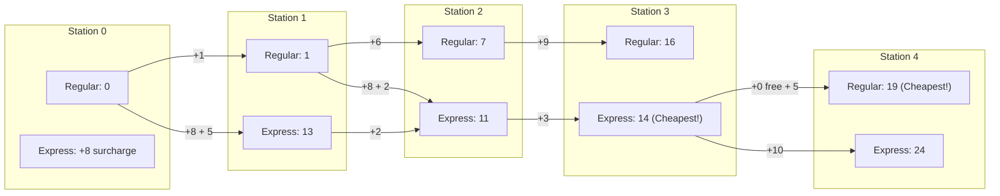

# Guided Example: Minimum Costs Using the Train Line

## 1. Problem Overview & Representative Instance

We are given two parallel train lines connecting $n + 1$ stations indexed from $0$ to $n$: a regular line and an express line. The traversal costs between consecutive stations are given by two integer arrays of length $n$:
- `regular[i]` is the cost to travel from station $i$ to station $i + 1$ on the regular route.
- `express[i]` is the cost to travel from station $i$ to station $i + 1$ on the express route.

We begin at station $0$ on the regular route with cost $0$.
Switching tracks operates under asymmetric rules:
1. Transferring from the regular route to the express route incurs an additional surcharge of `expressCost`.
2. Transferring from the express route back to the regular route is completely free (cost $0$).

Our goal is to compute an array `costs` of length $n$, where `costs[i]` is the minimum total cost to reach station $i + 1$ on either line.

Consider the representative instance:
- `regular = [1, 6, 9, 5]`
- `express = [5, 2, 3, 10]`
- `expressCost = 8`
- Number of hops: $n = 4$

Let us evaluate the cheapest paths to each station:
- **Station 1:**
  - Regular route: $0 + 1 = 1$.
  - Express route: requires transfer surcharge $8 + 5 = 13$.
  - Cheaper choice: $1$.
- **Station 2:**
  - Regular route: $1 + 6 = 7$.
  - Transfer to express at station 1: $1 + 8 + 2 = 11$.
  - Cheaper choice: $7$.
- **Station 3:**
  - Staying on regular: $7 + 9 = 16$.
  - Continuing on express from station 2: $11 + 3 = 14$.
  - Cheaper choice: $14$ (riding the express line is now cheaper despite the earlier transfer surcharge).
- **Station 4:**
  - Express ride cost is expensive ($10$). Switching back to regular at station 3 is free, costing $14 + 5 = 19$.
  - Continuing on express costs $14 + 10 = 24$.
  - Cheaper choice: $19$.

The resulting minimum costs vector is `[1, 7, 14, 19]`.

## 2. Mathematical & Algorithmic Principles

The movement between stations can be formulated as a 2-state Markov decision process on an acyclic directed graph with stations $i \in \{0, \dots, n\}$ and modes $M \in \{\text{Regular}, \text{Express}\}$.

### State Space Formulation
For each station index $i \in \{0, \dots, n\}$:
- $R[i]$: the minimum cost to arrive at station $i$ located on the **regular** line.
- $E[i]$: the minimum cost to arrive at station $i$ located on the **express** line.

### Initial Conditions
At the starting terminus (station $0$):
- $R[0] = 0$ (passenger begins on the regular line).
- $E[0] = \text{expressCost}$ (or $\infty$, transitioning to express at station 0 via the transfer penalty). Setting $R[0] = 0$ and $E[0] = \infty$ represents that no travel has occurred yet on the express line.

### State Transitions
To advance from station $i - 1$ to station $i$:
1. **Arriving on the Regular Track ($R[i]$):**
   A passenger arriving at station $i$ on the regular track must traverse the regular segment with cost $regular[i-1]$.
   They could have departed station $i - 1$ from:
   - The regular track at cost $R[i-1]$.
   - The express track at cost $E[i-1]$ (with free transfer to regular).
   Hence:
   $$R[i] = \min(R[i-1], \; E[i-1]) + regular[i-1]$$

2. **Arriving on the Express Track ($E[i]$):**
   A passenger arriving at station $i$ on the express track must traverse the express segment with cost $express[i-1]$.
   They could have departed station $i - 1$ from:
   - The express track at cost $E[i-1]$ (no surcharge).
   - The regular track at cost $R[i-1]$ plus the transfer penalty $\text{expressCost}$.
   Hence:
   $$E[i] = \min(E[i-1], \; R[i-1] + \text{expressCost}) + express[i-1]$$

3. **Optimal Station Cost:**
   At station $i$, the passenger is free to disembark from either line. Because switching from express to regular is free, the overall cheapest cost to reach station $i$ is:
   $$\text{cost}[i-1] = \min(R[i], \; E[i])$$

| State Dimension | State Variable | Incoming Transition Choices | Added Edge Weight |
|---|---|---|---|
| Regular Line | $R[i]$ | $\min(R[i-1], E[i-1])$ | $regular[i-1]$ |
| Express Line | $E[i]$ | $\min(E[i-1], R[i-1] + \text{expressCost})$ | $express[i-1]$ |
| Station Output | $\text{cost}[i-1]$ | $\min(R[i], E[i])$ | $0$ (free transfer) |

## 3. Step-by-Step Walkthrough with Intermediate State

Let us trace `regular = [1, 6, 9, 5]`, `express = [5, 2, 3, 10]`, and `expressCost = 8`.
Initialize base states: $R[0] = 0, E[0] = \infty$.

### Station 1 ($regular[0] = 1, express[0] = 5$)
- Regular track:
  $$R[1] = \min(0, \infty) + 1 = 1$$
- Express track:
  $$E[1] = \min(\infty, 0 + 8) + 5 = 8 + 5 = 13$$
- Station 1 minimum cost: $\min(1, 13) = 1$.

### Station 2 ($regular[1] = 6, express[1] = 2$)
- Regular track:
  $$R[2] = \min(R[1], E[1]) + regular[1] = \min(1, 13) + 6 = 1 + 6 = 7$$
- Express track:
  $$E[2] = \min(E[1], R[1] + 8) + express[1] = \min(13, 1 + 8) + 2 = \min(13, 9) + 2 = 9 + 2 = 11$$
- Station 2 minimum cost: $\min(7, 11) = 7$.

### Station 3 ($regular[2] = 9, express[2] = 3$)
- Regular track:
  $$R[3] = \min(R[2], E[2]) + regular[2] = \min(7, 11) + 9 = 7 + 9 = 16$$
- Express track:
  $$E[3] = \min(E[2], R[2] + 8) + express[2] = \min(11, 7 + 8) + 3 = \min(11, 15) + 3 = 11 + 3 = 14$$
- Station 3 minimum cost: $\min(16, 14) = 14$.

### Station 4 ($regular[3] = 5, express[3] = 10$)
- Regular track:
  $$R[4] = \min(R[3], E[3]) + regular[3] = \min(16, 14) + 5 = 14 + 5 = 19$$
- Express track:
  $$E[4] = \min(E[3], R[3] + 8) + express[3] = \min(14, 16 + 8) + 10 = \min(14, 24) + 10 = 14 + 10 = 24$$
- Station 4 minimum cost: $\min(19, 24) = 19$.

Final output array: `[1, 7, 14, 19]`.

## 4. Comprehensive State Trace

The state variables and optimal choices at every station are recorded in the trace table below.

| Station $i$ | Edge Costs $(reg, exp)$ | Regular State $R[i]$ | Express State $E[i]$ | Cheaper Line at Station | Station Minimum $\min(R[i], E[i])$ |
|---|---|---|---|---|---|
| $0$ (Start) | — | $0$ | $\infty$ | Regular | $0$ |
| $1$ | $(1, 5)$ | $1$ | $13$ | Regular | $1$ |
| $2$ | $(6, 2)$ | $7$ | $11$ | Regular | $7$ |
| $3$ | $(9, 3)$ | $16$ | $14$ | Express | $14$ |
| $4$ | $(5, 10)$ | $19$ | $24$ | Regular | $19$ |

Answer vector: `[1, 7, 14, 19]`.

## 5. Algorithmic Correctness & Soundness

1. **Optimal Substructure Property:**
   Any valid itinerary from station $0$ to station $i$ must arrive at station $i$ via either the regular edge from $i-1$ or the express edge from $i-1$. By Bellman's principle of optimality, the shortest path to station $i$ on a specific line is formed by extending the shortest path to station $i-1$ on whichever line yields the minimum composite cost.

2. **Asymmetry of Switching Costs:**
   The formulation explicitly charges `expressCost` only when a regular state transitions onto the express track ($R[i-1] + \text{expressCost}$). Transitioning from the express line to the regular line charges $0$, correctly encoding the free exit rule.

3. **Disembarkation Freedom:**
   Because switching tracks at the destination station from express to regular is free, a passenger on the express line at station $i$ can leave at that station without paying an exit penalty, justifying the final term $\min(R[i], E[i])$.

## 6. Edge Cases & Anti-Patterns

- **High Express Surcharge (`expressCost` very large):**
  - If `expressCost` exceeds the sum of all regular edges, the express line is never used. The algorithm smoothly defaults to the prefix sum of the regular array.
- **Cheaper Express Line Throughout (`regular` much larger than `express`):**
  - The surcharge is paid at station 0, and all subsequent stations remain on the express line.
- **Repeated Alternations:**
  - If segments alternate between very cheap regular and very cheap express, paying the surcharge multiple times can be optimal when savings exceed `expressCost`.
- **Anti-Pattern (Dijkstra's Algorithm Overhead):**
  - Modeling this as a general graph and using Dijkstra's priority queue takes $\mathcal{O}(n \log n)$ time. Because the underlying state graph is a direct DAG with topological order $0, 1, \dots, n$, simple dynamic programming evaluates in strictly linear $\mathcal{O}(n)$ time.

## 7. Complexity Analysis

- **Time Complexity:** $\mathcal{O}(n)$, where $n$ is the length of `regular`. A single pass from station $1$ to $n$ performs a constant number of arithmetic and minimum operations per step.
- **Space Complexity:** $\mathcal{O}(1)$ auxiliary space beyond the output array of size $n$, since each state transition depends only on the values from the immediately preceding station $i - 1$.
