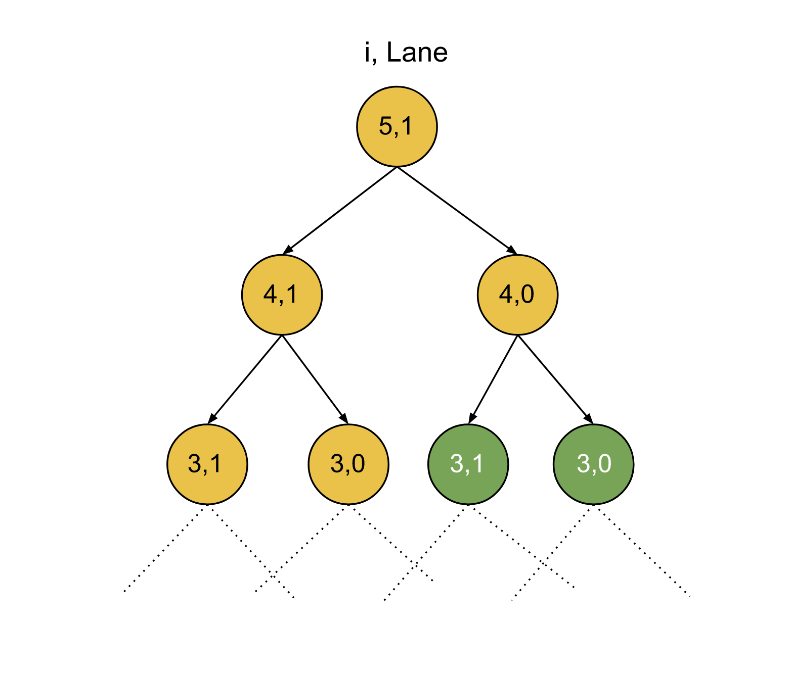

## Solution

---

### Overview

There are $N + 1$ stops; we are initially at stop `0`. There are two types of routes that go through these stops; one regular and the other one express. We are given two 1-indexed integer arrays, `regular` and `express`, both of length $N$. $\text{regular}[i]$ describes the cost it takes to go from $stop[i - 1]$ to $\text{stop}[i]$ using the regular route and $\text{express}[i]$ describes the cost it takes to go from $stop[i - 1]$ to $\text{stop}[i]$ using the express route.

Also, we can switch the routes from regular to express or vice versa, but we have to incur `expressCost` when switching from regular to express while there is no cost to switch back to regular from the express route. We need to return a 1-indexed array `costs` of length $N$, where $\text{costs}[i]$ is the minimum cost to reach stop ` i` from stop `0`.

We should take note of two characteristics of this problem at this time. First, as we iterate over the stops, we must decide whether to use the regular or express route. The cost for these choices will depend on the route we're currently on, which in turn depends on our previous choices of routes. In other words, each decision we make is affected by the previous decisions we have made. Second, the problem is asking to find the minimum cost required. These two characteristics suggest that we could solve this problem using dynamic programming. We will discuss two approaches using dynamic programming, and the third one is just the space-optimized version of the second approach.
</br>

---

### Approach 1: Top-Down Dynamic Programming

**Intuition**

At each stop `i`, we have two options; take the regular route or take the express route.
1. If we are taking the regular route, we need to spend $\text{regular}[i]$.
2. If we are taking the express route, we need to check the current lane we're on. If we are currently in the regular lane then we need to spend `expressCost` to switch to the express lane and then $\text{express}[i]$ to travel to the next stop. If we are already in the express lane, we just need to spend $\text{express}[i]$.

At each stop `i`, we will return the minimum cost of the two options, and after making one of these choices, we will recursively move on to the next stop and repeat the process for the next stop until we covered all the stops. Ultimately, when we reach the last stop, we can return `0` as the cost.

Remember, we must return the minimum cost to reach each stop from the `0th` stop. Hence, at every step, we will keep storing the minimum cost of the two options and store it corresponding to the current stop we're currently on. Therefore, we will start from the last stop, and at each stop, we will make the two choices as we discussed and return the minimum of the two options; also store this as the minimum cost to reach this stop from stop `0`.

What are the parameters that we need to track here? The first one is the index of the stop that we are currently on; also we need to track the lane as well to find if we need to incur `expressCost` or not while switching lanes. Hence, we will store the results corresponding to these two parameters, the index and the lane type (`1` for regular and `0` for express).

Note that because it is free to move from the express lane to the regular lane, one could always arrive at stop `i` in the express lane and then move to the regular lane for free. This means when it comes to reaching stop `i`, it can never be more expensive to be in the regular lane than to be in the express lane, and thus the answer for each stop can be represented as the cost in the regular lane.

This approach, however, is not efficient as we need to iterate over every two possibilities for each of the $N$ stops; therefore, there could be at-max $2^N$ operations which could be huge considering the number of stops can be up to $10^5$. If we observe the below figure, there are repeated subproblems. Notice the green nodes are repeated subproblems signifying that we have already solved these subproblems before. To avoid recalculating results for previously seen subproblems, we will cache the result for each subproblem. The next time we need to calculate the result for the same `stop` and `lane` (regular / express) we have already calculated, we can look up the result in constant time instead of recalculating the result.



**Algorithm**

1. Create a 2D array `dp` with size $N * 2$. Initialize all indices to `-1` to denote that the answer for these states has not yet been calculated.
2. Call the recursive function `solve()` with $i = \text{regular.size}() - 1$ and $lane = 1$, for each state, do the following:

1. If `i < 0`, i.e. all stops are covered, then return `0`.
2. Store the cost using the regular lane in the variable `regularLane`; the cost would be $\text{regular}[i]$ plus the recursive call with index as $i - 1$ and lane as `1`.
3. Store the cost using the express lane in the variable `expressLane`; the cost would be $\text{express}[i]$ plus the recursive call with index as $i - 1$ and lane as `0`, also there would be an extra `expressCost` if previously we were on the regular lane.
4. Return minimum of `regularLane` and `expressLane`; also store it as $\text{dp}[i][lane]$.
3. Iterate over all the stops, and for each stop `i`, store the cost to reach it from `0` as $\text{dp}[i][1]$ in the array `ans`.
4. Return `ans`.

**Implementation**

```cpp
class Solution {
public:
    long solve(int i, int lane, long dp[][2], vector<int>& regular, vector<int>& express, int expressCost) {
        // If all stops are covered, return 0.
        if (i < 0) {
            return 0;
        }

        if (dp[i][lane] != -1) {
            return dp[i][lane];
        }

        // Use the regular lane; no extra cost to switch lanes if required.
        long regularLane = regular[i] + solve(i - 1, 1, dp, regular, express, expressCost);
        // Use express lane; add expressCost if the previously regular lane was used.
        long expressLane = (lane ? expressCost : 0) + express[i]
                                                    + solve(i - 1, 0, dp, regular, express, expressCost);

        return dp[i][lane] = min(regularLane, expressLane);
    }

    vector<long long> minimumCosts(vector<int>& regular, vector<int>& express, int expressCost) {
        long dp[regular.size()][2];
        memset(dp, -1, sizeof(dp));

        solve(regular.size() - 1, 1, dp, regular, express, expressCost);

        // Store cost for each stop.
        vector<long long> ans;
        for (int i = 0 ; i < regular.size(); i++) {
            ans.push_back(dp[i][1]);
        }

        return ans;
    }
};
```

**Complexity Analysis**

Here, $N$ is the number of stops.

* Time complexity: $O(N)$

  We have $N$ stops, and for each stop, we will make two recursive calls for the two options; thus, the total number of operations could be $2 *N$, and we need to find the answer to each state to solve the original problem. For each state, the time complexity is $O(1)$ as we are just making recursive calls and finding the minimum of two integers. Hence, the total time complexity equals $O(N)$.

* Space complexity: $O(N)$

  The size of array `dp` is $2 * N$; also, there would be some stack space; the maximum number of active stack calls would be equal to $N$. We also need an array to store the answer `ans`, but generally, the space to store the answer is not considered part of the space complexity. Thus, the total space complexity equals $O(N)$.
  <br/>

---

### Approach 2: Bottom-Up Dynamic Programming

**Intuition**

In the previous approach, the recursive calls incurred stack space. This can be avoided by applying the same approach iteratively, which is generally faster than the top-down approach. We will follow a similar approach as the previous one, just in a reverse manner.

In this approach, we will start from the stop `0` and try to find the cost to reach the $i^{th}$ stop from `0` using the minimum cost we have calculated for previous stops. As the base case, the cost to reach stop `0` in the regular lane is `0` since we start there. However, the cost to reach stop `0` using the express lane is `expressCost` as this is the cost to switch lanes.

Now, we will iterate over the stops from `1` to `N`, and for each stop, we will find the minimum cost from each of the two routes, i.e. regular lane and express lane. For the regular lane, the cost to reach stop `i` would be $regular[i - 1] + min(dp[i - 1][1], dp[i - 1][0])$; this is because we can switch from express lane to regular with no cost, so we take the minimum of the two and add the cost to travel the regular lane. For the express lane, the minimum cost would be $express[i - 1] + min(expressCost + dp[i - 1][1], dp[i - 1][0])$; for this, we have to add `expressCost` to the cost via regular route while switching from the regular lane, we take the minimum of two and add the cost to travel via express lane. Hence the recursive equation for the minimum cost at stop `i` is:

> dp[i][1] = regular[i - 1] + Min(dp[i - 1][1], dp[i - 1][0]); Minimum cost to reach i via regular lane.

> dp[i][0] = express[i - 1] + Min(expressCost + dp[i - 1][1], dp[i - 1][0]); Minimum cost to reach i via express lane.

> Minimum cost to reach stop i = Min(dp[i][0], dp[i][1]);

We will store these minimum costs for each stop in an array `ans` and can return it in the end.

**Algorithm**

1. Create a 2D array `dp` with size $N * 2$.
2. Initialize $\text{dp}[0][1] = 0$ and $\text{dp}[0][0] = expressCost$; $\text{dp}[i][j]$ denotes the cost to reach stop `i` from `0` via lane `j` which could be `1` (regular) or `0`(express).
3. Iterate over the stops from `1` to `N`, and for each stop `i` find the cost as follows:

1. $\text{dp}[i][1] = regular[i - 1] + Min(dp[i - 1][1], dp[i - 1][0])$
2. $\text{dp}[i][0] = express[i - 1] + Min(expressCost + dp[i - 1][1], dp[i - 1][0])$
3. $Min(\text{dp}[i][0], \text{dp}[i][1])$; store it in the array `ans`.

4. Return `ans`.

**Implementation**

```cpp
class Solution {
public:
    vector<long long> minimumCosts(vector<int>& regular, vector<int>& express, int expressCost) {
        int N = regular.size() + 1;
        vector<long long> ans;

        long dp[N][2];
        dp[0][1] = 0;
        // Need to spend expressCost, as we start from the regular lane initially.
        dp[0][0] = expressCost;

        for (int i = 1; i < N; i++) {
            // Use the regular lane; no extra cost to switch to the express lane.
            dp[i][1] = regular[i - 1] + min(dp[i - 1][1], dp[i - 1][0]);
            // Use express lane; add extra cost if the previously regular lane was used.
            dp[i][0] = express[i - 1] + min(expressCost + dp[i - 1][1], dp[i - 1][0]);

            ans.push_back(min(dp[i][0], dp[i][1]));
        }
        return ans;
    }
};
```

**Complexity Analysis**

Here, $N$ is the number of stops.

* Time complexity: $O(N)$

  We iterate over each stop once to find the minimum cost, and hence the total time complexity is equal to $O(N)$.

* Space complexity: $O(N)$

  The size of array `dp` is $2 * N$. We also need an array to store the answer `ans`, but generally, the space to store the answer is not considered part of the space complexity. Thus, the total space complexity is equal to $O(N)$.
  <br/>

---

### Approach 3: Space-Optimized Bottom-Up Dynamic Programming

**Intuition**

In the previous approach to find the minimum cost for the stop `i`, we only need the minimum cost for the stop $i - 1$ via the two lanes; We can observe that we always use the $dp[i - 1]$ values to find the answer for $\text{dp}[i]$; but we still keep all the previously calculated results in the array `dp`. To save space, we can just use two variables, one `prevRegularLane` to store the minimum cost to reach $(i - 1)^{th}$ stop from `0` via the regular lane and another `prevExpressLane` to store the minimum cost to reach stop $(i - 1)^{th}$ stop from `0` via the express lane.

After calculating the result for the current stop `i`; we will update these two variables with the minimum cost for `i` so that we can use them for the $(i + 1)^{th}$ stop iteration. This way, we will follow the same approach as the last without the `dp` array. This will help in reducing the space complexity.

**Algorithm**

1. Initialize $prevRegularLane = 0$ and `prevExpressLane= expressCost`;  `prevExpressLane` denotes the minimum cost to reach the previous stop from `0` using the regular lane, and `prevExpressLane` denotes the minimum cost to reach the previous stop from `0` using the express lane.
2. Iterate over the stops from `1` to `N`, and for each stop `i` find the cost as follows:

1. $regularLaneCost = regular[i - 1] + Min(prevRegularLane, prevExpressLane)$
2. $expressLaneCost = express[i - 1] + Min(expressCost + prevRegularLane, prevExpressLane)$
3. `Min(regularLaneCost, expressLaneCost)`; store it in the array `ans`.
4. Assign $prevRegularLane = regularLaneCost$ & $prevExpressLane = expressLaneCost$ to update the previous values.

3. Return `ans`.

**Implementation**

```cpp
class Solution {
public:
    vector<long long> minimumCosts(vector<int>& regular, vector<int>& express, int expressCost) {
        int N = regular.size() + 1;

        long prevRegularLane = 0;
        // Need to spend expressCost, as we start from the regular lane initially.
        long prevExpressLane = expressCost;

        vector<long long> ans;
        for (int i = 1; i < N; i++) {
            // Use the regular lane; no extra cost to switch to the express lane.
            long regularLaneCost = regular[i - 1] + min(prevRegularLane, prevExpressLane);
            // Use express lane; add extra cost if the previously regular lane was used.
            long expressLaneCost = express[i - 1] + min(expressCost + prevRegularLane, prevExpressLane);

            ans.push_back(min(regularLaneCost, expressLaneCost));

            prevRegularLane = regularLaneCost;
            prevExpressLane = expressLaneCost;
        }

        return ans;
    }
};
```

**Complexity Analysis**

Here, $N$ is the number of stops.

* Time complexity: $O(N)$

  We iterate over each stop once to find the minimum cost, and hence the total time complexity is equal to $O(N)$.

* Space complexity: $O(1)$

  We only need two variables here, `prevRegularLane` and `prevExpressLane`, to find the following stop answer. We also need an array to store the answer `ans`, but generally, the space to store the answer is not considered part of the space complexity. Thus, the total space complexity is equal to constant.
  <br/>

---