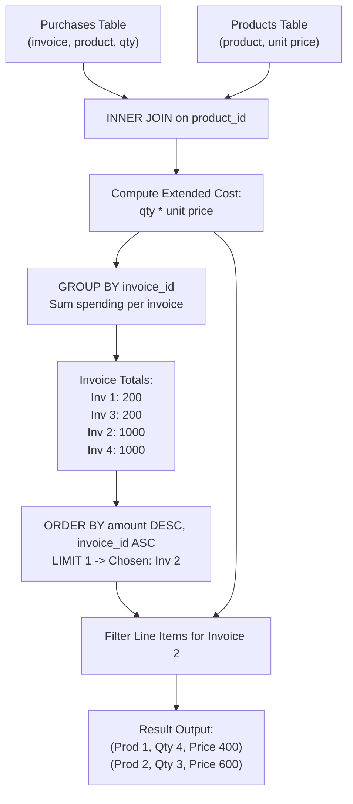

# Guided Example: Generate the Invoice

## 1. Problem Overview & Representative Instance

We are given two relational database tables, `Products` and `Purchases`:
- `Products` defines catalog pricing with columns `product_id` and unit `price`.
- `Purchases` records customer transactions with columns `invoice_id`, `product_id`, and purchased `quantity`.

Each invoice consists of one or more purchased line items. The total spending for an invoice is the sum of `quantity * price` across all products purchased in that invoice. We must identify the invoice with the **highest total spending**. If there is a tie between multiple invoices with the same maximum total spending, we select the invoice with the strictly **smallest** `invoice_id`.

Once this winning invoice is determined, we must return its itemized line items: `product_id`, `quantity`, and `price` (where `price` represents the total line item cost: $\text{quantity} \times \text{unit\_price}$).

Consider the representative instance:
- `Products`:
  - Product 1: unit price $100$
  - Product 2: unit price $200$
- `Purchases`:
  - Invoice 1: Product 1, quantity $2 \implies$ line cost $2 \times 100 = 200$
  - Invoice 3: Product 2, quantity $1 \implies$ line cost $1 \times 200 = 200$
  - Invoice 2:
    - Product 2, quantity $3 \implies 3 \times 200 = 600$
    - Product 1, quantity $4 \implies 4 \times 100 = 400$
    - Invoice 2 total: $600 + 400 = 1000$
  - Invoice 4: Product 1, quantity $10 \implies 10 \times 100 = 1000$

Comparing invoice totals:
- Invoices 2 and 4 tie for the maximum spending of $1000$.
- Breaking the tie: Invoice $2$ has a smaller identifier than Invoice $4$ ($2 < 4$).
- The selected invoice is Invoice $2$.

The itemized line items for Invoice 2 are:
- Product 1: quantity $4$, line price $400$
- Product 2: quantity $3$, line price $600$

## 2. Mathematical & Algorithmic Principles

Let relation $\mathcal{R}_{\text{prod}}$ represent `Products` and $\mathcal{R}_{\text{purch}}$ represent `Purchases`.

### Relational Extension and Aggregation
First, join purchase records with catalog prices along the foreign key `product_id`:

$$\mathcal{L} = \mathcal{R}_{\text{purch}} \bowtie_{\text{product\_id}} \mathcal{R}_{\text{prod}}$$

Each resulting line item tuple $\tau = (\text{inv}, \text{prod}, q, p) \in \mathcal{L}$ possesses an extended monetary cost:

$$\text{line\_cost}(\tau) = q \times p$$

The total expenditure for an invoice $k$ is obtained by summing across its constituent lines:

$$E(k) = \sum_{\tau \in \mathcal{L}, \tau.\text{inv} = k} \text{line\_cost}(\tau)$$

### Deterministic Argmax with Lexicographical Tie-Breaking
The winning invoice identifier $k^*$ is selected by maximizing total expenditure $E(k)$ and minimizing the identifier $k$ in case of ties:

$$k^* = \arg\max_{k} \left( E(k), \; -k \right)$$

This represents ordering the distinct invoice summaries by:
1. Primary key: $E(k)$ descending.
2. Secondary key: $k$ ascending.
3. Extracting the top single element ($\text{LIMIT } 1$).

### Itemized Projection
Once $k^*$ is isolated, the final query performs a relational equi-join filter matching all original line items belonging to $k^*$:

$$\text{Result} = \pi_{\text{prod}, \; q, \; q \times p} \left( \sigma_{\text{inv} = k^*}(\mathcal{L}) \right)$$

| Pipeline Stage | Relational Operator | Input Relations | Output Dimension |
|---|---|---|---|
| Price Resolution | Natural Inner Equi-Join | `Purchases` $\bowtie$ `Products` | Line items with unit price |
| Invoice Spending | Grouped Sum Aggregation | Extended line items $\mathcal{L}$ | $(k, E(k))$ per invoice |
| Target Selection | Ordered Projection with Limit | Summaries $(k, E(k))$ | Scalar winner $k^*$ |
| Final Invoice Render | Equi-Join Filter & Projection | $\mathcal{L} \bowtie \{k^*\}$ | Line item report for $k^*$ |

## 3. Step-by-Step Walkthrough with Intermediate State

Let us trace the representative instance across both tables.

### Phase 1: Equi-Join Line Items
Compute extended line cost $q \times p$ for each transaction record:
- Row 1: Invoice 1, Product 1, Qty 2, Unit Price 100 $\implies 2 \times 100 = 200$.
- Row 2: Invoice 3, Product 2, Qty 1, Unit Price 200 $\implies 1 \times 200 = 200$.
- Row 3: Invoice 2, Product 2, Qty 3, Unit Price 200 $\implies 3 \times 200 = 600$.
- Row 4: Invoice 2, Product 1, Qty 4, Unit Price 100 $\implies 4 \times 100 = 400$.
- Row 5: Invoice 4, Product 1, Qty 10, Unit Price 100 $\implies 10 \times 100 = 1000$.

### Phase 2: Grouped Aggregation by Invoice ID
Sum line costs per `invoice_id`:
- **Invoice 1:** Total $= 200$.
- **Invoice 3:** Total $= 200$.
- **Invoice 2:** Total $= 600 + 400 = 1000$.
- **Invoice 4:** Total $= 1000$.

### Phase 3: Rank and Tie-Break
Sort invoices by total spending descending, then by `invoice_id` ascending:
1. Invoice 2: Amount $1000$, ID $2$ (Precedes Invoice 4 because $2 < 4$)
2. Invoice 4: Amount $1000$, ID $4$
3. Invoice 1: Amount $200$, ID $1$
4. Invoice 3: Amount $200$, ID $3$

The top-ranked invoice is Invoice $2$.

### Phase 4: Output Line Items for Chosen Invoice
Filter the joined line items from Phase 1 where `invoice_id = 2`:
- Product 1: Quantity $4$, Extended Price $400$.
- Product 2: Quantity $3$, Extended Price $600$.

Both items are output.

## 4. Comprehensive State Trace

The evaluation of each purchase record and the resulting invoice aggregate ranking are captured below.

| Invoice ID | Product ID | Quantity | Unit Price | Extended Line Cost | Invoice Total | Tie-Break Rank |
|---|---|---|---|---|---|---|
| $1$ | $1$ | $2$ | $100$ | $200$ | $200$ | $3$ |
| $3$ | $2$ | $1$ | $200$ | $200$ | $200$ | $4$ |
| $2$ | $2$ | $3$ | $200$ | $600$ | $1000$ | **1 (Winner)** |
| $2$ | $1$ | $4$ | $100$ | $400$ | $1000$ | **1 (Winner)** |
| $4$ | $1$ | $10$ | $100$ | $1000$ | $1000$ | $2$ |

Chosen invoice is $2$.
Final projected rows:
- `(1, 4, 400)`
- `(2, 3, 600)`

## 5. Algorithmic Correctness & Soundness

1. **Multi-Item Line Aggregation:**
   Invoices can contain multiple distinct products. The grouped summation correctly computes total invoice value by summing across all products on that invoice, preventing single-line dominance biases.

2. **Deterministic Tie-Breaking:**
   Sorting primarily by `amount DESC` and secondarily by `invoice_id ASC` guarantees that when two or more invoices achieve the exact same highest total, the one with the smallest numeric identifier is uniquely and deterministically selected.

3. **Output Schema Compliance:**
   The output `price` column is required to represent the extended line item price ($\text{quantity} \times \text{unit\_price}$), rather than the catalog unit price. Computing $q \times p$ fulfills this schema definition.

## 6. Edge Cases & Anti-Patterns

- **Single Invoice in Database:**
  - That invoice is unconditionally the winner, regardless of its spending amount.
- **Multiple Products with Zero Quantities:**
  - Quantities are positive in standard business domains, but if a product has zero cost or zero quantity, the math holds without division issues.
- **Anti-Pattern (Joining Back Without Invoice Scoping):**
  - Projecting products with the highest overall unit price rather than identifying the invoice with highest total expenditure confuses product-level value with invoice-level value. Aggregation must happen at the `invoice_id` level first.

## 7. Complexity Analysis

- **Time Complexity:** $\mathcal{O}(P \log P + K \log K)$, where $P$ is the number of rows in `Purchases` and $K$ is the number of distinct invoices ($K \le P$).
  - Joining $P$ purchase rows with the catalog takes $\mathcal{O}(P)$ average time using hash join.
  - Grouping and summing takes $\mathcal{O}(P)$ time.
  - Sorting the $K$ invoice totals to find the top invoice takes $\mathcal{O}(K \log K)$ time (or $\mathcal{O}(K)$ via single-pass linear argmax).
  - Filtering and formatting the winner's line items takes $\mathcal{O}(L)$ time, where $L$ is the number of lines on that invoice.
  - Overall time complexity is linearithmic $\mathcal{O}(P \log P)$.
- **Space Complexity:** $\mathcal{O}(P)$ auxiliary memory to maintain the intermediate joined relations and grouped hash tables.
