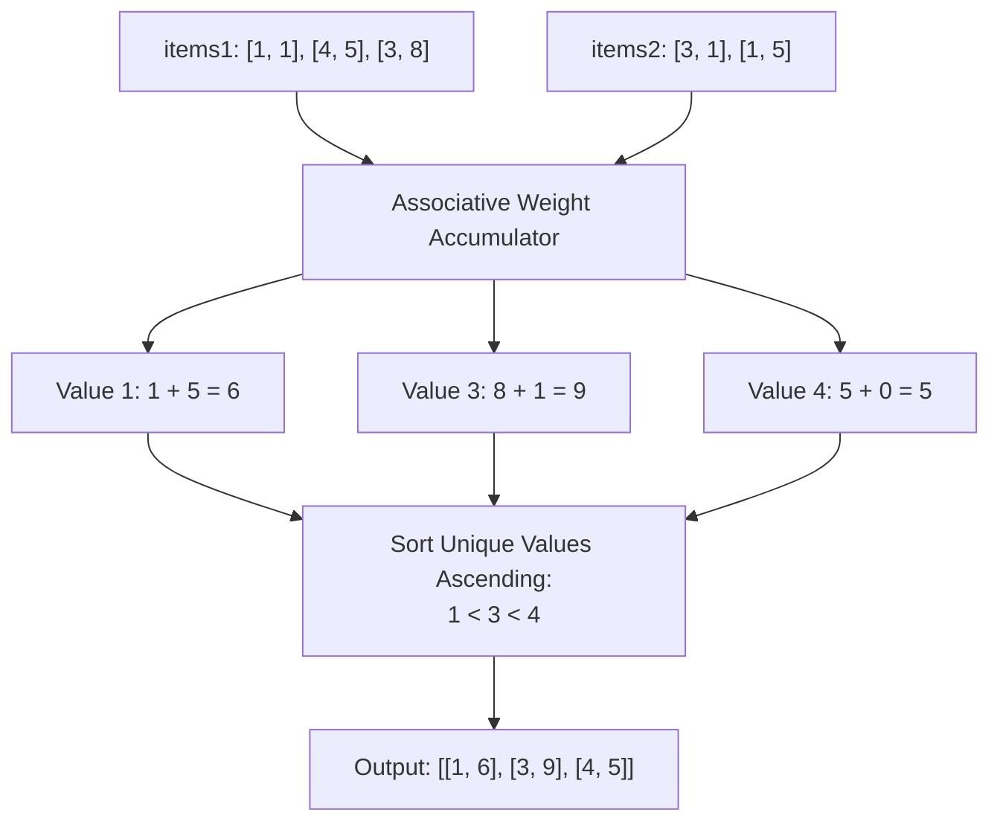

# Guided Example: Merge Similar Items

## 1. Problem Overview & Representative Instance

We are given two 2D integer arrays, `items1` and `items2`, representing two separate collections of weighted items. Each collection is represented as a list of pairs $[v, w]$, where:
- $v$ is the distinct value of the item.
- $w$ is the associated weight of the item.
- Each value $v$ appears at most once within `items1`, and at most once within `items2`.

We must merge these collections into a single unified 2D array `ret` such that:
1. Every distinct value present in either `items1` or `items2` appears exactly once in `ret`.
2. The weight for a value $v$ is the sum of its weights from both collections.
3. The resulting list is sorted in strictly **ascending order of value $v$**.

Consider the representative instance:
- `items1 = [[1, 1], [4, 5], [3, 8]]`
- `items2 = [[3, 1], [1, 5]]`

Let us group the contributions by item value $v$:
- **Value 1:**
  - Appears in `items1` with weight $1$.
  - Appears in `items2` with weight $5$.
  - Combined weight: $1 + 5 = 6$.
- **Value 3:**
  - Appears in `items1` with weight $8$.
  - Appears in `items2` with weight $1$.
  - Combined weight: $8 + 1 = 9$.
- **Value 4:**
  - Appears in `items1` with weight $5$.
  - Absent in `items2` (implicit weight $0$).
  - Combined weight: $5 + 0 = 5$.

Sorting the merged items by value in ascending order:
$$\text{ret} = [[1, 6], [3, 9], [4, 5]]$$

## 2. Mathematical & Algorithmic Principles

Each collection of items can be viewed as a formal linear combination over the set of discrete positive values $\mathcal{V} \subset \mathbb{Z}^+$:

$$C_1 = \sum_{(v, w) \in items1} w \cdot \mathbf{e}_v, \quad C_2 = \sum_{(v, w) \in items2} w \cdot \mathbf{e}_v$$

where $\mathbf{e}_v$ is the standard basis vector representing item identity $v$.

### Direct Algebraic Addition
The merged collection is simply the vector addition $C = C_1 + C_2$.
For any value $v \in \mathcal{V}_1 \cup \mathcal{V}_2$, the cumulative weight function evaluates as:

$$W(v) = w_1(v) + w_2(v)$$

where $w_k(v)$ is the weight of value $v$ in collection $k$ (defaulting to $0$ if value $v$ is absent).

### Order Structure
Let $\mathcal{U} = \mathcal{V}_1 \cup \mathcal{V}_2$ denote the union of distinct values.
We impose the standard strict total order on the key space:

$$u_1 < u_2 < \dots < u_m, \quad u_i \in \mathcal{U}$$

The final representation is an ordered sequence of 2-tuples:

$$\text{ret} = \left[ (u_1, W(u_1)), \; (u_2, W(u_2)), \; \dots, \; (u_m, W(u_m)) \right]$$

### Implementation Options
1. **Hash Table + Post-Sorting:**
   Accumulate weights into a standard hash map in $\mathcal{O}(|items1| + |items2|)$ time. Extract the keys, sort them in $\mathcal{O}(m \log m)$ time, and format the output.
2. **Direct-Address Array:**
   Since $1 \le v \le 1000$, an array of size $1001$ can accumulate weights at index $v$ in $\mathcal{O}(1)$ time. A single linear scan from index $1$ to $1000$ collects non-zero weights in automatically sorted order in $\mathcal{O}(V_{\max})$ time without explicit sorting.

| Component | Mathematical Meaning | Handling of Missing Keys | Output Role |
|---|---|---|---|
| Key $v$ | Unique item valuation | Present in $\mathcal{V}_1 \cup \mathcal{V}_2$ | Primary sort coordinate |
| Partial Weight $w_k(v)$ | Weight contribution from collection $k$ | Defaults to $0$ if absent | Summands in $W(v)$ |
| Total Weight $W(v)$ | Total aggregated mass $w_1(v) + w_2(v)$ | Strictly positive ($W(v) > 0$) | Value companion in pair |

## 3. Step-by-Step Walkthrough with Intermediate State

Let us trace `items1 = [[1, 1], [4, 5], [3, 8]]` and `items2 = [[3, 1], [1, 5]]`.
Initialize a direct weight accumulator map $M = \{\}$.

### Phase 1: Ingest `items1`
- **Item `[1, 1]`:**
  - Key $v = 1$, weight $w = 1$.
  - Record: $M[1] \leftarrow 0 + 1 = 1$.
- **Item `[4, 5]`:**
  - Key $v = 4$, weight $w = 5$.
  - Record: $M[4] \leftarrow 0 + 5 = 5$.
- **Item `[3, 8]`:**
  - Key $v = 3$, weight $w = 8$.
  - Record: $M[3] \leftarrow 0 + 8 = 8$.

State after collection 1: $M = \{1: 1, 4: 5, 3: 8\}$.

### Phase 2: Ingest `items2`
- **Item `[3, 1]`:**
  - Key $v = 3$, weight $w = 1$.
  - Value $3$ already exists with weight $8$.
  - Update: $M[3] \leftarrow 8 + 1 = 9$.
- **Item `[1, 5]`:**
  - Key $v = 1$, weight $w = 5$.
  - Value $1$ already exists with weight $1$.
  - Update: $M[1] \leftarrow 1 + 5 = 6$.

State after collection 2: $M = \{1: 6, 4: 5, 3: 9\}$.

### Phase 3: Sort by Key and Materialize
Extract all distinct keys: $\{1, 3, 4\}$.
Sort keys ascending:
$$1 < 3 < 4$$
Construct output pairs:
- For $v = 1$: pair is `[1, 6]`
- For $v = 3$: pair is `[3, 9]`
- For $v = 4$: pair is `[4, 5]`

Result: `[[1, 6], [3, 9], [4, 5]]`.

## 4. Comprehensive State Trace

The state of each distinct value across both input streams is captured in the trace table below.

| Item Value $v$ | Present in `items1`? | Weight in `items1` ($w_1$) | Present in `items2`? | Weight in `items2` ($w_2$) | Merged Weight $W(v)$ | Output Position (Sorted) |
|---|---|---|---|---|---|---|
| $1$ | Yes | $1$ | Yes | $5$ | $1 + 5 = 6$ | Index 0 (`[1, 6]`) |
| $3$ | Yes | $8$ | Yes | $1$ | $8 + 1 = 9$ | Index 1 (`[3, 9]`) |
| $4$ | Yes | $5$ | No | $0$ | $5 + 0 = 5$ | Index 2 (`[4, 5]`) |

Final sorted array: `[[1, 6], [3, 9], [4, 5]]`.

## 5. Algorithmic Correctness & Soundness

1. **Weight Conservation:**
   Because each collection guarantees uniqueness of values within itself, no value appears more than once in `items1` or more than once in `items2`. Thus, the additive operation $w_1(v) + w_2(v)$ accurately captures the totality of weight from both sources without double-counting.

2. **Completeness of Union:**
   Any value present in either input list is registered in the accumulator map. No items are omitted or dropped.

3. **Deterministic Ordering:**
   Explicit sorting of the unique keys ensures that the output is sorted in strictly increasing order of item value, adhering to the contract specification.

## 6. Edge Cases & Anti-Patterns

- **Disjoint Item Collections (`items1 = [[1, 2]]`, `items2 = [[2, 3]]`):**
  - No overlap in values. Merged array contains `[[1, 2], [2, 3]]`.
- **Complete Value Overlap:**
  - Every value appears in both arrays. Every output pair reflects a sum of two positive weights.
- **One Empty Collection:**
  - If one list is empty, the output is simply the sorted representation of the other list.
- **Anti-Pattern (Concatenation and In-Place Bubble Sorting):**
  - Concatenating and searching pairwise takes quadratic $\mathcal{O}((n_1 + n_2)^2)$ time. Hash map or direct-address aggregation reduces the merge to optimal $\mathcal{O}(N \log N)$ or $\mathcal{O}(N + V_{\max})$ time.

## 7. Complexity Analysis

- **Time Complexity:** $\mathcal{O}((n_1 + n_2) \log(n_1 + n_2))$, where $n_1$ is the length of `items1` and $n_2$ is the length of `items2`.
  - Inserting all $n_1 + n_2$ elements into a hash table takes $\mathcal{O}(n_1 + n_2)$ average time.
  - Sorting the $m \le n_1 + n_2$ unique keys takes $\mathcal{O}(m \log m)$ time.
  - When using a fixed-size direct-address array over bounded values $v \le 1000$, the time complexity is $\mathcal{O}(n_1 + n_2 + V_{\max})$, which runs in strictly linear $\mathcal{O}(n_1 + n_2)$ time.
- **Space Complexity:** $\mathcal{O}(n_1 + n_2)$ auxiliary space to store the merged frequency table and result array.
