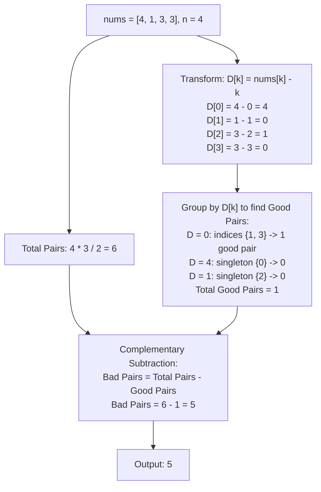

# Guided Example: Count Number of Bad Pairs

## 1. Problem Overview & Representative Instance

We are given a 0-indexed integer array `nums`. A pair of indices $(i, j)$ is defined as **bad** if:
1. $i < j$
2. $j - i \ne nums[j] - nums[i]$

Conversely, a pair is defined as **good** if $j - i = nums[j] - nums[i]$. Our objective is to calculate the total number of bad pairs present in `nums`.

Consider the representative instance:
- `nums = [4, 1, 3, 3]`
- Array length: $n = 4$

The total number of index pairs $(i, j)$ with $i < j$ is:
$$\binom{4}{2} = \frac{4 \times 3}{2} = 6$$

Let us evaluate the condition $j - i = nums[j] - nums[i]$ across all $6$ index pairs:
- $(0, 1)$: $1 - 0 = 1$, whereas $nums[1] - nums[0] = 1 - 4 = -3$. Since $1 \ne -3 \implies$ **Bad pair**.
- $(0, 2)$: $2 - 0 = 2$, whereas $nums[2] - nums[0] = 3 - 4 = -1$. Since $2 \ne -1 \implies$ **Bad pair**.
- $(0, 3)$: $3 - 0 = 3$, whereas $nums[3] - nums[0] = 3 - 4 = -1$. Since $3 \ne -1 \implies$ **Bad pair**.
- $(1, 2)$: $2 - 1 = 1$, whereas $nums[2] - nums[1] = 3 - 1 = 2$. Since $1 \ne 2 \implies$ **Bad pair**.
- $(1, 3)$: $3 - 1 = 2$, whereas $nums[3] - nums[1] = 3 - 1 = 2$. Since $2 = 2 \implies$ **Good pair**.
- $(2, 3)$: $3 - 2 = 1$, whereas $nums[3] - nums[2] = 3 - 3 = 0$. Since $1 \ne 0 \implies$ **Bad pair**.

There is exactly $1$ good pair: $(1, 3)$.
The remaining $6 - 1 = 5$ pairs are bad. The final answer is $5$.

## 2. Mathematical & Algorithmic Principles

Directly searching for pairs that violate $j - i \ne nums[j] - nums[i]$ requires checking inequality across $\mathcal{O}(n^2)$ pairs. We can reduce this to linear time using coordinate rearrangement and complementary counting.

### Algebraic Transposition of the Good Pair Invariant
Rearrange the equality condition:

$$j - i = nums[j] - nums[i]$$

Grouping terms with index $i$ on the left and index $j$ on the right:

$$nums[i] - i = nums[j] - j$$

Define the transformed sequence:

$$D[k] = nums[k] - k \quad \text{for } 0 \le k < n$$

Under this transformation:

$$(i, j) \text{ is a good pair} \iff D[i] = D[j]$$

A pair of indices is good if and only if both indices evaluate to the exact same value in array $D$.

### Complementary Counting Strategy
The total number of pairs of indices with $0 \le i < j < n$ is given by the binomial coefficient:

$$N_{\text{total}} = \binom{n}{2} = \frac{n(n - 1)}{2}$$

By the law of the excluded middle, every pair $(i, j)$ is either good or bad, but never both. Therefore:

$$N_{\text{bad}} = N_{\text{total}} - N_{\text{good}}$$

Let the distinct values in $D$ be partitioned into frequency classes, where $C(v) = |\{k \mid D[k] = v\}|$.
The total number of good pairs is the sum of combinations of choosing two identical values within each frequency bucket:

$$N_{\text{good}} = \sum_{v} \binom{C(v)}{2} = \sum_{v} \frac{C(v)(C(v) - 1)}{2}$$

### Online Single-Pass Formulation
Equivalently, as we iterate from $j = 0$ to $n - 1$:
- When we arrive at index $j$, there are $j$ preceding elements $i < j$.
- Exactly $H[D[j]]$ of these preceding elements have $D[i] = D[j]$ (good pairs).
- The remaining $j - H[D[j]]$ preceding elements have $D[i] \ne D[j]$ (bad pairs).
- We accumulate the bad pairs: $\text{ans} \leftarrow \text{ans} + (j - H[D[j]])$.
- We then increment the frequency: $H[D[j]] \leftarrow H[D[j]] + 1$.

| Metric / Term | Mathematical Formula | Algorithmic Function |
|---|---|---|
| Total Pairs $N_{\text{total}}$ | $\frac{n(n-1)}{2}$ | Upper bound on possible pairs |
| Transformed Value $D[k]$ | $nums[k] - k$ | Maps the condition to simple equality $D[i] = D[j]$ |
| Good Pairs $N_{\text{good}}$ | $\sum \binom{C(v)}{2}$ | Equal-key collisions in the hash map |
| Bad Pairs $N_{\text{bad}}$ | $N_{\text{total}} - N_{\text{good}}$ | Final target result |

## 3. Step-by-Step Walkthrough with Intermediate State

Let us trace `nums = [4, 1, 3, 3]` with $n = 4$.
We use the online single-pass approach with running accumulator $\text{bad\_count} = 0$ and frequency map $H$.

### Step 0: Index $j = 0, nums[0] = 4$
- Transformed difference: $D[0] = nums[0] - 0 = 4 - 0 = 4$.
- Preceding elements: $j = 0$.
- Preceding matches with value $4$: $H[4] = 0$.
- New bad pairs: $0 - 0 = 0$.
- Update accumulator: $\text{bad\_count} \leftarrow 0 + 0 = 0$.
- Record frequency: $H[4] \leftarrow 0 + 1 = 1$.
- State: $\text{bad\_count} = 0, H = \{4: 1\}$.

### Step 1: Index $j = 1, nums[1] = 1$
- Transformed difference: $D[1] = nums[1] - 1 = 1 - 1 = 0$.
- Preceding elements: $j = 1$ (index 0).
- Preceding matches with value $0$: $H[0] = 0$.
- New bad pairs: $1 - 0 = 1$ (pair $(0, 1)$).
- Update accumulator: $\text{bad\_count} \leftarrow 0 + 1 = 1$.
- Record frequency: $H[0] \leftarrow 0 + 1 = 1$.
- State: $\text{bad\_count} = 1, H = \{4: 1, 0: 1\}$.

### Step 2: Index $j = 2, nums[2] = 3$
- Transformed difference: $D[2] = nums[2] - 2 = 3 - 2 = 1$.
- Preceding elements: $j = 2$ (indices 0, 1).
- Preceding matches with value $1$: $H[1] = 0$.
- New bad pairs: $2 - 0 = 2$ (pairs $(0, 2)$ and $(1, 2)$).
- Update accumulator: $\text{bad\_count} \leftarrow 1 + 2 = 3$.
- Record frequency: $H[1] \leftarrow 0 + 1 = 1$.
- State: $\text{bad\_count} = 3, H = \{4: 1, 0: 1, 1: 1\}$.

### Step 3: Index $j = 3, nums[3] = 3$
- Transformed difference: $D[3] = nums[3] - 3 = 3 - 3 = 0$.
- Preceding elements: $j = 3$ (indices 0, 1, 2).
- Preceding matches with value $0$: $H[0] = 1$ (index 1).
- New bad pairs: $3 - 1 = 2$ (pairs $(0, 3)$ and $(2, 3)$; pair $(1, 3)$ is good).
- Update accumulator: $\text{bad\_count} \leftarrow 3 + 2 = 5$.
- Record frequency: $H[0] \leftarrow 1 + 1 = 2$.
- State: $\text{bad\_count} = 5, H = \{4: 1, 0: 2, 1: 1\}$.

Loop complete. Final bad pair count is $5$.

## 4. Comprehensive State Trace

The evaluation of each index and the cumulative resolution of bad pairs is detailed below.

| Index $j$ | Element $nums[j]$ | Difference $D[j]$ | Preceding Count $j$ | Historical Matches $H[D[j]]$ | Good Pairs at $j$ | Bad Pairs Added ($j - H$) | Running Total Bad Pairs |
|---|---|---|---|---|---|---|---|
| $0$ | $4$ | $4$ | $0$ | $0$ | $0$ | $0$ | $0$ |
| $1$ | $1$ | $0$ | $1$ | $0$ | $0$ | $1$ | $1$ |
| $2$ | $3$ | $1$ | $2$ | $0$ | $0$ | $2$ | $3$ |
| $3$ | $3$ | $0$ | $3$ | $1$ (Idx 1) | $1$ (`(1, 3)`) | $2$ | **5** |

Total bad pairs: $5$.

## 5. Algorithmic Correctness & Soundness

1. **Bijective Algebraic Equivalence:**
   The equation $j - i = nums[j] - nums[i]$ holds if and only if $nums[i] - i = nums[j] - j$. Because integer subtraction is deterministic and invertible, two indices satisfy the good pair relationship if and only if their mapped values $D[i]$ and $D[j]$ are equal.

2. **Completeness of Disjoint Partitioning:**
   Every pair of indices $(i, j)$ with $i < j$ satisfies either $D[i] = D[j]$ or $D[i] \ne D[j]$. Since the set of all pairs is partitioned into good and bad pairs without overlap, $N_{\text{bad}} = N_{\text{total}} - N_{\text{good}}$ is exact.

3. **Invariance of Summation Order:**
   Adding $j - H[D[j]]$ at step $j$ counts all pairs $(i, j)$ with $i < j$ such that $D[i] \ne D[j]$. Because every pair is inspected exactly once at the moment of its right endpoint $j$, no pair is missed or counted twice.

## 6. Edge Cases & Anti-Patterns

- **All Pairs Good (`nums = [1, 2, 3, 4, 5]`):**
  - $D[k] = nums[k] - k = 1$ for all $k$.
  - All $5$ elements share the same difference $1$.
  - Good pairs $= \binom{5}{2} = 10$. Bad pairs $= 10 - 10 = 0$.
- **All Pairs Bad (All $D[k]$ Distinct):**
  - Good pairs $= 0$. Bad pairs $= \frac{n(n-1)}{2}$.
- **Large Arrays (64-Bit Integer Requirement):**
  - If $n = 10^5$, total pairs can reach $\approx 5 \times 10^9$, exceeding 32-bit signed integer capacity. The accumulator must be stored as a 64-bit integer (`long long` in C++, `long` in Java).
- **Anti-Pattern (Nested Pair Checking):**
  - Evaluating every $(i, j)$ via nested loops takes $\mathcal{O}(n^2)$ time. Transforming coordinates and hashing differences reduces time to strictly linear $\mathcal{O}(n)$.

## 7. Complexity Analysis

- **Time Complexity:** $\mathcal{O}(n)$, where $n$ is the length of `nums`. We perform a single sequential pass across $n$ elements. Each hash map lookup and insertion takes $\mathcal{O}(1)$ average time.
- **Space Complexity:** $\mathcal{O}(n)$ auxiliary space to store the frequency map of transformed differences $D[k]$.
