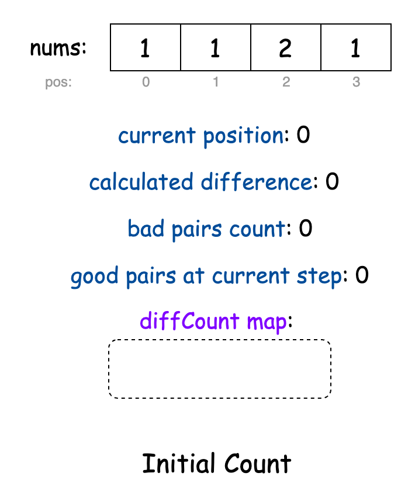
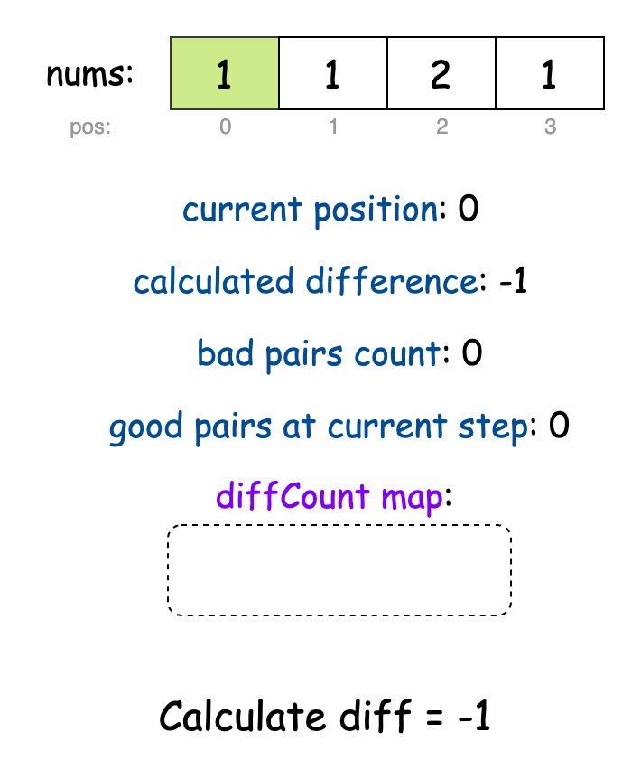
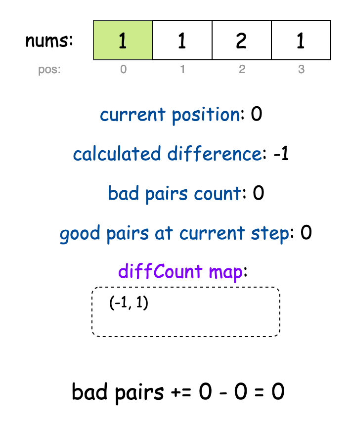
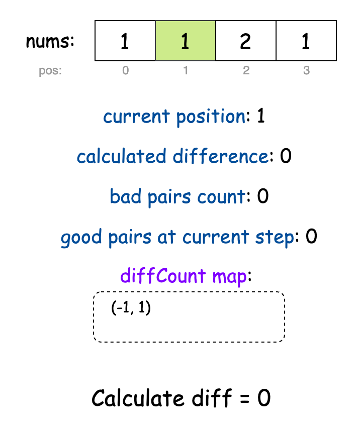
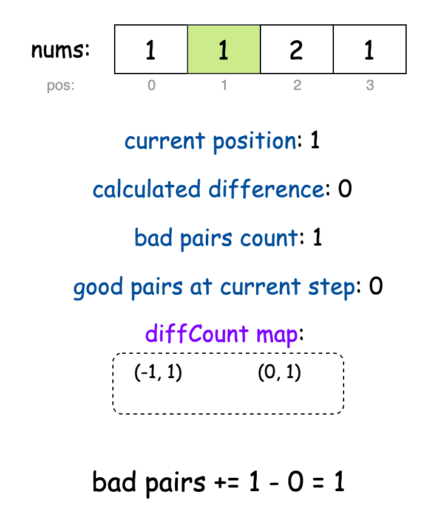
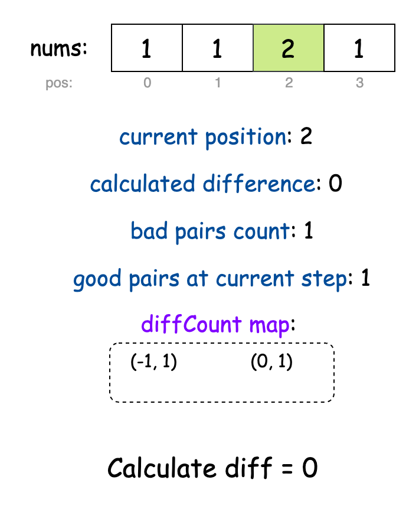
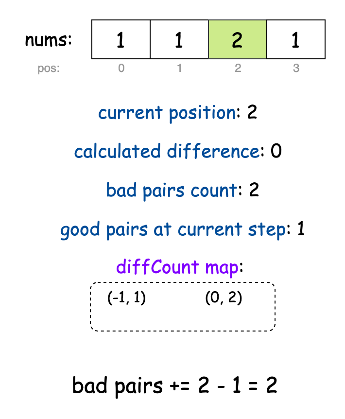
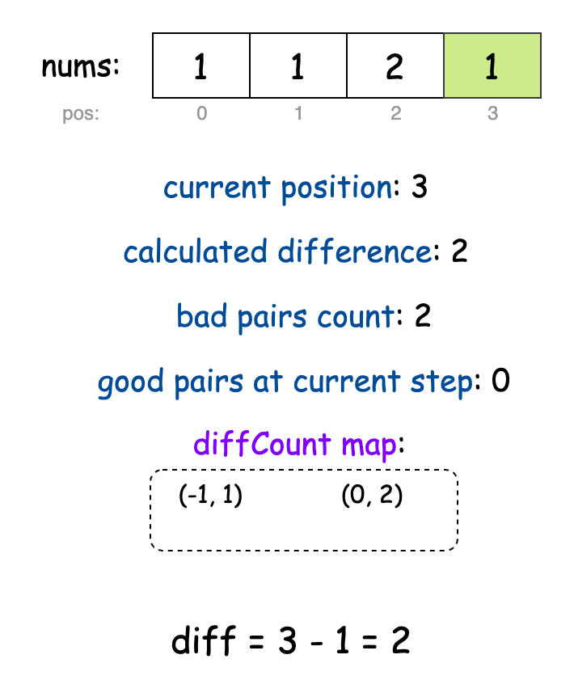
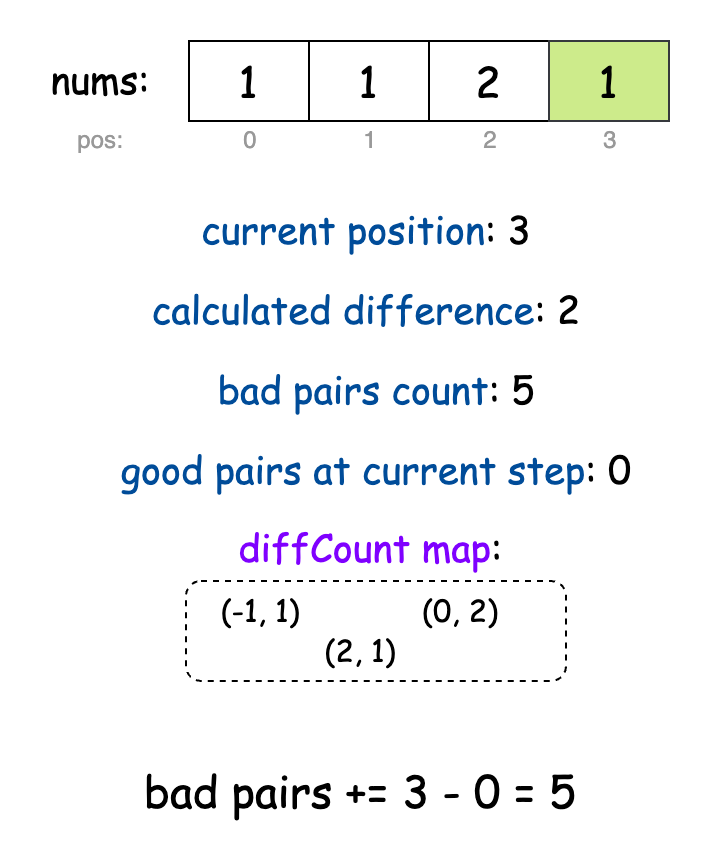
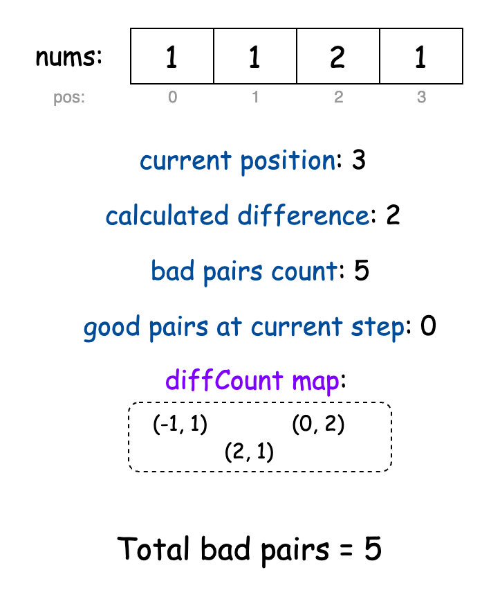

## Solution

---

### Approach: Hash Map

#### Intuition

First, let's understand what makes a pair "good" rather than "bad". For any two positions `i` and `j` in our array, they form a good pair if the difference between their positions equals the difference between their values. Mathematically, we can write this as: $j - i = \text{nums}[j] - \text{nums}[i]$.

Rearranging this equation gives us:

$$
\begin{aligned}
j - nums[j] = i - nums[i]
\end{aligned}
$$

This transformation highlights a key insight: for two positions to form a good pair, the difference between their position and their value ($position - value$) must be the same. In other words, the value of $j - \text{nums}[j]$ must match the value of $i - \text{nums}[i]$. This "$position - value$" difference is the key to identifying good pairs.

For example, if the array is `nums = [1, 1, 2, 1]` at positions `0, 1, 2, 3`, then calculating $position - number$ gives us `[-1, 0, 0, 2]`. Here, positions `1` and `2` both have the same tag `0`, forming a good pair.

As the number of bad pairs would be the total number of pairs minus the number of good pairs, let's focus on finding the number of good pairs each element can make. Since an element can form a good pair only with elements occurring before it, we can iterate over the `nums` array and keep a running count of all the good pairs we find.

We can use a hash map to keep track of the counts of each $position - number$ value as we iterate through the array. For each index `j`, the value $j - \text{nums}[j]$ tells us how many indices before `j` could form good pairs with it. These counts are stored in the hash map.

- For an index `j`, all previous indices `0` to $j - 1$ can potentially form pairs with it. This means `j` total pairs are possible.
- Out of these, the number of good pairs is determined by the count of $j - \text{nums}[j]$ stored in the hash map.
- The difference between the total pairs (`j`) and the good pairs gives the number of bad pairs contributed by $\text{nums}[j]$.

As we iterate, we keep updating the hash map with the current $position - number$ values and accumulate the count of bad pairs. After processing the entire array, we return the total count of bad pairs.

The slideshow below demonstrates the algorithm in action:





















> For a more comprehensive understanding of hash tables, check out the [Hash Table Explore Card 🔗](https://leetcode.com/explore/learn/card/hash-table/). This resource provides an in-depth look at hash tables, explaining their key concepts and applications with a variety of problems to solidify understanding of the pattern.

#### Algorithm

- Initialize:
  - a variable `badPairs` to `0` to keep track of the total count of bad pairs.
  - a hash map `diffCount` to store the frequency of differences between position and value.

- For each position `pos` from `0` to the length of the array:
  - Calculate the difference between the current position and its value ($pos - \text{nums}[pos]$).
  - Get the count of previous positions that had the same difference value, defaulting to `0` if not found.
  - Add to `badPairs` the number of total possible pairs up to the current position (`pos`) minus the count of good pairs (`goodPairsCount`).
  - Update the frequency map by incrementing the count for the current difference by `1`.

- Return the total count of bad pairs stored in `badPairs`.

#### Implementation

```python
class Solution:
    def countBadPairs(self, nums: List[int]) -> int:
        bad_pairs = 0
        diff_count = {}

        for pos in range(len(nums)):
            diff = pos - nums[pos]

            # Count of previous positions with same difference
            good_pairs_count = diff_count.get(diff, 0)

            # Total possible pairs minus good pairs = bad pairs
            bad_pairs += pos - good_pairs_count

            # Update count of positions with this difference
            diff_count[diff] = good_pairs_count + 1

        return bad_pairs
```

#### Complexity Analysis

Let $n$ be the length of the input array `nums`.

- Time complexity: $O(n)$

    The algorithm iterates through the array exactly once. At each position, the operations performed (calculating difference, accessing, and updating the hash map) are all $O(1)$ on average. Therefore, the total time complexity is linear with respect to the array length.

- Space complexity: $O(n)$

    The algorithm uses a hash map to store differences between position and value. In the worst case, each position could have a unique difference value, causing the hash map to store $n$ key-value pairs. No other data structures that scale with input size are used. Therefore, the space complexity is $O(n)$.

---