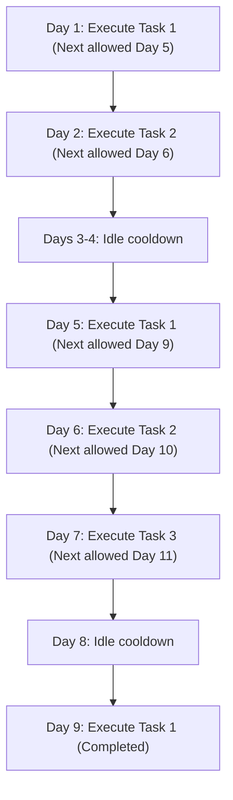

# Guided Example: Task Scheduler II

## 1. Problem Overview & Representative Instance

In a sequential task execution queue, tasks must be completed in the exact order presented in the input array `tasks`. Each task is identified by a positive integer type. While tasks of different types can be executed on consecutive days, tasks of the identical type require a mandatory resting duration of at least `space` days between executions. On any given calendar day, the processor can execute at most one task, or it can remain idle to satisfy cooldown constraints.

We seek the minimum number of calendar days required to complete all tasks in the prescribed order.

Consider the representative instance:
- `tasks = [1, 2, 1, 2, 3, 1]`
- `space = 3`

Here, six task items are scheduled with a minimum spacing of 3 idle or foreign-task days between duplicate task IDs.

## 2. Mathematical & Algorithmic Principles

Let the calendar timeline be represented by a 1-indexed discrete day counter $d \in \mathbb{N}^+$. Executing a task on day $d$ occupies that day completely. 

If a task of type $t$ is performed on day $d$, any subsequent occurrence of task $t$ cannot be executed earlier than:
$$\text{earliest}(t) = d + \text{space} + 1$$

Because the task sequence order is immutable, scheduling decisions are strictly greedy and deterministic:
1. Advancing to the next task requires at least one calendar day increment from the preceding task's completion day: $d \leftarrow d + 1$.
2. If task $t$ has been executed previously, the current day must also satisfy $d \ge \text{earliest}(t)$. Thus, the calendar day jumps immediately to $\max(d, \text{earliest}(t))$.
3. After dispatching task $t$ on day $d$, we update the hash map entry for $t$ to record its next permissible execution date: $\text{earliest}(t) \leftarrow d + \text{space} + 1$.

This single-pass online formulation guarantees the minimal calendar day for each prefix without needing an explicit simulation of idle day intervals.

| Property | Definition | Significance |
|---|---|---|
| Sequential Order | Tasks executed strictly from index $0$ to $n-1$ | Eliminates reordering combinatorial search |
| Cooldown Horizon | Minimum separation $\ge \text{space}$ idle days | Defines earliest next valid calendar day |
| Temporal Monotonicity | Current day sequence $d_0 < d_1 < \dots < d_{n-1}$ | Ensures greedy timestamp advancement is optimal |

## 3. Step-by-Step Walkthrough with Intermediate State

We process `tasks = [1, 2, 1, 2, 3, 1]` with `space = 3`. Initially, current day $d = 0$, and the cooldown map $\text{earliest}$ is empty.

- **Step 1: Task 1**
  - Incremental day: $d \leftarrow 0 + 1 = 1$.
  - Lookup $\text{earliest}(1)$: Not present ($0$).
  - Effective day: $d = \max(1, 0) = 1$.
  - Update cooldown: $\text{earliest}(1) = 1 + 3 + 1 = 5$.

- **Step 2: Task 2**
  - Incremental day: $d \leftarrow 1 + 1 = 2$.
  - Lookup $\text{earliest}(2)$: Not present ($0$).
  - Effective day: $d = \max(2, 0) = 2$.
  - Update cooldown: $\text{earliest}(2) = 2 + 3 + 1 = 6$.

- **Step 3: Task 1**
  - Incremental day: $d \leftarrow 2 + 1 = 3$.
  - Lookup $\text{earliest}(1)$: Value is $5$.
  - Cooldown constraint requires $d \ge 5$. Days 3 and 4 are forced idle breaks.
  - Effective day: $d = \max(3, 5) = 5$.
  - Update cooldown: $\text{earliest}(1) = 5 + 3 + 1 = 9$.

- **Step 4: Task 2**
  - Incremental day: $d \leftarrow 5 + 1 = 6$.
  - Lookup $\text{earliest}(2)$: Value is $6$.
  - Effective day: $d = \max(6, 6) = 6$.
  - Update cooldown: $\text{earliest}(2) = 6 + 3 + 1 = 10$.

- **Step 5: Task 3**
  - Incremental day: $d \leftarrow 6 + 1 = 7$.
  - Lookup $\text{earliest}(3)$: Not present ($0$).
  - Effective day: $d = \max(7, 0) = 7$.
  - Update cooldown: $\text{earliest}(3) = 7 + 3 + 1 = 11$.

- **Step 6: Task 1**
  - Incremental day: $d \leftarrow 7 + 1 = 8$.
  - Lookup $\text{earliest}(1)$: Value is $9$. Day 8 is forced idle break.
  - Effective day: $d = \max(8, 9) = 9$.
  - Update cooldown: $\text{earliest}(1) = 9 + 3 + 1 = 13$.

All tasks have been scheduled. The final day reached is $9$.

## 4. Comprehensive State Trace

The complete transition dynamics across all items are summarized below:

| Index | Task ID | Day Before Check | Earliest Allowed | Effective Day | Forced Idle Days | Next Allowed |
|---|---|---|---|---|---|---|
| 0 | 1 | 1 | 1 | 1 | 0 | 5 |
| 1 | 2 | 2 | 1 | 2 | 0 | 6 |
| 2 | 1 | 3 | 5 | 5 | 2 (Days 3-4) | 9 |
| 3 | 2 | 6 | 6 | 6 | 0 | 10 |
| 4 | 3 | 7 | 1 | 7 | 0 | 11 |
| 5 | 1 | 8 | 9 | 9 | 1 (Day 8) | 13 |

## 5. Algorithmic Correctness & Soundness

The correctness of the greedy temporal jump rests on two structural invariants:
1. **Order Invariance**: The problem enforces an immutable order of execution: task $i$ must complete strictly before task $i+1$ can begin. Thus, completing task $i$ as early as possible never restricts or delays the earliest feasible completion day of task $i+1$.
2. **Minimality of Idle Intervals**: The earliest permissible day for task $i$ is uniquely bounded from below by both $d_{i-1} + 1$ (since at most one task can be executed per day) and $\text{last\_executed}(task_i) + \text{space} + 1$. Setting $d_i = \max(d_{i-1} + 1, \text{last\_executed}(task_i) + \text{space} + 1)$ is both valid and minimal.

By induction on the prefix length, every prefix $k$ finishes on the strictly minimal possible day.

## 6. Edge Cases & Anti-Patterns

- **All Distinct Tasks**: When every task ID is unique, no cooldown ever activates. The answer simplifies to $n$ days.
- **Identical Consecutive Tasks**: When tasks are of the form $[X, X, X]$, each execution incurs exactly $\text{space}$ idle days. Total days evaluate directly to $1 + (n-1) \cdot (\text{space} + 1)$.
- **Zero Cooldown ($\text{space} = 0$)**: Cooldown requirement is trivially met by normal daily progression.
- **Large Identifier Spacing**: Task IDs can be large (e.g., $10^9$). Using a direct array index causes memory exhaustion; an associative hash table or dictionary is mandatory.
- **Anti-Pattern (Day-by-Day Incremental Simulation)**: Simulating days with a counter incrementing by $1$ and checking task queues causes time-limit exceeded errors when `space` is large (e.g., up to $10^9$). The direct calendar jump $\max(d, \text{earliest})$ achieves $\mathcal{O}(1)$ time per task.

## 7. Complexity Analysis

- **Time Complexity**: $\mathcal{O}(n)$, where $n$ is the number of tasks. We perform a single sequential pass over the array of tasks, performing $\mathcal{O}(1)$ average-time hash table lookups and updates at each step.
- **Space Complexity**: $\mathcal{O}(u)$, where $u \le n$ represents the number of unique task types present in `tasks`. A hash map stores the next allowed calendar day for each distinct task identifier.
