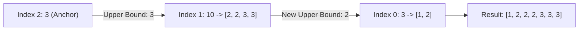

# Guided Example: Minimum Replacements to Sort the Array

## 1. Problem Overview & Representative Instance

Given an array of positive integers, an elementary operation consists of taking any single value and decomposing it into two positive integers that sum to the original number. These replacement parts replace the original entry in place, preserving the relative order of surrounding elements. An element may undergo this decomposition repeatedly, yielding $k$ total parts from a single original number via exactly $k - 1$ operations. The objective is to determine the minimum total number of replacement operations necessary to render the entire array sorted in non-decreasing order.

Consider the representative input array:
$$\text{nums} = [3, 10, 3]$$

In this sequence, the central value $10$ violates the non-decreasing order with respect to its right neighbor $3$. Because decomposition can only create strictly smaller positive integers, splitting can never increase a value. Hence, our boundary constraints must propagate backward from the rightmost elements.

## 2. Mathematical & Algorithmic Principles

Because replacement operations can only decrease values (partitioning an integer into parts strictly smaller than itself), the rightmost element $\text{nums}[n - 1]$ can never be increased. Any partition of $\text{nums}[n - 1]$ would only lower the ceiling for preceding elements without expanding feasibility. Therefore, $\text{nums}[n - 1]$ serves as the fixed upper bound anchor for its immediate left neighbor.

Working backward from index $n - 2$ down to $0$:
1. Let $\text{upper}$ denote the maximum permissible value that the rightmost piece of $\text{nums}[i]$ may take.
2. If $\text{nums}[i] \le \text{upper}$, no decomposition is required. The element naturally satisfies the sorting constraint, so we simply set $\text{upper} = \text{nums}[i]$.
3. If $\text{nums}[i] > \text{upper}$, the element must be partitioned into $k$ positive integers such that every piece is at most $\text{upper}$.
   - To minimize operations, we must minimize $k$. The smallest number of parts each bounded by $\text{upper}$ is given by:
     $$k = \left\lceil \frac{\text{nums}[i]}{\text{upper}} \right\rceil = \left\lfloor \frac{\text{nums}[i] + \text{upper} - 1}{\text{upper}} \right\rfloor$$
   - Generating $k$ parts requires $k - 1$ operations.
   - To leave the largest possible upper bound for preceding elements to the left, the $k$ parts must be as nearly equal as possible. When partitioning an integer $S$ into $k$ integers, the minimum part size is:
     $$\text{upper}_{\text{new}} = \left\lfloor \frac{\text{nums}[i]}{k} \right\rfloor$$
   - Placing the smallest piece at the leftmost position ensures the sub-array remains non-decreasing while maximizing the subsequent constraint $\text{upper}_{\text{new}}$.

This backward greedy strategy optimizes both local operations and the remaining global search space in a single linear pass.

## 3. Step-by-Step Walkthrough with Intermediate State

We execute the algorithm on $\text{nums} = [3, 10, 3]$ with $n = 3$.

- **Initialization:**
  - $\text{total\_ops} = 0$
  - Set the anchor bound to the final element: $\text{upper} = \text{nums}[2] = 3$.

- **Step 1 (Index 1, Value 10):**
  - Current value $\text{nums}[1] = 10$, $\text{upper} = 3$.
  - Since $10 > 3$, a split is required.
  - Calculate minimal parts count:
    $$k = \left\lceil \frac{10}{3} \right\rceil = 4$$
  - Decomposing $10$ into $4$ parts requires $k - 1 = 3$ operations.
  - $\text{total\_ops} = 0 + 3 = 3$.
  - To maximize the leftmost piece, we compute:
    $$\text{upper} = \left\lfloor \frac{10}{4} \right\rfloor = 2$$
  - Explicit parts for $10$: $[2, 2, 3, 3]$. Notice that all parts are $\le 3$, they sum to $10$, and the leftmost value is $2$.

- **Step 2 (Index 0, Value 3):**
  - Current value $\text{nums}[0] = 3$, $\text{upper} = 2$.
  - Since $3 > 2$, a split is required.
  - Calculate minimal parts count:
    $$k = \left\lceil \frac{3}{2} \right\rceil = 2$$
  - Decomposing $3$ into $2$ parts requires $k - 1 = 1$ operation.
  - $\text{total\_ops} = 3 + 1 = 4$.
  - Update upper bound:
    $$\text{upper} = \left\lfloor \frac{3}{2} \right\rfloor = 1$$
  - Explicit parts for $3$: $[1, 2]$. Both parts are $\le 2$, sum to $3$, and the leftmost value is $1$.

- **Termination:**
  - The traversal reaches the beginning of the array.
  - The transformed array is $[1, 2, 2, 2, 3, 3, 3]$, which is strictly non-decreasing.
  - Total operations performed: $4$.

## 4. Comprehensive State Trace

The state variables update across each backward inspection step as summarized below:

| Index $i$ | Value $\text{nums}[i]$ | Incoming $\text{upper}$ | Condition | Parts $k$ | Added Ops ($k - 1$) | Leftmost Part ($\lfloor \text{nums}[i] / k \rfloor$) | Cumulative Ops |
|---|---|---|---|---|---|---|---|
| 2 | 3 | — | Anchor | 1 | 0 | 3 | 0 |
| 1 | 10 | 3 | $10 > 3$ | 4 | 3 | 2 | 3 |
| 0 | 3 | 2 | $3 > 2$ | 2 | 1 | 1 | 4 |

The resulting decomposition of each element and the final non-decreasing sequence are detailed in the structural mapping below:

| Array Index | Original Value | Decomposed Sequence | Sub-sequence Legality | Running Prefix Bound |
|---|---|---|---|---|
| 0 | 3 | $[1, 2]$ | $1 \le 2$ | 1 |
| 1 | 10 | $[2, 2, 3, 3]$ | $2 \le 2 \le 3 \le 3$ | 2 |
| 2 | 3 | $[3]$ | $3 \le 3$ | 3 |

Concatenating the decomposed sequences produces $[1, 2, 2, 2, 3, 3, 3]$, which is verified non-decreasing with $4$ operations.

## 5. Algorithmic Correctness & Soundness

The correctness of this greedy formulation depends on two mathematical guarantees:
1. **Minimality of Component Count:** If an element $V$ must be split into integers each no larger than $U$, the Pigeonhole Principle dictates that at least $\lceil V / U \rceil$ integers are mandatory. Creating fewer integers would require at least one part to strictly exceed $U$, violating the ordering constraint with the subsequent element.
2. **Maximization of Preceding Ceiling:** Suppose $V$ is partitioned into $k$ sorted integers $p_1 \le p_2 \le \dots \le p_k$. The sum is fixed at $\sum p_j = V$. To make $p_1$ as large as possible, the remaining $p_2, \dots, p_k$ must be as close to $p_1$ as possible. The maximum possible value for the minimum entry $p_1$ in any integer partition of $V$ into $k$ parts is $\lfloor V / k \rfloor$.
3. **Monotonic Feasibility:** Any choice that makes $p_1$ smaller than $\lfloor V / k \rfloor$ would impose a strictly tighter upper bound on all preceding elements, strictly reducing the feasible choices for earlier indices. Thus, choosing $p_1 = \lfloor V / k \rfloor$ dominates any other configuration.

By backward induction, this greedy choice is both locally and globally optimal.

## 6. Edge Cases & Anti-Patterns

- **Already Sorted Arrays:** If $\text{nums} = [1, 2, 3, 4, 5]$, every check $\text{nums}[i] \le \text{upper}$ succeeds without triggering decomposition. The loop executes with $k = 1$, adding $0$ operations and completing in $\mathcal{O}(n)$ time.
- **Identical Elements:** If $\text{nums} = [5, 5, 5]$, each element matches the bound exactly ($5 \le 5$), adding $0$ operations.
- **Large Values & Overflow:** With $\text{nums}[i] = 10^9$ and $n = 10^5$, if elements require cascading splits into ones, total operations can reach $\approx 10^{14}$. A 64-bit unsigned/signed accumulator is required to prevent numerical overflow.
- **Anti-Pattern: Forward Left-to-Right Scan:** Attempting to process elements from index $0$ forward fails because splitting an element can only decrease values. When $nums[i] > nums[i + 1]$, modifying $nums[i]$ from the left cannot anticipate how far right elements will shrink, leading to inconsistent backtracking or exponential search.

## 7. Complexity Analysis

- **Time Complexity:** The backward traversal examines each of the $n$ elements exactly once. Each iteration performs integer division, ceiling division, modulo, and addition, all operating in $\mathcal{O}(1)$ time. Therefore, the overall time complexity is strictly $\mathcal{O}(n)$.
- **Space Complexity:** The algorithm maintains only a few scalar variables ($\text{upper}$, $k$, and the operations accumulator). No additional arrays or recursive call stacks are created. Hence, the auxiliary space complexity is $\mathcal{O}(1)$.
