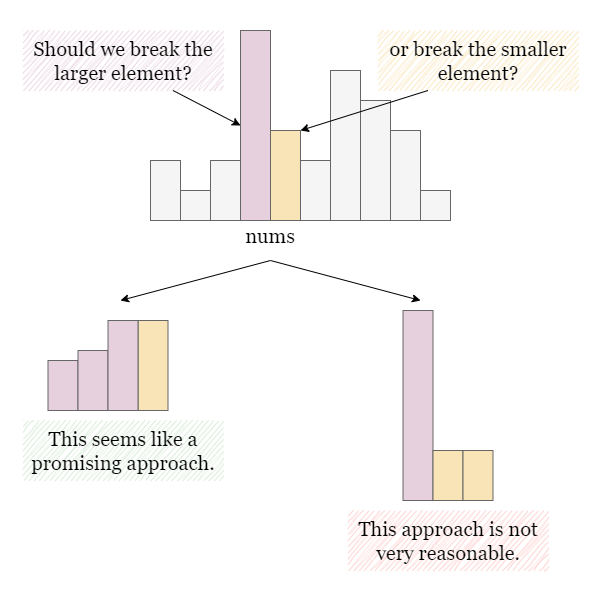
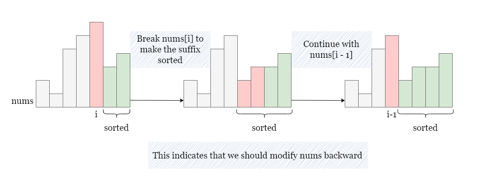
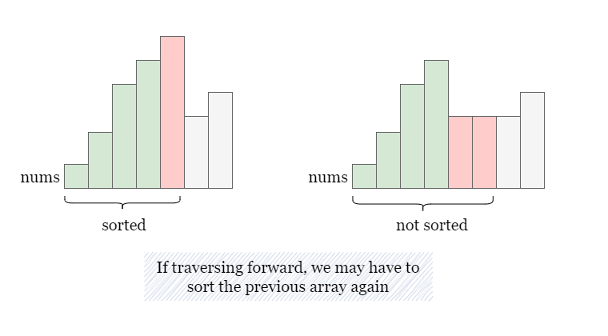
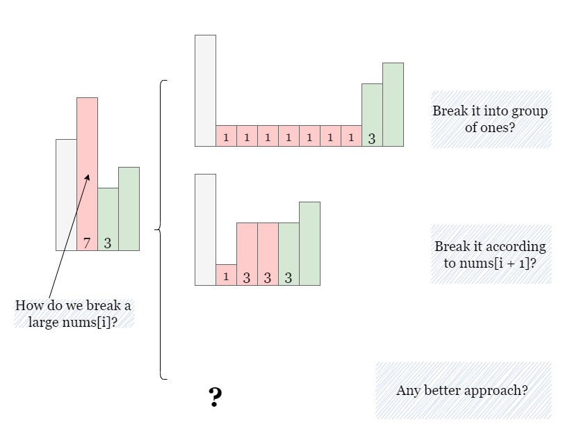
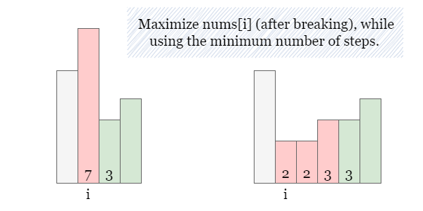
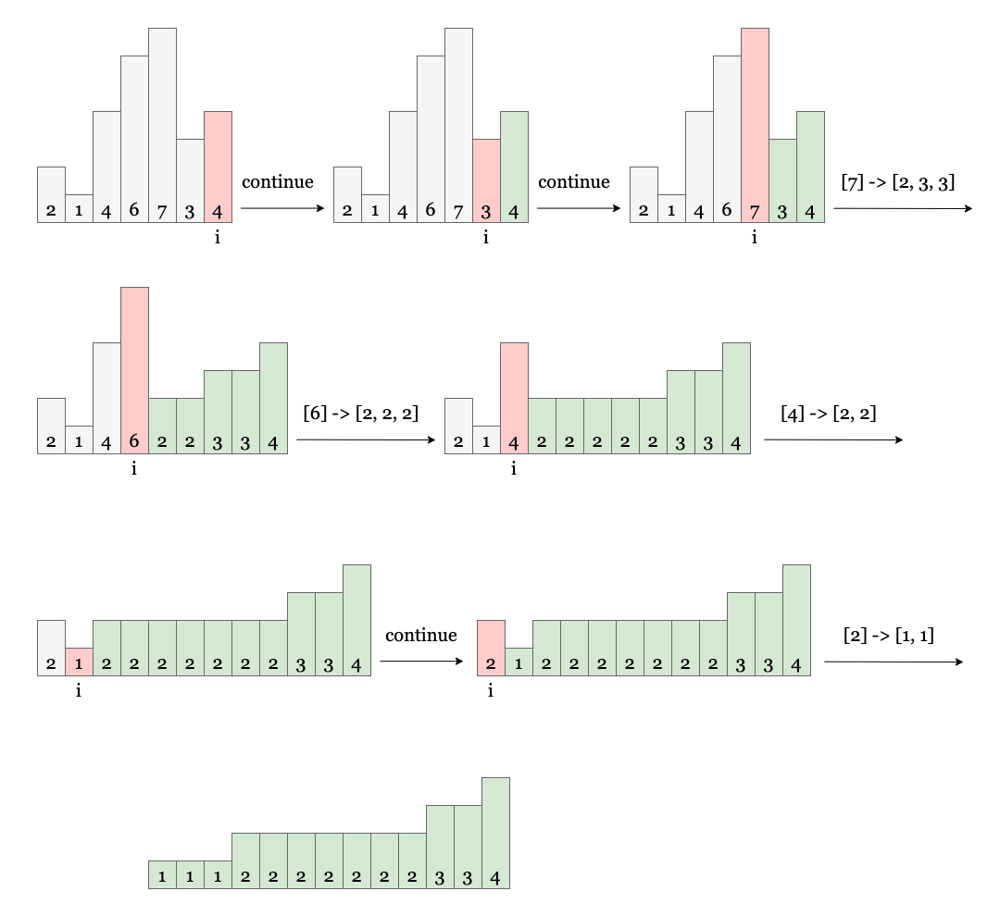

## Solution

---

### Approach: Greedy

#### Intuition

If `nums` is not sorted, there exists at least one adjacent pair $\text{nums}[i], nums[i + 1]$ where $\text{nums}[i] > nums[i + 1]$. How should we handle this pair of numbers that don't adhere to the sorted order? Should we break down the larger $\text{nums}[i]$ using replacement operations or the smaller $nums[i + 1]$? To minimize the number of steps, it is unnecessary to break down the smaller number because it would only increase the number of replacement operations.



Now that we understand the logic for handling adjacent unsorted pairs, the next question is the order in which we process `nums`. Here, we need to traverse in **reverse** order. The reason is that our replacement operations will only make the current $\text{nums}[i]$ become two (or more) smaller numbers.

If we start from the end and move toward the beginning, we can ensure that the suffix array always remains sorted. This is because we are replacing $\text{nums}[i]$ with smaller elements, which will not disrupt the sorting structure of the suffix array (elements at indices $i + 1, i + 2$, etc. that are already sorted).



On the contrary, if we start from the beginning and replace a larger element with smaller elements, it may disrupt the sorted order of the previously processed elements on the left, and we'll end up needing more operations to sort the processed subarray again, as shown in the picture below.



Now that we know the traversal order, the next step is to minimize the number of operations. When we reach $\text{nums}[i]$ during the reverse traversal, if $\text{nums}[i] > nums[i + 1]$, how many smaller numbers should we break $\text{nums}[i]$ into? Here are a few options:

- Breaking $\text{nums}[i]$ into many 1s, which would require too many operations.
- Breaking $\text{nums}[i]$ according to the value of $nums[i + 1]$, with the remainder of $\text{nums}[i]$ divided by $nums[i + 1]$ becoming the new $\text{nums}[i]$. However, in some cases, this method can result in a very small $\text{nums}[i]$. For example, `[7]` will be replaced by `[1, 3, 3]`, thus all the previous elements must be replaced by 1s.
- Any better method?



We can use a method similar to option 2:

- If $\text{nums}[i]$ is divisible by $nums[i + 1]$, we break $\text{nums}[i]$ into multiple elements of value $nums[i + 1]$.
- If $\text{nums}[i]$ is not divisible by $nums[i + 1]$, we break $\text{nums}[i]$ into $\text{nums}_{elements} = \text{nums}[i] / nums[i + 1] + 1$ sorted elements, with the the smallest element being $nums[i + 1] / \text{nums}_{elements}$. For example, if $\text{nums}[i] = 7$ and $nums[i + 1] = 3$, we replace `[7]` with `[2, 2, 3]` by two replacement operations.



The reason that `[2, 2, 3]` is a better split than `[1, 3, 3]` is that all future elements on the left will need to be less than or equal to the elements we split into here. Thus, we would prefer the larger `2` over the smaller `1`, so we have more options for future splits.

In summary, we traverse `nums` in reverse and break down each $\text{nums}[i]$ that violates the sorting order according to the approach mentioned above. We also accumulate the number of replacement operations. It is important to note that when we break $\text{nums}[i]$ into `n` elements, it actually requires $n - 1$ steps.

Please refer to the picture below as a detailed example:



> In the previous paragraph, we discussed two cases for calculating $\text{num}_{elements}$, which can be simplified by $\text{nums}_{elements} = (\text{nums}[i] + nums[i + 1] - 1) / nums[i + 1]$. Regardless of whether $\text{nums}[i]$ is divisible as $nums[i + 1]$ or not, we will always obtain the correct result.

<br>

#### Algorithm

1) Set `answer` as 0, and set `n` as the length of `nums`.

2) Iterate over `nums` backward from $nums[n - 2]$, as we don't need to replace $nums[n - 1]$.
- If $\text{nums}[i] \le nums[i + 1]$, move on to the next element $nums[i - 1]$.
- If $\text{nums}[i]$ is divisible by $nums[i + 1]$, break $\text{nums}[i]$ into $\text{nums}_{elements} = \text{num}[i] / nums[i + 1]$ elements, otherwise, break $\text{num}[i]$ into $\text{nums}_{elements} = \text{nums}[i] / nums[i + 1] + 1$ elements. This requires $\text{num}_{elements} - 1$ replacement operations. Hence, we increment `answer` by $\text{num}_{elements} - 1$.
- The largest possible $\text{nums}[i]$ after the operations is $\text{nums}[i] / \text{num}_{elements}$, update $\text{nums}[i]$ as $\text{nums}[i] / \text{num}_{elements}$.

3) Return `answer` once the iteration is complete.

#### Implementation

```python
class Solution:
    def minimumReplacement(self, nums: List[int]) -> int:
        answer = 0
        n = len(nums)

        # Start from the second last element, as the last one is always sorted.
        for i in range(n - 2, -1, -1):
            # No need to break if they are already in order.
            if nums[i] <= nums[i + 1]:
                continue

            # Count how many elements are made from breaking nums[i].
            num_elements = (nums[i] + nums[i + 1] - 1) // nums[i + 1]

            # It requires numElements - 1 replacement operations.
            answer += num_elements - 1

            # Maximize nums[i] after replacement.
            nums[i] = nums[i] // num_elements

        return answer
```

#### Complexity Analysis

Let $n$ be the size of `nums`.

* Time complexity: $O(n)$

- We iterate over `nums` once in reverse.
- At each step, we calculate $\text{num}_{elements}$, `answer` and $\text{nums}[i]$, which takes $O(1)$ time.

* Space complexity: $O(1)$

- We're modifying `nums` in place and not using any additional data structures that scale with the size of the input.
- Note that some interviewers might not want you to modify the input as it is not considered good practice in real-world coding. If that's the case, you could slightly modify the algorithm to use an integer to track the most recently split numbers.

<br/>