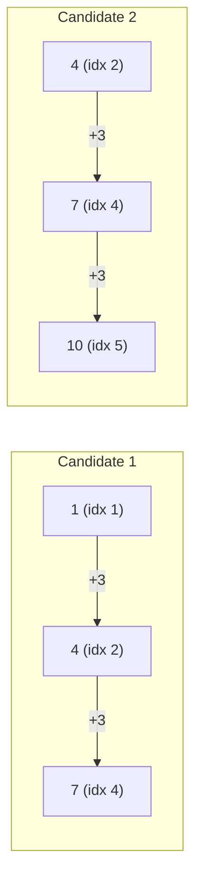

# Guided Example: Number of Arithmetic Triplets

## 1. Problem Overview & Representative Instance

Given a strictly increasing array of integers $\text{nums}$ and a positive integer $\text{diff}$, an arithmetic triplet is defined as a tuple of indices $(i, j, k)$ satisfying the strict positional ordering $i < j < k$ such that the difference between consecutive values is exactly $\text{diff}$:
$$\text{nums}[j] - \text{nums}[i] = \text{diff} \quad \text{and} \quad \text{nums}[k] - \text{nums}[j] = \text{diff}$$

The objective is to compute the total number of unique arithmetic triplets present in the array.

Consider the representative configuration:
- $\text{nums} = [0, 1, 4, 6, 7, 10]$
- $\text{diff} = 3$

Because the array is guaranteed to be strictly increasing, every integer appears at most once. If the target values $x + \text{diff}$ and $x + 2 \cdot \text{diff}$ both exist in the array, their indices in the sorted sequence are guaranteed to be unique and strictly increasing ($i < j < k$).

## 2. Mathematical & Algorithmic Principles

An arithmetic triplet requires three elements with values of the form $(x, x + d, x + 2d)$, where $d = \text{diff}$. Because $\text{nums}$ is strictly increasing:
1. Every element in $\text{nums}$ is distinct.
2. If $x < y$, then the index of $x$ is strictly less than the index of $y$.
3. Therefore, whenever $x$, $x + d$, and $x + 2d$ all belong to the set of elements in $\text{nums}$, the triplet of their corresponding indices $(i_x, i_{x+d}, i_{x+2d})$ unconditionally satisfies $i_x < i_{x+d} < i_{x+2d}$.

This reduces the problem from an $\mathcal{O}(n^3)$ multi-pointer search to a set membership verification problem:
- Populate a lookup set $S$ with all elements in $\text{nums}$.
- For each value $x \in \text{nums}$, test whether both $x + \text{diff} \in S$ and $x + 2 \cdot \text{diff} \in S$.
- If both conditions hold, increment the valid triplet count by $1$.

Because each valid triplet has a unique anchor $x = \text{nums}[i]$, iterating over all $x$ counts each distinct arithmetic triplet exactly once.

## 3. Step-by-Step Walkthrough with Intermediate State

We execute the set membership approach on $\text{nums} = [0, 1, 4, 6, 7, 10]$ with $\text{diff} = 3$.

- **Phase 1: Set Ingestion:**
  Construct hash set $S = \{0, 1, 4, 6, 7, 10\}$.
  Initialize $\text{triplet\_count} = 0$.

- **Phase 2: Sequential Anchor Verification:**
  - **Index 0 ($x = 0$):**
    - Target 1: $0 + 3 = 3$. Is $3 \in S$? No.
    - Target 2: Not checked.
    - Result: No triplet anchored at $0$.
  - **Index 1 ($x = 1$):**
    - Target 1: $1 + 3 = 4$. Is $4 \in S$? Yes (Index 2).
    - Target 2: $1 + 6 = 7$. Is $7 \in S$? Yes (Index 4).
    - Result: Triplet $(1, 4, 7)$ at indices $(1, 2, 4)$ is valid.
    - Update: $\text{triplet\_count} = 0 + 1 = 1$.
  - **Index 2 ($x = 4$):**
    - Target 1: $4 + 3 = 7$. Is $7 \in S$? Yes (Index 4).
    - Target 2: $4 + 6 = 10$. Is $10 \in S$? Yes (Index 5).
    - Result: Triplet $(4, 7, 10)$ at indices $(2, 4, 5)$ is valid.
    - Update: $\text{triplet\_count} = 1 + 1 = 2$.
  - **Index 3 ($x = 6$):**
    - Target 1: $6 + 3 = 9$. Is $9 \in S$? No.
    - Result: No triplet anchored at $6$.
  - **Index 4 ($x = 7$):**
    - Target 1: $7 + 3 = 10$. Is $10 \in S$? Yes (Index 5).
    - Target 2: $7 + 6 = 13$. Is $13 \in S$? No.
    - Result: No triplet anchored at $7$.
  - **Index 5 ($x = 10$):**
    - Target 1: $10 + 3 = 13$. Is $13 \in S$? No.
    - Result: No triplet anchored at $10$.

- **Termination:**
  All candidates evaluated. Total arithmetic triplets found: $2$.

## 4. Comprehensive State Trace

The evaluation of each element as a prospective triplet anchor is tabulated below:

| Index $i$ | Anchor $x$ | First Target ($x + 3$) | In Set? | Second Target ($x + 6$) | In Set? | Formed Triplet | Cumulative Count |
|---|---|---|---|---|---|---|---|
| 0 | 0 | 3 | False | 6 | — | None | 0 |
| 1 | 1 | 4 | True | 7 | True | $(1, 4, 7)$ | 1 |
| 2 | 4 | 7 | True | 10 | True | $(4, 7, 10)$ | 2 |
| 3 | 6 | 9 | False | 12 | — | None | 2 |
| 4 | 7 | 10 | True | 13 | False | None | 2 |
| 5 | 10 | 13 | False | 16 | — | None | 2 |

We also detail the verified index relationships for all successfully formed triplets:

| Triplet Identifier | Values $(x, y, z)$ | Indices $(i, j, k)$ | Strict Index Condition ($i < j < k$) | Difference Verification |
|---|---|---|---|---|
| Triplet 1 | $(1, 4, 7)$ | $(1, 2, 4)$ | $1 < 2 < 4$ | $4 - 1 = 3$, $7 - 4 = 3$ |
| Triplet 2 | $(4, 7, 10)$ | $(2, 4, 5)$ | $2 < 4 < 5$ | $7 - 4 = 3$, $10 - 7 = 3$ |

Both triplets satisfy all required algebraic and positional conditions.

## 5. Algorithmic Correctness & Soundness

The correctness of this algorithm rests on the injective property of strictly increasing sequences:
1. **Uniqueness of Values:** Because $\text{nums}[0] < \text{nums}[1] < \dots < \text{nums}[n - 1]$, the mapping from array indices to numerical values is strictly injective. No value appears more than once.
2. **Order Preservation:** For any two elements $a, b \in \text{nums}$, $a < b$ if and only if $\text{index}(a) < \text{index}(b)$. Since $\text{diff} > 0$, we have $x < x + \text{diff} < x + 2 \cdot \text{diff}$, which implies $\text{index}(x) < \text{index}(x + \text{diff}) < \text{index}(x + 2 \cdot \text{diff})$ without needing to inspect the index values.
3. **No Double Counting:** Each arithmetic triplet has exactly one minimal element $x$. By iterating through candidate minimal elements $x$ and requiring both upper elements to be present, each triplet is counted exactly once at its anchor $x$.

## 6. Edge Cases & Anti-Patterns

- **Minimum Length ($n = 3$):** If $\text{nums} = [1, 3, 5]$ with $\text{diff} = 2$, the algorithm inspects $x = 1$, finds $3$ and $5$, and outputs $1$. If $\text{nums} = [1, 2, 4]$ with $\text{diff} = 2$, it tests $x = 1 \implies (3, 5)$, which fails, outputting $0$.
- **Overlapping Arithmetic Sequences:** If $\text{nums} = [0, 2, 4, 6]$, two triplets exist: $(0, 2, 4)$ and $(2, 4, 6)$. Because the algorithm evaluates anchors $0$ and $2$ independently, both overlapping triplets are counted.
- **Anti-Pattern: Cubic Triple Loop:** Implementing three nested loops over $i$, $j$, and $k$ yields $\mathcal{O}(n^3)$ operations. While $n \le 200$ permits cubic solutions on small inputs, the hash set lookup formulation reduces the complexity to $\mathcal{O}(n)$ and generalizes to large inputs.
- **Anti-Pattern: Duplicate Tracking:** Attempting to store frequency counts is unnecessary because the problem guarantees strictly increasing inputs, meaning all counts are identically $1$.

## 7. Complexity Analysis

- **Time Complexity:** Inserting all $n$ elements into a hash set takes $\mathcal{O}(n)$ time. The subsequent scan tests two membership queries per element, each taking $\mathcal{O}(1)$ average time. Thus, the total time complexity is $\mathcal{O}(n)$.
- **Space Complexity:** The auxiliary hash set stores $n$ distinct integer keys. Therefore, the additional space complexity is $\mathcal{O}(n)$.
