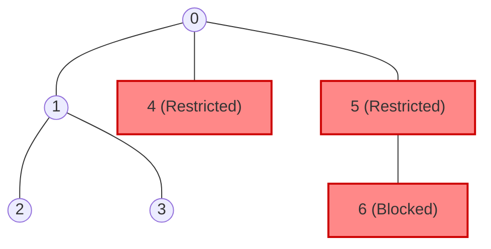

# Guided Example: Reachable Nodes With Restrictions

## 1. Problem Overview & Representative Instance

Consider an undirected tree composed of $n$ vertices labeled from $0$ to $n - 1$, interconnected by exactly $n - 1$ edges. A specified subset of vertices, designated as $\text{restricted}$, represents prohibited waypoints. Node $0$ is guaranteed to be unrestricted and serves as the designated starting point. The objective is to calculate the maximum number of vertices reachable from node $0$ without traversing any prohibited vertex.

Consider the representative tree instance:
- Vertex count: $n = 7$
- Edge set: $\text{edges} = [[0, 1], [1, 2], [3, 1], [4, 0], [0, 5], [5, 6]]$
- Restricted set: $\text{restricted} = [4, 5]$

Because the underlying topology is a tree, there exists exactly one unique simple path between node $0$ and any other vertex $u$. If any vertex along this unique path belongs to $\text{restricted}$, then vertex $u$ is unreachable from $0$. In effect, every restricted vertex disconnects and prunes the entire subtree situated behind it relative to root $0$.

## 2. Mathematical & Algorithmic Principles

In any connected undirected tree $T = (V, E)$, removing a set of vertices $R = \text{restricted}$ decomposes the tree into a forest of disjoint connected subgraphs $T \setminus R$. Because node $0 \notin R$, node $0$ belongs to exactly one connected component $C_0 \subseteq V \setminus R$. The problem is equivalent to determining the cardinality $|C_0|$.

Key algorithmic insights:
1. **Constant-Time Restriction Checks:** Convert the array $\text{restricted}$ into a hash set or a boolean indicator array $B$ of size $n$, where $B[u] = \text{true}$ if $u \in R$. This permits $\mathcal{O}(1)$ query time per neighbor candidate.
2. **Component Discovery via BFS/DFS:** Initiating graph traversal at vertex $0$, we visit adjacent neighbors under two conditions:
   - The neighbor is not restricted ($B[v] = \text{false}$).
   - The neighbor has not yet been visited.
3. **Early Pruning:** By omitting restricted vertices from ever entering the traversal queue or recursion stack, we prevent unnecessary exploration of unreachable subtrees rooted at those restricted nodes.

Every node added to the visited structure is reachable via a path strictly contained within $V \setminus R$, and exhaustive exploration of the component guarantees counting every element of $C_0$.

## 3. Step-by-Step Walkthrough with Intermediate State

We execute Breadth-First Search (BFS) on the representative tree with $n = 7$, $\text{edges} = [[0, 1], [1, 2], [3, 1], [4, 0], [0, 5], [5, 6]]$, and $\text{restricted} = [4, 5]$.

- **Phase 1: Adjacency List Construction & Restriction Indexing:**
  - Adjacency list:
    - $0: [1, 4, 5]$
    - $1: [0, 2, 3]$
    - $2: [1]$
    - $3: [1]$
    - $4: [0]$
    - $5: [0, 6]$
    - $6: [5]$
  - Restricted boolean lookup:
    - $B = [F, F, F, F, T, T, F]$ (vertices 4 and 5 marked prohibited).
  - Traversal structures:
    - Queue $Q = [0]$
    - Visited set $V = \{0\}$
    - Reachable counter: $1$

- **Step 1: Expand Node 0:**
  - Dequeue $0$.
  - Examine neighbors of $0$:
    - Neighbor $1$: Not restricted ($B[1] = F$), unvisited. Add $1$ to $Q$ and $V$.
    - Neighbor $4$: Restricted ($B[4] = T$). Discarded.
    - Neighbor $5$: Restricted ($B[5] = T$). Discarded.
  - State: $Q = [1]$, $V = \{0, 1\}$, Count $= 2$.

- **Step 2: Expand Node 1:**
  - Dequeue $1$.
  - Examine neighbors of $1$:
    - Neighbor $0$: Already visited. Skip.
    - Neighbor $2$: Not restricted ($B[2] = F$), unvisited. Add $2$ to $Q$ and $V$.
    - Neighbor $3$: Not restricted ($B[3] = F$), unvisited. Add $3$ to $Q$ and $V$.
  - State: $Q = [2, 3]$, $V = \{0, 1, 2, 3\}$, Count $= 4$.

- **Step 3: Expand Node 2:**
  - Dequeue $2$.
  - Neighbors of $2$: $[1]$ (already visited).
  - State: $Q = [3]$, $V = \{0, 1, 2, 3\}$, Count $= 4$.

- **Step 4: Expand Node 3:**
  - Dequeue $3$.
  - Neighbors of $3$: $[1]$ (already visited).
  - State: $Q = []$, $V = \{0, 1, 2, 3\}$, Count $= 4$.

- **Termination:**
  - Traversal queue is exhausted.
  - Final reachable set $C_0 = \{0, 1, 2, 3\}$, cardinality is $4$.

## 4. Comprehensive State Trace

The traversal transitions are traced step-by-step in the table below:

| Step | Node Dequeued | Neighbors Inspected | Status of Neighbor | Action Taken | Traversal Queue ($Q$) | Visited Cardinality |
|---|---|---|---|---|---|---|
| 0 | — | — | — | Initial state | $[0]$ | 1 |
| 1 | 0 | 1 | Legal, unvisited | Enqueue 1 | $[1]$ | 2 |
| 1 | 0 | 4 | Prohibited ($4 \in R$) | Prune subtree | $[1]$ | 2 |
| 1 | 0 | 5 | Prohibited ($5 \in R$) | Prune subtree | $[1]$ | 2 |
| 2 | 1 | 0 | Visited | Ignore | $[2, 3]$ | 2 |
| 2 | 1 | 2 | Legal, unvisited | Enqueue 2 | $[2, 3]$ | 3 |
| 2 | 1 | 3 | Legal, unvisited | Enqueue 3 | $[2, 3]$ | 4 |
| 3 | 2 | 1 | Visited | Ignore | $[3]$ | 4 |
| 4 | 3 | 1 | Visited | Ignore | $[]$ | 4 |

The reachability status and justification for every vertex in the tree is detailed below:

| Vertex | Tree Distance from Root 0 | Unique Path from Root 0 | Contains Restricted Vertex? | Final Reachability Status |
|---|---|---|---|---|
| 0 | 0 | $[0]$ | No | Reachable (Start) |
| 1 | 1 | $[0, 1]$ | No | Reachable |
| 2 | 2 | $[0, 1, 2]$ | No | Reachable |
| 3 | 2 | $[0, 1, 3]$ | No | Reachable |
| 4 | 1 | $[0, 4]$ | Yes (Vertex 4) | Unreachable (Restricted) |
| 5 | 1 | $[0, 5]$ | Yes (Vertex 5) | Unreachable (Restricted) |
| 6 | 2 | $[0, 5, 6]$ | Yes (Vertex 5) | Unreachable (Severed by 5) |

## 5. Algorithmic Correctness & Soundness

The correctness of the algorithm relies on fundamental properties of trees:
1. **Uniqueness of Simple Paths:** In any tree, there is exactly one simple path between any pair of nodes $(u, v)$. Therefore, vertex $u$ is reachable from $0$ in $T \setminus R$ if and only if every intermediate vertex on that unique path belongs to $V \setminus R$.
2. **Completeness of BFS/DFS on Subgraphs:** Starting at node $0$, standard graph traversal visits all vertices in the connected component of the induced subgraph $G[V \setminus R]$. Since no restricted node is ever enqueued, edges leading into $R$ are never traversed.
3. **Absence of Alternative Cycles:** Because trees contain no cycles, a pruned branch cannot be accessed from an alternate direction. Once a restricted node blocks an edge, no alternative detour exists, guaranteeing zero false negatives.

## 6. Edge Cases & Anti-Patterns

- **All Neighbors of Node 0 Restricted:** If every direct neighbor of node $0$ belongs to $\text{restricted}$, traversal halts immediately after step 1, correctly returning $1$.
- **No Node Restricted from Reaching Root:** If all restricted nodes are situated on distant disconnected branches or $\text{restricted}$ is empty, the entire tree remains connected, returning $n$.
- **Linear Chain Graph:** In a line graph $0 - 1 - 2 - 3$, restricting node $2$ severs both $2$ and $3$, yielding reachable count $2$.
- **Anti-Pattern: Full Tree Traversal with Post-Filtering:** Exploring the entire tree including restricted nodes and attempting to discard nodes whose path to root contains a restriction requires path tracking and $\mathcal{O}(n^2)$ verification. Immediate pruning at the frontier during BFS/DFS ensures linear time.

## 7. Complexity Analysis

- **Time Complexity:**
  - Initializing the restriction set takes $\mathcal{O}(|R|)$ time.
  - Constructing the adjacency list takes $\mathcal{O}(|V| + |E|) = \mathcal{O}(n)$ time since $|E| = n - 1$.
  - Traversing the reachable component visits each accessible vertex at most once and inspects its incident edges at most twice (once from each endpoint).
  - The total time complexity is bounded by $\mathcal{O}(n)$.
- **Space Complexity:**
  - The adjacency list stores $2(n - 1)$ directed entries: $\mathcal{O}(n)$ space.
  - The visited set and traversal queue store at most $n$ vertex labels: $\mathcal{O}(n)$ space.
  - The restriction boolean indicator or hash set stores $|R| \le n$ elements: $\mathcal{O}(n)$ space.
  - The overall auxiliary space complexity is $\mathcal{O}(n)$.