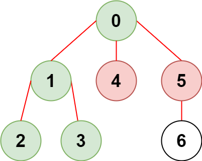
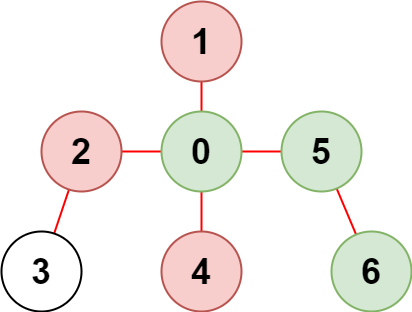

### 1. Description

There is an undirected tree with `n` nodes labeled from `0` to $n - 1$ and $n - 1$ edges.

You are given a 2D integer array `edges` of length $n - 1$ where $\text{edges}[i] = [a_{i}, b_{i}]$ indicates that there is an edge between nodes $a_{i}$ and $b_{i}$ in the tree. You are also given an integer array `restricted` which represents **restricted** nodes.

Return *the **maximum** number of nodes you can reach from node *`0`* without visiting a restricted node.*

Note that node `0` will **not** be a restricted node.

### 2. Function Contract

**Inputs**

- `n`: Input parameter (`int`).
- `edges`: Input parameter (`List[List[int]]`).
- `restricted`: Input parameter (`List[int]`).

**Return value**

- Returns `int`.

### 3. Examples

#### Example 1

- **Input:** $n = 7, edges = [[0,1],[1,2],[3,1],[4,0],[0,5],[5,6]], restricted = [4,5]$
- **Output:** `4`
- **Explanation:** The diagram above shows the tree.
We have that [0,1,2,3] are the only nodes that can be reached from node 0 without visiting a restricted node.

#### Example 2

- **Input:** $n = 7, edges = [[0,1],[0,2],[0,5],[0,4],[3,2],[6,5]], restricted = [4,2,1]$
- **Output:** `3`
- **Explanation:** The diagram above shows the tree.
We have that [0,5,6] are the only nodes that can be reached from node 0 without visiting a restricted node.

### 4. Constraints

- $2 \le n \le 10^{5}$

- $\text{edges.length} = n - 1$

- $\text{edges}[i].length = 2$

- $0 \le a_{i}, b_{i} < n$

- $a_{i} \neq b_{i}$

- `edges` represents a valid tree.

- $1 \le \text{restricted.length} < n$

- $1 \le \text{restricted}[i] < n$

- All the values of `restricted` are **unique**.
