## Solution

---

### Overview

In this problem, we are given an undirected tree where some nodes are restricted.

As shown in the picture below, if we start from node `0`, we can reach the following nodes: `0, 1, 2, 3` (colored in green), which we call **reachable**. Note that although node `6` is not restricted, it is not reachable from `0` because cannot reach it by traversing node `5`, since it is a restricted node.

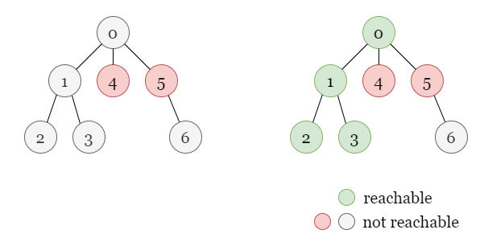

Here our task is to find out the number of reachable nodes in the given tree.

---

### Approach 1: Breadth First Search (BFS)

#### Intuition

In BFS, we will explore all nodes at the present depth (`d`) before moving on to the nodes at the next depth ($d + 1$).

Here is the order in which we visit nodes using BFS, the starting node is colored in red, and the numbers stand for the depth of each node. Regardless of the specific structure, we always visit the node of $depth = 0$, then all nodes of $depth = 1$, all nodes of $depth = 2$, and so forth.

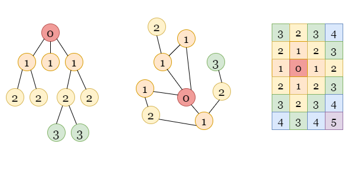

Here is an example with the steps:

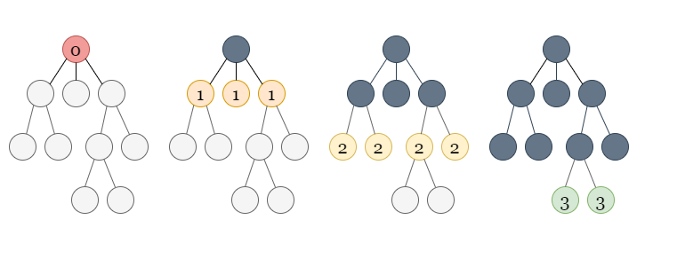

We visit the starting node first with depth 0, then we mark all its unvisited neighbor nodes with depth 1 to be visited soon, once we visit a node with a depth of 1, we mark all its unvisited neighbor nodes with depth 2 as well.
Thus, we can use a queue `queue` as a container to store all the nodes to be visited without mixing the order. Since the operation on the queue is done in First In, First Out (FIFO) order, it allows us to explore all the nodes of the current depth, before moving on to nodes of the next depth!

Once we add a node to the `queue`, we immediately mark it as **visited** to prevent it from being added to the `queue` again by some other nodes later.

Considering that some of the nodes are restricted, we can mark them as **visited** at the beginning to avoid adding them to the `queue`. Later in the process, we only consider **unvisited** nodes, so these restricted nodes will never be taken into account, let alone those that can only be visited by traversing restricted nodes.

Refer to the following slide as an example:

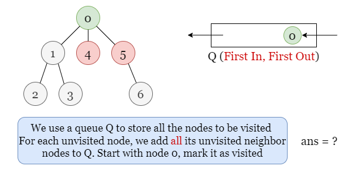

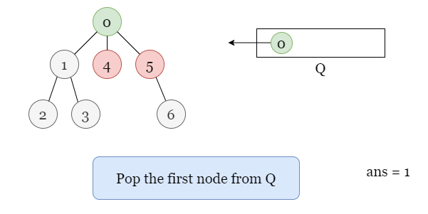

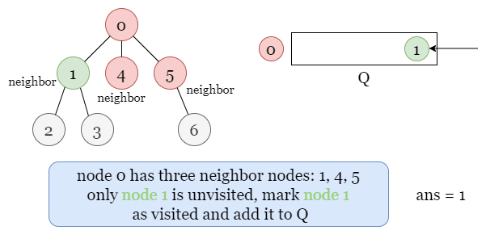

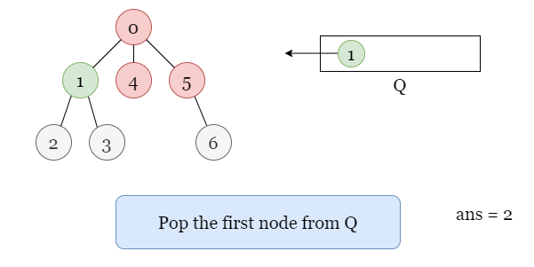

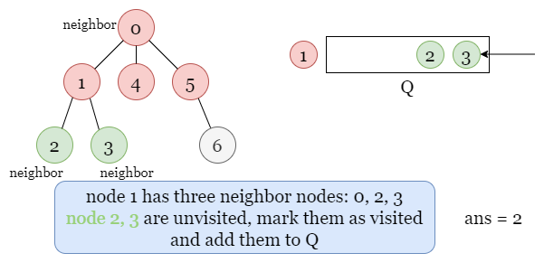

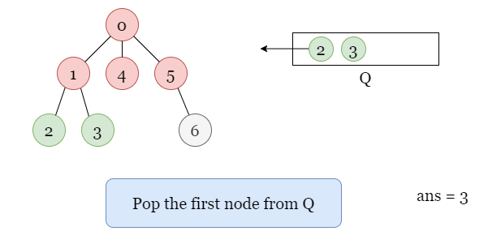

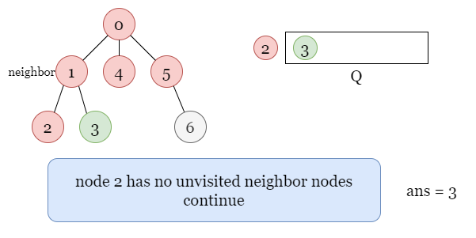

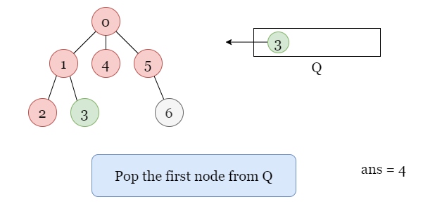

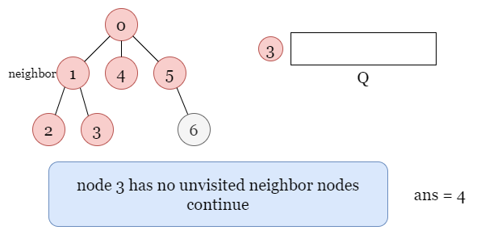

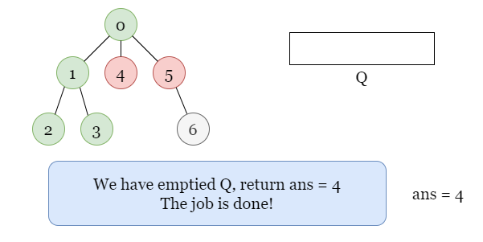

If you are not much familiar with BFS traversal, we suggest you read our [Leetcode Explore Card](https://leetcode.com/explore/learn/card/queue-stack/231/practical-application-queue/1376/) and have some knowledge of it beforehand.

<details>

<summary>There are also many other interesting problems that can be solved using BFS. You can practice using BFS approach on the following problems! (click to show)</summary>

<br>

- [1102. Path With Maximum Minimum Value](https://leetcode.com/problems/path-with-maximum-minimum-value/)
- [1162. As Far from Land as Possible](https://leetcode.com/problems/as-far-from-land-as-possible/)
- [1559. Detect Cycles in 2D Grid](https://leetcode.com/problems/detect-cycles-in-2d-grid/)
- [1631. Path With Minimum Effort](https://leetcode.com/problems/path-with-minimum-effort/)
- [1926. Nearest Exit from Entrance in Maze](https://leetcode.com/problems/nearest-exit-from-entrance-in-maze/)

</details>

<br>

#### Algorithm

1) Initialize an empty queue `queue` to store the nodes to be visited, set $ans = 0$ as the number of reachable nodes.
2) Use one bool array `seen` to mark all restricted nodes as **visited** by setting their values to `true`.
3) Add the starting node `0` to `queue` and mark it also as **visited**.
4) If `queue` has nodes, get the first node $\text{curr}_{node}$ from `queue`, increment `ans` by 1. Otherwise, go to step 6.
5) Add **unvisited** neighbor nodes of $\text{curr}_{node}$ to `queue` and mark them as **visited**. Repeat step 4.
6) Once we emptied `queue`, it means that we have visited all the reachable nodes. Return `ans`.

#### Implementation

```python
class Solution:
    def reachableNodes(self, n: int, edges: List[List[int]], restricted: List[int]) -> int:
        # Store all edges in 'neighbors'.
        neighbors = collections.defaultdict(list)
        for node_a, node_b in edges:
            neighbors[node_a].append(node_b)
            neighbors[node_b].append(node_a)

        # Mark the nodes in 'restricted' as visited.
        seen = [False] * n
        for node in restricted:
            seen[node] = True

        # Store all the nodes to be visited in 'queue'.
        ans = 0
        queue = collections.deque([0])
        seen[0] = True

        while queue:
            curr_node = queue.popleft()
            ans += 1

            # For all the neighbors of the current node, if we haven't visit it before,
            # add it to 'queue' and mark it as visited.
            for next_node in neighbors[curr_node]:
                if not seen[next_node]:
                    seen[next_node] = True
                    queue.append(next_node)

        return ans
```

#### Complexity Analysis

Let $n$ be the number of nodes in the given tree.

* Time complexity: $O(n)$

- In a typical BFS search, the time complexity is $O(V + E)$ where $V$ is the number of vertices and $E$ is the number of edges. In this problem, there are $n$ nodes and $n - 1$ edges.
- The time complexity is $O(n)$.

* Space complexity: $O(n)$

- Since the number of edges and vertices are of the same order of magnitude, thus we used a hash map `neighbors` rather than an adjacency matrix to store the edges, this will cost $O(n)$ space for $O(n)$ edges.
- We use `seen`, either a hash set or an array to record the visited nodes, this takes $O(n)$ space.
- There may be up to $n$ nodes stored in `queue` which takes $O(n)$ space.
- Therefore, the space complexity is $O(n)$.

<br/>

---

### Approach 2: Depth First Search (DFS): Recursive

#### Intuition

In DFS, we explore nodes as far as possible along each branch. Upon reaching the end of the current branch, we backtrack to the next possible branch and continue exploring.

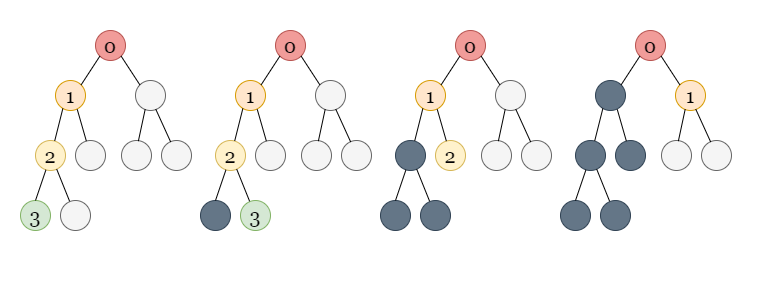

Once we encounter an unvisited node, we will take one of its neighbor nodes (if exists) as the next node on this branch. Recursively call the function to take the next node as the 'starting node' and solve the subproblem. If we reach the end of this branch, we backtrack to the previous node and visit the next neighbor node (if exists), and repeat the process. Similarly, we also use a bool array `seen` to record every restricted node and visited node as **visited**, so they won't be visited by other nodes anymore.

Refer to the following slide as an example:

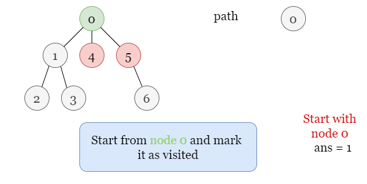

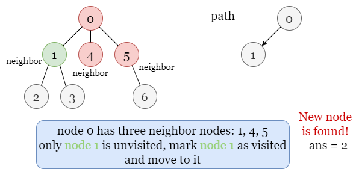

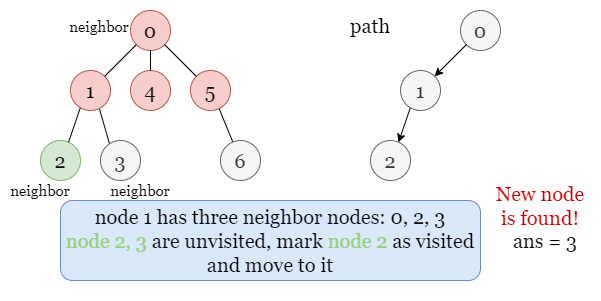

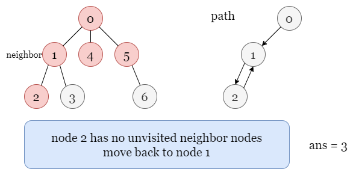

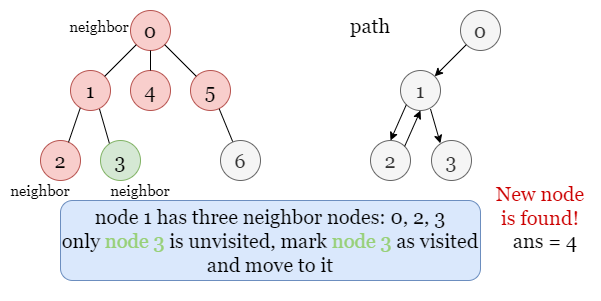


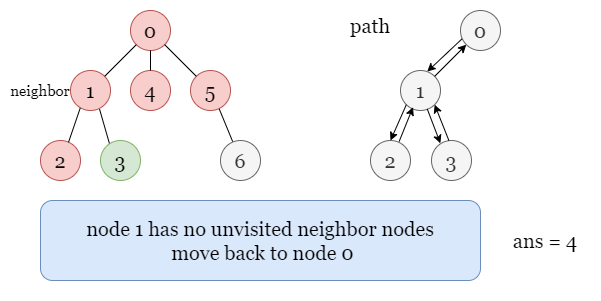

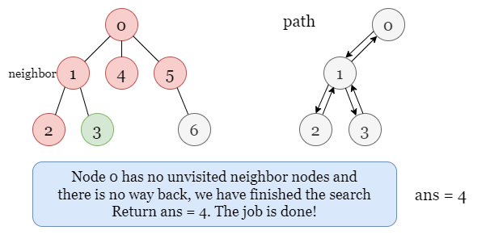

If you are new to depth-first search, see our [Leetcode Explore Card](https://leetcode.com/explore/learn/card/queue-stack/232/practical-application-stack/1377/) for more information on it!

<details>

<summary>There are also many interesting problems that can be solved using DFS! (click to show)</summary>

<br>

- [200. Number of Islands](https://leetcode.com/problems/number-of-islands/)
- [1102. Path With Maximum Minimum Value](https://leetcode.com/problems/path-with-maximum-minimum-value/)
- [1631. Path With Minimum Effort](https://leetcode.com/problems/path-with-minimum-effort/)
- [1706. Where Will the Ball Fall](https://leetcode.com/problems/where-will-the-ball-fall/)
- [2049. Count Nodes With the Highest Score](https://leetcode.com/problems/count-nodes-with-the-highest-score/)

</details>

<br>

#### Algorithm

1) Start from the starting node `0`, let $ans = 0$ as the total number of reachable nodes.
2) Use one bool array `seen` to mark all restricted nodes as **visited** by setting their values to `true`.
3) For the current node we are visiting $\text{curr}_{node}$, find all its neighbor nodes that haven't been visited before.
- If there exist such neighbor nodes, mark one as visited and move to this node, increment `ans` by 1 and repeat step 3.
- Otherwise, return.
4) Return `ans` once we finished the search.

#### Implementation

```python
class Solution:
    def reachableNodes(self, n: int, edges: List[List[int]], restricted: List[int]) -> int:
        # Store all edges according to nodes in 'neighbors'.
        neighbors = collections.defaultdict(list)
        for node_a, node_b in edges:
            neighbors[node_a].append(node_b)
            neighbors[node_b].append(node_a)

        # Mark the nodes in 'restricted' as visited.
        seen = [False] * n
        for node in restricted:
            seen[node] = True

        def dfs(curr_node):
            # Mark 'curr_node' as visited and increment 'ans' by 1.
            self.ans += 1
            seen[curr_node] = True

            # Go for unvisited neighbors of 'currNode'.
            for next_node in neighbors[curr_node]:
                if not seen[next_node]:
                    dfs(next_node)

        self.ans = 0
        dfs(0)
        return self.ans
```

#### Complexity Analysis

Let $n$ be the number of nodes in the given tree.

* Time complexity: $O(n)$

- In typical DFS search, the time complexity is $O(V + E)$ where $V, E$ are the number of vertices and edges. In this problem, there are $n$ nodes and $n - 1$ edges.
- The overall time complexity is $O(n)$.

* Space complexity: $O(n)$

- We use a hash map to store $n - 1$ edges, which takes $O(n)$ space.
- We use `seen`, either a hash set or an array to keep track of the visited nodes, which requires $O(n)$ space.
- The recusive function takes $O(n)$ space.
- Therefore, the overall space complexity is $O(n)$.

<br/>

---

### Approach 3: Depth First Search (DFS): Iterative

#### Intuition

We can also implement DFS iteratively using a `stack` to replicate recursive self calls. Since the operations on a stack are performed in First In, Last Out (FILO) order. Therefore, the top node on `stack` always leads to the next branch: whenever we reach the end of the current branch, we can get the node on the top of `stack` and move along the branch that starts from it.

Similarly, we use an array `seen` to record the status of each node, we mark all the restricted nodes as **visited** at the beginning. Therefore, we don't need to take them into account. Once we add a node to the `stack`, we immediately mark it as **visited** to prevent it from being revisited later.

Take the following slides as an example:

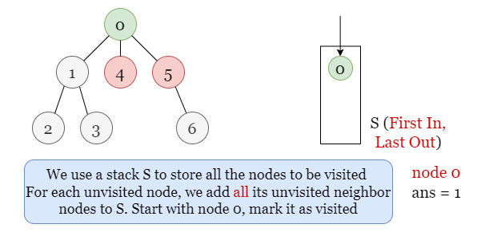

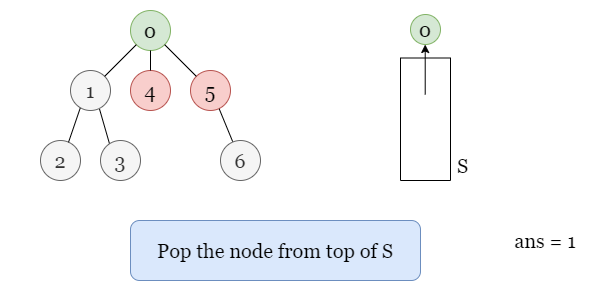

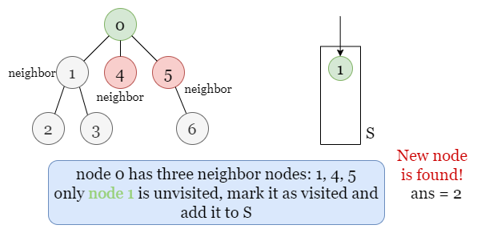

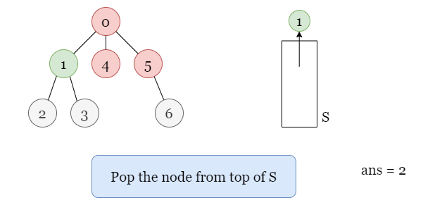

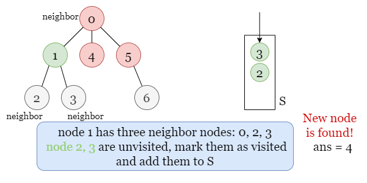

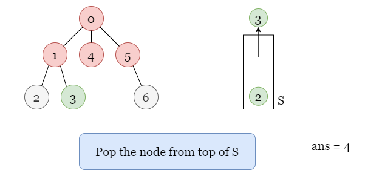

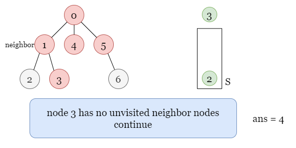

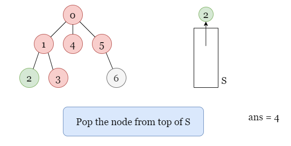

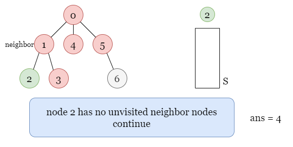

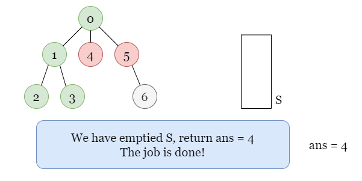

See our [Interview Crash Course](https://leetcode.com/explore/featured/card/leetcodes-interview-crash-course-data-structures-and-algorithms/706/stacks-and-queues/) and [Explore Card on DFS](https://leetcode.com/explore/learn/card/queue-stack/232/practical-application-stack/1377/) for more infomation on DFS!

<details>

<summary>There are also many interesting problems that can be solved using DFS! (click to show)</summary>

<br>

- [200. Number of Islands](https://leetcode.com/problems/number-of-islands/)
- [1102. Path With Maximum Minimum Value](https://leetcode.com/problems/path-with-maximum-minimum-value/)
- [1631. Path With Minimum Effort](https://leetcode.com/problems/path-with-minimum-effort/)
- [1706. Where Will the Ball Fall](https://leetcode.com/problems/where-will-the-ball-fall/)
- [2049. Count Nodes With the Highest Score](https://leetcode.com/problems/count-nodes-with-the-highest-score/)

</details>

<br>

#### Algorithm

1) Initialize an empty stack `stack` to store the nodes to be visited and set $ans = 0$ as the number of reachable nodes.
2) Use one bool array `seen` to mark all restricted nodes as **visited** by setting their values to `true`.
3) Add the starting node `0` to `stack` and mark it as **visited**.
4) If `stack` has nodes, get the top node $\text{curr}_{node}$ from `stack`, increment `ans` by 1. Otherwise, go to step 6.
5) Add **unvisited** neighbor nodes of $\text{curr}_{node}$ to `stack` and mark them as **visited**. Repeat step 4.
6) Once we emptied `stack`, it means that we have visited all the reachable nodes. Return `ans`.

#### Implementation

```python
class Solution:
    def reachableNodes(self, n: int, edges: List[List[int]], restricted: List[int]) -> int:
        # Store all edges according to nodes in 'neighbor'.
        neighbors = collections.defaultdict(set)
        for a, b in edges:
            neighbors[a].add(b)
            neighbors[b].add(a)

        # Mark the nodes in 'restricted' as visited.
        seen = [False] * n
        for node in restricted:
            seen[node] = True

        # Use stack 'stack' to store all nodes to be visited, start from node 0.
        stack = [0]
        ans = 0
        seen[0] = True

        while stack:
            curr_node = stack.pop()
            ans += 1

            # Add all unvisited neighbors of the current node to 'stack'
            # and mark them as visited.
            for next_node in neighbors[curr_node]:
                if not seen[next_node]:
                    seen[next_node] = True
                    stack.append(next_node)

        return ans
```

#### Complexity Analysis

Let $n$ be the number of nodes in the given tree.

* Time complexity: $O(n)$

- In a typical DFS search, the time complexity is $O(V + E)$ where $V, E$ are the number of vertices and edges. In this problem, there are $n$ nodes and $n - 1$ edges.
- The time complexity is $O(n)$.

* Space complexity: $O(n)$

- We use a hash map to store $n - 1$ edges which requires $O(n)$ space.
- We use `seen`, either a hash set or an array to record the visited nodes, which also takes $O(n)$ space.
- We use a stack `stack` to store all the nodes to be visited, in the worst-case scenario, there may be $O(n)$ nodes in `stack`.
- To sum up, the space complexity is $O(n)$.

<br/>

---

### Approach 4: Disjoint Set Union (DSU)

#### Intuition

All the reachable nodes from node `0` (including node `0` itself) are in the same group, and the number of them is the size of this group. Thus we can use the union-find data structure to solve this problem.

Let's first assume that there is no edge in the graph and that all these points are isolated points, then we add these edges back, and for each edge $edge = [\text{node}_{a}, \text{node}_{b}]$, we connect $\text{node}_{a}$ with $\text{node}_{b}$ representing that these two nodes belong to the same group.

However, we have some restricted nodes that won't get connected to any other nodes. If we encounter an edge that connects any restricted node, that is, either $\text{node}_{a}$ or $\text{node}_{b}$ is a restricted node, we can just skip it.

We update the size of each group during the iteration. After the iteration stops, we can get the size of the group `g` containing node `0`. Since a node that belongs to a group is reachable by other nodes in the same group, the size of `g` equals the number of reachable nodes starting from node `0`.

Please refer to the picture below, the restricted nodes are colored in red while the dashed lines show all edges connected to these nodes.

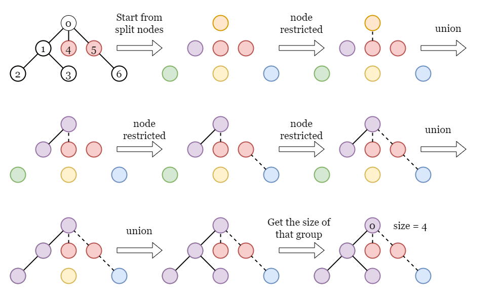

<br>

#### Algorithm

1) Store all the restricted nodes in a hash set `restricted`.
2) Iterate over all edges. For each edge $edge = [\text{node}_{a}, \text{node}_{b}]$, if neither of the two nodes is restricted, we use the union-find data structure to connect these two nodes.
2) Find the group `g` where node `0` belongs and return its size.

#### Implementation

```python
class UnionFind:
    def __init__(self, n):
        self.root = list(range(n))
        self.rank = [1] * n
    def find(self, x):
        if self.root[x] != x:
            self.root[x] = self.find(self.root[x])
        return self.root[x]
    def union(self, x, y):
        root_x, root_y = self.find(x), self.find(y)
        if root_x != root_y:
            if self.rank[root_x] > self.rank[root_y]:
                root_x, root_y = root_y, root_x
            self.rank[root_y] += self.rank[root_x]
            self.root[root_x] = root_y
    def getSize(self, x):
        return self.rank[self.find(x)]

class Solution:
    def reachableNodes(self, n: int, edges: List[List[int]], restricted: List[int]) -> int:
        rest_set_ = set(restricted)
        uf = UnionFind(n)

        for a, b in edges:
            if a not in rest_set and b not in rest_set:
                uf.union(a, b)

        return uf.getSize(0)
```

#### Complexity Analysis

Let $n$ be the number of nodes in the given tree.

* Time complexity: $O(n \cdot\log n)$

- The amortized complexity for performing $n$ union find operations is $O(n\cdot \alpha(n))$ time where $\alpha$ is the [Inverse Ackermann Function](https://en.wikipedia.org/wiki/Ackermann_function#Inverse).
- To sum up, the overall time complexity is $O(n\cdot \alpha(n))$.

* Space complexity: $O(n)$

- We used two arrays `root` and `rank` to save the root and rank of each cell in the union-find data structure, they take $O(n)$ space.

<br/>