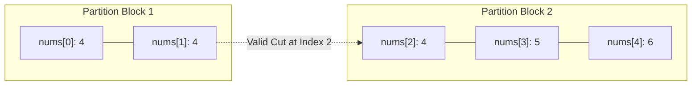

# Guided Example: Check if There is a Valid Partition For The Array

## 1. Problem Overview & Representative Instance

Given a sequence of integers $\text{nums}$, the objective is to determine whether the entire array can be partitioned into contiguous subarrays such that every subarray conforms to at least one of three valid structural patterns:
1. Exactly two equal elements: $[x, x]$.
2. Exactly three equal elements: $[x, x, x]$.
3. Exactly three consecutive strictly increasing elements with adjacent difference $1$: $[x, x + 1, x + 2]$.

Subarrays cannot overlap, every element must belong to exactly one partition, and the relative order of elements must remain undisturbed. The problem asks for a boolean confirmation indicating whether a complete valid partition exists.

Consider the representative array:
$$\text{nums} = [4, 4, 4, 5, 6]$$

This five-element array cannot be partitioned into equal pairs alone (since $5$ is odd), nor into three-element groups alone. However, splitting into $[4, 4]$ (valid pattern 1) and $[4, 5, 6]$ (valid pattern 3) successfully covers the entire sequence.

## 2. Mathematical & Algorithmic Principles

Because every valid subarray must have a length of either $2$ or $3$, the decision to close a subarray at index $i - 1$ depends exclusively on the validity of partitions of prefixes ending at index $i - 2$ or $i - 3$. This exhibits optimal substructure.

Let $DP[i]$ be a boolean predicate indicating whether the prefix subarray $\text{nums}[0 \dots i - 1]$ admits a valid partition:
- **Base Case:**
  $$DP[0] = \text{true}$$
  An empty prefix is trivially partitioned by zero subarrays.
  $$DP[1] = \text{false}$$
  No valid pattern has length $1$.

- **Recurrence Transitions for $i \ge 2$:**
  $DP[i]$ evaluates to $\text{true}$ if and only if at least one of the following backward transitions holds:
  1. **Two-Element Equal Pair:**
     $$DP[i - 2] \land (\text{nums}[i - 1] = \text{nums}[i - 2])$$
  2. **Three-Element Equal Triplet ($i \ge 3$):**
     $$DP[i - 3] \land (\text{nums}[i - 1] = \text{nums}[i - 2] = \text{nums}[i - 3])$$
  3. **Three-Element Consecutive Sequence ($i \ge 3$):**
     $$DP[i - 3] \land (\text{nums}[i - 1] = \text{nums}[i - 2] + 1 = \text{nums}[i - 3] + 2)$$

Because each state $DP[i]$ depends only on $DP[i - 1]$, $DP[i - 2]$, and $DP[i - 3]$, the full table can be maintained with four rolling boolean variables, achieving linear time and constant auxiliary memory.

## 3. Step-by-Step Walkthrough with Intermediate State

We trace the representative array $\text{nums} = [4, 4, 4, 5, 6]$ of length $n = 5$.

- **Initialization:**
  - $DP[0] = \text{true}$
  - $DP[1] = \text{false}$

- **Step 1: Prefix of Length 2 ($i = 2$, slice $\text{nums}[0 \dots 1] = [4, 4]$):**
  - Pattern 1 check: Does $\text{nums}[1] = \text{nums}[0]$? Yes ($4 = 4$).
    Prerequisite: Is $DP[0] = \text{true}$? Yes.
    Therefore, transition 1 succeeds: $DP[2] = \text{true}$.

- **Step 2: Prefix of Length 3 ($i = 3$, slice $\text{nums}[0 \dots 2] = [4, 4, 4]$):**
  - Pattern 1 check ($[4, 4]$ at end): $\text{nums}[2] = \text{nums}[1]$ is true, but prerequisite $DP[1] = \text{false}$.
  - Pattern 2 check ($[4, 4, 4]$ at end): $\text{nums}[2] = \text{nums}[1] = \text{nums}[0]$ ($4 = 4 = 4$).
    Prerequisite: Is $DP[0] = \text{true}$? Yes.
    Therefore, transition 2 succeeds: $DP[3] = \text{true}$.

- **Step 3: Prefix of Length 4 ($i = 4$, slice $\text{nums}[0 \dots 3] = [4, 4, 4, 5]$):**
  - Pattern 1 check ($[4, 5]$): $\text{nums}[3] \neq \text{nums}[2]$ ($5 \neq 4$). Fails.
  - Pattern 2 check ($[4, 4, 5]$): Not all equal. Fails.
  - Pattern 3 check ($[4, 4, 5]$): Not consecutive increasing. Fails.
  - Therefore, no transition succeeds: $DP[4] = \text{false}$.

- **Step 4: Prefix of Length 5 ($i = 5$, slice $\text{nums}[0 \dots 4] = [4, 4, 4, 5, 6]$):**
  - Pattern 1 check ($[5, 6]$): $\text{nums}[4] \neq \text{nums}[3]$ ($6 \neq 5$). Fails.
  - Pattern 2 check ($[4, 5, 6]$): Not equal. Fails.
  - Pattern 3 check ($[4, 5, 6]$):
    $\text{nums}[4] = \text{nums}[3] + 1$ ($6 = 5 + 1$) and $\text{nums}[3] = \text{nums}[2] + 1$ ($5 = 4 + 1$). Condition satisfied!
    Prerequisite: Is $DP[5 - 3] = DP[2] = \text{true}$? Yes, $DP[2] = \text{true}$.
    Therefore, transition 3 succeeds: $DP[5] = \text{true}$.

- **Conclusion:**
  $DP[5] = \text{true}$. A valid partition exists.

## 4. Comprehensive State Trace

The dynamic programming evaluation across all prefix lengths is detailed below:

| Prefix Length $i$ | Current Value $\text{nums}[i - 1]$ | Candidate Suffix Tested | Pattern Match Result | Linked Prerequisite State | Transition Result | $DP[i]$ |
|---|---|---|---|---|---|---|
| 0 | — | — | — | Base Case | Valid | True |
| 1 | 4 | $[4]$ | No single-element pattern | — | Invalid | False |
| 2 | 4 | $[4, 4]$ | Pattern 1: Equal pair | $DP[0] = \text{True}$ | Accepted | True |
| 3 | 4 | $[4, 4, 4]$ | Pattern 2: Equal triplet | $DP[0] = \text{True}$ | Accepted | True |
| 4 | 5 | $[4, 5]$ or $[4, 4, 5]$ | None matched | $DP[2]$ / $DP[1]$ | Rejected | False |
| 5 | 6 | $[4, 5, 6]$ | Pattern 3: Consecutive triplet | $DP[2] = \text{True}$ | Accepted | True |

We also tabulate the candidate partitions explored and their structural classifications:

| Subarray Range | Subarray Elements | Candidate Pattern Type | Internal Pattern Valid? | Prefix Preceding Valid? | Combined Viability |
|---|---|---|---|---|---|
| Indices $0 \dots 1$ | $[4, 4]$ | Pattern 1 (Pair) | True | True ($DP[0]$) | Valid |
| Indices $0 \dots 2$ | $[4, 4, 4]$ | Pattern 2 (Triplet) | True | True ($DP[0]$) | Valid |
| Indices $2 \dots 4$ | $[4, 5, 6]$ | Pattern 3 (Consecutive) | True | True ($DP[2]$) | Valid |
| Indices $3 \dots 4$ | $[5, 6]$ | Pattern 1 (Pair) | False ($5 \neq 6$) | True ($DP[3]$) | Invalid |

Combining partition $[0 \dots 1]$ and $[2 \dots 4]$ yields a complete valid tiling of the array.

## 5. Algorithmic Correctness & Soundness

The correctness of this dynamic programming formulation is established by structural induction on the prefix length:
1. **Exhaustive Lookback:** Any valid partition must terminate with a valid subarray of length $2$ or length $3$. There are no legal subarrays of any other length. Hence, checking the last $2$ elements and the last $3$ elements covers all possible terminal blocks.
2. **Independence of Suffix and Prefix:** The validity of the final block depends only on the values within that block. The validity of the remaining elements depends entirely on whether the prefix prior to the block can be validly partitioned. By the principle of optimal substructure, $DP[i]$ is true if and only if there exists a valid terminal block ending at $i - 1$ whose preceding prefix state is true.
3. **No False Negatives:** If any sequence of valid partitions covers $\text{nums}$, the final subarray in that sequence ends at index $n - 1$ with length $2$ or $3$. By backward induction, the dynamic programming recurrence will test and accept this partition.

## 6. Edge Cases & Anti-Patterns

- **Equal Elements of Length 4 ($[1, 1, 1, 1]$):**
  - Length 2 evaluates to true ($DP[2] = \text{true}$ via $[1, 1]$).
  - Length 3 evaluates to true ($DP[3] = \text{true}$ via $[1, 1, 1]$).
  - Length 4 evaluates to true ($DP[4] = \text{true}$ via pair $[1, 1]$ linked to $DP[2]$).
  - A greedy strategy that greedily consumes the triplet $[1, 1, 1]$ leaves a trailing $[1]$ and incorrectly reports false. The dynamic programming approach evaluates both choices and finds the valid $2 + 2$ partition.
- **Length 2 Input ($[x, y]$):**
  - If $x = y$, $DP[2] = \text{true}$.
  - If $x \neq y$, $DP[2] = \text{false}$.
- **Consecutive Increasing Triplet with Gaps ($[1, 3, 5]$):** Pattern 3 strictly mandates adjacent difference of $1$. Arithmetic progressions with difference $\ge 2$ correctly evaluate to false.
- **Anti-Pattern: Recursive Backtracking without Memoization:** Pure recursion explores up to $\mathcal{O}(2^n)$ branches due to overlapping subproblems (e.g. repeated values generating both length-2 and length-3 branches). Maintaining memoized states reduces this to linear time.

## 7. Complexity Analysis

- **Time Complexity:** The recurrence computes $DP[i]$ for each index from $2$ to $n$. Each step performs at most three local checks, each consisting of constant-time equality comparisons and boolean conjunctions. Total time complexity is $\mathcal{O}(n)$.
- **Space Complexity:** Evaluating $DP[i]$ only requires access to $DP[i - 1]$, $DP[i - 2]$, and $DP[i - 3]$. By tracking only the four most recent boolean values in rolling variables, auxiliary space complexity is $\mathcal{O}(1)$.
