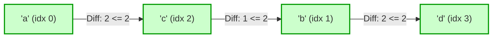

# Guided Example: Longest Ideal Subsequence

## 1. Problem Overview & Representative Instance

Given a string $s$ consisting of lowercase English characters and an integer tolerance $k$, we seek to extract a subsequence $t$ of maximum possible length that satisfies the "ideal" property. A subsequence is ideal if for every adjacent pair of characters in $t$, the absolute difference between their alphabetical indices is at most $k$:
$$|\text{alphabet\_index}(t[i]) - \text{alphabet\_index}(t[i - 1])| \le k \quad \text{for all } i \ge 1$$

Here, the alphabet is non-cyclic (the positional difference between `'a'` and `'z'` is $25$, not $1$). The characters in $t$ maintain their relative order from $s$, but need not appear consecutively in the original string.

Consider the representative configuration:
- String: $s = \text{"acfgbd"}$
- Tolerance: $k = 2$

Alphabet positions are defined as `'a' \to 0, 'b' \to 1, \dots, 'z' \to 25$. If we select `"acbd"`:
- Distance between `'a'` ($0$) and `'c'` ($2$) is $|2 - 0| = 2 \le 2$.
- Distance between `'c'` ($2$) and `'b'` ($1$) is $|1 - 2| = 1 \le 2$.
- Distance between `'b'` ($1$) and `'d'` ($3$) is $|3 - 1| = 2 \le 2$.

All adjacent transitions satisfy the bound $k = 2$, yielding an ideal subsequence of length $4$.

## 2. Mathematical & Algorithmic Principles

A naive Longest Increasing Subsequence (LIS) variant that compares each character against all preceding indices in $s$ requires $\mathcal{O}(n^2)$ time, which is prohibitive for $n = 10^5$. However, the alphabet size is bounded by $|\Sigma| = 26$.

Let $DP[c]$ denote the maximum length of an ideal subsequence constructed from the prefix of $s$ examined so far, with the invariant that the subsequence ends with character $c \in \{0, 1, \dots, 25\}$.

When a character $x \in \{0, \dots, 25\}$ is encountered:
1. It can extend any previously established ideal subsequence whose terminal character $c$ falls within the allowable window:
   $$c \in [\max(0, x - k),\, \min(25, x + k)]$$
2. The optimal predecessor is the character that maximizes $DP[c]$ within this numerical range:
   $$DP_{\text{new}}[x] = 1 + \max_{\substack{|c - x| \le k \\ 0 \le c \le 25}} DP[c]$$
3. Because extending a subsequence cannot decrease the length achievable by ending at character $x$, we update $DP[x] = DP_{\text{new}}[x]$.
4. Characters outside the window $[\max(0, x - k), \min(25, x + k)]$ remain unaltered.

After scanning the complete string, the global answer is simply $\max_{0 \le c < 26} DP[c]$.

## 3. Step-by-Step Walkthrough with Intermediate State

We trace the string $s = \text{"acfgbd"}$ with $k = 2$.
We represent characters as 0-indexed integers:
`'a' = 0, 'b' = 1, 'c' = 2, 'd' = 3, 'f' = 5, 'g' = 6`.
Initialize table $DP[0 \dots 25] = 0$.

- **Step 1: Process `'a'` ($x = 0$):**
  - Eligible predecessor window: $[\max(0, 0 - 2), \min(25, 0 + 2)] = [0, 2]$.
  - Best predecessor: $\max(DP[0], DP[1], DP[2]) = 0$.
  - Update: $DP[0] = 1 + 0 = 1$. Subsequence: `"a"`.

- **Step 2: Process `'c'` ($x = 2$):**
  - Eligible predecessor window: $[0, 4]$.
  - Best predecessor: $\max(DP[0 \dots 4]) = DP[0] = 1$.
  - Update: $DP[2] = 1 + 1 = 2$. Subsequence: `"ac"`.

- **Step 3: Process `'f'` ($x = 5$):**
  - Eligible predecessor window: $[3, 7]$.
  - Predecessor values: $DP[3]=0, DP[4]=0, DP[5]=0, DP[6]=0, DP[7]=0$. Maximum is $0$.
  - Update: $DP[5] = 1 + 0 = 1$. Subsequence: `"f"`.

- **Step 4: Process `'g'` ($x = 6$):**
  - Eligible predecessor window: $[4, 8]$.
  - Best predecessor: $\max(DP[4 \dots 8]) = DP[5] = 1$ (from `'f'`).
  - Update: $DP[6] = 1 + 1 = 2$. Subsequence: `"fg"`.

- **Step 5: Process `'b'` ($x = 1$):**
  - Eligible predecessor window: $[0, 3]$.
  - Values in range: $DP[0] = 1$, $DP[1] = 0$, $DP[2] = 2$, $DP[3] = 0$. Maximum is $DP[2] = 2$ (from `'c'`).
  - Update: $DP[1] = 1 + 2 = 3$. Subsequence: `"acb"`.

- **Step 6: Process `'d'` ($x = 3$):**
  - Eligible predecessor window: $[1, 5]$.
  - Values in range: $DP[1] = 3$, $DP[2] = 2$, $DP[3] = 0$, $DP[4] = 0$, $DP[5] = 1$. Maximum is $DP[1] = 3$ (from `'b'`).
  - Update: $DP[3] = 1 + 3 = 4$. Subsequence: `"acbd"`.

- **Final Result:**
  $\max_{c} DP[c] = \max(DP) = DP[3] = 4$.

## 4. Comprehensive State Trace

The evolution of the dynamic programming array across each scanned character is tabulated below:

| Step | Char | Alphabet Code $x$ | Search Window $[x - k, x + k]$ | Predecessor Max ($\max DP[c]$) | Updated $DP[x]$ | Subsequence Realized |
|---|---|---|---|---|---|---|
| 1 | 'a' | 0 | $[0, 2]$ | 0 | 1 | `"a"` |
| 2 | 'c' | 2 | $[0, 4]$ | 1 (via 'a') | 2 | `"ac"` |
| 3 | 'f' | 5 | $[3, 7]$ | 0 | 1 | `"f"` |
| 4 | 'g' | 6 | $[4, 8]$ | 1 (via 'f') | 2 | `"fg"` |
| 5 | 'b' | 1 | $[0, 3]$ | 2 (via 'c') | 3 | `"acb"` |
| 6 | 'd' | 3 | $[1, 5]$ | 3 (via 'b') | 4 | `"acbd"` |

The final non-zero entries in the terminal table $DP$ are summarized in the profile below:

| Alphabet Character | Positional Index | Longest Subsequence Ending Here | Example Subsequence |
|---|---|---|---|
| 'a' | 0 | 1 | `"a"` |
| 'b' | 1 | 3 | `"acb"` |
| 'c' | 2 | 2 | `"ac"` |
| 'd' | 3 | 4 | `"acbd"` |
| 'f' | 5 | 1 | `"f"` |
| 'g' | 6 | 2 | `"fg"` |

The maximum value across the alphabet profile is $4$, achieved by terminating at `'d'`.

## 5. Algorithmic Correctness & Soundness

The soundness of the fixed-alphabet dynamic programming table relies on the following guarantees:
1. **Sufficiency of Terminal Character:** The validity of appending character $x$ to an existing subsequence depends solely on the last character $c$ of that subsequence, satisfying $|c - x| \le k$. All characters preceding $c$ in the subsequence have already satisfied the condition. Thus, tracking only the terminal character of the subsequence captures the complete necessary state.
2. **Dominance of Maximum Length:** For any given terminal character $c$, retaining only the maximum length achieved so far strictly dominates any shorter subsequence ending in $c$. A longer subsequence ending in $c$ offers identical transition opportunities for future characters while contributing a strictly higher base length.
3. **Sequential Processing Preserves Order:** By iterating through $s$ from left to right, every predecessor considered was physically present before the current character in $s$, preserving original subsequence ordering.

## 6. Edge Cases & Anti-Patterns

- **Zero Tolerance ($k = 0$):** When $k = 0$, the search window collapses to $[x, x]$. The update becomes $DP[x] = 1 + DP[x]$. This counts the maximum frequency of identical characters, correctly finding the longest subsequence composed of a single repeating letter.
- **Maximum Tolerance ($k = 25$):** When $k = 25$, any character can follow any other character. The search window covers the entire alphabet $[0, 25]$. The answer is trivially $n$, the length of the string.
- **Single Character Input:** For $|s| = 1$, the loop executes once and yields $1$.
- **Anti-Pattern: Pairwise $\mathcal{O}(n^2)$ LIS:** Iterating over all previous string indices $j < i$ to check whether $|s[i] - s[j]| \le k$ leads to $10^{10}$ operations when $n = 10^5$, causing Time Limit Exceeded. Exploiting the fixed alphabet size of $26$ drops the per-element cost to constant time.

## 7. Complexity Analysis

- **Time Complexity:** For each of the $n$ characters in $s$, the algorithm scans an interval of length at most $2k + 1 \le 26$. This requires at most $26$ comparisons per character. Therefore, total time complexity is $\mathcal{O}(n \cdot |\Sigma|) = \mathcal{O}(26n) = \mathcal{O}(n)$, which runs comfortably within standard execution limits.
- **Space Complexity:** The dynamic programming state requires an array of size equal to the alphabet size $|\Sigma| = 26$. This uses $\mathcal{O}(|\Sigma|) = \mathcal{O}(1)$ auxiliary space, independent of string length $n$.