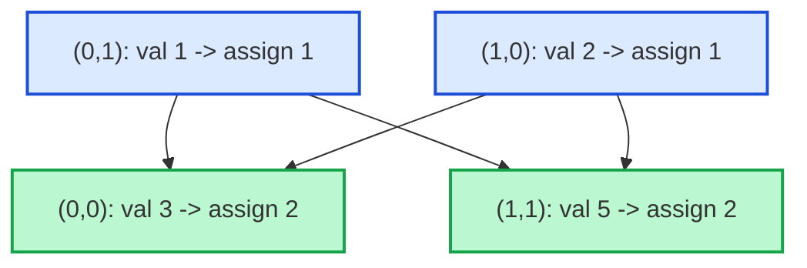

# Guided Example: Minimize Maximum Value in a Grid

## 1. Problem Overview & Representative Instance

Given an $m \times n$ matrix $\text{grid}$ consisting entirely of distinct positive integers, we must assign a positive replacement integer to every cell. The replacements must preserve all strict relative orderings within each individual row and within each individual column:
- If $\text{grid}[r][c_1] > \text{grid}[r][c_2]$, then $\text{ans}[r][c_1] > \text{ans}[r][c_2]$.
- If $\text{grid}[r_1][c] > \text{grid}[r_2][c]$, then $\text{ans}[r_1][c] > \text{ans}[r_2][c]$.

Cells that do not share a row or column impose no mutual ordering constraints and may receive equal replacement values. Every replacement must be a positive integer ($\ge 1$). The goal is to minimize the maximum integer present in the replacement matrix.

Consider the representative configuration:
$$\text{grid} = \begin{bmatrix} 3 & 1 \\ 2 & 5 \end{bmatrix}$$

All four entries are distinct. In row $0$, cell $(0, 0)$ must exceed cell $(0, 1)$. In column $0$, cell $(0, 0)$ must exceed cell $(1, 0)$. In column $1$, cell $(1, 1)$ must exceed cell $(0, 1)$. In row $1$, cell $(1, 1)$ must exceed cell $(1, 0)$. We seek the smallest positive values that satisfy these simultaneous orthogonal chains.

## 2. Mathematical & Algorithmic Principles

Because every number in $\text{grid}$ is distinct, every pairwise comparison between two cells in the same row or column is a strict inequality ($>$ or $<$). This defines a Directed Acyclic Graph (DAG) of constraints where directed edges point from smaller elements to larger elements.

Sorting all $N = m \cdot n$ cells in ascending order of their original values provides a valid topological ordering of this DAG:
1. When evaluating cell $(r, c)$, any constraint requiring $\text{ans}[r][c] > \text{ans}[r'][c']$ involves an element with $\text{grid}[r'][c'] < \text{grid}[r][c]$.
2. Because cells are processed in strictly ascending order of $\text{grid}$, all predecessors of $(r, c)$ in row $r$ and column $c$ have already received their final replacement values.
3. To minimize the replacement value at $(r, c)$, it should be set to the smallest positive integer that strictly exceeds all existing values in row $r$ and column $c$:
   $$\text{ans}[r][c] = \max\bigl(\text{row\_max}[r],\, \text{col\_max}[c]\bigr) + 1$$
   where $\text{row\_max}[r]$ is the maximum value currently assigned to any cell in row $r$ (initialized to $0$), and $\text{col\_max}[c]$ is the maximum value currently assigned to any cell in column $c$ (initialized to $0$).
4. After computing $\text{ans}[r][c]$, the maximum trackers are updated:
   $$\text{row\_max}[r] = \text{ans}[r][c], \quad \text{col\_max}[c] = \text{ans}[r][c]$$

By induction, assigning the absolute minimum feasible positive integer to each cell in topological order guarantees that every individual cell is minimized, which in turn minimizes the global maximum of the matrix.

## 3. Step-by-Step Walkthrough with Intermediate State

We trace the representative grid:
$$\text{grid} = \begin{bmatrix} 3 & 1 \\ 2 & 5 \end{bmatrix}, \quad m = 2, \, n = 2$$

- **Phase 1: Flatten & Sort Coordinates:**
  Gather all tuples $(\text{value}, r, c)$ and sort by value:
  $$[(1, 0, 1),\, (2, 1, 0),\, (3, 0, 0),\, (5, 1, 1)]$$

- **Phase 2: Initialize State Trackers:**
  - $\text{row\_max} = [0, 0]$
  - $\text{col\_max} = [0, 0]$
  - $\text{ans}$ initialized to a $2 \times 2$ matrix.

- **Step 1: Cell $(0, 1)$ with Value 1:**
  - Look up current bounds: $\text{row\_max}[0] = 0$, $\text{col\_max}[1] = 0$.
  - Compute replacement:
    $$\text{val} = \max(0, 0) + 1 = 1$$
  - Assign $\text{ans}[0][1] = 1$.
  - Update bounds: $\text{row\_max}[0] = 1$, $\text{col\_max}[1] = 1$.

- **Step 2: Cell $(1, 0)$ with Value 2:**
  - Look up current bounds: $\text{row\_max}[1] = 0$, $\text{col\_max}[0] = 0$.
  - Compute replacement:
    $$\text{val} = \max(0, 0) + 1 = 1$$
  - Assign $\text{ans}[1][0] = 1$.
  - Update bounds: $\text{row\_max}[1] = 1$, $\text{col\_max}[0] = 1$.

- **Step 3: Cell $(0, 0)$ with Value 3:**
  - Look up current bounds: $\text{row\_max}[0] = 1$, $\text{col\_max}[0] = 1$.
  - Compute replacement:
    $$\text{val} = \max(1, 1) + 1 = 2$$
  - Assign $\text{ans}[0][0] = 2$.
  - Update bounds: $\text{row\_max}[0] = 2$, $\text{col\_max}[0] = 2$.

- **Step 4: Cell $(1, 1)$ with Value 5:**
  - Look up current bounds: $\text{row\_max}[1] = 1$, $\text{col\_max}[1] = 1$.
  - Compute replacement:
    $$\text{val} = \max(1, 1) + 1 = 2$$
  - Assign $\text{ans}[1][1] = 2$.
  - Update bounds: $\text{row\_max}[1] = 2$, $\text{col\_max}[1] = 2$.

- **Termination:**
  All cells assigned. The final replacement matrix is:
  $$\text{ans} = \begin{bmatrix} 2 & 1 \\ 1 & 2 \end{bmatrix}$$
  The maximum value across the matrix is $2$.

## 4. Comprehensive State Trace

The execution ledger across all sequential assignments is documented below:

| Processing Step | Original Value | Coordinates $(r, c)$ | Incoming $\text{row\_max}[r]$ | Incoming $\text{col\_max}[c]$ | Assigned Value $\text{val}$ | Updated $\text{row\_max}[r]$ | Updated $\text{col\_max}[c]$ |
|---|---|---|---|---|---|---|---|
| 1 | 1 | $(0, 1)$ | 0 | 0 | 1 | $\text{row\_max}[0] = 1$ | $\text{col\_max}[1] = 1$ |
| 2 | 2 | $(1, 0)$ | 0 | 0 | 1 | $\text{row\_max}[1] = 1$ | $\text{col\_max}[0] = 1$ |
| 3 | 3 | $(0, 0)$ | 1 | 1 | 2 | $\text{row\_max}[0] = 2$ | $\text{col\_max}[0] = 2$ |
| 4 | 5 | $(1, 1)$ | 1 | 1 | 2 | $\text{row\_max}[1] = 2$ | $\text{col\_max}[1] = 2$ |

We verify all row and column constraints against the resulting assignments:

| Constraint Scope | Cell Pair Evaluated | Original Values | Replacement Values | Strict Comparison Preserved? |
|---|---|---|---|---|
| Row 0 | $(0, 0)$ vs $(0, 1)$ | $3 > 1$ | $2 > 1$ | Satisfied |
| Row 1 | $(1, 0)$ vs $(1, 1)$ | $2 < 5$ | $1 < 2$ | Satisfied |
| Column 0 | $(0, 0)$ vs $(1, 0)$ | $3 > 2$ | $2 > 1$ | Satisfied |
| Column 1 | $(0, 1)$ vs $(1, 1)$ | $1 < 5$ | $1 < 2$ | Satisfied |

All four directional conditions hold strictly, and no replacement value exceeds $2$.

## 5. Algorithmic Correctness & Soundness

The correctness of this greedy formulation follows from properties of partially ordered sets:
1. **Valid Topological Order:** Since elements in the matrix are pairwise distinct, the relation defined by row and column precedence contains no cycles. Any total order consistent with numerical magnitude is a topological sort of the constraint DAG.
2. **Component-Wise Minimal Feasible Values:** For any node $u$ in a DAG where edge $(v, u)$ requires $\text{ans}[u] \ge \text{ans}[v] + 1$, the optimal value is $\text{ans}[u] = 1 + \max_{(v, u) \in E} \text{ans}[v]$. Because edges only exist between cells in the same row or column, the maximum over all predecessors of cell $(r, c)$ is precisely $\max(\text{row\_max}[r], \text{col\_max}[c])$.
3. **Pointwise Minimality:** The assignment produces values that are pointwise minimal: no cell could receive a strictly smaller positive integer without violating either a row constraint or a column constraint with one of its predecessors. Pointwise minimality trivially implies minimality of the supremum $\max_{(r, c)} \text{ans}[r][c]$.

## 6. Edge Cases & Anti-Patterns

- **Single Cell ($1 \times 1$ Matrix):** For $\text{grid} = [[10]]$, sorting yields one element, $\max(0, 0) + 1 = 1$, correctly outputting $[[1]]$.
- **Single Row ($1 \times n$):** All entries share row $0$ but distinct columns. The sorted order sequentially increments $\text{row\_max}[0]$ from $1$ to $n$, assigning ranks $1, 2, \dots, n$ in order of value.
- **Single Column ($m \times 1$):** Dual to the single row case, entries are assigned ranks $1, 2, \dots, m$ along column $0$.
- **Anti-Pattern: Full Disjoint Set Union (DSU) Overhead:** In problems where duplicate values exist across rows and columns, identical numbers must be unified with DSU. However, because the input here guarantees all entries are strictly distinct, DSU is unnecessary. Directly sorting the cell list eliminates redundant graph constructions.

## 7. Complexity Analysis

- **Time Complexity:**
  - Gathering the $m \cdot n$ cell coordinates takes $\mathcal{O}(mn)$ time.
  - Sorting the array of $mn$ tuples by value takes $\mathcal{O}(mn \log(mn))$ time.
  - Iterating through the sorted cells and performing constant-time lookups and updates in $\text{row\_max}$ and $\text{col\_max}$ takes $\mathcal{O}(mn)$ time.
  - Overall time complexity is dominated by sorting: $\mathcal{O}(mn \log(mn))$.
- **Space Complexity:**
  - Storing the list of cell tuples requires $\mathcal{O}(mn)$ memory.
  - Auxiliary tracking arrays $\text{row\_max}$ and $\text{col\_max}$ require $\mathcal{O}(m + n)$ space.
  - The result matrix requires $\mathcal{O}(mn)$ space.
  - Total auxiliary space complexity is $\mathcal{O}(mn)$.
