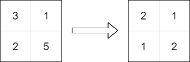

## Description

You are given an `m x n` integer matrix `grid` containing **distinct** positive integers.

You have to replace each integer in the matrix with a positive integer satisfying the following conditions:

- The **relative** order of every two elements that are in the same row or column should stay the **same** after the replacements.

- The **maximum** number in the matrix after the replacements should be as **small** as possible.

The relative order stays the same if for all pairs of elements in the original matrix such that $grid[r_{1}][c_{1}] > grid[r_{2}][c_{2}]$ where either $r_{1} = r_{2}$ or $c_{1} = c_{2}$, then it must be true that $grid[r_{1}][c_{1}] > grid[r_{2}][c_{2}]$ after the replacements.

For example, if `grid = [[2, 4, 5], [7, 3, 9]]` then a good replacement could be either `grid = [[1, 2, 3], [2, 1, 4]]` or `grid = [[1, 2, 3], [3, 1, 4]]`.

Return *the **resulting** matrix.* If there are multiple answers, return **any** of them.
### Function Contract

**Inputs**

- `grid`: An $m \times n$ matrix of distinct positive integers ($1 \le m, n \le 1000$, $1 \le m \times n \le 10^5$, $1 \le \text{grid}[i][j] \le 10^9$).

**Return value**

Return an $m \times n$ matrix of positive integers that preserves row-wise and column-wise relative order while minimizing the maximum value in the matrix.

### Examples
#### Example 1

- **Input:** `grid = [[3,1],[2,5]]`
- **Output:** `[[2,1],[1,2]]`
- **Explanation:** The above diagram shows a valid replacement.
The maximum number in the matrix is 2. It can be shown that no smaller value can be obtained.
#### Example 2

- **Input:** `grid = [[10]]`
- **Output:** `[[1]]`
- **Explanation:** We replace the only number in the matrix with 1.
### Constraints

- $m = \text{grid.length}$

- $n = \text{grid}[i].length$

- $1 \le m, n \le 1000$

- $1 \le m * n \le 10^{5}$

- $1 \le \text{grid}[i][j] \le 10^{9}$

- `grid` consists of distinct integers.