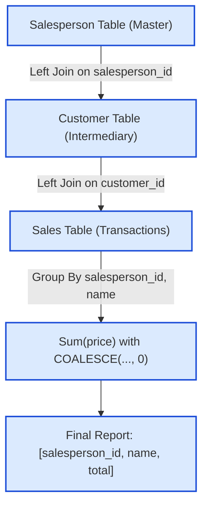

# Guided Example: Calculate the Influence of Each Salesperson

## 1. Problem Overview & Representative Instance

In an enterprise sales database, business interactions are partitioned across three normalized relations:
1. $\text{Salesperson}(\text{salesperson\_id}, \text{name})$: Master registry of all sales representatives.
2. $\text{Customer}(\text{customer\_id}, \text{salesperson\_id})$: Account assignments linking each client to an assigned salesperson.
3. $\text{Sales}(\text{sale\_id}, \text{customer\_id}, \text{price})$: Transaction logs capturing individual purchases completed by customers.

A salesperson's "influence" is defined as the total monetary value of all purchases made by every customer assigned to them. A crucial business invariant requires reporting every registered salesperson—even those who have zero assigned customers, or whose assigned customers have logged zero purchases. In such zero-transaction cases, the reported influence must explicitly evaluate to $0$ rather than $\text{NULL}$.

Consider the representative corporate instance:
- **Salesperson:**
  - $(1, \text{"Alice"})$
  - $(2, \text{"Bob"})$
  - $(3, \text{"Jerry"})$
- **Customer:**
  - $(1, 1)$ (Client $1 \to$ Alice)
  - $(2, 1)$ (Client $2 \to$ Alice)
  - $(3, 2)$ (Client $3 \to$ Bob)
- **Sales:**
  - $(1, 2, 892)$ (Client $2 \to 892$)
  - $(2, 1, 354)$ (Client $1 \to 354$)
  - $(3, 3, 988)$ (Client $3 \to 988$)
  - $(4, 3, 856)$ (Client $3 \to 856$)

Jerry has no assigned clients, Bob has one client who made two purchases, and Alice has two clients each with one purchase.

## 2. Mathematical & Algorithmic Principles

From the standpoint of relational algebra, computing total influence involves a multi-stage outer join and grouped aggregation:
1. **Preservation of the Primary Domain:**
   Because all salespeople must be represented in the final output regardless of sales activity, we perform left outer joins anchored at the master table $\text{Salesperson}$:
   $$\mathcal{T} = \text{Salesperson} \ \leftthreetimes_{\text{salesperson\_id}} \ \text{Customer} \ \leftthreetimes_{\text{customer\_id}} \ \text{Sales}$$
   Using an inner join ($\bowtie$) would drop Jerry (who has no customer links) and any salesperson whose customers have never completed a transaction.
2. **Three-Valued Logic and Null Coalescing:**
   When a salesperson has no associated transactions, the outer joins produce rows where $\text{price}$ is $\text{NULL}$. In standard SQL:
   $$\text{SUM}(\text{NULL}) = \text{NULL}$$
   To satisfy the non-null requirement, we wrap the aggregation in a null-coalescing projection:
   $$\text{total} = \text{COALESCE}\bigl(\text{SUM}(\text{price}),\, 0\bigr)$$
   This maps $\text{NULL} \to 0$ while leaving positive totals intact.
3. **Partitioning and Aggregation Key:**
   Grouping is performed over $(\text{salesperson\_id}, \text{name})$. Because $\text{salesperson\_id}$ is the primary key of $\text{Salesperson}$, grouping by this identifier creates exactly one output row per salesperson.

## 3. Step-by-Step Walkthrough with Intermediate State

We trace the multi-table join and aggregation on our representative dataset.

- **Phase 1: First Left Join ($\text{Salesperson} \leftthreetimes \text{Customer}$):**
  - Alice ($\text{id} = 1$): Matches customer $1$ and customer $2$. Produces two intermediate tuples:
    - $(1, \text{"Alice"}, 1)$
    - $(1, \text{"Alice"}, 2)$
  - Bob ($\text{id} = 2$): Matches customer $3$. Produces one intermediate tuple:
    - $(2, \text{"Bob"}, 3)$
  - Jerry ($\text{id} = 3$): No matching customer record. Produces one row with a null customer:
    - $(3, \text{"Jerry"}, \text{NULL})$

- **Phase 2: Second Left Join ($\dots \leftthreetimes \text{Sales}$):**
  - Tuple $(1, \text{"Alice"}, 1)$: Matches sale $2$ ($\text{price} = 354$).
  - Tuple $(1, \text{"Alice"}, 2)$: Matches sale $1$ ($\text{price} = 892$).
  - Tuple $(2, \text{"Bob"}, 3)$: Matches sale $3$ ($\text{price} = 988$) and sale $4$ ($\text{price} = 856$).
  - Tuple $(3, \text{"Jerry"}, \text{NULL})$: No matching sale. Produces row with $\text{sale\_id} = \text{NULL}$ and $\text{price} = \text{NULL}$.

- **Phase 3: Grouped Aggregation & Null Handling:**
  - **Group Alice ($\text{id} = 1$):**
    - Active prices: $\{354, 892\}$.
    - $\text{SUM}(\text{price}) = 354 + 892 = 1246$.
    - $\text{COALESCE}(1246, 0) = 1246$.
  - **Group Bob ($\text{id} = 2$):**
    - Active prices: $\{988, 856\}$.
    - $\text{SUM}(\text{price}) = 988 + 856 = 1844$.
    - $\text{COALESCE}(1844, 0) = 1844$.
  - **Group Jerry ($\text{id} = 3$):**
    - Active prices: $\{\text{NULL}\}$.
    - $\text{SUM}(\text{NULL}) = \text{NULL}$.
    - $\text{COALESCE}(\text{NULL}, 0) = 0$.

All salespeople are accounted for with valid numeric values.

## 4. Comprehensive State Trace

The full intermediate result of the joined relational stream prior to grouping is shown below:

| Salesperson ID | Name | Customer ID | Sale ID | Sale Price | Grouping Bucket |
|---|---|---|---|---|---|
| 1 | Alice | 1 | 2 | 354 | Group Alice |
| 1 | Alice | 2 | 1 | 892 | Group Alice |
| 2 | Bob | 3 | 3 | 988 | Group Bob |
| 2 | Bob | 3 | 4 | 856 | Group Bob |
| 3 | Jerry | NULL | NULL | NULL | Group Jerry |

The final aggregation and projection results are summarized in the table below:

| Salesperson ID | Name | Customer Count | Raw Sum Calculation | Coalesced Total |
|---|---|---|---|---|
| 1 | Alice | 2 | $354 + 892 = 1246$ | 1246 |
| 2 | Bob | 1 | $988 + 856 = 1844$ | 1844 |
| 3 | Jerry | 0 | $\text{SUM}(\text{NULL}) = \text{NULL}$ | 0 |

The final report contains the three rows: $(1, \text{"Alice"}, 1246)$, $(2, \text{"Bob"}, 1844)$, and $(3, \text{"Jerry"}, 0)$.

## 5. Algorithmic Correctness & Soundness

The correctness of this relational query relies on mathematical and logical properties:
1. **Domain Completeness via Outer Join:**
   Let $S$ be the set of all salespeople. A sequence of left outer joins starting from $\text{Salesperson}$ guarantees that the projection of the result onto $\text{salesperson\_id}$ satisfies $\pi_{\text{salesperson\_id}}(\mathcal{T}) = S$. No salesperson is ever eliminated.
2. **Cardinality Conservation:**
   Every individual sale belongs to exactly one customer, and every customer belongs to at most one salesperson. Therefore, no sale is duplicated across multiple salespeople.
3. **Partition Independence:**
   Because each customer is assigned to a unique salesperson, the transactions of distinct salespeople are disjoint sets of rows in the join result. Summing over each group independently yields the exact total sales generated by that salesperson.
4. **Identity Element Replacement:**
   $\text{COALESCE}(x, 0)$ behaves as the identity function for any non-null numerical value $x$, and maps $\text{NULL}$ directly to the additive identity $0$, preserving algebraic consistency.

## 6. Edge Cases & Anti-Patterns

- **Salesperson with Zero Customers:** Salesperson exists in $\text{Salesperson}$ but has no entries in $\text{Customer}$ (e.g. Jerry). Both left joins produce nulls, and $\text{COALESCE}$ converts the null sum to $0$.
- **Customer with Zero Purchases:** A salesperson is assigned a customer, but that customer has never made a purchase in $\text{Sales}$. The second left join produces nulls for that customer's sales, correctly contributing $0$ to the salesperson's sum.
- **Multiple Sales per Customer:** A single customer makes multiple purchases. The join correctly produces multiple rows for that customer, summing all their purchase values into the salesperson's total.
- **Anti-Pattern: Inner Join Trap:** Using `INNER JOIN` discards any salesperson without customers or transactions. This produces incomplete tables missing salespeople whose influence is $0$.
- **Anti-Pattern: Omitting COALESCE:** Querying `SUM(price)` without `COALESCE` or `IFNULL` returns $\text{NULL}$ for zero-sales reps, violating the problem specification.

## 7. Complexity Analysis

- **Time Complexity:**
  - Let $|S|$ be the row count of $\text{Salesperson}$, $|C|$ be the count of $\text{Customer}$, and $|R|$ be the count of $\text{Sales}$.
  - Joining $\text{Salesperson}$ with $\text{Customer}$ via foreign key index takes $\mathcal{O}(|S| + |C|)$ time.
  - Joining the resulting stream with $\text{Sales}$ via customer index takes $\mathcal{O}(|C| + |R|)$ time.
  - Hash grouping by $\text{salesperson\_id}$ accumulates sums in $\mathcal{O}(|S| + |R|)$ time.
  - Overall time complexity is linear in total database records: $\mathcal{O}(|S| + |C| + |R|)$.
- **Space Complexity:**
  - The query execution engine stores intermediate join states and an aggregation hash map of size bounded by the number of unique salespeople $|S|$.
  - Therefore, auxiliary working space complexity is $\mathcal{O}(|S| + |R|)$.
