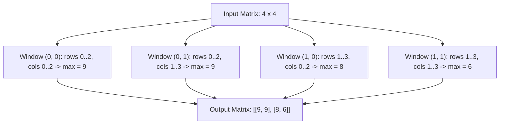

# Guided Example: Largest Local Values in a Matrix

## 1. Problem Overview & Representative Instance

Given an $n \times n$ integer matrix $\text{grid}$, we want to construct an $(n - 2) \times (n - 2)$ integer matrix $\text{maxLocal}$. For each cell $(i, j)$ in the output matrix, the value $\text{maxLocal}[i][j]$ must be the maximum value among all nine elements situated within the contiguous $3 \times 3$ submatrix of $\text{grid}$ whose top-left corner is at row $i$ and column $j$:
$$\text{maxLocal}[i][j] = \max_{\substack{i \le r \le i + 2 \\ j \le c \le j + 2}} \text{grid}[r][c]$$

This operation is equivalent to a 2D max-pooling operation with kernel size $3 \times 3$, stride $1$, and valid padding (no zero-padding).

Consider the representative $4 \times 4$ grid:
$$\text{grid} = \begin{bmatrix} 9 & 9 & 8 & 1 \\ 5 & 6 & 2 & 6 \\ 8 & 2 & 6 & 4 \\ 6 & 2 & 2 & 2 \end{bmatrix}$$

Because $n = 4$, the output dimensions are $(4 - 2) \times (4 - 2) = 2 \times 2$. Exactly four contiguous $3 \times 3$ windows exist within this input, each overlapping with adjacent windows.

## 2. Mathematical & Algorithmic Principles

The transformation maps a discrete 2D spatial domain $\mathbb{Z}^{n \times n}$ to $\mathbb{Z}^{(n-2) \times (n-2)}$ via a local supremum filter:
1. **Coordinate Boundaries:**
   For any output coordinate $(i, j)$ where $0 \le i, j \le n - 3$, the input window spans row indices $\{i, i + 1, i + 2\}$ and column indices $\{j, j + 1, j + 2\}$. Since $i \le n - 3$, the maximum row index evaluated is $(n - 3) + 2 = n - 1 < n$, ensuring zero out-of-bounds array accesses.
2. **Fixed Kernel Footprint:**
   Each output position depends on a fixed constant number of cells:
   $$|\mathcal{W}(i, j)| = 3 \times 3 = 9 \text{ cells}$$
3. **Local Supremum:**
   The output value is calculated by scanning the nine constituent entries and tracking the running maximum. Because each entry is bounded by $1 \le \text{grid}[r][c] \le 100$, initializing a local accumulator to $0$ guarantees correct tracking.
4. **Independent Window Evaluation:**
   Because each output entry $\text{maxLocal}[i][j]$ is a deterministic function of a static input window, window evaluations can be executed independently in row-major order.

## 3. Step-by-Step Walkthrough with Intermediate State

We execute the sliding window pooling over the $4 \times 4$ grid:
$$\text{grid} = \begin{bmatrix} 9 & 9 & 8 & 1 \\ 5 & 6 & 2 & 6 \\ 8 & 2 & 6 & 4 \\ 6 & 2 & 2 & 2 \end{bmatrix}$$

- **Initialization:**
  Create output matrix $\text{maxLocal}$ of size $2 \times 2$.

- **Window $(0, 0)$ — Top-Left Kernel:**
  - Row range: $[0, 2]$, Column range: $[0, 2]$.
  - Constituent elements:
    $$\begin{bmatrix} 9 & 9 & 8 \\ 5 & 6 & 2 \\ 8 & 2 & 6 \end{bmatrix}$$
  - Candidate values: $\{9, 9, 8, 5, 6, 2, 8, 2, 6\}$.
  - Running maximum: $\max = 9$.
  - Record: $\text{maxLocal}[0][0] = 9$.

- **Window $(0, 1)$ — Top-Right Kernel:**
  - Row range: $[0, 2]$, Column range: $[1, 3]$.
  - Constituent elements:
    $$\begin{bmatrix} 9 & 8 & 1 \\ 6 & 2 & 6 \\ 2 & 6 & 4 \end{bmatrix}$$
  - Candidate values: $\{9, 8, 1, 6, 2, 6, 2, 6, 4\}$.
  - Running maximum: $\max = 9$.
  - Record: $\text{maxLocal}[0][1] = 9$.

- **Window $(1, 0)$ — Bottom-Left Kernel:**
  - Row range: $[1, 3]$, Column range: $[0, 2]$.
  - Constituent elements:
    $$\begin{bmatrix} 5 & 6 & 2 \\ 8 & 2 & 6 \\ 6 & 2 & 2 \end{bmatrix}$$
  - Candidate values: $\{5, 6, 2, 8, 2, 6, 6, 2, 2\}$.
  - Running maximum: $\max = 8$ (found at $(2, 0)$).
  - Record: $\text{maxLocal}[1][0] = 8$.

- **Window $(1, 1)$ — Bottom-Right Kernel:**
  - Row range: $[1, 3]$, Column range: $[1, 3]$.
  - Constituent elements:
    $$\begin{bmatrix} 6 & 2 & 6 \\ 2 & 6 & 4 \\ 2 & 2 & 2 \end{bmatrix}$$
  - Candidate values: $\{6, 2, 6, 2, 6, 4, 2, 2, 2\}$.
  - Running maximum: $\max = 6$.
  - Record: $\text{maxLocal}[1][1] = 6$.

- **Termination:**
  All four cells populated. Resulting matrix:
  $$\text{maxLocal} = \begin{bmatrix} 9 & 9 \\ 8 & 6 \end{bmatrix}$$

## 4. Comprehensive State Trace

The evaluation of each output window is detailed in the execution log below:

| Output Pos $(i, j)$ | Row Span | Column Span | Elements in $3 \times 3$ Window | Intermediate Running Max Evolution | Emitted Value |
|---|---|---|---|---|---|
| $(0, 0)$ | $[0, 2]$ | $[0, 2]$ | $[9, 9, 8, 5, 6, 2, 8, 2, 6]$ | $9 \to 9 \to 9 \to 9 \dots$ | 9 |
| $(0, 1)$ | $[0, 2]$ | $[1, 3]$ | $[9, 8, 1, 6, 2, 6, 2, 6, 4]$ | $9 \to 9 \to 9 \to 9 \dots$ | 9 |
| $(1, 0)$ | $[1, 3]$ | $[0, 2]$ | $[5, 6, 2, 8, 2, 6, 6, 2, 2]$ | $5 \to 6 \to 6 \to 8 \to 8 \dots$ | 8 |
| $(1, 1)$ | $[1, 3]$ | $[1, 3]$ | $[6, 2, 6, 2, 6, 4, 2, 2, 2]$ | $6 \to 6 \to 6 \to 6 \dots$ | 6 |

We also tabulate the spatial overlap across windows showing which input cells participate in multiple output entries:

| Input Coordinate | Original Value | Participating Windows | Output Values Affected |
|---|---|---|---|
| $(1, 1)$ | 6 | All four: $(0, 0), (0, 1), (1, 0), (1, 1)$ | $[9, 9, 8, 6]$ |
| $(1, 2)$ | 2 | All four: $(0, 0), (0, 1), (1, 0), (1, 1)$ | $[9, 9, 8, 6]$ |
| $(2, 1)$ | 2 | All four: $(0, 0), (0, 1), (1, 0), (1, 1)$ | $[9, 9, 8, 6]$ |
| $(2, 2)$ | 6 | All four: $(0, 0), (0, 1), (1, 0), (1, 1)$ | $[9, 9, 8, 6]$ |

The core intersection cells $(1, 1), (1, 2), (2, 1), (2, 2)$ are evaluated across all four windows.

## 5. Algorithmic Correctness & Soundness

The correctness of direct sliding window max pooling follows from:
1. **Bijection of Submatrices:** Every contiguous $3 \times 3$ submatrix has a unique top-left corner $(i, j)$ satisfying $0 \le i \le n - 3$ and $0 \le j \le n - 3$. The total count of such corners is $(n - 2) \times (n - 2)$, matching the exact dimensions of the output matrix.
2. **Completeness of Neighborhood Search:** For each pair $(i, j)$, iterating $r \in [i, i + 2]$ and $c \in [j, j + 2]$ examines all $3 \times 3 = 9$ indices comprising that submatrix.
3. **Soundness of Maximum Accumulation:** The supremum over a finite set $S = \{x_1, \dots, x_9\}$ is calculated deterministically via pairwise maximum operations $\max(a, b)$, guaranteeing the true maximal value is emitted.

## 6. Edge Cases & Anti-Patterns

- **Minimal Input Size ($n = 3$):** An input grid of dimension $3 \times 3$ has $(3 - 2) \times (3 - 2) = 1 \times 1$ output. The algorithm inspects all 9 entries and outputs a single scalar matrix $[[\max]]$.
- **Uniform Matrix:** If every element in the grid is identical (e.g. all 1s), every $3 \times 3$ window maximum is 1.
- **Isolated Global Maximum:** If a single peak (e.g. 100) sits at coordinate $(2, 2)$, it will be included in every window that contains row 2 and column 2, broadcasting that value to up to 9 distinct output cells.
- **Anti-Pattern: Index Offset Errors:** Using loop bounds up to $n - 1$ instead of $n - 3$ for the top-left corner causes array index out-of-bounds exceptions when accessing $i + 2$ or $j + 2$.

## 7. Complexity Analysis

- **Time Complexity:**
  - The output matrix contains $(n - 2)^2$ cells.
  - For each output cell, exactly $3 \times 3 = 9$ input values are examined.
  - The total number of operations is $9(n - 2)^2 = \mathcal{O}(n^2)$.
  - Given $n \le 100$, the maximum operations performed is $9 \times 98^2 \approx 86{,}436$, executing virtually instantaneously.
- **Space Complexity:**
  - The algorithm only requires memory to store the output matrix of size $(n - 2) \times (n - 2) = \mathcal{O}(n^2)$ integers.
  - The auxiliary space beyond the output buffer is $\mathcal{O}(1)$.
