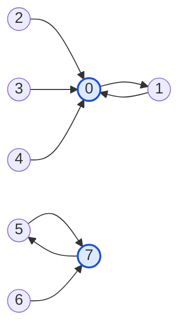

# Guided Example: Node With Highest Edge Score

## 1. Problem Overview & Representative Instance

In a directed graph consisting of $n$ vertices labeled $0$ through $n - 1$, every node has out-degree exactly $1$. The directed topology is defined by an array $\text{edges}$, where a directed arc extends from node $i$ to node $\text{edges}[i]$. The "edge score" of any target vertex $v$ is defined as the sum of the numerical identifiers of all source vertices that point directly to $v$:
$$\text{score}(v) = \sum_{u \mid \text{edges}[u] = v} u$$

If no incoming edges terminate at vertex $v$, its score is defined as $0$. The objective is to identify the vertex that achieves the maximum edge score. If multiple vertices tie with the identical maximum score, the smallest vertex index among them must be returned.

Consider the representative graph:
$$\text{edges} = [1, 0, 0, 0, 0, 7, 7, 5], \quad n = 8$$

Each index represents a source node. Nodes $1, 2, 3, 4$ all target node $0$, while nodes $5, 6$ target node $7$. We evaluate which target node accumulates the greatest collective source weight.

## 2. Mathematical & Algorithmic Principles

Every node $u \in \{0, 1, \dots, n - 1\}$ participates in exactly one outgoing edge $u \to \text{edges}[u]$. Therefore, each source identifier $u$ contributes its full numerical label to exactly one target accumulator.

Key algorithmic invariants:
1. **Single-Pass Accumulation:**
   Allocate an accumulator array $\text{score}$ of size $n$, initialized to all zeros. For each index $u$ from $0$ to $n - 1$:
   $$\text{score}[\text{edges}[u]] \leftarrow \text{score}[\text{edges}[u]] + u$$
2. **64-bit Integer Precision:**
   Because $n \le 10^5$, if all nodes point to a single hub vertex $v$, the maximum accumulated score reaches:
   $$\sum_{u=0}^{n-1} u = \frac{(n - 1)n}{2} \approx \frac{10^5 \times 10^5}{2} \approx 5 \times 10^9$$
   This value strictly exceeds the maximum limit of a 32-bit signed integer ($2^{31} - 1 \approx 2.14 \times 10^9$). Accumulator entries must use 64-bit integer types to prevent arithmetic overflow.
3. **Deterministic Argmax Scanning:**
   Iterating $v$ from $0$ to $n - 1$, we maintain the optimal vertex $\text{best\_node}$ and its score $\text{max\_score}$. A candidate $v$ replaces $\text{best\_node}$ strictly when $\text{score}[v] > \text{max\_score}$. Because ties are not allowed to overwrite previous records, the strictly smaller index is automatically preserved.

## 3. Step-by-Step Walkthrough with Intermediate State

We trace the representative array $\text{edges} = [1, 0, 0, 0, 0, 7, 7, 5]$ with $n = 8$.

- **Initialization:**
  Allocate $\text{score} = [0, 0, 0, 0, 0, 0, 0, 0]$ with 64-bit integers.

- **Edge Evaluation:**
  - **Index 0 ($0 \to 1$):**
    Contribution: $0$. $\text{score}[1] \leftarrow 0 + 0 = 0$.
  - **Index 1 ($1 \to 0$):**
    Contribution: $1$. $\text{score}[0] \leftarrow 0 + 1 = 1$.
  - **Index 2 ($2 \to 0$):**
    Contribution: $2$. $\text{score}[0] \leftarrow 1 + 2 = 3$.
  - **Index 3 ($3 \to 0$):**
    Contribution: $3$. $\text{score}[0] \leftarrow 3 + 3 = 6$.
  - **Index 4 ($4 \to 0$):**
    Contribution: $4$. $\text{score}[0] \leftarrow 6 + 4 = 10$.
  - **Index 5 ($5 \to 7$):**
    Contribution: $5$. $\text{score}[7] \leftarrow 0 + 5 = 5$.
  - **Index 6 ($6 \to 7$):**
    Contribution: $6$. $\text{score}[7] \leftarrow 5 + 6 = 11$.
  - **Index 7 ($7 \to 5$):**
    Contribution: $7$. $\text{score}[5] \leftarrow 0 + 7 = 7$.

- **Final Score Table:**
  $\text{score} = [10, 0, 0, 0, 0, 7, 0, 11]$.

- **Argmax Selection:**
  - Node 0: score $10 > 0 \implies \text{best\_node} = 0, \text{max\_score} = 10$.
  - Node 1 to 4: score $0 \le 10 \implies$ no change.
  - Node 5: score $7 \le 10 \implies$ no change.
  - Node 6: score $0 \le 10 \implies$ no change.
  - Node 7: score $11 > 10 \implies \text{best\_node} = 7, \text{max\_score} = 11$.

- **Output:**
  The optimal target node is $7$.

## 4. Comprehensive State Trace

The contribution of each directed edge to the running score ledger is tabulated below:

| Source Node $u$ | Target Node $\text{edges}[u]$ | Added Label Weight | Destination Score Before | Destination Score After |
|---|---|---|---|---|
| 0 | 1 | 0 | 0 | 0 |
| 1 | 0 | 1 | 0 | 1 |
| 2 | 0 | 2 | 1 | 3 |
| 3 | 0 | 3 | 3 | 6 |
| 4 | 0 | 4 | 6 | 10 |
| 5 | 7 | 5 | 0 | 5 |
| 6 | 7 | 6 | 5 | 11 |
| 7 | 5 | 7 | 0 | 7 |

The final score profile across all 8 vertices and the resulting selection priority are detailed below:

| Vertex Label $v$ | In-Degree Count | Source Predecessors Set | Sum of Predecessors ($\text{score}[v]$) | Comparison with Current Max |
|---|---|---|---|---|
| 0 | 4 | $\{1, 2, 3, 4\}$ | $1 + 2 + 3 + 4 = 10$ | New Leader: 10 |
| 1 | 1 | $\{0\}$ | $0$ | $0 < 10$ |
| 2 | 0 | $\emptyset$ | $0$ | $0 < 10$ |
| 3 | 0 | $\emptyset$ | $0$ | $0 < 10$ |
| 4 | 0 | $\emptyset$ | $0$ | $0 < 10$ |
| 5 | 1 | $\{7\}$ | $7$ | $7 < 10$ |
| 6 | 0 | $\emptyset$ | $0$ | $0 < 10$ |
| 7 | 2 | $\{5, 6\}$ | $5 + 6 = 11$ | New Leader: 11 |

Node 7 achieves the highest edge score of 11.

## 5. Algorithmic Correctness & Soundness

The correctness of this algorithm rests on structural properties of directed functional mappings:
1. **Partition of Mass:** Because each node $u$ has exactly one outgoing edge, the mapping $u \mapsto \text{edges}[u]$ defines a partition of the total sum of indices $\sum_{u=0}^{n-1} u$ across the target nodes. No source label is omitted, and no source label is counted more than once.
2. **Exhaustive Score Calculation:** After processing all $n$ indices, $\text{score}[v]$ is guaranteed to equal the exact sum $\sum_{u \mid \text{edges}[u] = v} u$.
3. **Tie-Breaking Soundness:** By scanning candidate indices $v$ in strictly ascending order ($0, 1, \dots, n - 1$) and updating the optimal choice only when $\text{score}[v] > \text{max\_score}$ (strict inequality), ties preserve the earlier, smaller index.

## 6. Edge Cases & Anti-Patterns

- **Tie Between Equal Maximal Scores:** If $\text{edges} = [2, 0, 0, 2]$, Node 0 receives $\{1, 2\} \implies 3$, and Node 2 receives $\{0, 3\} \implies 3$. Node 0 is examined first and sets the record $3$. When Node 2 is examined, its score is equal to $3$, but not strictly greater. The algorithm correctly retains index $0$.
- **Nodes with Zero In-Degree:** Vertices with no incoming edges have score $0$. If all nodes have score $0$, index $0$ is returned.
- **Star Graph (All-to-One):** All $n - 1$ nodes point to node $0$. Node $0$ score equals $\sum_{i=1}^{n-1} i \approx 5 \times 10^9$. 64-bit integer variables prevent arithmetic overflow.
- **Anti-Pattern: Counting In-Degree:** Confusing in-degree (count of incoming edges) with edge score (sum of source identifiers). In our example, node 0 has in-degree 4 and score 10, whereas node 7 has in-degree 2 and score 11. Edge score is determined by source node values, not sheer edge count.

## 7. Complexity Analysis

- **Time Complexity:**
  - Allocating the score array of size $n$ takes $\mathcal{O}(n)$ time.
  - Iterating through $\text{edges}$ of length $n$ performs constant-time addition per element: $\mathcal{O}(n)$ time.
  - The linear argmax scan examines each of the $n$ score entries once: $\mathcal{O}(n)$ time.
  - Overall time complexity is strictly $\mathcal{O}(n)$.
- **Space Complexity:**
  - The auxiliary accumulator array $\text{score}$ stores $n$ 64-bit integers: $\mathcal{O}(n)$ space.
  - Scalar variables for tracking maximum scores take $\mathcal{O}(1)$ space.
  - Total auxiliary space complexity is $\mathcal{O}(n)$.
