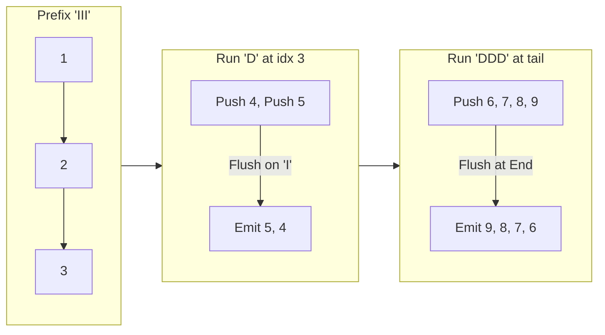

# Guided Example: Construct Smallest Number From DI String

## 1. Problem Overview & Representative Instance

Given a pattern string $\text{pattern}$ of length $n$ containing only the characters `'I'` (representing an increasing relation) and `'D'` (representing a decreasing relation), we must construct a digit string $\text{num}$ of length $n + 1$. The string must adhere to the following rules:
1. Every character in $\text{num}$ must be a decimal digit chosen from `'1'` through `'9'`.
2. All digits in $\text{num}$ must be pairwise distinct (no digit may appear more than once).
3. For each index $i \in [0, n - 1]$:
   - If $\text{pattern}[i] = \text{'I'}$, then $\text{num}[i] < \text{num}[i + 1]$.
   - If $\text{pattern}[i] = \text{'D'}$, then $\text{num}[i] > \text{num}[i + 1]$.

Among all valid candidate strings, we seek the lexicographically smallest possible string.

Consider the representative pattern:
$$\text{pattern} = \text{"IIIDIDDD"}, \quad n = 8$$

Since $n = 8$, the output requires $n + 1 = 9$ distinct digits. To ensure lexicographical minimality, the digits used must be the smallest available digits: $\{1, 2, 3, 4, 5, 6, 7, 8, 9\}$. Consecutive `'D'` sequences force descending runs, while `'I'` marks points where values can reset to smaller unassigned integers.

## 2. Mathematical & Algorithmic Principles

To make a number lexicographically as small as possible, we must make each digit as small as possible from left to right:
1. **Minimal Digit Alphabet:**
   Because distinct digits are required, any length-$(n + 1)$ string must use at least $n + 1$ unique digits. The set of smallest possible digits is $\{1, 2, \dots, n + 1\}$.
2. **Decreasing Segments as Reversed Increasing Sequences:**
   A sequence of $k$ consecutive `'D'` characters corresponds to a contiguous subsegment of $k + 1$ strictly decreasing digits:
   $$v_0 > v_1 > \dots > v_k$$
   To minimize the prefix while satisfying this local descent, the set of $k + 1$ smallest remaining available integers must be assigned to these positions in strictly reversed order.
3. **LIFO Stack Mechanism:**
   We process indices $i$ from $0$ to $n$:
   - At each step $i$, push the candidate digit $i + 1$ onto a stack.
   - If $i = n$ (end of string) or $\text{pattern}[i] = \text{'I'}$:
     The increasing condition or termination allows us to close the pending descending block. We pop all elements from the stack and append them to the result.
   - Because a stack operates on a Last-In, First-Out (LIFO) basis, pushing ascending numbers $a, a+1, \dots, a+k$ and subsequently emptying the stack emits them in descending order $a+k, \dots, a+1, a$.

This greedy stack traversal constructs the globally minimal valid permutation in a single linear sweep.

## 3. Step-by-Step Walkthrough with Intermediate State

We trace the algorithm on $\text{pattern} = \text{"IIIDIDDD"}$ ($n = 8$). The digit budget spans $1$ through $9$.

- **Step 0 ($i = 0$, push digit 1):**
  - Push $1$ onto stack: $\text{stack} = [1]$.
  - $\text{pattern}[0] = \text{'I'}$: Flush stack.
  - Pop $1$. Append to output.
  - State: $\text{output} = \text{"1"}$, $\text{stack} = []$.

- **Step 1 ($i = 1$, push digit 2):**
  - Push $2$ onto stack: $\text{stack} = [2]$.
  - $\text{pattern}[1] = \text{'I'}$: Flush stack.
  - Pop $2$. Append to output.
  - State: $\text{output} = \text{"12"}$, $\text{stack} = []$.

- **Step 2 ($i = 2$, push digit 3):**
  - Push $3$ onto stack: $\text{stack} = [3]$.
  - $\text{pattern}[2] = \text{'I'}$: Flush stack.
  - Pop $3$. Append to output.
  - State: $\text{output} = \text{"123"}$, $\text{stack} = []$.

- **Step 3 ($i = 3$, push digit 4):**
  - Push $4$ onto stack: $\text{stack} = [4]$.
  - $\text{pattern}[3] = \text{'D'}$: Do not flush; hold in buffer.
  - State: $\text{output} = \text{"123"}$, $\text{stack} = [4]$.

- **Step 4 ($i = 4$, push digit 5):**
  - Push $5$ onto stack: $\text{stack} = [4, 5]$.
  - $\text{pattern}[4] = \text{'I'}$: Flush stack.
  - Pop $5$, then pop $4$.
  - State: $\text{output} = \text{"12354"}$, $\text{stack} = []$.
  - Notice $5 > 4$, satisfying `'D'` at index 3, while $3 < 5$ satisfies `'I'` at index 2!

- **Step 5 ($i = 5$, push digit 6):**
  - Push $6$ onto stack: $\text{stack} = [6]$.
  - $\text{pattern}[5] = \text{'D'}$: Hold.
  - State: $\text{output} = \text{"12354"}$, $\text{stack} = [6]$.

- **Step 6 ($i = 6$, push digit 7):**
  - Push $7$ onto stack: $\text{stack} = [6, 7]$.
  - $\text{pattern}[6] = \text{'D'}$: Hold.
  - State: $\text{output} = \text{"12354"}$, $\text{stack} = [6, 7]$.

- **Step 7 ($i = 7$, push digit 8):**
  - Push $8$ onto stack: $\text{stack} = [6, 7, 8]$.
  - $\text{pattern}[7] = \text{'D'}$: Hold.
  - State: $\text{output} = \text{"12354"}$, $\text{stack} = [6, 7, 8]$.

- **Step 8 ($i = 8$, push digit 9):**
  - Push $9$ onto stack: $\text{stack} = [6, 7, 8, 9]$.
  - Condition $i = n = 8$ met: Final termination flush.
  - Pop $9$, then $8$, then $7$, then $6$.
  - State: $\text{output} = \text{"123549876"}$, $\text{stack} = []$.

- **Final Output:**
  $$\text{"123549876"}$$

## 4. Comprehensive State Trace

The complete stack transitions and output emission ledger are documented below:

| Step $i$ | Pushed Digit | Pattern Token | Action Triggered | Stack State Before Flush | Emitted Substring | Accumulated Result |
|---|---|---|---|---|---|---|
| 0 | 1 | 'I' | Flush on 'I' | $[1]$ | `"1"` | `"1"` |
| 1 | 2 | 'I' | Flush on 'I' | $[2]$ | `"2"` | `"12"` |
| 2 | 3 | 'I' | Flush on 'I' | $[3]$ | `"3"` | `"123"` |
| 3 | 4 | 'D' | Buffer descent | $[4]$ | None | `"123"` |
| 4 | 5 | 'I' | Flush on 'I' | $[4, 5]$ | `"54"` | `"12354"` |
| 5 | 6 | 'D' | Buffer descent | $[6]$ | None | `"12354"` |
| 6 | 7 | 'D' | Buffer descent | $[6, 7]$ | None | `"12354"` |
| 7 | 8 | 'D' | Buffer descent | $[6, 7, 8]$ | None | `"12354"` |
| 8 | 9 | Terminal ($i=n$) | Flush on End | $[6, 7, 8, 9]$ | `"9876"` | `"123549876"` |

We verify each adjacent relationship in the generated sequence against the input pattern:

| Index $i$ | Adjacent Pair $(\text{num}[i], \text{num}[i+1])$ | Numerical Comparison | Expected Pattern | Verification Status |
|---|---|---|---|---|
| 0 | $(1, 2)$ | $1 < 2$ | 'I' | Valid |
| 1 | $(2, 3)$ | $2 < 3$ | 'I' | Valid |
| 2 | $(3, 5)$ | $3 < 5$ | 'I' | Valid |
| 3 | $(5, 4)$ | $5 > 4$ | 'D' | Valid |
| 4 | $(4, 9)$ | $4 < 9$ | 'I' | Valid |
| 5 | $(9, 8)$ | $9 > 8$ | 'D' | Valid |
| 6 | $(8, 7)$ | $8 > 7$ | 'D' | Valid |
| 7 | $(7, 6)$ | $7 > 6$ | 'D' | Valid |

All eight comparisons strictly match the pattern string.

## 5. Algorithmic Correctness & Soundness

The correctness of this greedy stack technique rests on structural properties of permutations:
1. **Exact Pattern Conformance:**
   - Within any buffered descending block, digits $d_1, d_2, \dots, d_m$ are popped in reverse order of entry, ensuring $d_m > d_{m-1} > \dots > d_1$, perfectly satisfying all consecutive `'D'` conditions.
   - At each transition between blocks, the last digit of the previous block was derived from an earlier, strictly smaller integer batch than the first digit emitted by the subsequent block. Thus, the boundary between blocks is unconditionally strictly increasing, satisfying `'I'`.
2. **Lexicographical Optimality:**
   A string is lexicographically minimized if its most significant digits are as small as possible. The earliest index that can be finalized is index $0$. If $\text{pattern}[0] = \text{'I'}$, the smallest legal digit is $1$, which the algorithm assigns immediately. If $\text{pattern}[0 \dots k-1] = \text{'D'}^k$, the first $k + 1$ positions must descend; the smallest possible subset of digits that can fill them is $\{1, \dots, k + 1\}$, and descending order requires placing $k + 1$ first. The algorithm precisely selects this assignment.
3. **No Unused or Duplicate Digits:**
   The algorithm pushes exactly the integers $1, 2, \dots, n + 1$ and pops each exactly once, guaranteeing all $n + 1$ digits are distinct.

## 6. Edge Cases & Anti-Patterns

- **All Increasing ($\text{"IIII"}$):** Every step triggers an immediate flush of size 1. The output is `"12345"`.
- **All Decreasing ($\text{"DDDD"}$):** All digits $1$ through $5$ accumulate on the stack until $i = 4$, then flush completely in reverse, yielding `"54321"`.
- **Alternating Pattern ($\text{"IDID"}$):** Digits are reversed in single-step pairs, correctly alternating local peaks and valleys.
- **Anti-Pattern: Exhaustive Permutation Backtracking:** Generating all permutations of digits and filtering for pattern matches requires $\mathcal{O}((n + 1)!)$ time. For $n \le 8$, $(9)! = 362{,}880$, which passes, but fails to generalize. The stack algorithm solves the problem in deterministic $\mathcal{O}(n)$ time.

## 7. Complexity Analysis

- **Time Complexity:**
  - The loop iterates $n + 1$ times.
  - Each integer from $1$ to $n + 1$ is pushed onto the stack exactly once and popped from the stack exactly once.
  - Each push and pop operation takes $\mathcal{O}(1)$ time.
  - Total time complexity is strictly $\mathcal{O}(n)$, which requires fewer than 20 operations for $n \le 8$.
- **Space Complexity:**
  - The auxiliary stack stores at most $n + 1$ characters at any point.
  - The output buffer stores $n + 1$ characters.
  - Total auxiliary space complexity is $\mathcal{O}(n)$.
