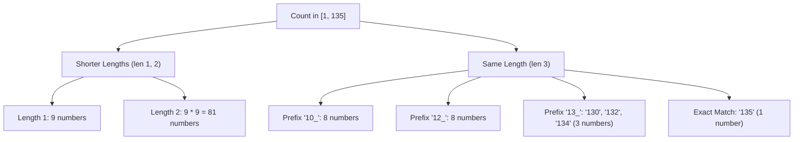

# Guided Example: Count Special Integers

## 1. Problem Overview & Representative Instance

A positive integer is classified as a "special integer" if all digits in its standard base-10 decimal representation are pairwise distinct. Any repeated digit anywhere in the number disqualifies it (for example, $22$, $101$, and $1335$ are non-special, whereas $23$, $104$, and $9876$ are special). Given an upper bound integer $n$, the task is to count how many special integers exist in the inclusive range $[1, n]$.

Consider the representative instance:
$$n = 135$$

The number $135$ has length $L = 3$. We seek all integers $x \in [1, 135]$ whose decimal digits contain zero repetitions. Because $n$ can be as large as $2 \cdot 10^9$, scanning every integer individually requires billions of operations and is computationally infeasible. Instead, we decompose the counting problem using combinatorial prefix enumeration.

## 2. Mathematical & Algorithmic Principles

Let $s$ be the decimal string representation of $n$, with length $L = |s|$.
The set of positive special integers $\le n$ can be partitioned into two disjoint subsets:
1. **Numbers with strictly fewer digits ($1 \le \text{length} < L$):**
   For any fixed length $k < L$:
   - The leading digit cannot be $0$, leaving $9$ non-zero choices ($\{1, 2, \dots, 9\}$).
   - The remaining $k - 1$ positions must be filled with distinct digits chosen from the remaining $9$ digits (including $0$).
   - The number of valid combinations for length $k$ is given by the falling factorial permutation formula:
     $$\text{Count}(k) = 9 \times P(9, k - 1) = 9 \times \frac{9!}{(10 - k)!}$$
2. **Numbers with exactly $L$ digits bounded by $n$:**
   We inspect digits of $n$ from left to right at indices $i = 0, 1, \dots, L - 1$, maintaining a set $\text{used}$ of digits already fixed in the matching prefix:
   - Let $d_i$ be the digit at position $i$ in $n$.
   - For every candidate digit $c$ such that $(\text{start} \le c < d_i)$, where $\text{start} = 1$ if $i = 0$ and $\text{start} = 0$ otherwise:
     - If $c \notin \text{used}$, fixing digit $c$ at position $i$ strictly guarantees that the resulting number will be smaller than $n$.
     - The remaining $L - 1 - i$ positions can be filled with any distinct unused digits chosen from the available pool of size $10 - (i + 1)$.
     - Number of ways:
       $$P\bigl(10 - (i + 1),\, L - 1 - i\bigr)$$
   - After testing all candidates $c < d_i$, we test whether $d_i$ itself is already in $\text{used}$:
     - If $d_i \in \text{used}$, the prefix of $n$ itself violates the distinct digit requirement. No valid special integer can share a prefix extending beyond index $i$, so we terminate the prefix exploration immediately.
     - If $d_i \notin \text{used}$, we insert $d_i$ into $\text{used}$ and proceed to index $i + 1$.
3. **Exact Upper Bound Inclusion:**
   If the loop finishes all $L$ positions without encountering a duplicate digit, $n$ itself is special, adding $1$ to the total count.

## 3. Step-by-Step Walkthrough with Intermediate State

We execute this prefix counting procedure for $n = 135$ ($L = 3$, digits $[1, 3, 5]$).

- **Part 1: Numbers with Fewer Digits ($k < 3$):**
  - **Length $k = 1$:**
    $9 \times P(9, 0) = 9 \times 1 = 9$ (integers $1$ through $9$).
  - **Length $k = 2$:**
    $9 \times P(9, 1) = 9 \times 9 = 81$ (two-digit numbers without repeated digits, e.g. excluding $11, 22, \dots$).
  - Total from shorter lengths: $9 + 81 = 90$.

- **Part 2: Three-Digit Numbers Bounded by $135$:**
  - Initialize $\text{used} = \emptyset$.

  - **Index $i = 0$ (Target Digit $d_0 = 1$):**
    - Allowed range for $c$: $\text{start} = 1 \le c < 1 \implies$ no candidate values.
    - Since $1 \notin \text{used}$, add $1$ to $\text{used} = \{1\}$.

  - **Index $i = 1$ (Target Digit $d_1 = 3$, Prefix $1$):**
    - Allowed range for $c$: $0 \le c < 3 \implies c \in \{0, 1, 2\}$.
    - Test $c = 0$: $0 \notin \{1\}$. Available pool: $10 - 2 = 8$ digits. Remaining slots: $3 - 1 - 1 = 1$.
      Ways: $P(8, 1) = 8$ (numbers $102, 103, \dots, 109$).
    - Test $c = 1$: $1 \in \{1\}$, invalid (digit duplicate).
    - Test $c = 2$: $2 \notin \{1\}$. Available pool: $8$ digits, remaining slots: $1$.
      Ways: $P(8, 1) = 8$ (numbers $120, 123, \dots, 129$).
    - Subtotal at index 1: $8 + 8 = 16$.
    - Since $3 \notin \text{used}$, add $3$ to $\text{used} = \{1, 3\}$.

  - **Index $i = 2$ (Target Digit $d_2 = 5$, Prefix $13$):**
    - Allowed range for $c$: $0 \le c < 5 \implies c \in \{0, 1, 2, 3, 4\}$.
    - Test $c = 0$: $0 \notin \{1, 3\}$. Remaining slots: $0$. Ways: $P(7, 0) = 1$ (number $130$).
    - Test $c = 1$: $1 \in \{1, 3\}$, invalid.
    - Test $c = 2$: $2 \notin \{1, 3\}$. Ways: $P(7, 0) = 1$ (number $132$).
    - Test $c = 3$: $3 \in \{1, 3\}$, invalid.
    - Test $c = 4$: $4 \notin \{1, 3\}$. Ways: $P(7, 0) = 1$ (number $134$).
    - Subtotal at index 2: $1 + 1 + 1 = 3$.
    - Since $5 \notin \text{used}$, add $5$ to $\text{used} = \{1, 3, 5\}$.

  - **Exact Match Check:**
    - Loop completes successfully across all $3$ digits.
    - Number $135$ has all distinct digits, so add $1$.

- **Grand Total Calculation:**
  $$\text{Total} = 90 + 16 + 3 + 1 = 110$$

## 4. Comprehensive State Trace

The detailed combinatorial contributions across each length category and prefix branch are tabulated below:

| Segment Evaluated | Fixed Prefix | Candidate Digit $c$ | Remaining Slots | Available Digit Pool | Formula Applied | Valid Count Emitted |
|---|---|---|---|---|---|---|
| Length 1 | `""` | $1 \dots 9$ | 0 | — | $9 \times P(9, 0)$ | 9 |
| Length 2 | `""` | $1 \dots 9$ for first digit | 1 | 9 | $9 \times P(9, 1)$ | 81 |
| Length 3 (pos 0) | `""` | None ($< 1$) | 2 | 9 | — | 0 |
| Length 3 (pos 1) | `"1"` | $c = 0$ | 1 | 8 | $P(8, 1)$ | 8 |
| Length 3 (pos 1) | `"1"` | $c = 1$ (duplicate) | 1 | — | Skipped | 0 |
| Length 3 (pos 1) | `"1"` | $c = 2$ | 1 | 8 | $P(8, 1)$ | 8 |
| Length 3 (pos 2) | `"13"` | $c = 0$ | 0 | 7 | $P(7, 0)$ | 1 |
| Length 3 (pos 2) | `"13"` | $c = 1$ (duplicate) | 0 | — | Skipped | 0 |
| Length 3 (pos 2) | `"13"` | $c = 2$ | 0 | 7 | $P(7, 0)$ | 1 |
| Length 3 (pos 2) | `"13"` | $c = 3$ (duplicate) | 0 | — | Skipped | 0 |
| Length 3 (pos 2) | `"13"` | $c = 4$ | 0 | 7 | $P(7, 0)$ | 1 |
| Exact Match | `"135"` | Fully Valid | 0 | — | Endpoint | 1 |

The cumulative counts grouped by structural tier are summarized in the profile below:

| Structural Tier | Coverage Scope | Cardinality Contribution | Cumulative Total |
|---|---|---|---|
| 1-Digit Numbers | $[1, 9]$ | 9 | 9 |
| 2-Digit Numbers | $[10, 99]$ | 81 | 90 |
| 3-Digit Numbers with prefix $< 13$ | $[100, 129]$ | 16 | 106 |
| 3-Digit Numbers with prefix $13$ and $< 135$ | $[130, 134]$ | 3 | 109 |
| Boundary Value | $\{135\}$ | 1 | 110 |

The exact number of special integers in $[1, 135]$ is confirmed to be 110.

## 5. Algorithmic Correctness & Soundness

The correctness of this digit combinatorics approach is guaranteed by the following properties:
1. **Disjoint Partitioning:** Any positive integer $x \le n$ has either strictly fewer decimal digits than $n$, or has the same number of digits. If it has the same number of digits, there exists a unique index $i$ where its prefix first differs from $n$ ($x[i] < n[i]$), or it matches $n$ identically. These cases are pairwise mutually exclusive and collectively exhaustive.
2. **Exact Permutation Factorization:** When $k$ distinct digits are already chosen and placed in specific prefix positions, exactly $10 - k$ unused digits remain. Choosing $r$ distinct digits to fill the remaining $r$ positions in any order corresponds to the permutation count $P(10 - k, r)$.
3. **No False Positives from Duplicates:** By explicitly verifying $c \notin \text{used}$ before adding $P(10 - (i + 1), L - 1 - i)$, every counted sequence contains exclusively distinct digits.
4. **Early Termination on Prefix Collision:** If $n$ contains a duplicate digit at index $i$ (for instance, $n = 1225$), no integer matching the prefix $122$ can ever be special. Terminating immediately ensures no invalid suffixes are explored.

## 6. Edge Cases & Anti-Patterns

- **Single Digit ($n \le 9$):** Length is 1. The shorter lengths loop is empty, and candidates $1 \dots n - 1$ plus exact match $n$ contribute exactly $n$.
- **Number with Duplicate Digits ($n = 20$):**
  - Length 1 contributes 9.
  - Length 2: at $i = 0$, $c = 1 \implies P(9, 1) = 9$.
  - At $i = 1$, $c < 0$ has no candidates. Digit 0 is added.
  - Number $20$ itself has distinct digits, adding 1.
  - Total: $9 + 9 + 1 = 19$ (all integers $\le 20$ except $11$).
- **Number with Interior Duplicates ($n = 114$):** When $i = 1$, the target digit is $1$. Because $1 \in \text{used}$, the loop breaks immediately. Exact match $114$ is rejected.
- **Anti-Pattern: Linear Enumeration Loop:** Iterating from $1$ to $n$ and testing each number with set operations requires $\mathcal{O}(n \log_{10} n)$ operations. For $n = 2 \cdot 10^9$, this causes extreme Time Limit Exceeded. The combinatorics solution finishes in fewer than 100 arithmetic operations.

## 7. Complexity Analysis

- **Time Complexity:**
  - Let $L = \lfloor \log_{10} n \rfloor + 1$ be the number of decimal digits in $n$. For $n \le 2 \cdot 10^9$, $L \le 10$.
  - Counting shorter lengths requires $L$ iterations, each computing a falling factorial in $\mathcal{O}(L)$ time.
  - Counting same-length prefixes performs at most $10$ iterations per digit position $i$.
  - The total number of iterations is bounded by $10 \times L \le 100$.
  - Overall time complexity is $\mathcal{O}(L^2) = \mathcal{O}(1)$ with respect to the input magnitude.
- **Space Complexity:**
  - The digit string $s$ and the boolean/bitmask set $\text{used}$ require memory bounded by $L \le 10$.
  - The auxiliary space complexity is $\mathcal{O}(L) = \mathcal{O}(1)$.
