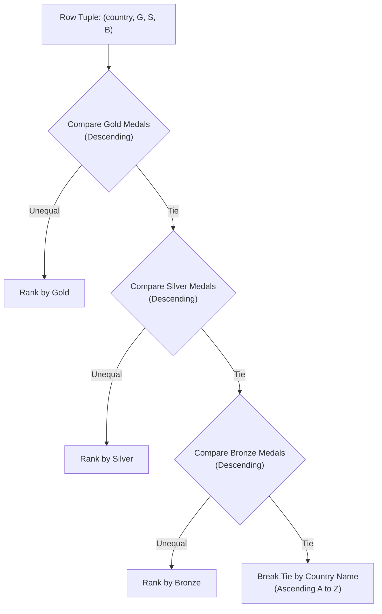

# Guided Example: Sort the Olympic Table

## 1. Problem Overview & Representative Instance

In international athletic competition accounting, countries are ranked using a hierarchical medal-count protocol. The database relation $\text{Olympic}(\text{country}, \text{gold\_medals}, \text{silver\_medals}, \text{bronze\_medals})$ maintains medal records where each country's name serves as the primary key.

The authoritative Olympic ranking protocol mandates the following priority criteria:
1. Primary criterion: $\text{gold\_medals}$ in descending order (highest gold count first).
2. Secondary criterion: When gold counts tie, $\text{silver\_medals}$ in descending order.
3. Tertiary criterion: When both gold and silver counts tie, $\text{bronze\_medals}$ in descending order.
4. Quaternary tie-breaker: If all three medal counts are identical, order by country name in ascending lexicographical order ($\text{A} \to \text{Z}$).

The task is to return the full relation with all rows and columns arranged in strict compliance with this multi-tier sorting protocol.

Consider the representative medal tally:
- $\text{China}$: $(10, 10, 20)$
- $\text{South Sudan}$: $(0, 0, 1)$
- $\text{USA}$: $(10, 10, 20)$
- $\text{Israel}$: $(2, 2, 3)$
- $\text{Egypt}$: $(2, 2, 2)$

Notice that China and the USA share identical medal tallies across all three tiers, triggering the alphabetical tie-breaker. Israel and Egypt tie on gold and silver, requiring bronze discrimination.

## 2. Mathematical & Algorithmic Principles

From the perspective of relational algebra and order theory, sorting over multiple attributes establishes a strict total order over the set of rows.

Define the comparison key for each row $r$ as a 4-tuple:
$$K(r) = \bigl(-\text{gold\_medals},\, -\text{silver\_medals},\, -\text{bronze\_medals},\, \text{country}\bigr)$$
where negation maps the descending numeric requirements into standard ascending lexicographical comparisons:
- For any two rows $r_1$ and $r_2$, row $r_1$ precedes $r_2$ if and only if $K(r_1) < K(r_2)$ under standard dictionary comparison.
- Because $\text{country}$ is a primary key, all country names are distinct. Consequently, for any distinct rows $r_1 \neq r_2$, the fourth component guarantees $K(r_1) \neq K(r_2)$.
- This eliminates all potential ties and defines a deterministic total order on the relation.

In relational database systems, this specification maps directly to the standard execution clause:
$$\text{ORDER BY gold\_medals DESC, silver\_medals DESC, bronze\_medals DESC, country ASC}$$

## 3. Step-by-Step Walkthrough with Intermediate State

We trace the sorting evaluation across the five representative countries.

- **Phase 1: Key Tuple Extraction:**
  Construct the sorting key vector $K(r) = (-\text{Gold}, -\text{Silver}, -\text{Bronze}, \text{Country})$ for each entity:
  - $\text{China}$: $(-10, -10, -20, \text{"China"})$
  - $\text{South Sudan}$: $(0, 0, -1, \text{"South Sudan"})$
  - $\text{USA}$: $(-10, -10, -20, \text{"USA"})$
  - $\text{Israel}$: $(-2, -2, -3, \text{"Israel"})$
  - $\text{Egypt}$: $(-2, -2, -2, \text{"Egypt"})$

- **Phase 2: Tier 1 (Gold Medals):**
  Group by gold count in descending order:
  - Gold = 10: $\{\text{China}, \text{USA}\}$
  - Gold = 2: $\{\text{Israel}, \text{Egypt}\}$
  - Gold = 0: $\{\text{South Sudan}\}$

- **Phase 3: Tier 2 & 3 (Silver & Bronze Resolution):**
  - Group Gold = 10:
    Both countries have Silver $= 10$ and Bronze $= 20$.
    All three medal values tie. Proceed to Tier 4.
  - Group Gold = 2:
    Both have Silver $= 2$.
    Examine Bronze:
    Israel has Bronze $= 3$, Egypt has Bronze $= 2$.
    Because $3 > 2$, Israel precedes Egypt. Rank 3: Israel, Rank 4: Egypt.
  - Group Gold = 0:
    South Sudan is the sole member. Rank 5: South Sudan.

- **Phase 4: Tier 4 (Lexicographical Country Tie-Breaker):**
  - For China vs. USA:
    Compare country strings lexicographically:
    $$\text{"China"} < \text{"USA"}$$
    Therefore, China takes Rank 1, and USA takes Rank 2.

- **Final Ranked Result:**
  1. $\text{China}$: $(10, 10, 20)$
  2. $\text{USA}$: $(10, 10, 20)$
  3. $\text{Israel}$: $(2, 2, 3)$
  4. $\text{Egypt}$: $(2, 2, 2)$
  5. $\text{South Sudan}$: $(0, 0, 1)$

## 4. Comprehensive State Trace

The full evaluation of the ordering vectors and tier resolutions is detailed in the table below:

| Country | Gold | Silver | Bronze | Primary Key Tuple $(-\text{G}, -\text{S}, -\text{B}, \text{Name})$ | Deciding Criterion | Assigned Rank |
|---|---|---|---|---|---|---|
| China | 10 | 10 | 20 | $(-10, -10, -20, \text{"China"})$ | Country Alphabetical ($\text{"China"} < \text{"USA"}$) | 1 |
| USA | 10 | 10 | 20 | $(-10, -10, -20, \text{"USA"})$ | Country Alphabetical | 2 |
| Israel | 2 | 2 | 3 | $(-2, -2, -3, \text{"Israel"})$ | Bronze Count ($3 > 2$) | 3 |
| Egypt | 2 | 2 | 2 | $(-2, -2, -2, \text{"Egypt"})$ | Bronze Count | 4 |
| South Sudan | 0 | 0 | 1 | $(0, 0, -1, \text{"South Sudan"})$ | Gold Count ($0 < 2$) | 5 |

We also detail the pairwise decision rationale for all adjacent entries in the final sorted order:

| Adjacent Pair $(r_i, r_{i+1})$ | Metric Comparison | Inequality Evaluated | Ordering Verdict |
|---|---|---|---|
| China vs. USA | Country Name | $\text{"China"} < \text{"USA"}$ | China strictly precedes USA |
| USA vs. Israel | Gold Medals | $10 > 2$ | USA strictly precedes Israel |
| Israel vs. Egypt | Bronze Medals | $3 > 2$ (Gold and Silver equal) | Israel strictly precedes Egypt |
| Egypt vs. South Sudan | Gold Medals | $2 > 0$ | Egypt strictly precedes South Sudan |

The sequence is strictly sorted and transitive across all five records.

## 5. Algorithmic Correctness & Soundness

The correctness of multi-key ordering rests on strict mathematical guarantees:
1. **Lexicographical Well-Ordering:**
   The product ordering $<_{\text{lex}}$ over $\mathbb{Z} \times \mathbb{Z} \times \mathbb{Z} \times \Sigma^*$ is a strict total order. For any two rows $r_a \neq r_b$, exactly one of $K(r_a) <_{\text{lex}} K(r_b)$ or $K(r_b) <_{\text{lex}} K(r_a)$ is true.
2. **Determinism via Primary Key:**
   Because each country has a unique string name, no two rows can have identical 4-tuples. Therefore, the ordering is strictly antisymmetric and free of ambiguities or non-deterministic permutations.
3. **Equivalence to Official Olympic Rules:**
   Each priority tier corresponds to an established international ranking rule: gold count dominates, followed by silver, followed by bronze, with alphabetical collation serving as the final neutral tie-breaker.

## 6. Edge Cases & Anti-Patterns

- **All Counts Equal to Zero:** If multiple nations have zero medals of all types, all three medal tiers tie identically ($0 = 0 = 0$). Ranking falls entirely back to alphabetical country name, ordering the zero-medal nations in lexicographical order.
- **Single Participant:** If the table contains only one nation, the output contains that nation directly.
- **Anti-Pattern: Ascending Numeric Sort:** Omitting the `DESC` keyword on medal counts places countries with 0 medals at the top of the leaderboard, inverting the Olympic hierarchy.
- **Anti-Pattern: Descending Country Tie-Breaker:** Applying `DESC` to the country column causes USA to precede China, violating the standard ascending alphabetical requirement.

## 7. Complexity Analysis

- **Time Complexity:**
  - Let $R$ be the number of rows in the $\text{Olympic}$ relation.
  - Generating comparison keys takes $\mathcal{O}(R)$ time.
  - Sorting $R$ records using comparison-based sort (such as Quicksort or Merge Sort) requires $\mathcal{O}(R \log R)$ comparisons.
  - Each tuple comparison takes $\mathcal{O}(L)$ time, where $L$ is the maximum length of a country name string ($L \le 50$).
  - Overall time complexity is $\mathcal{O}(L \cdot R \log R)$, which easily runs within database engine memory limits.
- **Space Complexity:**
  - Storing the output relation requires $\mathcal{O}(R)$ space.
  - Sorting overhead in the database execution engine requires $\mathcal{O}(R)$ auxiliary working buffer memory.
  - Total auxiliary space complexity is $\mathcal{O}(R)$.
