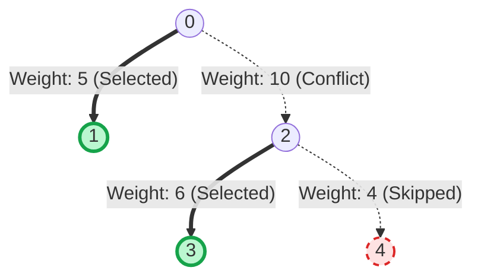

# Guided Example: Choose Edges to Maximize Score in a Tree

## 1. Problem Overview & Representative Instance

We are given a directed representation of a weighted tree with $n$ vertices labeled $0$ through $n - 1$, rooted at node $0$. The tree topology is specified by an array $\text{edges}$ where for each vertex $i \ge 1$, $\text{edges}[i] = [\text{parent}, \text{weight}]$, indicating an edge connecting node $i$ to its parent with a given weight (which may be positive, negative, or zero). For the root, $\text{edges}[0] = [-1, -1]$.

We wish to select a subset of edges from the tree to maximize the sum of their weights, subject to the condition that **no two chosen edges share a vertex**. In graph theory, this is the classic **Maximum Weight Matching** problem on trees. Since choosing no edges is valid, the maximum score is at least $0$.

Consider the representative tree:
$$\text{edges} = [[-1, -1], [0, 5], [0, 10], [2, 6], [2, 4]]$$

The tree structure has vertices $0, 1, 2, 3, 4$:
- Root $0$ has children $1$ (weight $5$) and $2$ (weight $10$).
- Node $2$ has children $3$ (weight $6$) and $4$ (weight $4$).
- Leaves are $1, 3, 4$.

If we greedily pick the heaviest edge $(0, 2)$ with weight $10$, both node $0$ and node $2$ become matched, preventing the selection of edge $(0, 1)$ (weight $5$) and edge $(2, 3)$ (weight $6$). However, choosing $(0, 1)$ and $(2, 3)$ yields a total weight of $5 + 6 = 11$, which strictly outperforms the single heavy edge.

## 2. Mathematical & Algorithmic Principles

In any valid matching, each vertex can be incident to at most one chosen edge. For any node $u$ in the rooted tree:
- Node $u$ can be matched with at most one of its children, OR
- Node $u$ can be matched with its parent, OR
- Node $u$ can remain unmatched.

This suggests a bottom-up Tree Dynamic Programming formulation. For each node $u$, define two values for the subtree rooted at $u$:
1. $\text{skip}[u]$: The maximum matching weight obtainable within the subtree of $u$, given that the edge between $u$ and its parent is **not** selected.
   - Node $u$ is free to either match with at most one of its children $v$, or match with none of them.
2. $\text{pick}[u]$: The maximum matching weight obtainable within the subtree of $u$, plus the weight $w(\text{parent}, u)$, given that the edge between $u$ and its parent **is** selected.
   - Because $u$ is matched to its parent, $u$ cannot be matched to any of its children.

### Recurrence Transitions:
Let $\text{children}(u)$ denote the set of children of $u$:
1. If $u$ does not match with any child, every child $v \in \text{children}(u)$ is free from an incoming parent edge, so each child contributes $\text{skip}[v]$:
   $$\text{base} = \sum_{v \in \text{children}(u)} \text{skip}[v]$$
2. If $u$ matches with its parent via edge weight $w(\text{parent}, u)$:
   $$\text{pick}[u] = w(\text{parent}, u) + \text{base}$$
3. If $u$ considers matching with a specific child $v^* \in \text{children}(u)$:
   - The selected edge $(u, v^*)$ provides $\text{pick}[v^*]$.
   - All other children $v \neq v^*$ cannot match with $u$, contributing $\text{skip}[v]$.
   - The net gain from choosing child $v^*$ over leaving $(u, v^*)$ unselected is:
     $$\Delta(v^*) = \text{pick}[v^*] - \text{skip}[v^*]$$
   - Thus, matching $u$ with child $v^*$ achieves:
     $$\text{base} + \Delta(v^*)$$
4. Taking the best option for $\text{skip}[u]$:
   $$\text{skip}[u] = \max\left(\text{base},\, \text{base} + \max_{v \in \text{children}(u)} \Delta(v)\right)$$
   If the maximum gain $\max \Delta(v) \le 0$, no child edge is selected, and $\text{skip}[u] = \text{base}$.

Evaluating these recurrences in post-order (leaves to root) computes $\text{skip}[0]$, which represents the global maximum matching score.

## 3. Step-by-Step Walkthrough with Intermediate State

We execute post-order tree dynamic programming on $\text{edges} = [[-1, -1], [0, 5], [0, 10], [2, 6], [2, 4]]$.

- **Leaf 1 (Child of 0, Edge Weight 5):**
  - $\text{children}(1) = \emptyset$.
  - $\text{base} = 0$.
  - $\text{skip}[1] = 0$.
  - $\text{pick}[1] = 5 + 0 = 5$.
  - $\Delta(1) = 5 - 0 = 5$.

- **Leaf 3 (Child of 2, Edge Weight 6):**
  - $\text{children}(3) = \emptyset$.
  - $\text{base} = 0$.
  - $\text{skip}[3] = 0$.
  - $\text{pick}[3] = 6 + 0 = 6$.
  - $\Delta(3) = 6 - 0 = 6$.

- **Leaf 4 (Child of 2, Edge Weight 4):**
  - $\text{children}(4) = \emptyset$.
  - $\text{base} = 0$.
  - $\text{skip}[4] = 0$.
  - $\text{pick}[4] = 4 + 0 = 4$.
  - $\Delta(4) = 4 - 0 = 4$.

- **Node 2 (Child of 0, Edge Weight 10, Children $\{3, 4\}$):**
  - $\text{base} = \text{skip}[3] + \text{skip}[4] = 0 + 0 = 0$.
  - Candidate child gains:
    - Child 3: $\Delta(3) = 6$.
    - Child 4: $\Delta(4) = 4$.
    - Best gain: $\max(6, 4) = 6$ (by matching edge $(2, 3)$).
  - Compute states:
    - $\text{skip}[2] = \max(0, 0 + 6) = 6$.
    - $\text{pick}[2] = w(0, 2) + \text{base} = 10 + 0 = 10$.
  - Net gain for parent:
    $$\Delta(2) = \text{pick}[2] - \text{skip}[2] = 10 - 6 = 4$$

- **Root 0 (Sentinel Parent, Children $\{1, 2\}$):**
  - $\text{base} = \text{skip}[1] + \text{skip}[2] = 0 + 6 = 6$.
  - Candidate child gains:
    - Child 1: $\Delta(1) = 5 \implies \text{base} + \Delta(1) = 6 + 5 = 11$.
    - Child 2: $\Delta(2) = 4 \implies \text{base} + \Delta(2) = 6 + 4 = 10$.
    - Best gain: $\max(5, 4) = 5$ (by matching edge $(0, 1)$).
  - Compute state:
    $$\text{skip}[0] = \max(6, 6 + 5) = 11$$

- **Termination:**
  The optimal matching score for the tree is $\text{skip}[0] = 11$.

## 4. Comprehensive State Trace

The full post-order evaluation of all five nodes is detailed in the table below:

| Node $u$ | Parent | Weight $w(\text{par}, u)$ | Children Set | Base $\sum \text{skip}[v]$ | Candidate Gains $\{\Delta(v)\}$ | $\text{skip}[u]$ | $\text{pick}[u]$ | $\Delta(u)$ |
|---|---|---|---|---|---|---|---|---|
| 1 | 0 | 5 | $\emptyset$ | 0 | None | 0 | 5 | 5 |
| 3 | 2 | 6 | $\emptyset$ | 0 | None | 0 | 6 | 6 |
| 4 | 2 | 4 | $\emptyset$ | 0 | None | 0 | 4 | 4 |
| 2 | 0 | 10 | $\{3, 4\}$ | 0 | $\Delta(3)=6, \Delta(4)=4$ | 6 | 10 | 4 |
| 0 | — | — | $\{1, 2\}$ | 6 | $\Delta(1)=5, \Delta(2)=4$ | 11 | — | — |

The comparative analysis between the greedy approach and the dynamic programming matching is summarized below:

| Strategy | Selected Edges | Vertex Coverage | Total Weight | Optimality Status |
|---|---|---|---|---|
| Greedy by Weight | $(0, 2)$ | $\{0, 2\}$ | $10$ | Suboptimal |
| Alternative Match | $(0, 2), (3, 4)$ (invalid) | $\{0, 2, 3, 4\}$ | N/A | Illegal (no edge between 3 and 4) |
| Optimal Tree Matching | $(0, 1)$ and $(2, 3)$ | $\{0, 1, 2, 3\}$ | $5 + 6 = 11$ | Optimal |

The optimal matching achieves a score of 11 using pairwise disjoint edges $(0, 1)$ and $(2, 3)$.

## 5. Algorithmic Correctness & Soundness

The correctness of the tree dynamic programming algorithm follows from structural induction on trees:
1. **Subtree Independence:** In any tree, the subtrees rooted at the children $v_1, v_2, \dots$ of node $u$ are completely vertex-disjoint. No edge within the subtree of $v_1$ can share a vertex with an edge in the subtree of $v_2$.
2. **Mutual Exclusion at Node $u$:**
   - If node $u$ matches with child $v^*$, the vertex $u$ is occupied. No edge can connect $u$ to any other child $v \neq v^*$, nor can $u$ match with its parent.
   - If node $u$ matches with its parent, vertex $u$ is occupied, forbidding all child connections $(u, v)$.
   - If node $u$ does not match with its parent or any child, each child $v$ is independently free to match internally.
3. **Exact Optimal Substructure:** Because the choice of matching at most one child $v^*$ with $u$ decouples the remaining children, the optimal choice among children is achieved by taking the maximum marginal gain $\max_{v} \Delta(v)$, provided that gain is positive.

By induction from the leaves to the root, $\text{skip}[0]$ yields the global maximum weight matching.

## 6. Edge Cases & Anti-Patterns

- **All Negative Edge Weights:** If every edge weight is negative (e.g. $w \le -1$), all $\text{pick}$ values will produce $\Delta(v) \le 0$. The algorithm chooses $\text{base} = 0$ at all steps, correctly returning $0$ (matching zero edges).
- **Star Graph (Root with $n - 1$ Children):** All edges share vertex $0$. The algorithm computes $\text{base} = 0$ and $\max \Delta(v) = \max_{v} w(0, v)$. It correctly selects the single heaviest positive edge (or $0$ if all are negative).
- **Linear Path Graph:** Edges form a line $0 - 1 - 2 - 3$. The recurrence reduces to finding the maximum weight independent set of edges on a path, which the tree DP handles identically to the linear $1\text{D}$ recurrence.
- **Anti-Pattern: Greedy Maximum-Weight Edge Selection:** Greedily taking the heaviest edge in the tree can lock two nodes simultaneously, blocking multiple adjacent edges whose sum strictly exceeds the single heavy edge (as seen in our representative example where picking $10$ blocked $5 + 6 = 11$).

## 7. Complexity Analysis

- **Time Complexity:**
  - Constructing the adjacency list from the input array of size $n$ takes $\mathcal{O}(n)$ time.
  - The tree traversal visits each of the $n$ nodes exactly once during the post-order depth-first search.
  - At each node $u$, computing $\text{base}$ and finding the maximum child gain takes time proportional to the number of children of $u$: $\mathcal{O}(\text{deg}(u))$.
  - Summing across all vertices, $\sum_{u} \text{deg}(u) = n - 1$.
  - Total time complexity is strictly $\mathcal{O}(n)$.
- **Space Complexity:**
  - The adjacency tree representation requires $\mathcal{O}(n)$ memory.
  - The DP memoization tables or return tuples require $\mathcal{O}(n)$ memory.
  - The recursion call stack depth is bounded by the height of the tree: $\mathcal{O}(n)$ in the worst case (skewed tree).
  - Total auxiliary space complexity is $\mathcal{O}(n)$.
