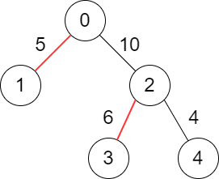
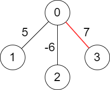

## Description

You are given a **weighted** tree consisting of `n` nodes numbered from `0` to $n - 1$.

The tree is **rooted** at node `0` and represented with a **2D** array `edges` of size `n` where $\text{edges}[i] = [\text{par}_{i}, \text{weight}_{i}]$ indicates that node $\text{par}_{i}$ is the **parent** of node `i`, and the edge between them has a weight equal to $\text{weight}_{i}$. Since the root does **not** have a parent, you have $\text{edges}[0] = [-1, -1]$.

Choose some edges from the tree such that no two chosen edges are **adjacent** and the **sum** of the weights of the chosen edges is maximized.

Return *the **maximum** sum of the chosen edges*.

**Note**:

- You are allowed to **not** choose any edges in the tree, the sum of weights in this case will be `0`.

- Two edges $\text{Edge}_{1}$ and $\text{Edge}_{2}$ in the tree are **adjacent** if they have a **common** node.

		<li>In other words, they are adjacent if $\text{Edge}_{1}$ connects nodes `a` and `b` and $\text{Edge}_{2}$ connects nodes `b` and `c`.

	</li>
### Function Contract

- Refer to method signature.

### Examples

#### Example 1

- **Input:** $edges = [[-1,-1],[0,5],[0,10],[2,6],[2,4]]$
- **Output:** `11`
- **Explanation:** The above diagram shows the edges that we have to choose colored in red.
The total score is 5 + 6 = 11.
It can be shown that no better score can be obtained.
#### Example 2

- **Input:** $edges = [[-1,-1],[0,5],[0,-6],[0,7]]$
- **Output:** `7`
- **Explanation:** We choose the edge with weight 7.
Note that we cannot choose more than one edge because all edges are adjacent to each other.
### Constraints

- $n = \text{edges.length}$

- $1 \le n \le 10^{5}$

- $\text{edges}[i].length = 2$

- $\text{par}_{0} = \text{weight}_{0} = -1$

- $0 \le \text{par}_{i} \le n - 1$ for all $i \ge 1$.

- $\text{par}_{i} \neq i$

- $-10^{6} \le \text{weight}_{i} \le 10^{6}$ for all $i \ge 1$.

- `edges` represents a valid tree.