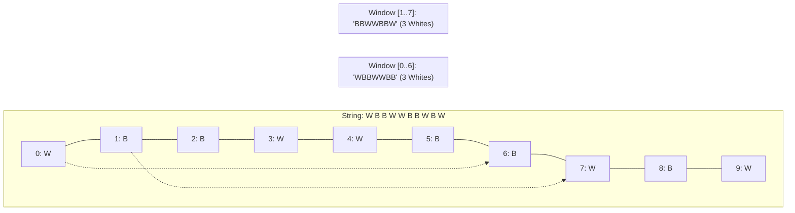

# Guided Example: Minimum Recolors to Get K Consecutive Black Blocks

## 1. Problem Overview & Representative Instance

Given a binary string $\text{blocks}$ of length $n$ composed entirely of `'W'` (white blocks) and `'B'` (black blocks), and an integer $k$ ($1 \le k \le n$), we wish to find the minimum number of recoloring operations required to produce at least one contiguous sequence of $k$ black blocks. A single operation converts an existing white block into a black block (`'W' \to 'B'`); black blocks never need modification.

Because any contiguous run of $k$ black blocks must occupy an exact index interval $[i, i + k - 1]$ for some start index $0 \le i \le n - k$, the problem is equivalent to finding a contiguous subsegment of length $k$ that contains the minimum count of white blocks.

Consider the representative sequence:
- $\text{blocks} = \text{"WBBWWBBWBW"}$, length $n = 10$
- Window length: $k = 7$

There are $n - k + 1 = 10 - 7 + 1 = 4$ candidate windows of length $7$. Any white block inside the chosen window must be converted to black, while blocks outside the window can remain untouched.

## 2. Mathematical & Algorithmic Principles

To achieve $k$ consecutive black blocks within an interval $I = [i, i + k - 1]$ of length $k$, every white block inside $I$ must be flipped. Thus, the operation cost for window $I$ is precisely:
$$\text{Cost}(i) = \sum_{j=i}^{i + k - 1} \mathbf{1}_{[\text{blocks}[j] = \text{'W'}]}$$
We seek $\min_{0 \le i \le n - k} \text{Cost}(i)$.

Rather than recalculating the sum over $k$ elements for each of the $n - k + 1$ windows (which would take $\mathcal{O}(n \cdot k)$ time), we apply a **Fixed-Size Sliding Window**:
1. **Initial Window Sum:**
   Count the number of `'W'` characters in the prefix of length $k$:
   $$W_0 = \sum_{j=0}^{k - 1} \mathbf{1}_{[\text{blocks}[j] = \text{'W'}]}$$
   Initialize $\text{min\_recolors} = W_0$.
2. **Incremental Slide:**
   When the window advances from $[i - 1, i + k - 2]$ to $[i, i + k - 1]$:
   - The leftmost block $\text{blocks}[i - 1]$ departs from the window. If it is `'W'`, decrement the white counter by $1$.
   - The rightmost block $\text{blocks}[i + k - 1]$ enters the window. If it is `'W'`, increment the white counter by $1$.
   - Update the current window cost:
     $$W_i = W_{i - 1} - \mathbf{1}_{[\text{blocks}[i - 1] = \text{'W'}]} + \mathbf{1}_{[\text{blocks}[i + k - 1] = \text{'W'}]}$$
3. **Global Extremum:**
   Track the minimum observed value:
   $$\text{min\_recolors} \leftarrow \min(\text{min\_recolors},\, W_i)$$

Each slide executes in $\mathcal{O}(1)$ time, yielding an optimal linear algorithm.

## 3. Step-by-Step Walkthrough with Intermediate State

We trace the sliding window on $\text{blocks} = \text{"WBBWWBBWBW"}$ with $k = 7$.

- **Phase 1: Initial Window $[0 \dots 6]$:**
  - Slice: $\text{blocks}[0 \dots 6] = \text{"WBBWWBB"}$.
  - Elements:
    - Index 0: `'W'` (+1)
    - Index 1: `'B'`
    - Index 2: `'B'`
    - Index 3: `'W'` (+1)
    - Index 4: `'W'` (+1)
    - Index 5: `'B'`
    - Index 6: `'B'`
  - Initial white count: $W_0 = 3$.
  - Running minimum: $\text{min\_recolors} = 3$.

- **Phase 2: Slide to Window 1 ($i = 1$, Span $[1 \dots 7]$):**
  - Departing block: $\text{blocks}[0] = \text{'W'}$ (decrement count: $-1$).
  - Arriving block: $\text{blocks}[7] = \text{'W'}$ (increment count: $+1$).
  - New white count: $W_1 = 3 - 1 + 1 = 3$.
  - Window string: $\text{"BBWWBBW"}$.
  - Running minimum: $\min(3, 3) = 3$.

- **Phase 3: Slide to Window 2 ($i = 2$, Span $[2 \dots 8]$):**
  - Departing block: $\text{blocks}[1] = \text{'B'}$ (no change).
  - Arriving block: $\text{blocks}[8] = \text{'B'}$ (no change).
  - New white count: $W_2 = 3 - 0 + 0 = 3$.
  - Window string: $\text{"BWWBBWB"}$.
  - Running minimum: $\min(3, 3) = 3$.

- **Phase 4: Slide to Window 3 ($i = 3$, Span $[3 \dots 9]$):**
  - Departing block: $\text{blocks}[2] = \text{'B'}$ (no change).
  - Arriving block: $\text{blocks}[9] = \text{'W'}$ (increment count: $+1$).
  - New white count: $W_3 = 3 - 0 + 1 = 4$.
  - Window string: $\text{"WWBBWBW"}$.
  - Running minimum: $\min(3, 4) = 3$.

- **Termination:**
  All $4$ valid windows evaluated. The minimum recolor operations required is $3$.

## 4. Comprehensive State Trace

The full state transitions across all sliding window positions are detailed in the ledger below:

| Window Index $i$ | Window Range | Substring Profile | Outgoing Block | Incoming Block | Delta Effect | White Count $W_i$ | Running Minimum |
|---|---|---|---|---|---|---|---|
| 0 | $[0 \dots 6]$ | `"WBBWWBB"` | — | — | Initial Scan | 3 | 3 |
| 1 | $[1 \dots 7]$ | `"BBWWBBW"` | $\text{blocks}[0] = \text{'W'}$ | $\text{blocks}[7] = \text{'W'}$ | $-1 + 1 = 0$ | 3 | 3 |
| 2 | $[2 \dots 8]$ | `"BWWBBWB"` | $\text{blocks}[1] = \text{'B'}$ | $\text{blocks}[8] = \text{'B'}$ | $0 + 0 = 0$ | 3 | 3 |
| 3 | $[3 \dots 9]$ | `"WWBBWBW"` | $\text{blocks}[2] = \text{'B'}$ | $\text{blocks}[9] = \text{'W'}$ | $0 + 1 = +1$ | 4 | 3 |

We also tabulate the recoloring strategy and resulting configurations for each window:

| Window Range | Existing Black Blocks | White Blocks to Invert | Operations Required | Resulting Substring |
|---|---|---|---|---|
| $[0 \dots 6]$ | Indices $\{1, 2, 5, 6\}$ (4 blocks) | Indices $\{0, 3, 4\}$ (3 blocks) | 3 | `"BBBBBBB"` |
| $[1 \dots 7]$ | Indices $\{1, 2, 5, 6\}$ (4 blocks) | Indices $\{3, 4, 7\}$ (3 blocks) | 3 | `"BBBBBBB"` |
| $[2 \dots 8]$ | Indices $\{2, 5, 6, 8\}$ (4 blocks) | Indices $\{3, 4, 7\}$ (3 blocks) | 3 | `"BBBBBBB"` |
| $[3 \dots 9]$ | Indices $\{5, 6, 8\}$ (3 blocks) | Indices $\{3, 4, 7, 9\}$ (4 blocks) | 4 | `"BBBBBBB"` |

Inverting white blocks at indices $\{0, 3, 4\}$ realizes the required 7 consecutive black blocks in 3 operations.

## 5. Algorithmic Correctness & Soundness

The correctness of the fixed-size sliding window approach follows from:
1. **Completeness of Search Space:** Any contiguous run of $k$ black blocks must occupy an interval $[i, i + k - 1]$ for some $i \in \{0, 1, \dots, n - k\}$. The algorithm evaluates every possible starting coordinate $i$ without omission.
2. **Exact Local Cost Measurement:** Because the objective is to transform the entire interval into black blocks, every white block in that interval must be recolored, and black blocks already present require zero operations. Therefore, the cost for window $i$ is exactly the count of `'W'` characters in that window.
3. **Invariance of Sliding Transitions:** The difference between consecutive windows $[i, i + k - 1]$ and $[i + 1, i + k]$ involves only the removal of $\text{blocks}[i]$ and the addition of $\text{blocks}[i + k]$. The internal elements $[i + 1, i + k - 1]$ are shared and their sum remains unchanged. Hence, $W_{i+1} = W_i - \mathbf{1}_{W}[i] + \mathbf{1}_{W}[i + k]$ is exact.

## 6. Edge Cases & Anti-Patterns

- **Target Run Equals String Length ($k = n$):** There is exactly one window $[0 \dots n - 1]$. The sliding loop performs zero steps, returning the total white blocks in the entire string.
- **Already Satisfied ($0$ Operations):** If the string already contains a run of $k$ black blocks (e.g. $\text{"WBWBBBW"}$ with $k = 2$), the window covering `"BB"` has $W = 0$, immediately returning $0$.
- **All White Blocks ($\text{"WWWW"}$):** Every block in the chosen window must be recolored; the algorithm correctly returns $k$.
- **Single Block Window ($k = 1$):** If at least one `'B'` exists, minimum recolors is $0$; otherwise $1$.
- **Anti-Pattern: Dynamic Two-Pointer Expansion:** Using a variable-sized two-pointer window that expands and contracts is unnecessary and prone to off-by-one errors because the required consecutive length is strictly fixed at $k$. A fixed window maintains simpler invariants.

## 7. Complexity Analysis

- **Time Complexity:**
  - Initializing the first window of size $k$ takes $\mathcal{O}(k)$ time.
  - The window slides $n - k$ times, performing $\mathcal{O}(1)$ updates per step.
  - The total time complexity is $\mathcal{O}(k + (n - k)) = \mathcal{O}(n)$.
  - For $n \le 100$, execution requires fewer than $200$ elementary operations.
- **Space Complexity:**
  - The algorithm only maintains a few integer counters ($\text{current\_white}$, $\text{min\_recolors}$, loop index).
  - Auxiliary space complexity is $\mathcal{O}(1)$.