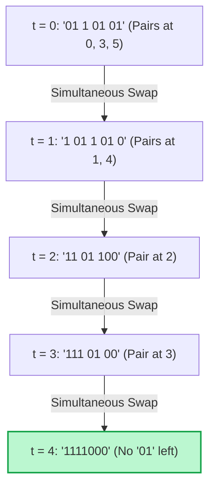

# Guided Example: Time Needed to Rearrange a Binary String

## 1. Problem Overview & Representative Instance

Given a binary string $s$ consisting of characters `'0'` and `'1'`, we consider a discrete synchronous simulation process. In each second, every occurrence of the contiguous substring `"01"` at the beginning of that second is simultaneously replaced by `"10"`. The process terminates when no `"01"` substring remains—meaning that all `'1'` digits have migrated to the left of all `'0'` digits (forming a sorted string of the form $1^a 0^b$).

Crucially, all replacements in a given second occur **simultaneously**. A character that moves during a given second cannot participate in another replacement until the subsequent second. We want to determine the total number of seconds needed until no further transitions can occur.

Consider the representative string:
$$s = \text{"0110101"}$$

This string contains $4$ ones and $3$ zeros. In the initial configuration, three distinct `"01"` substrings appear simultaneously: at indices $(0, 1)$, $(3, 4)$, and $(5, 6)$. We observe how these particles move leftward across consecutive discrete time steps.

## 2. Mathematical & Algorithmic Principles

This process models a discrete 1D traffic flow or particle hopping model:
1. **Inversion Metric and Termination:**
   Define the inversion count $I(s)$ as the number of pairs $(i, j)$ such that $i < j$, $s[i] = \text{'0'}$, and $s[j] = \text{'1'}$. Each replacement of `"01"` with `"10"` strictly reduces the total number of inversions by at least $1$. Because $I(s) \le n^2 / 4$ is finite and non-negative, the system is guaranteed to reach a quiescent state $I(s) = 0$ in finite time.
2. **Synchronous Particle Dynamics:**
   - Every `'1'` wants to travel to the left, jumping over preceding `'0'`s.
   - If a `'1'` has empty space (a `'0'`) directly in front of it, it advances by $1$ position in $1$ second.
   - If a `'1'` is directly behind another `'1'`, it is blocked and must wait until the leading `'1'` moves forward.
3. **Linear Dynamic Programming Form:**
   Let $\text{zeros}$ be the count of zeros encountered to the left of the current `'1'`.
   Let $DP$ be the time required for all ones processed so far to reach their final packed positions:
   - When a `'0'` is encountered: increment $\text{zeros} \leftarrow \text{zeros} + 1$.
   - When a `'1'` is encountered with $\text{zeros} > 0$:
     The time required for this `'1'` to settle is at least $\text{zeros}$ (the distance it must travel).
     Additionally, because it cannot collide with the immediately preceding `'1'`, it must finish at least $1$ second after the preceding particle:
     $$DP_{\text{new}} = \max(DP_{\text{old}} + 1,\, \text{zeros})$$
   - If $\text{zeros} = 0$, the `'1'` is already in its final position, so $DP$ remains $0$.

This recurrence evaluates the exact duration in a single pass over the string in $\mathcal{O}(n)$ time and $\mathcal{O}(1)$ auxiliary space.

## 3. Step-by-Step Walkthrough with Intermediate State

We trace the step-by-step physical simulation on $s = \text{"0110101"}$.

- **Time $t = 0$:**
  - String: `"0110101"`.
  - Active `"01"` pairs at indices:
    - Index $0-1$: `"01"`
    - Index $3-4$: `"01"`
    - Index $5-6$: `"01"`
  - Simultaneous replacement: Swap pairs at $0-1$, $3-4$, and $5-6$.
  - End of Second 1.

- **Time $t = 1$:**
  - String: `"1011010"`.
  - Active `"01"` pairs at indices:
    - Index $1-2$: `"01"`
    - Index $4-5$: `"01"`
  - Simultaneous replacement: Swap pairs at $1-2$ and $4-5$.
  - End of Second 2.

- **Time $t = 2$:**
  - String: `"1101100"`.
  - Active `"01"` pairs at indices:
    - Index $2-3$: `"01"`
  - Simultaneous replacement: Swap pair at $2-3$.
  - End of Second 3.

- **Time $t = 3$:**
  - String: `"1110100"`.
  - Active `"01"` pairs at indices:
    - Index $3-4$: `"01"`
  - Simultaneous replacement: Swap pair at $3-4$.
  - End of Second 4.

- **Time $t = 4$:**
  - String: `"1111000"`.
  - Active `"01"` pairs: None.
  - Quiescent condition met.
  - Total time elapsed: $4$ seconds.

## 4. Comprehensive State Trace

The full state transitions of the string and the active swap locations across all seconds are detailed in the table below:

| Second $t$ | String at Start of Second | Identified `"01"` Index Pairs | Simultaneous Operations Executed | Remaining Inversions |
|---|---|---|---|---|
| 0 | `"0110101"` | $(0, 1), (3, 4), (5, 6)$ | Invert positions $0-1, 3-4, 5-6$ | 7 |
| 1 | `"1011010"` | $(1, 2), (4, 5)$ | Invert positions $1-2, 4-5$ | 4 |
| 2 | `"1101100"` | $(2, 3)$ | Invert positions $2-3$ | 2 |
| 3 | `"1110100"` | $(3, 4)$ | Invert positions $3-4$ | 1 |
| 4 | `"1111000"` | None | Quiescent state reached | 0 |

We also trace the corresponding single-pass dynamic programming state evolution on the string characters from left to right:

| Index $i$ | Character $s[i]$ | Preceding Zeros Count | Transition Formula Applied | Updated $DP$ Value |
|---|---|---|---|---|
| 0 | '0' | 1 | Zero accumulator increment | 0 |
| 1 | '1' | 1 | $\max(0 + 1, 1) = 1$ | 1 |
| 2 | '1' | 1 | $\max(1 + 1, 1) = 2$ | 2 |
| 3 | '0' | 2 | Zero accumulator increment | 2 |
| 4 | '1' | 2 | $\max(2 + 1, 2) = 3$ | 3 |
| 5 | '0' | 3 | Zero accumulator increment | 3 |
| 6 | '1' | 3 | $\max(3 + 1, 3) = 4$ | 4 |

Both the concrete simulation and the analytical dynamic programming recurrence confirm that exactly 4 seconds are required.

## 5. Algorithmic Correctness & Soundness

The correctness of the synchronous rearrangement model rests on invariants of particle exclusion:
1. **Synchronicity & Independence:** In any second, replacing `"01"` with `"10"` modifies disjoint two-element windows. Since two adjacent `"01"` patterns cannot overlap (the character after `'1'` in `"01"` is either `'0'` or `'1'`, so `"0101"` has disjoint pairs at $0-1$ and $2-3$), simultaneous replacement is well-defined and deterministic.
2. **Strict Inversion Monotonicity:** Every swap strictly moves a `'1'` left and a `'0'` right, decreasing the total number of inversions by at least $1$. The process cannot cycle or enter infinite loops.
3. **Soundness of the Traffic Recurrence:**
   - Any `'1'` with $z$ preceding zeros must make at least $z$ steps to bypass those zeros.
   - If the previous `'1'` finished settling at time $T$, the current particle cannot finish earlier than $T + 1$ because the exclusion principle prevents two particles from occupying the same cell or overtaking one another.
   - Taking the maximum over these two physical constraints produces the exact completion timestamp.

## 6. Edge Cases & Anti-Patterns

- **Already Sorted String ($s = \text{"11100"}$):** Contains zero `"01"` pairs. The simulation immediately terminates at $t = 0$.
- **All Zeros or All Ones ($s = \text{"0000"}$ or $s = \text{"1111"}$):** Zero transitions occur; time is $0$.
- **Worst-Case Inversion ($s = \text{"000111"}$):** All zeros precede all ones. The ones move in a tight pack, taking $3 + 3 - 1 = 5$ seconds.
- **Alternating Pattern ($s = \text{"010101"}$):** All three pairs swap in parallel at $t = 1$, producing `"101010"`, which then swaps again at $t = 2$, etc.
- **Anti-Pattern: Sequential Greedy In-Place String Mutation:** Mutating the string sequentially from left to right within the same second allows a single `'1'` to cascade through multiple zeros in a single time step (e.g. converting `"011"` into `"110"` sequentially). The problem strictly mandates that moves occur simultaneously based on the snapshot at the beginning of the second.

## 7. Complexity Analysis

- **Time Complexity:**
  - **Dynamic Programming Approach:** A single pass over the string of length $n$ performs constant-time arithmetic for each character, requiring strictly $\mathcal{O}(n)$ time.
  - **Direct Simulation Approach:** Each second reduces the inversion count or shifts particles left. At most $n$ seconds can elapse, and each second scans $n$ characters. Total simulation time is $\mathcal{O}(n^2)$.
  - Given $n \le 1000$, $\mathcal{O}(n)$ requires $\approx 10^3$ operations, while $\mathcal{O}(n^2)$ requires $\approx 10^6$ operations; both complete well within standard limits.
- **Space Complexity:**
  - The dynamic programming approach only tracks scalar counters ($\text{zeros}$, $DP$), using $\mathcal{O}(1)$ auxiliary space.
  - Simulation in-place or via two string buffers uses $\mathcal{O}(n)$ auxiliary space.
