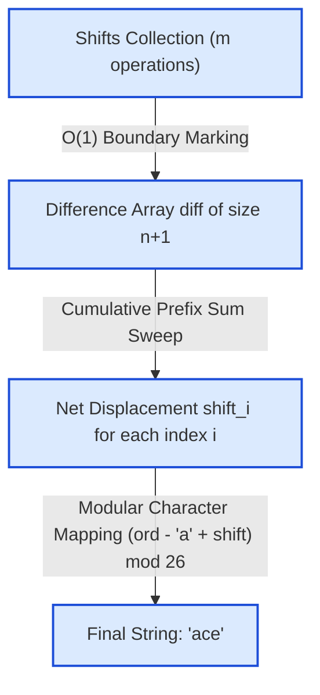

# Guided Example: Shifting Letters II

## 1. Problem Overview & Representative Instance

We are given a lowercase English string $s$ of length $n$ and an array $\text{shifts}$ containing $m$ range operations. Each operation is specified as a triple $[\text{start}, \text{end}, \text{direction}]$:
- $\text{start}$ and $\text{end}$ ($0 \le \text{start} \le \text{end} < n$) define an inclusive character index interval $[\text{start}, \text{end}]$.
- $\text{direction} = 1$ denotes a forward cyclic shift by $1$ position (mapping `'a' \to 'b'`, `'b' \to 'c'`, $\dots$, `'z' \to 'a'`).
- $\text{direction} = 0$ denotes a backward cyclic shift by $1$ position (mapping `'b' \to 'a'`, `'c' \to 'b'`, $\dots$, `'a' \to 'z'`).

Shifts overlap arbitrarily and accumulate algebraically modulo $26$. The objective is to compute the final string after all $m$ operations have been applied.

Consider the representative instance:
- String: $s = \text{"abc"}$, length $n = 3$
- Operations:
  1. $[0, 1, 0]$ (shift backward on range $[0, 1]$)
  2. $[1, 2, 1]$ (shift forward on range $[1, 2]$)
  3. $[0, 2, 1]$ (shift forward on range $[0, 2]$)

Because both $n$ and $m$ can reach $5 \cdot 10^4$, repeatedly updating characters across each interval individually requires $\mathcal{O}(n \cdot m) \approx 2.5 \cdot 10^9$ operations, which exceeds standard time limits. We must decouple query collection from string generation using a difference array.

## 2. Mathematical & Algorithmic Principles

Alphabet rotation on characters forms a cyclic group $\mathbb{Z}_{26}$. A net shift $\delta \in \mathbb{Z}$ applied to character $c \in \{\text{'a'}, \dots, \text{'z'}\}$ transforms it to:
$$c' = \text{chr}\Bigl(\bigl((\text{ord}(c) - \text{ord}(\text{'a'}) + \delta) \bmod 26 + 26\bigr) \bmod 26 + \text{ord}(\text{'a'})\Bigr)$$

Because addition in $\mathbb{Z}_{26}$ is linear and associative, independent interval updates can be integrated via a **1D Difference Array**:
1. **Interval Delta Marking:**
   Initialize an array $\text{diff}$ of length $n + 1$ with zeros. For each query $[\text{start}, \text{end}, \text{dir}]$:
   - Determine value: $v = +1$ if $\text{dir} = 1$ else $-1$.
   - Apply boundary deltas:
     $$\text{diff}[\text{start}] \leftarrow \text{diff}[\text{start}] + v$$
     $$\text{diff}[\text{end} + 1] \leftarrow \text{diff}[\text{end} + 1] - v$$
2. **Prefix Sum Integration:**
   The net displacement experienced by character $i$ is the prefix sum of all preceding boundary deltas:
   $$\text{shift}[i] = \sum_{j=0}^{i} \text{diff}[j] = \text{shift}[i - 1] + \text{diff}[i]$$
   - When entering index $\text{start}$, $\text{diff}[\text{start}]$ adds $v$ to all subsequent elements.
   - When passing beyond $\text{end}$, $\text{diff}[\text{end} + 1]$ subtracts $v$, canceling the effect for indices $> \text{end}$.
3. **Pointwise Transformation:**
   After accumulating $\text{shift}[i]$, each character is updated in $\mathcal{O}(1)$ time using modulo $26$ arithmetic.

## 3. Step-by-Step Walkthrough with Intermediate State

We trace the representative instance: $s = \text{"abc"}$ ($n = 3$), $\text{shifts} = [[0, 1, 0], [1, 2, 1], [0, 2, 1]]$.

- **Phase 1: Difference Array Initialization:**
  Create $\text{diff}$ of size $n + 1 = 4$:
  $$\text{diff} = [0, 0, 0, 0]$$

- **Phase 2: Recording Shifts in $\mathcal{O}(1)$ per Query:**
  - **Query 1: $[0, 1, 0]$ ($v = -1$ on $[0, 1]$):**
    - $\text{diff}[0] \leftarrow 0 + (-1) = -1$
    - $\text{diff}[1 + 1] = \text{diff}[2] \leftarrow 0 - (-1) = +1$
    - State: $\text{diff} = [-1, 0, 1, 0]$
  - **Query 2: $[1, 2, 1]$ ($v = +1$ on $[1, 2]$):**
    - $\text{diff}[1] \leftarrow 0 + 1 = 1$
    - $\text{diff}[2 + 1] = \text{diff}[3] \leftarrow 0 - 1 = -1$
    - State: $\text{diff} = [-1, 1, 1, -1]$
  - **Query 3: $[0, 2, 1]$ ($v = +1$ on $[0, 2]$):**
    - $\text{diff}[0] \leftarrow -1 + 1 = 0$
    - $\text{diff}[2 + 1] = \text{diff}[3] \leftarrow -1 - 1 = -2$
    - State: $\text{diff} = [0, 1, 1, -2]$

- **Phase 3: Prefix Sweep and String Transformation:**
  Maintain running accumulator $\text{shift} = 0$.

  - **Index $i = 0$ (Character `'a'`, original offset $0$):**
    - $\text{shift} \leftarrow 0 + \text{diff}[0] = 0 + 0 = 0$.
    - Net rotation: $0 \pmod{26} = 0$.
    - New character: $(0 + 0) \pmod{26} = 0 \implies \text{'a'}$.

  - **Index $i = 1$ (Character `'b'`, original offset $1$):**
    - $\text{shift} \leftarrow 0 + \text{diff}[1] = 0 + 1 = 1$.
    - Net rotation: $1 \pmod{26} = 1$.
    - New character: $(1 + 1) \pmod{26} = 2 \implies \text{'c'}$.

  - **Index $i = 2$ (Character `'c'`, original offset $2$):**
    - $\text{shift} \leftarrow 1 + \text{diff}[2] = 1 + 1 = 2$.
    - Net rotation: $2 \pmod{26} = 2$.
    - New character: $(2 + 2) \pmod{26} = 4 \implies \text{'e'}$.

- **Resulting String:**
  $$\text{"ace"}$$

## 4. Comprehensive State Trace

The difference array updates across all three operations are detailed in the ledger below:

| Operation Step | Target Interval | Shift Direction | Delta Value $v$ | $\text{diff}[\text{start}]$ Update | $\text{diff}[\text{end}+1]$ Update | Resulting Array State |
|---|---|---|---|---|---|---|
| Initial | — | — | — | — | — | $[0, 0, 0, 0]$ |
| Shift 1 | $[0, 1]$ | Backward (0) | $-1$ | $\text{diff}[0] += -1$ | $\text{diff}[2] -= -1$ | $[-1, 0, 1, 0]$ |
| Shift 2 | $[1, 2]$ | Forward (1) | $+1$ | $\text{diff}[1] += 1$ | $\text{diff}[3] -= 1$ | $[-1, 1, 1, -1]$ |
| Shift 3 | $[0, 2]$ | Forward (1) | $+1$ | $\text{diff}[0] += 1$ | $\text{diff}[3] -= 1$ | $[0, 1, 1, -2]$ |

The prefix integration and modular character reconstruction are tabulated below:

| Index $i$ | Source Char | Base Ordinal (0–25) | $\text{diff}[i]$ | Running Net Shift | Effective Modulo 26 Shift | Transformed Ordinal | Output Char |
|---|---|---|---|---|---|---|---|
| 0 | `'a'` | 0 | 0 | 0 | 0 | 0 | `'a'` |
| 1 | `'b'` | 1 | 1 | $0 + 1 = 1$ | 1 | $1 + 1 = 2$ | `'c'` |
| 2 | `'c'` | 2 | 1 | $1 + 1 = 2$ | 2 | $2 + 2 = 4$ | `'e'` |

The final output is verified to be `"ace"`.

## 5. Algorithmic Correctness & Soundness

The correctness of difference array prefix accumulation is established by telescoping cancellation:
1. **Exact Interval Coverage:**
   For any index $k$, the net shift accumulated via prefix summation is:
   $$\text{shift}[k] = \sum_{j=0}^{k} \text{diff}[j] = \sum_{j=0}^{k} \sum_{q} \left( v_q \cdot \mathbf{1}_{[\text{start}_q = j]} - v_q \cdot \mathbf{1}_{[\text{end}_q + 1 = j]} \right)$$
   Swapping sums yields:
   $$\text{shift}[k] = \sum_{q} v_q \left( \sum_{j=0}^{k} \mathbf{1}_{[\text{start}_q = j]} - \sum_{j=0}^{k} \mathbf{1}_{[\text{end}_q + 1 = j]} \right)$$
   - If $k < \text{start}_q$: both indicator sums evaluate to $0$, contribution is $0$.
   - If $\text{start}_q \le k \le \text{end}_q$: the first sum is $1$ and the second is $0$, contribution is $v_q$.
   - If $k > \text{end}_q$: both indicator sums are $1$, canceling to $1 - 1 = 0$.
   Hence, every query $q$ contributes its exact value $v_q$ if and only if $k \in [\text{start}_q, \text{end}_q]$.
2. **Algebraic Consistency over $\mathbb{Z}_{26}$:**
   Because cyclic shifts satisfy $(a + b) \bmod 26$, summing net shifts before applying the single modular transformation is identical to applying each shift sequentially.

## 6. Edge Cases & Anti-Patterns

- **Zero Net Shift (Self-Canceling Operations):** If a range is shifted forward and then shifted backward by the same amount, $\text{diff}$ values sum to $0$, and the characters remain unchanged.
- **Negative Running Shift:** If cumulative shifts are negative (e.g. $-1$ on `'a'`), Python handles negative modulo naturally ($-1 \pmod{26} = 25 \implies \text{'z'}$). In languages like C++ or Java where `%` is remainder, adding $26$ before taking modulo (`(val % 26 + 26) % 26`) prevents negative indices.
- **Single Character String ($n = 1$):** All intervals are $[0, 0]$. Updates affect $\text{diff}[0]$ and $\text{diff}[1]$ correctly.
- **Anti-Pattern: Eager In-Place Simulation:** Modifying characters inside each interval in an inner loop requires $\mathcal{O}(m \cdot n)$ time. The difference array defers evaluation to a single pass, dropping execution time from seconds to milliseconds.

## 7. Complexity Analysis

- **Time Complexity:**
  - Initializing the difference array of size $n + 1$ takes $\mathcal{O}(n)$ time.
  - Processing $m$ range queries by modifying two array endpoints takes $\mathcal{O}(m)$ time.
  - The prefix sum sweep and character generation takes $\mathcal{O}(n)$ time.
  - Total time complexity is strictly linear: $\mathcal{O}(n + m)$.
  - For $n, m \le 5 \cdot 10^4$, this executes in $\approx 10^5$ operations.
- **Space Complexity:**
  - The auxiliary difference array $\text{diff}$ requires $n + 1$ integers: $\mathcal{O}(n)$ space.
  - The output character array requires $\mathcal{O}(n)$ space.
  - Total auxiliary space complexity is $\mathcal{O}(n)$.
