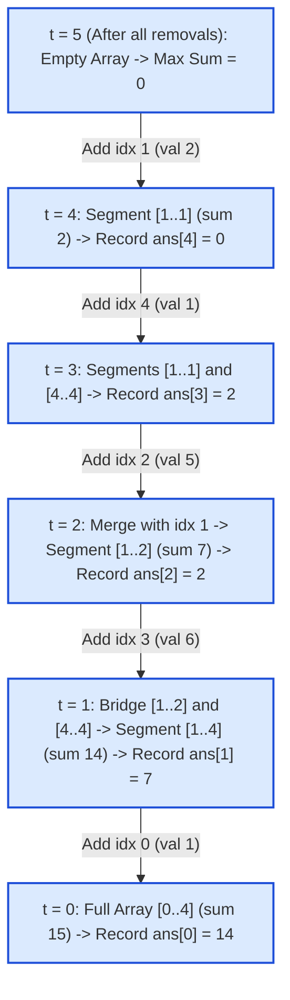

# Guided Example: Maximum Segment Sum After Removals

## 1. Problem Overview & Representative Instance

We are given two integer arrays of length $n$:
1. $\text{nums}$: A list of positive integers where $1 \le \text{nums}[i] \le 10^9$.
2. $\text{removeQueries}$: A permutation of indices from $0$ to $n - 1$ specifying the sequence in which array elements are permanently removed.

A "segment" is defined as any maximal contiguous subsegment of elements that have not yet been removed. Its "segment sum" is the sum of values within that contiguous slice. When an element is removed, the segment containing it may shrink, disappear, or split into two independent contiguous segments. After each removal, we must determine the maximum segment sum among all currently surviving segments. If all elements have been removed, the maximum segment sum is $0$.

Consider the representative instance:
$$\text{nums} = [1, 2, 5, 6, 1], \quad \text{removeQueries} = [0, 3, 2, 4, 1], \quad n = 5$$

In the forward direction, removals fragment contiguous ranges into smaller pieces. Maintaining dynamic splitting intervals online requires complex balanced binary search tree operations. However, reversing time transforms destructive deletions into constructive additions, converting the problem into incremental component merging.

## 2. Mathematical & Algorithmic Principles

Forward deletion breaks connected components. In contrast, backward addition merges connected components:
1. **Time-Reversal Duality:**
   Let $S_k$ denote the set of active indices remaining after the $k$-th removal ($k = 0, 1, \dots, n - 1$). The sequence of active states satisfies:
   $$S_0 \supset S_1 \supset \dots \supset S_{n-1} \supset S_n = \emptyset$$
   Reversing this timeline produces an incremental growth process:
   $$\emptyset = S_n \subset S_{n-1} \subset \dots \subset S_1 \subset S_0$$
   At each reverse step $k$ (from $n - 1$ down to $0$):
   - The answer after query $k$ corresponds to the maximum segment sum of state $S_{k+1}$, before $\text{removeQueries}[k]$ is reactivated.
   - We record $\text{ans}[k] = \text{max\_sum}$.
   - We then activate index $u = \text{removeQueries}[k]$ and merge it with any adjacent neighbors that are already active ($u - 1$ and $u + 1$).
2. **Disjoint Set Union (DSU) with Weight Augmentation:**
   We maintain a Disjoint Set Union structure where each root stores the total sum of its component:
   - When index $u$ is activated, create a singleton component with $\text{sum}[\text{find}(u)] = \text{nums}[u]$.
   - If $u > 0$ and index $u - 1$ is active, union the sets containing $u$ and $u - 1$, summing their component weights:
     $$\text{sum}[\text{root}_{\text{merged}}] = \text{sum}[\text{root}_1] + \text{sum}[\text{root}_2]$$
   - If $u < n - 1$ and index $u + 1$ is active, union the sets containing $u$ and $u + 1$ likewise.
   - Update the global maximum:
     $$\text{max\_sum} \leftarrow \max(\text{max\_sum},\, \text{sum}[\text{root}_{\text{merged}}])$$
3. **64-bit Integer Representation:**
   Because $n \le 10^5$ and $\text{nums}[i] \le 10^9$, total sums can reach $10^{14}$, which strictly exceeds 32-bit signed integer limits. All sums must use 64-bit integer types.

## 3. Step-by-Step Walkthrough with Intermediate State

We trace the reverse reconstruction on $\text{nums} = [1, 2, 5, 6, 1]$ with $\text{removeQueries} = [0, 3, 2, 4, 1]$.
We iterate $k$ from $n - 1 = 4$ down to $0$, maintaining $\text{max\_sum} = 0$:

- **Step $k = 4$ (Query element is index 1):**
  - Record answer before activation: $\text{ans}[4] = \text{max\_sum} = 0$.
  - Activate index $1$ ($\text{val} = 2$).
  - Neighbors: index $0$ and index $2$ are inactive.
  - Component at index $1$ has sum $2$.
  - Update: $\text{max\_sum} = \max(0, 2) = 2$.

- **Step $k = 3$ (Query element is index 4):**
  - Record answer before activation: $\text{ans}[3] = \text{max\_sum} = 2$.
  - Activate index $4$ ($\text{val} = 1$).
  - Neighbors: index $3$ is inactive.
  - Component at index $4$ has sum $1$.
  - Update: $\text{max\_sum} = \max(2, 1) = 2$.

- **Step $k = 2$ (Query element is index 2):**
  - Record answer before activation: $\text{ans}[2] = \text{max\_sum} = 2$.
  - Activate index $2$ ($\text{val} = 5$).
  - Neighbors:
    - Left neighbor index $1$ is active (component $\{1\}$, sum $2$).
    - Merge $\{1\}$ and $\{2\}$: new sum is $2 + 5 = 7$.
    - Right neighbor index $3$ is inactive.
  - Update: $\text{max\_sum} = \max(2, 7) = 7$.

- **Step $k = 1$ (Query element is index 3):**
  - Record answer before activation: $\text{ans}[1] = \text{max\_sum} = 7$.
  - Activate index $3$ ($\text{val} = 6$).
  - Neighbors:
    - Left neighbor index $2$ is active (component $\{1, 2\}$, sum $7$).
      Merge: new sum is $7 + 6 = 13$.
    - Right neighbor index $4$ is active (component $\{4\}$, sum $1$).
      Merge: new sum is $13 + 1 = 14$.
  - Combined component $\{1, 2, 3, 4\}$ has sum $14$.
  - Update: $\text{max\_sum} = \max(7, 14) = 14$.

- **Step $k = 0$ (Query element is index 0):**
  - Record answer before activation: $\text{ans}[0] = \text{max\_sum} = 14$.
  - Activate index $0$ ($\text{val} = 1$).
  - Neighbors: Right neighbor index $1$ is active (component $\{1, 2, 3, 4\}$, sum $14$).
  - Merge $\{0\}$ into $\{1, 2, 3, 4\}$: new sum is $1 + 14 = 15$.
  - Update: $\text{max\_sum} = \max(14, 15) = 15$.

- **Final Answer Array:**
  $$\text{ans} = [14, 7, 2, 2, 0]$$

## 4. Comprehensive State Trace

The reverse evaluation timeline and union events are documented in the execution table below:

| Reverse Step $k$ | Activated Index $u$ | Removed at Forward Query | Recorded $\text{ans}[k]$ | Activated Value | Merged Adjacent Components | New Component Sum | Updated Global $\text{max\_sum}$ |
|---|---|---|---|---|---|---|---|
| 4 | 1 | Query 4 | 0 | 2 | None | 2 | 2 |
| 3 | 4 | Query 3 | 2 | 1 | None | 1 | 2 |
| 2 | 2 | Query 2 | 2 | 5 | Merge with $\{1\}$ (sum 2) | $5 + 2 = 7$ | 7 |
| 1 | 3 | Query 1 | 7 | 6 | Merge with $\{1, 2\}$ (7) & $\{4\}$ (1) | $6 + 7 + 1 = 14$ | 14 |
| 0 | 0 | Query 0 | 14 | 1 | Merge with $\{1, 2, 3, 4\}$ (14) | $1 + 14 = 15$ | 15 |

We verify the surviving segments in the original forward order:

| Forward Query $i$ | Removed Index | Active Remaining Segments | Individual Segment Sums | Theoretical Maximum Sum |
|---|---|---|---|---|
| 0 | 0 | $[1 \dots 4]$ | $\text{sum}([2, 5, 6, 1]) = 14$ | 14 |
| 1 | 3 | $[1 \dots 2]$ and $[4 \dots 4]$ | $\text{sum}([2, 5]) = 7$, $\text{sum}([1]) = 1$ | 7 |
| 2 | 2 | $[1 \dots 1]$ and $[4 \dots 4]$ | $\text{sum}([2]) = 2$, $\text{sum}([1]) = 1$ | 2 |
| 3 | 4 | $[1 \dots 1]$ | $\text{sum}([2]) = 2$ | 2 |
| 4 | 1 | None | 0 | 0 |

The reverse DSU outputs match the forward segmentation state at every query boundary.

## 5. Algorithmic Correctness & Soundness

The correctness of this algorithm is established by properties of bijective time reversal and DSU:
1. **Exact Equivalence of Configurations:**
   Because $\text{removeQueries}$ is a permutation of $\{0, 1, \dots, n - 1\}$, the set of elements present after removing prefixes of queries is identical to the set of elements present after inserting suffixes of queries in reverse order.
2. **Contiguity Invariant:**
   An element $u$ can only belong to the same contiguous segment as $u - 1$ and $u + 1$. Merging sets only when adjacent neighbors are marked active guarantees that every DSU component corresponds to a connected contiguous segment of the array.
3. **Monotonicity of Backward Maximums:**
   Because all array entries are strictly positive ($\text{nums}[i] \ge 1$), adding elements and merging components never decreases component weights. Therefore, $\text{max\_sum}$ is monotonically non-decreasing over backward time:
   $$\text{max\_sum}_{k-1} \ge \text{max\_sum}_k$$
   This guarantees that tracking the running maximum across reverse steps captures the true global peak.

## 6. Edge Cases & Anti-Patterns

- **Single Element Array ($n = 1$):** `removeQueries = [0]`. Step $k = 0$ records $\text{ans}[0] = 0$. After removal, no elements remain. Correct output is $[0]$.
- **Right-to-Left Sequential Removal:** Removing indices $n - 1, n - 2, \dots, 0$. Reversing adds elements from left to right, building a single prefix that grows by one element at each step.
- **Large Sums Exceeding $2^{31} - 1$:** When $n = 10^5$ and each entry is $10^9$, segment sums reach $10^{14}$. Using 64-bit integers prevents overflow.
- **Anti-Pattern: Online Segment Splitting with Balanced Trees:** Attempting to maintain segments using an ordered map/set of intervals in forward time requires finding the containing interval, splitting it into two, deleting the old interval, and re-inserting the two new intervals into a balanced multiset of sums. While $\mathcal{O}(n \log n)$, it incurs significant overhead and pointer manipulation compared to the near-linear $\mathcal{O}(n \cdot \alpha(n))$ reverse DSU.

## 7. Complexity Analysis

- **Time Complexity:**
  - Initializing arrays of size $n$ takes $\mathcal{O}(n)$ time.
  - The reverse loop executes $n$ times.
  - In each step, at most two $\text{union}$ operations and three $\text{find}$ operations are executed on adjacent indices.
  - With path compression and union by rank/size, each DSU operation runs in amortized inverse Ackermann time $\mathcal{O}(\alpha(n))$.
  - Total time complexity is strictly $\mathcal{O}(n \cdot \alpha(n))$, which is practically indistinguishable from $\mathcal{O}(n)$.
- **Space Complexity:**
  - The DSU $\text{parent}$ and augmented $\text{sum}$ arrays each take $n$ elements: $\mathcal{O}(n)$ space.
  - The boolean $\text{active}$ array and output array $\text{ans}$ take $\mathcal{O}(n)$ space.
  - Total auxiliary space complexity is $\mathcal{O}(n)$.
