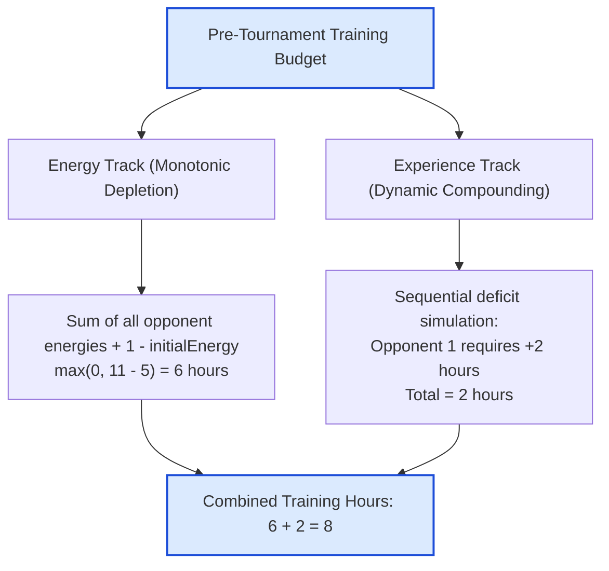

# Guided Example: Minimum Hours of Training to Win a Competition

## 1. Problem Overview & Representative Instance

An athlete enters a tournament characterized by two independent attributes: energy and experience. Initially, the athlete possesses positive values $\text{initialEnergy}$ and $\text{initialExperience}$. A sequential ladder of $n$ opponents must be contested in strict order:
- Opponent $i$ requires overcoming energy threshold $\text{energy}[i]$ and experience threshold $\text{experience}[i]$.
- To defeat opponent $i$, the athlete's current statistics must be **strictly greater** than the opponent's values:
  $$\text{current\_energy} > \text{energy}[i] \quad \text{and} \quad \text{current\_experience} > \text{experience}[i]$$
- Upon victory, energy depletes: $\text{current\_energy} \leftarrow \text{current\_energy} - \text{energy}[i]$.
- Experience compounds: $\text{current\_experience} \leftarrow \text{current\_experience} + \text{experience}[i]$.

Before the competition begins, each hour of pre-tournament training can increase either initial energy or initial experience by exactly $1$ point. We seek the minimum total hours of training needed to guarantee victory across all $n$ opponents.

Consider the representative competition:
- $\text{initialEnergy} = 5$, $\text{initialExperience} = 3$
- $\text{energy} = [1, 4, 3, 2]$
- $\text{experience} = [2, 6, 3, 1]$

The athlete must defeat all four opponents sequentially without suffering an energy exhaustion or an experience shortfall at any stage.

## 2. Mathematical & Algorithmic Principles

Because energy changes and experience changes do not influence one another, the two requirements decouple completely:
$$\text{Total Hours} = \text{Energy Hours} + \text{Experience Hours}$$

### Energy Track: Closed-Form Monotonic Depletion
Energy decreases monotonically after every match. To survive the final match $n - 1$ with at least $1$ remaining energy unit, the total initial energy must satisfy:
$$\text{required\_energy} \ge \sum_{i=0}^{n-1} \text{energy}[i] + 1$$
Therefore, the minimum training hours allocated to energy is:
$$\text{hours}_{\text{energy}} = \max\left(0,\, \sum_{i=0}^{n-1} \text{energy}[i] + 1 - \text{initialEnergy}\right)$$

### Experience Track: Online Greedy Deficit Elimination
Experience increases after each victory. At encounter $i$:
1. If the current experience $X \le \text{experience}[i]$, the athlete faces a deficit. To achieve the strict inequality $X > \text{experience}[i]$, we must elevate $X$ before the tournament by:
   $$\text{deficit} = \text{experience}[i] + 1 - X$$
2. We immediately add $\text{deficit}$ to our training total, update the baseline $X \leftarrow X + \text{deficit} = \text{experience}[i] + 1$, and then absorb the opponent's experience:
   $$X \leftarrow X + \text{experience}[i]$$
3. If $X > \text{experience}[i]$, no training is required; we simply add $\text{experience}[i]$ to $X$.

Summing the two independent requirements produces the globally minimal training investment.

## 3. Step-by-Step Walkthrough with Intermediate State

We trace the representative instance: $\text{initialEnergy} = 5, \text{initialExperience} = 3$, $\text{energy} = [1, 4, 3, 2], \text{experience} = [2, 6, 3, 1]$.

- **Phase 1: Energy Training Calculation:**
  - Total opponent energy sum:
    $$\sum \text{energy} = 1 + 4 + 3 + 2 = 10$$
  - Strict survival requires at least $10 + 1 = 11$ starting energy.
  - Initial energy provided is $5$.
  - Energy training needed:
    $$\text{hours}_{\text{energy}} = \max(0, 11 - 5) = 6 \text{ hours}$$

- **Phase 2: Experience Simulation:**
  Initialize $X = 3$, $\text{hours}_{\text{exp}} = 0$.

  - **Opponent 0 ($\text{exp}[0] = 2$):**
    - Check: $X = 3 > 2$. Valid without training.
    - Absorb: $X \leftarrow 3 + 2 = 5$.
    - Deficit added: $0$.

  - **Opponent 1 ($\text{exp}[1] = 6$):**
    - Check: $X = 5 \le 6$. Insufficient experience.
    - Required value: $6 + 1 = 7$.
    - Deficit: $7 - 5 = 2$ hours.
    - Accumulate training: $\text{hours}_{\text{exp}} \leftarrow 0 + 2 = 2$.
    - Boost baseline: $X \leftarrow 7$.
    - Absorb: $X \leftarrow 7 + 6 = 13$.

  - **Opponent 2 ($\text{exp}[2] = 3$):**
    - Check: $X = 13 > 3$. Valid without training.
    - Absorb: $X \leftarrow 13 + 3 = 16$.
    - Deficit added: $0$.

  - **Opponent 3 ($\text{exp}[3] = 1$):**
    - Check: $X = 16 > 1$. Valid without training.
    - Absorb: $X \leftarrow 16 + 1 = 17$.
    - Deficit added: $0$.

- **Phase 3: Grand Total:**
  $$\text{Total Hours} = \text{hours}_{\text{energy}} + \text{hours}_{\text{exp}} = 6 + 2 = 8 \text{ hours}$$

## 4. Comprehensive State Trace

The opponent-by-opponent evaluation ledger is detailed in the table below:

| Match $i$ | Opponent Energy | Current Energy (Starting at 11) | Energy After Match | Opponent Exp | Starting Exp | Exp Deficit | Added Training | Post-Battle Exp |
|---|---|---|---|---|---|---|---|---|
| 0 | 1 | 11 ($> 1$) | 10 | 2 | 3 ($> 2$) | 0 | 0 | $3 + 2 = 5$ |
| 1 | 4 | 10 ($> 4$) | 6 | 6 | 5 ($\le 6$) | $7 - 5 = 2$ | 2 | $7 + 6 = 13$ |
| 2 | 3 | 6 ($> 3$) | 3 | 3 | 13 ($> 3$) | 0 | 0 | $13 + 3 = 16$ |
| 3 | 2 | 3 ($> 2$) | 1 | 1 | 16 ($> 1$) | 0 | 0 | $16 + 1 = 17$ |

The comparative requirements between energy and experience tracks are summarized below:

| Attribute Track | Pre-Tournament Value | Tournament Depletion / Gain Dynamics | Required Floor at Bottleneck | Final Training Hours |
|---|---|---|---|---|
| Energy | 5 | Decreases by $\sum \text{energy} = 10$ | Must exceed each opponent; final $\ge 1$ | 6 |
| Experience | 3 | Increases by $\text{experience}[i]$ after each win | Bottleneck at opponent 1 ($X \ge 7$) | 2 |

Total minimal training hours required is 8.

## 5. Algorithmic Correctness & Soundness

The correctness of decoupling and greedy elevation is justified by:
1. **Attribute Independence:** No action or result in the energy track affects the experience track, and vice-versa. Minimizing their sum is strictly equivalent to independently minimizing each attribute.
2. **Sufficiency and Necessity for Energy:** Because energy only decreases and every single match must be won, the cumulative consumption is invariant: exactly $\sum \text{energy}[i]$. If the starting energy is $E$, the energy remaining after match $k$ is $E - \sum_{j=0}^k \text{energy}[j]$. The condition that this remains $\ge 1$ for all $k$ is bottlenecked at $k = n - 1$. Thus, $E \ge \sum_{j=0}^{n-1} \text{energy}[j] + 1$ is both necessary and sufficient.
3. **Optimality of Greedy Experience Elevation:** Any hour of training added to initial experience propagates forward through all $n$ matches without loss. Elevating initial experience by the exact local deficit at the moment it occurs guarantees feasibility for all subsequent matches while never training more than strictly necessary.

## 6. Edge Cases & Anti-Patterns

- **Already Sufficient Stats:** If initial energy and experience strictly exceed all requirements (e.g. Example 2: $\text{initialEnergy} = 2, \text{initialExperience} = 4, \text{energy} = [1], \text{experience} = [3]$), $\text{hours} = 0$.
- **Strict Inequality Requirement ($>$ vs $\ge$):** If an opponent has experience $5$, an athlete with experience $5$ cannot win; they must reach $6$. Forgetting the $+1$ offset produces incorrect deficit calculations.
- **Single Dominant Opponent:** A single massive opponent early in the ladder forces a large upfront experience elevation that carries over to trivialize all subsequent opponents.
- **Anti-Pattern: Step-by-Step Energy Simulation:** Simulating energy step-by-step with branch checks is redundant. Closed-form summation $\sum \text{energy} + 1$ computes energy hours in a single arithmetic expression.

## 7. Complexity Analysis

- **Time Complexity:**
  - Summing the $n$ elements of $\text{energy}$ takes $\mathcal{O}(n)$ time.
  - Scanning through the $n$ elements of $\text{experience}$ performs $\mathcal{O}(1)$ comparisons and updates per opponent: $\mathcal{O}(n)$ time.
  - Total time complexity is strictly $\mathcal{O}(n)$.
  - With $n \le 100$, execution requires fewer than $200$ CPU instructions.
- **Space Complexity:**
  - The algorithm operates with a constant number of scalar accumulators.
  - Auxiliary space complexity is strictly $\mathcal{O}(1)$.
