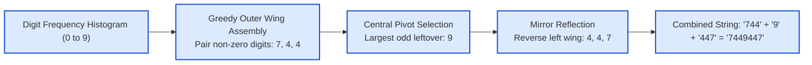

# Guided Example: Largest Palindromic Number

## 1. Problem Overview & Representative Instance

Given a string of decimal digits $\text{num}$ of length $n$ ($1 \le n \le 10^5$), we must select a non-empty subset of its digits and arrange them into a palindromic string. Each occurrence of a digit in $\text{num}$ can be used at most once.

The goal is to construct the **numerically largest possible palindromic integer**. A valid multi-digit number must never contain leading zeros (for instance, `"07470"` is illegal and must be reduced to `"747"`, while `"0"` is legal only as a single-digit integer).

Consider the representative multiset of digits:
$$\text{num} = \text{"444947137"}$$

The total length is $n = 9$. We have:
- Four $4$s
- Two $7$s
- One $9$, one $3$, and one $1$

To maximize an integer numerically, we must prioritize two criteria in order:
1. **Maximize length:** Using more digits strictly dominates any shorter number.
2. **Maximize most significant digits:** Place larger digits as close to the outer boundaries (highest place values) as possible.

## 2. Mathematical & Algorithmic Principles

Any palindrome $P$ can be factored into three contiguous segments:
$$P = L \circ C \circ \text{reverse}(L)$$
where $L$ is the left wing string, $C$ is the center (either a single digit or empty), and $\text{reverse}(L)$ is the mirrored right wing.

### Construction Strategy:
1. **Histogram of Frequencies:**
   Count the frequency of each decimal digit $d \in \{0, 1, \dots, 9\}$ in $\text{num}$.
2. **Greedy Outer Wing Assembly:**
   Iterate $d$ from $9$ down to $0$:
   - **Leading Zero Guard:** If $d = 0$ and the left wing $L$ is currently empty, we cannot use pairs of zeros for the outer wings, because doing so would introduce leading zeros.
   - Otherwise, if $\text{count}[d] \ge 2$, we can allocate $k = \lfloor \text{count}[d] / 2 \rfloor$ copies of digit $d$ to the left wing $L$.
   - Symmetrically, $k$ copies will be assigned to the right wing, using $2k$ occurrences. We update $\text{count}[d] \leftarrow \text{count}[d] \bmod 2$.
3. **Central Pivot Selection:**
   A palindrome of odd length can accommodate exactly one unpaired center digit. To maximize the number, scan $d$ from $9$ down to $0$:
   - The first digit encountered with $\text{count}[d] > 0$ is selected as the center $C$.
   - If no leftover digit exists with positive count, $C$ remains empty.
4. **Zero Edge Case:**
   If both $L$ is empty and no non-zero center was found, but $\text{count}[0] > 0$, the maximum number is the single digit `"0"`.

## 3. Step-by-Step Walkthrough with Intermediate State

We trace the representative string $\text{num} = \text{"444947137"}$.

- **Phase 1: Frequency Counting:**
  - $\text{count}[9] = 1$
  - $\text{count}[7] = 2$
  - $\text{count}[4] = 4$
  - $\text{count}[3] = 1$
  - $\text{count}[1] = 1$
  - All other digits have frequency $0$.

- **Phase 2: Left Wing Assembly (Scan $d = 9$ down to $0$):**
  - $d = 9$: $\text{count}[9] = 1 < 2 \implies$ cannot form pair.
  - $d = 8$: $\text{count}[8] = 0$.
  - $d = 7$: $\text{count}[7] = 2 \ge 2 \implies$ allocate $\lfloor 2 / 2 \rfloor = 1$ copy of `'7'`.
    - Left wing: $L = \text{"7"}$.
    - Remaining count: $\text{count}[7] \leftarrow 0$.
  - $d = 6, 5$: counts are $0$.
  - $d = 4$: $\text{count}[4] = 4 \ge 2 \implies$ allocate $\lfloor 4 / 2 \rfloor = 2$ copies of `'4'`.
    - Left wing: $L = \text{"744"}$.
    - Remaining count: $\text{count}[4] \leftarrow 0$.
  - $d = 3$: $\text{count}[3] = 1 < 2$.
  - $d = 2$: $\text{count}[2] = 0$.
  - $d = 1$: $\text{count}[1] = 1 < 2$.
  - $d = 0$: $\text{count}[0] = 0$.

- **Phase 3: Central Pivot Selection (Scan $d = 9$ down to $0$):**
  - Remaining pool: $\text{count}[9] = 1$, $\text{count}[3] = 1$, $\text{count}[1] = 1$.
  - Highest available digit is $d = 9$.
  - Set center: $C = \text{"9"}$.
  - Remaining digits ($3$ and $1$) cannot be paired symmetrically and are omitted.

- **Phase 4: Palindrome Synthesis:**
  - Left wing: $L = \text{"744"}$.
  - Center: $C = \text{"9"}$.
  - Right wing: $\text{reverse}(L) = \text{"447"}$.
  - Result:
    $$\text{"744"} + \text{"9"} + \text{"447"} = \text{"7449447"}$$

## 4. Comprehensive State Trace

The digit allocation profile across all ten decimal characters is detailed in the table below:

| Digit $d$ | Input Frequency | Pairs Formed $\lfloor \text{count} / 2 \rfloor$ | Left Wing Contribution | Left Wing State $L$ | Residual Count | Role in Final Palindrome |
|---|---|---|---|---|---|---|
| 9 | 1 | 0 | `""` | `""` | 1 | Central Pivot |
| 8 | 0 | 0 | `""` | `""` | 0 | None |
| 7 | 2 | 1 | `"7"` | `"7"` | 0 | Outer Wing Pair |
| 6 | 0 | 0 | `""` | `"7"` | 0 | None |
| 5 | 0 | 0 | `""` | `"7"` | 0 | None |
| 4 | 4 | 2 | `"44"` | `"744"` | 0 | Inner Wing Pairs |
| 3 | 1 | 0 | `""` | `"744"` | 1 | Unused (suboptimal) |
| 2 | 0 | 0 | `""` | `"744"` | 0 | None |
| 1 | 1 | 0 | `""` | `"744"` | 1 | Unused (suboptimal) |
| 0 | 0 | 0 | `""` | `"744"` | 0 | None |

We also contrast how various potential arrangements compare numerically:

| Candidate Palindrome | Digits Included | Length | Most Significant Digit | Numerical Validity |
|---|---|---|---|---|
| `"7449447"` | $\{7, 7, 4, 4, 4, 4, 9\}$ | 7 | 7 | Optimal |
| `"4749474"` | $\{7, 7, 4, 4, 4, 4, 9\}$ | 7 | 4 | Suboptimal ($4 < 7$) |
| `"4479744"` | $\{7, 7, 4, 4, 4, 4, 9\}$ | 7 | 4 | Suboptimal ($4 < 7$) |
| `"9"` | $\{9\}$ | 1 | 9 | Suboptimal (shorter) |

The configuration placing `'7'` in the highest place value maximizes the numerical magnitude.

## 5. Algorithmic Correctness & Soundness

The correctness of this greedy algorithm is guaranteed by standard number-theoretic principles:
1. **Length Dominance:**
   Any base-10 integer with $k + 1$ digits is strictly greater than any integer with $k$ digits:
   $$10^k > \sum_{i=0}^{k-1} 9 \cdot 10^i = 10^k - 1$$
   Therefore, maximizing the number of paired digits and including an available center digit guarantees maximal length.
2. **Lexicographical Significance:**
   For numbers of equal length, the value is determined by the most significant mismatch. Scanning from $9$ down to $0$ ensures that higher digit values are placed in earlier positions of $L$, maximizing the highest place values $10^{m-1}, 10^{m-2}, \dots$.
3. **Soundness of Leading Zero Guard:**
   If $L$ is empty, placing `'0'` at the outer boundary produces a number with leading zeros (e.g. `"0...0"`), which violates the contract. Zeros are only permitted into $L$ once a non-zero digit has already been assigned to the leading position.

## 6. Edge Cases & Anti-Patterns

- **All Zeros ($\text{num} = \text{"0000"}$):**
  $L$ remains empty because $d = 0$ with empty $L$ is blocked. Center scan finds $d = 0$ with count $> 0$, setting $C = \text{"0"}$. Final result is `"0"`.
- **Zeros Dominate Non-Zeros ($\text{num} = \text{"00009"}$):**
  No non-zero pairs exist, so $L$ is empty. Center scan selects $d = 9$. Result is `"9"`. Surrounding it with zeros would produce `"00900"`, which is invalid.
- **Interior Zeros ($\text{num} = \text{"00001100"}$):**
  Digit $1$ forms a pair, making $L = \text{"1"}$. Now $L$ is non-empty, so four zeros form two pairs, making $L = \text{"100"}$. Output is `"100001"`.
- **Anti-Pattern: Including Multiple Odd Digits:** A palindrome can have at most one center character. Attempting to force two odd leftover digits breaks symmetry. Only the single largest odd digit may be retained.

## 7. Complexity Analysis

- **Time Complexity:**
  - Counting digit frequencies across the input string of length $n$ takes $\mathcal{O}(n)$ time.
  - The loops for wing assembly and center selection iterate over the constant alphabet size $|\Sigma| = 10$ (digits $0$ to $9$).
  - Constructing the final string of length $\le n$ takes $\mathcal{O}(n)$ time.
  - Total time complexity is strictly linear: $\mathcal{O}(n + |\Sigma|) = \mathcal{O}(n)$.
- **Space Complexity:**
  - The frequency table stores $10$ integer counters: $\mathcal{O}(1)$ space.
  - The string buffer for $L$ and the final result uses $\mathcal{O}(n)$ space.
  - Total auxiliary space complexity is $\mathcal{O}(n)$.
