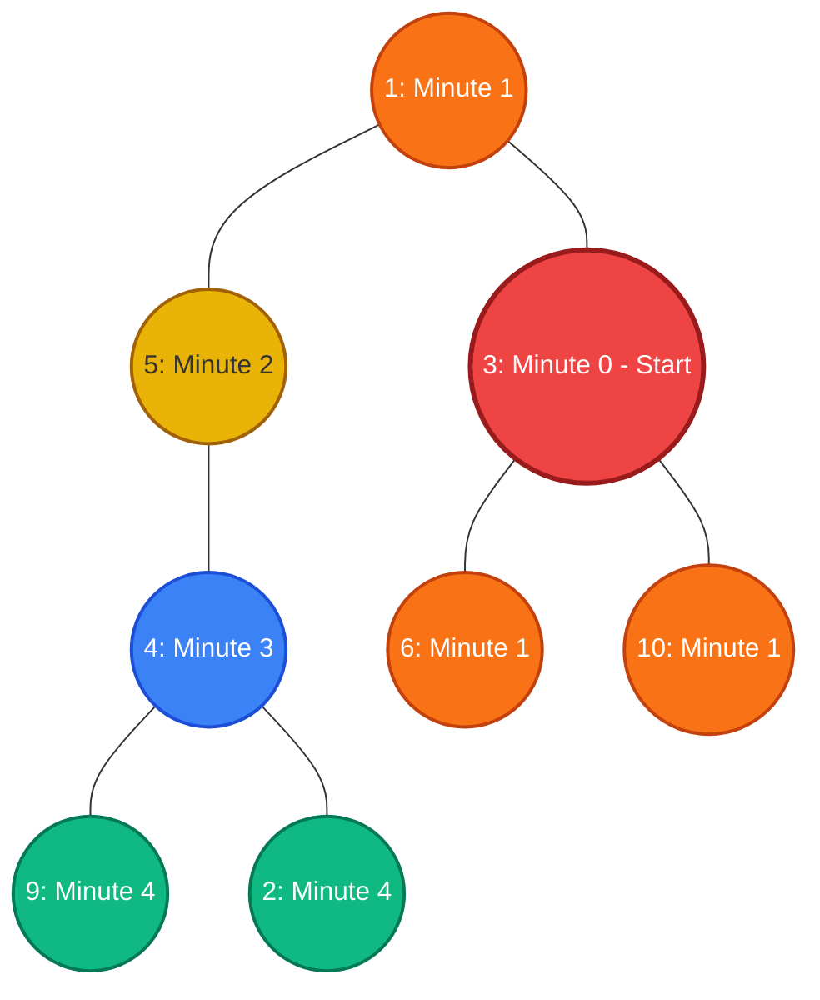

# Guided Example: Amount of Time for Binary Tree to Be Infected

## 1. Problem Overview & Representative Instance

We are given the root of a binary tree containing $n$ vertices ($1 \le n \le 10^5$), each possessing a unique integer value. A specified node labeled $\text{start}$ becomes infected at minute $0$.

During each subsequent minute, the infection spreads from any infected vertex to all of its uninfected adjacent neighbors simultaneously. In a tree, adjacency is bidirectional:
- An infected node infects its parent.
- An infected node infects both its left and right children.

The process continues until every node in the tree is infected. The objective is to calculate the total number of minutes required for the infection to permeate the entire tree.

Consider the representative tree:
$$\text{root} = [1, 5, 3, \text{null}, 4, 10, 6, 9, 2], \quad \text{start} = 3$$

The tree layout:
- Root is $1$.
- Left branch: $1 \to 5 \to 4 \to \{9, 2\}$.
- Right branch: $1 \to 3 \to \{10, 6\}$.
- Patient zero is node $3$.

Because infection spreads uniformly across every unweighted undirected edge, the total time required is mathematically equivalent to the **eccentricity** of node $\text{start}$—that is, the maximum shortest-path distance from node $\text{start}$ to any other node in the graph:
$$\text{time} = \max_{u \in V} \text{dist}_T(\text{start}, u)$$

## 2. Mathematical & Algorithmic Principles

A binary tree is typically represented as a directed data structure where nodes only hold pointers to their children. To simulate radial propagation from an arbitrary interior node, we must support bidirectional traversal:
1. **Undirected Adjacency Transformation:**
   Perform a depth-first or breadth-first search starting from the root to construct an undirected adjacency graph $G = (V, E)$:
   - For every node $u$ with left child $v_L$: add undirected edge $(u, v_L)$.
   - For every node $u$ with right child $v_R$: add undirected edge $(u, v_R)$.
   Because $G$ is a connected tree on $n$ vertices, $|E| = n - 1$.
2. **Breadth-First Search (BFS) Wavefront:**
   Initiate a queue-based level-order traversal rooted at $\text{start}$:
   - At minute $0$: enqueue $\text{start}$ with $\text{dist} = 0$, mark visited.
   - At each minute $t$:
     De-queue all nodes belonging to the current wavefront. For each node, inspect all unvisited neighbors (parent, left child, right child).
     Mark newly reached neighbors as visited and enqueue them for minute $t + 1$.
   - When the queue becomes empty, the last minute level processed represents the maximum distance from $\text{start}$.

Because an unweighted tree contains exactly one simple path between any pair of nodes, BFS explores nodes in strictly increasing order of path length, guaranteeing optimal shortest-path distances.

## 3. Step-by-Step Walkthrough with Intermediate State

We trace the BFS infection progression starting from node $3$ on the tree with vertices $\{1, 3, 4, 5, 6, 9, 10, 2\}$.

- **Graph Construction:**
  Adjacency lists:
  - $1: [5, 3]$
  - $3: [1, 10, 6]$
  - $5: [1, 4]$
  - $4: [5, 9, 2]$
  - $10: [3]$
  - $6: [3]$
  - $9: [4]$
  - $2: [4]$

- **Minute 0 (Initialization):**
  - Infection source: $\{3\}$.
  - Visited set: $\{3\}$.
  - Queue: $[3]$.
  - Elapsed minutes: $0$.

- **Minute 1:**
  - Dequeue wavefront: $\{3\}$.
  - Unvisited neighbors of $3$:
    - Parent $1$ (unvisited $\implies$ infected)
    - Child $10$ (unvisited $\implies$ infected)
    - Child $6$ (unvisited $\implies$ infected)
  - Newly infected wavefront: $\{1, 10, 6\}$.
  - Visited set: $\{3, 1, 10, 6\}$.
  - Elapsed minutes: $1$.

- **Minute 2:**
  - Dequeue wavefront: $\{1, 10, 6\}$.
  - Neighbors of $10$: $[3]$ (already visited).
  - Neighbors of $6$: $[3]$ (already visited).
  - Neighbors of $1$: $[5, 3]$. Node $3$ visited; node $5$ unvisited $\implies$ infected.
  - Newly infected wavefront: $\{5\}$.
  - Visited set: $\{3, 1, 10, 6, 5\}$.
  - Elapsed minutes: $2$.

- **Minute 3:**
  - Dequeue wavefront: $\{5\}$.
  - Neighbors of $5$: $[1, 4]$. Node $1$ visited; node $4$ unvisited $\implies$ infected.
  - Newly infected wavefront: $\{4\}$.
  - Visited set: $\{3, 1, 10, 6, 5, 4\}$.
  - Elapsed minutes: $3$.

- **Minute 4:**
  - Dequeue wavefront: $\{4\}$.
  - Neighbors of $4$: $[5, 9, 2]$. Node $5$ visited; nodes $9$ and $2$ unvisited $\implies$ infected.
  - Newly infected wavefront: $\{9, 2\}$.
  - Visited set: $\{3, 1, 10, 6, 5, 4, 9, 2\}$.
  - Elapsed minutes: $4$.

- **Minute 5 (Termination):**
  - Dequeue wavefront: $\{9, 2\}$.
  - Neighbors of $9$: $[4]$ (visited).
  - Neighbors of $2$: $[4]$ (visited).
  - Newly infected wavefront: $\emptyset$.
  - Queue is exhausted. All $8$ nodes are visited.
  - Total time: $4$ minutes.

## 4. Comprehensive State Trace

The level-by-level BFS infection progression is documented in the table below:

| Elapsed Minute $t$ | Current Infection Frontier | Examined Neighbors | Newly Infected Cohort | Running Total Infected | Remaining Healthy Nodes |
|---|---|---|---|---|---|
| 0 | $\{3\}$ | Initial seed | $\{3\}$ | 1 | 7 |
| 1 | $\{3\}$ | $1, 10, 6$ | $\{1, 10, 6\}$ | 4 | 4 |
| 2 | $\{1, 10, 6\}$ | $5$ (from 1) | $\{5\}$ | 5 | 3 |
| 3 | $\{5\}$ | $4$ (from 5) | $\{4\}$ | 6 | 2 |
| 4 | $\{4\}$ | $9, 2$ (from 4) | $\{9, 2\}$ | 8 | 0 |

We also detail the shortest tree path and distance from node $3$ to each node in the tree:

| Destination Node $u$ | Unique Simple Path from Node 3 | Path Length (Edges) | Arrival Minute |
|---|---|---|---|
| 3 | $[3]$ | 0 | 0 |
| 10 | $[3 \to 10]$ | 1 | 1 |
| 6 | $[3 \to 6]$ | 1 | 1 |
| 1 | $[3 \to 1]$ | 1 | 1 |
| 5 | $[3 \to 1 \to 5]$ | 2 | 2 |
| 4 | $[3 \to 1 \to 5 \to 4]$ | 3 | 3 |
| 9 | $[3 \to 1 \to 5 \to 4 \to 9]$ | 4 | 4 |
| 2 | $[3 \to 1 \to 5 \to 4 \to 2]$ | 4 | 4 |

The maximum distance to any vertex is $\max(0, 1, 1, 1, 2, 3, 4, 4) = 4$.

## 5. Algorithmic Correctness & Soundness

The correctness of the BFS infection model follows from foundational properties of tree graphs:
1. **Tree Metric Uniqueness:** A tree is a connected acyclic undirected graph. Between any two vertices $u$ and $v$, there exists a unique simple path. The shortest path distance $\text{dist}(u, v)$ is the exact edge length of this unique path.
2. **Breadth-First Search Invariant:**
   In an unweighted graph, BFS discovers all vertices at distance $d$ before any vertex at distance $d + 1$. Because infection spreads by $1$ edge per unit of time, a node at tree distance $d$ from $\text{start}$ is infected at precisely minute $d$.
3. **Exhaustion Guarantee:**
   Because the tree is connected, the BFS queue visits every vertex in $V$. The number of level-by-level expansions minus one equals the maximum eccentricity $\max_{u \in V} \text{dist}(\text{start}, u)$, which represents the moment the final node is infected.

## 6. Edge Cases & Anti-Patterns

- **Single Node Tree ($\text{root} = [1], \text{start} = 1$):**
  Node 1 is infected at minute 0. The queue pops 1, finds no neighbors, and finishes immediately. Total time is $0$ minutes.
- **Start Node at Root:**
  Infection spreads purely downward into all subtrees. The required time equals the standard height of the tree rooted at the source.
- **Start Node at Deep Leaf:**
  Infection must travel upward through the parent chain all the way to the root before descending down the opposite side of the tree, reaching distances approaching the tree diameter.
- **Anti-Pattern: Standard Directed Tree Traversal:** Attempting to solve the problem by only traversing child pointers fails completely because infection travels backward to parents and across to sibling subtrees. Bidirectional graph conversion or upward parent tracking is required.

## 7. Complexity Analysis

- **Time Complexity:**
  - Converting the tree of $n$ nodes into an adjacency list visits each node and its edges once: $\mathcal{O}(n)$ time.
  - The BFS traversal enqueues each of the $n$ nodes exactly once and inspects $2(n - 1)$ directed edge instances: $\mathcal{O}(n)$ time.
  - Total time complexity is strictly $\mathcal{O}(n)$.
  - For $n \le 10^5$, execution completes in tens of milliseconds.
- **Space Complexity:**
  - The adjacency list stores $n$ vertices and $2(n - 1)$ edges: $\mathcal{O}(n)$ space.
  - The BFS queue and visited hash set store at most $n$ elements: $\mathcal{O}(n)$ space.
  - Total auxiliary space complexity is $\mathcal{O}(n)$.
