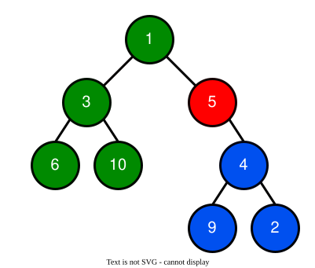

[TOC]

## Solution

---
### Overview

Our objective is to find the number of minutes needed for the entire tree to become infected. A node one level away from the start node takes 1 minute to become infected. All nodes on that level take the same amount of time to become infected. A node two levels away from the start node takes two minutes to become infected. We can reason that the distance of any given node from the start node will be the number of minutes it takes to infect the whole tree. Therefore, our solution will be the maximum distance from the start node.

---

### Approach 1: Convert to Graph and Breadth-First Search

#### Intuition

Before we can approach finding the maximum distance from the start node, we must note that the start node is not necessarily the root node. This means the infection may spread from child to root, which would include traversal from child to parent. The ordinary definition of a binary tree does not support this kind of traversal, so we need to convert the binary tree to a structure that represents the original but allows traversal from child to parent. In this scenario, a child is a neighbor of a parent and vice-versa. An undirected graph will work for this.

##### 1. Convert the binary tree to an undirected graph

A tree is a special kind of graph with a root and subtrees. We want to search the graph from any node, not just the root, and be able to traverse to all neighbors, including parents and children. An undirected graph is a set of vertices with edges that connect them. We will use a map to represent our graph, made up of integer vertices, and an adjacency list to record the edges.

We can define a function that converts our binary tree to an undirected graph by traversing the tree and creating a graph. The parameters are the current node and its parent. We traverse the tree with a preorder traversal, visiting first the root, then the left and right child, so we can log the parent of each node and make a connection to it. When we encounter a new right or left child, we add them to the adjacency list.

The algorithm for this recursive `convert` function is defined as follows:

1. If $current = null$, return.
2. If the root has a new value, we add it to the map and create a new adjacency list to store the adjacent vertices
3. Retrieve the adjacency list of the current vertex.
3. If `current` is not the root, add its parent to the adjacency list.
4. If `current` a left child, add the child to its adjacency list.
5. If `current` has a right child, add the child to its adjacency list.
6. Recursively call convert on `current.left` with current as the parent.
7. Recursively call convert on `current.right` with current as the parent.

```python
def convert(
    self, current: TreeNode, parent: int, tree_map: Dict[int, Set[int]]
):
    if current is None:
        return
    if current.val not in tree_map:
        tree_map[current.val] = set()
    adjacent_list = tree_map[current.val]
    if parent != 0:
        adjacent_list.add(parent)
    if current.left:
        adjacent_list.add(current.left.val)
    if current.right:
        adjacent_list.add(current.right.val)
    self.convert(current.left, current.val, tree_map)
    self.convert(current.right, current.val, tree_map)
```

##### 2. Conduct a Breath First Search (BFS) to find the maximum distance between the start and other vertices.

We can find the maximum distance between the vertex with the value `start` and the rest of the vertices in our graph by using a BFS starting with the `start`.

###### Standard Breadth-First Search
1. Add the first node to the queue
2. While the queue is not empty:
- Remove the front node of the queue and mark it as visited.
- Check whether all adjacent nodes have been visited. If they have not, add them to the queue

If you are not familiar with BFS traversal, we suggest you read our relevant [LeetCode Explore Card](https://leetcode.com/explore/learn/card/queue-stack/231/practical-application-queue/1376/).

To determine the amount of time it takes to infect all of the vertices, we specifically need to determine the maximum distance from the start vertex. We use the variable `minute` to store the distance from the start vertex. We will make a few tweaks to BFS to update `minute` accurately.

For our implementation of BFS, we will use a queue to store the vertices that we need to visit. We will create a set to store the nodes we have already visited so we don't visit them multiple times. We add `start` to the queue and the visited set and then iterate through the vertices in the queue until it is empty.  We set the variable `levelSize` to the size of the queue so we can keep track of how many vertices are in the current level. We `poll()` a vertex `current` from the queue. We iterate through each of the values in its adjacency list checking whether each one has been visited. If they have not been visited, we add them to the queue and the visited set. After adding all of the adjacent vertices, we decrement `levelSize`. When there are no more vertices in the current level, we will move to the next level, so we increment the variable `minute`. When the queue is empty, we return $minute - 1$, because we have incremented `minute` for each level, but the time taken by the first node to infect neighbors is zero.

#### Algorithm

1. Declare a hash map `map` to store vertices and their adjacency list for edges.
2. Implement a function `convert` that creates an undirected graph of the tree and stores it in `map` as explained above.
3. Call `convert(root, 0, map)` as the root has no parent.
4. Set `minute`, the distance from the start vertex to 0.
5. Initialize a `queue` and add `start`.
6. Initialize a set `visited` to store the visited vertexes and add `start`.
7. While `queue` is not empty:
- Set `levelSize`, the number of vertices in this level, to the size of `queue`.
- While  `levelSize` is greater than 0:
- Remove a vertex `current` from the `queue `.
- For each edge in the adjacency list:
- Check whether the edge has been visited. If not, add it to `queue` and `visited`.
- Decrement `levelSize`.
- Increment `minute` as the distance from `startNode` has increased.
8. After the BFS, return $minute - 1$.

#### Implementation

```python
# Definition for a binary tree node.
# class TreeNode:
#     def __init__(self, val=0, left=None, right=None):
#         self.val = val
#         self.left = left
#         self.right = right
class Solution:
    def amountOfTime(self, root: TreeNode, start: int) -> int:
        tree_map: Dict[int, Set[int]] = {}
        self.convert(root, 0, tree_map)
        queue = deque([start])
        minute = 0
        visited = {start}

        while queue:
            level_size = len(queue)
            while level_size > 0:
                current = queue.popleft()
                for num in tree_map[current]:
                    if num not in visited:
                        visited.add(num)
                        queue.append(num)
                level_size -= 1
            minute += 1

        return minute - 1

    def convert(
        self, current: TreeNode, parent: int, tree_map: Dict[int, Set[int]]
    ):
        if current is None:
            return
        if current.val not in tree_map:
            tree_map[current.val] = set()
        adjacent_list = tree_map[current.val]
        if parent != 0:
            adjacent_list.add(parent)
        if current.left:
            adjacent_list.add(current.left.val)
        if current.right:
            adjacent_list.add(current.right.val)
        self.convert(current.left, current.val, tree_map)
        self.convert(current.right, current.val, tree_map)
```

#### Complexity Analysis

Let $n$ be the number of nodes in the tree.

- Time complexity: $O(n)$

    Converting the tree to a graph using a preorder traversal costs $O(n)$. We then perform BFS, which also costs $O(n)$ because we don't visit a node more than once.

- Space complexity: $O(n)$

    When converting the tree to a graph, we require $O(n)$ extra space for the map. We also require $O(n)$ space for the queue and $O(n)$ space for the visited set during the BFS.

---

### Approach 2: One-Pass Depth-First Search

#### Intuition

The above solution passed over each node twice, once to create an undirected graph, and again to complete the breath first search. Is there a way to find the maximum distance from the start node with only one pass?

If the node with the value start happened to be the root, the maximum distance from the start node would be equivalent to the maximum height of the tree. We can also reason that there are certain test cases where the maximum height of the start node's sub-tree would be the maximum distance from the start node. An example case where this is true is `[1, 2, null, 3, null, 4, null]` where the start node is 2. In this case, all nodes have only one child.

Is there a way to calculate the maximum distance from the start node using subtree depths, even when the start node is not the root? This would help us solve the problem in just one pass.

The first question we need to solve is "Can we determine the max distance of the start node using the depths of sub-trees?" We use the image below to demonstrate a method for determining the max distance using sub-tree depths.



In the image above the start node is the red node, 5.
subDepth = 2 // red subtree's depth (Nodes below the start node)
depth = 1 // red node's depth (the start node)
otherDepth = 2 // green subtree depth (nodes above the start node)
distance = depth + other_depth = 3 // distance of any node above the start node from the start node
maxDistance = max(distance, sub_depth) = 3

Knowing that we can calculate the maximum distance from the start node using subtree height, we can attempt a one-pass method of solving this problem. We can base our algorithm on a calculation of max depth using a depth-first search.

Here is the basic recursive algorithm for finding the maximum depth, which we will adjust to our needs.

1. If $root = null$ return 0.
2. Make a recursive call with root.right and save as `rightDepth`.
3. Make a recursive call with root.left and save as `leftDepth`.
4. Return max(rightDepth, leftDepth) + 1.

One challenge to this task is identifying whether we have encountered the start node during the traversal. We can return a negative depth when we encounter the start node. This will flag that we have found the start node, and as we traverse the tree, whenever we encounter a negative depth, we know the subtree contains the start node.

Additionally, as we traverse the tree, we might find the start node before we have calculated the max depth of each part of the tree. Therefore, we need to be able to save the max distance and continue calculating it while traversing the rest of the tree.

There are four main cases:

1. If `root` is null, return 0.
2. $\text{root.val} = start$. If so, we return $depth = -1$ to signify this is the start node. In this way, in subsequent recursive calls, the parent node of the start node will know whether its child nodes contain the start node. Here we are also able to calculate the `maxDistance` of any node in the start node's subtree by finding the max of the left and right depth.
3.  The left and right depth are both non-negative. If they are, we know the start node is not in this subtree, and we can set $depth = max(leftDepth, rightDepth)$ just like with the basic max depth.
4. The final case is when the `root` is not the start node, but its subtree contains the start node. In this case, we will set $depth = min(leftDepth, rightDepth) - 1$, which will give us a negative number, the absolute value of which represents the distance of the start node to the root node. To calculate the distance from the start node to the furthest node in the other subtree, we will add the absolute value of the negative depth of the subtree that contains the start node, and the positive depth of the other subtree, for convenience, we can directly take the absolute value of two values. Then, we update `maxDistance` with `distance` if it is larger.

#### Algorithm
1. Declare a variable `maxDistance` to store maximum distance from the start node.
2. Define a function `traverse` that performs a depth-first search of the tree that returns depth and calculates and saves `maxDistance`.
- For each call to `traverse`, we have a new root and declare a variable $depth = 0$.
- If $root = null$ set $depth = 0$ and return.
- Recursively call `traverse` with `root.right` and save in the variable `rightDepth`.
- Recursively call `traverse` with `root.left` and save in the variable `leftDepth`.
- If $root = start$ the root is the start node:
- Set $maxDistance = max(leftDepth, rightDepth)$  to calcualte the start node's max depth.
- Set $depth = -1$ to signify this is the start node.
- If the `leftDepth` and `rightDepth` are both greater than or equal to `0`, the start node is not in this subtree:
- Set $depth = max(leftDepth, rightDepth) + 1$ to calculate the current root's max depth.
- Else, the current root's subtree contains the start node:
- Define a variable `distance` as the sum of `abs(leftDepth)` and `abs(rightDepth)`, which is the distance of the furthest node in the other subtree.
- Set $maxDistance = max(maxDistance, distance)$ to update `maxDistance` if `distance` is larger.
- Set $depth = min(leftDepth, rightDepth) - 1$ to calculate a negative number that signifies the subtree contains the start node and represents the distance of the start node from the root.
- return `depth`.
3. Call `traverse(root, start)`.
4. Return `maxDistance`.

#### Implementation

```python
# Definition for a binary tree node.
# class TreeNode:
#     def __init__(self, val=0, left=None, right=None):
#         self.val = val
#         self.left = left
#         self.right = right
class Solution:
    def __init__(self):
        self.max_distance = 0

    def amountOfTime(self, root, start):
        self.traverse(root, start)
        return self.max_distance

    def traverse(self, root, start):
        depth = 0
        if root is None:
            return depth

        left_depth = self.traverse(root.left, start)
        right_depth = self.traverse(root.right, start)

        if root.val == start:
            self.max_distance = max(left_depth, right_depth)
            depth = -1
        elif left_depth >= 0 and right_depth >= 0:
            depth = max(left_depth, right_depth) + 1
        else:
            distance = abs(left_depth) + abs(right_depth)
            self.max_distance = max(self.max_distance, distance)
            depth = min(left_depth, right_depth) - 1

        return depth
```

#### Complexity

Let $n$ be the number of nodes in the tree.

- Time complexity: $O(n)$

    Traversing the tree with a DFS costs $O(n)$ as we visit each node exactly once.

- Space complexity: $O(n)$

    The space complexity of DFS is determined by the maximum depth of the call stack, which corresponds to the height of the tree (or the graph in our case). In the worst case, if the tree is completely unbalanced (e.g., a linked list), the call stack can grow as deep as the number of nodes, resulting in a space complexity of $O(n)$.