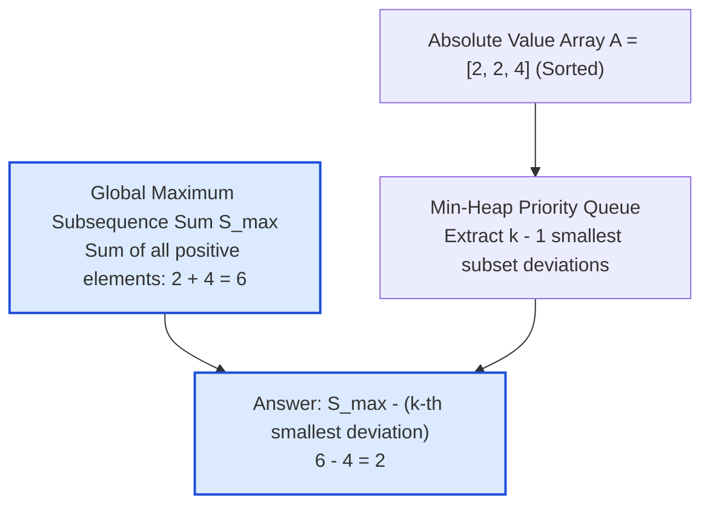

# Guided Example: Find the K-Sum of an Array

## 1. Problem Overview & Representative Instance

Given an integer array $\text{nums}$ of $n$ elements (where $-10^9 \le \text{nums}[i] \le 10^9$) and an integer $k$ ($1 \le k \le \min(2000, 2^n)$), consider all $2^n$ possible subsequences. Each subsequence is assigned the sum of its constituent elements, with the empty subsequence defined to have sum $0$.

The task is to determine the $k$-th largest subsequence sum, counting identical sums at their full multiplicity.

Consider the representative instance:
$$\text{nums} = [2, 4, -2], \quad k = 5$$

The array contains $n = 3$ elements, yielding $2^3 = 8$ subsequences. Sorting all $8$ subsequence sums in descending order gives:
$$[6, 4, 4, 2, 2, 0, 0, -2]$$
The $5$-th largest value is $2$.

Because $n$ can reach $10^5$, generating all $2^n$ subsequences requires exponential time and memory, which is completely intractable. However, because $k \le 2000$, we can reframe the search as finding the $k$-th smallest reduction from the global maximum sum.

## 2. Mathematical & Algorithmic Principles

### Duality Reduction:
1. **The Global Maximum Sum ($S_{\max}$):**
   The single largest subsequence sum is obtained by selecting every positive element and excluding every negative or zero element:
   $$S_{\max} = \sum_{x \in \text{nums}, x > 0} x$$
2. **Deviation from Maximum:**
   Any arbitrary subsequence can be viewed as an alteration from this optimal selection:
   - Excluding a positive element $x > 0$ decreases the sum by $x = |x|$.
   - Including a negative element $y \le 0$ decreases the sum by $-y = |y|$.
   Therefore, every subsequence sum corresponds uniquely to:
   $$\text{Sum} = S_{\max} - \sum_{e \in S} |e|$$
   for some subset $S \subseteq \text{nums}$.
3. **Problem Equivalence:**
   Finding the $k$-th largest subsequence sum in $\text{nums}$ is mathematically identical to finding:
   $$S_{\max} - \Delta_k$$
   where $\Delta_k$ is the $k$-th smallest subset sum of the transformed array of absolute values:
   $$A = [|\text{nums}[0]|,\, |\text{nums}[1]|,\, \dots,\, |\text{nums}[n - 1]|]$$

### Min-Heap Subset Generation:
Sort $A$ in non-decreasing order: $A[0] \le A[1] \le \dots \le A[n - 1]$.
The $1$-st smallest subset sum is the empty set with sum $\Delta_1 = 0$.
To generate subsequent subset sums in strictly increasing order without duplicate exploration, we use a min-heap storing tuples $(\text{sum}, i)$, where $\text{sum}$ is the total sum of a subset whose rightmost chosen element is at index $i$:
- Seed the heap with the smallest singleton: $(A[0], 0)$.
- At each step, pop the minimal state $(\text{sum}, i)$ from the heap:
  - **Branch 1 (Include next element):** Form a larger subset by appending the next element:
    $$(\text{sum} + A[i + 1],\, i + 1)$$
  - **Branch 2 (Replace current element):** Swap the current element for the next element, maintaining subset cardinality:
    $$(\text{sum} - A[i] + A[i + 1],\, i + 1)$$
  - Both branches are valid whenever $i + 1 < n$.

Extracting $k - 1$ elements from the min-heap yields $\Delta_k$, completing the solution in $\mathcal{O}(n \log n + k \log k)$ time.

## 3. Step-by-Step Walkthrough with Intermediate State

We trace the algorithm on $\text{nums} = [2, 4, -2]$ with $k = 5$.

- **Phase 1: Base Parameters:**
  - Positive sum: $S_{\max} = 2 + 4 = 6$.
  - Absolute values: $[|2|, |4|, |-2|] = [2, 4, 2]$.
  - Sorted array: $A = [2, 2, 4]$ ($n = 3$).

- **Phase 2: Priority Queue Transitions ($k = 5$):**
  - **Rank 1:** Empty subset: $\Delta_1 = 0$.
    Result for rank 1: $S_{\max} - 0 = 6$.
    Initialize heap with $(A[0], 0) = (2, 0)$.

  - **Extraction 1 (Determines Rank 2):**
    - Pop minimum: $(\text{sum} = 2, i = 0)$.
    - Deviation: $\Delta_2 = 2$.
    - Equivalent subsequence sum: $6 - 2 = 4$.
    - Push Branch 1 (include next): $(2 + A[1], 1) = (2 + 2, 1) = (4, 1)$.
    - Push Branch 2 (replace current): $(2 - A[0] + A[1], 1) = (2 - 2 + 2, 1) = (2, 1)$.
    - Heap contents: $[(2, 1), (4, 1)]$.

  - **Extraction 2 (Determines Rank 3):**
    - Pop minimum: $(\text{sum} = 2, i = 1)$.
    - Deviation: $\Delta_3 = 2$.
    - Equivalent subsequence sum: $6 - 2 = 4$.
    - Push Branch 1 (include next): $(2 + A[2], 2) = (2 + 4, 2) = (6, 2)$.
    - Push Branch 2 (replace current): $(2 - A[1] + A[2], 2) = (2 - 2 + 4, 2) = (4, 2)$.
    - Heap contents: $[(4, 1), (4, 2), (6, 2)]$.

  - **Extraction 3 (Determines Rank 4):**
    - Pop minimum: $(\text{sum} = 4, i = 1)$.
    - Deviation: $\Delta_4 = 4$.
    - Equivalent subsequence sum: $6 - 4 = 2$.
    - Push Branch 1: $(4 + A[2], 2) = (4 + 4, 2) = (8, 2)$.
    - Push Branch 2: $(4 - A[1] + A[2], 2) = (4 - 2 + 4, 2) = (6, 2)$.
    - Heap contents: $[(4, 2), (6, 2), (6, 2), (8, 2)]$.

  - **Extraction 4 (Determines Rank 5):**
    - Pop minimum: $(\text{sum} = 4, i = 2)$.
    - Deviation: $\Delta_5 = 4$.
    - Equivalent subsequence sum: $6 - 4 = 2$.
    - Target rank $k = 5$ reached!

- **Final Answer:**
  $$S_{\max} - \Delta_5 = 6 - 4 = 2$$

## 4. Comprehensive State Trace

The min-heap extraction sequence is detailed in the ledger below:

| Subsequence Rank $r$ | Popped State $(\text{sum}, i)$ | Popped Deviation $\Delta_r$ | Generated Include Branch | Generated Replace Branch | Active Heap Minima | Realized Subsequence Sum $S_{\max} - \Delta_r$ |
|---|---|---|---|---|---|---|
| 1 | Baseline (Empty) | 0 | Seed $(2, 0)$ | — | $[(2, 0)]$ | $6 - 0 = 6$ |
| 2 | $(2, 0)$ | 2 | $(4, 1)$ | $(2, 1)$ | $[(2, 1), (4, 1)]$ | $6 - 2 = 4$ |
| 3 | $(2, 1)$ | 2 | $(6, 2)$ | $(4, 2)$ | $[(4, 1), (4, 2), (6, 2)]$ | $6 - 2 = 4$ |
| 4 | $(4, 1)$ | 4 | $(8, 2)$ | $(6, 2)$ | $[(4, 2), (6, 2), (6, 2), (8, 2)]$ | $6 - 4 = 2$ |
| 5 | $(4, 2)$ | 4 | — ($i+1 = n$) | — | Remaining Heap | $6 - 4 = 2$ |

The complete mapping of all 8 subsets and their corresponding subsequence realizations is summarized below:

| Subset of Absolute Array $A = [2, 2, 4]$ | Subset Sum $\Delta$ | Originating Subsequence of $\text{nums}$ | Calculated Sum ($6 - \Delta$) | Rank in Non-Increasing Order |
|---|---|---|---|---|
| $\emptyset$ | 0 | $\{2, 4\}$ | 6 | 1 |
| $\{A[0]\}$ | 2 | $\{4\}$ (exclude 2) | 4 | 2 |
| $\{A[1]\}$ | 2 | $\{2, 4, -2\}$ (include -2) | 4 | 3 |
| $\{A[2]\}$ | 4 | $\{2\}$ (exclude 4) | 2 | 4 |
| $\{A[0], A[1]\}$ | 4 | $\{4, -2\}$ | 2 | 5 |
| $\{A[0], A[2]\}$ | 6 | $\emptyset$ | 0 | 6 |
| $\{A[1], A[2]\}$ | 6 | $\{2, -2\}$ | 0 | 7 |
| $\{A[0], A[1], A[2]\}$ | 8 | $\{-2\}$ | -2 | 8 |

Rank 5 yields subsequence sum $2$.

## 5. Algorithmic Correctness & Soundness

The correctness of the duality reduction and heap traversal is justified by:
1. **Bijective Inversion:** Every selection of indices in the original array corresponds bijectively to a choice of deviations in $A$. Since the baseline sum is constant ($S_{\max}$), sorting subsequence sums in descending order is isomorphic to sorting deviation sums in ascending order.
2. **Canonical Search Tree Property:**
   Any non-empty subset of sorted array $A$ can be uniquely represented by its elements $A[j_1], A[j_2], \dots, A[j_m]$ where $j_1 < j_2 < \dots < j_m$. The two branch operations (appending $A[j_m + 1]$ or replacing $A[j_m]$ with $A[j_m + 1]$) define a rooted binary tree that spans every non-empty subset of $A$ without cycles, redundancy, or omission.
3. **Monotonicity of Heap Extraction:**
   Because all elements in $A$ are non-negative ($A[i] \ge 0$), and $A$ is sorted, any generated child state has sum at least as large as the parent state from which it originated. By the invariant of priority queues, states are extracted in non-decreasing order of deviation sum.

## 6. Edge Cases & Anti-Patterns

- **First Rank ($k = 1$):** Directly returns $S_{\max}$ without entering the heap loop.
- **All Elements Negative:** $S_{\max} = 0$. Deviations represent adding negative numbers. The sums will be non-positive, with the empty set achieving the maximum ($0$).
- **Identical Elements (Duplicates):** Handled naturally by index-based branching. The tree branches on indices, ensuring that multiple subsets with identical numerical sums are counted at their proper algebraic multiplicity.
- **Anti-Pattern: Exponential Subset Enumeration:** Using recursion to generate all $2^n$ subsequences causes immediate Time Limit Exceeded when $n > 20$. The duality reduction reduces search space from $2^{100000}$ to at most $k \le 2000$ states.

## 7. Complexity Analysis

- **Time Complexity:**
  - Computing $S_{\max}$ and generating absolute values takes $\mathcal{O}(n)$ time.
  - Sorting the array $A$ of size $n$ takes $\mathcal{O}(n \log n)$ time.
  - The heap algorithm runs $k - 1$ pop and push cycles.
  - The heap size is bounded by $2k$. Each heap operation takes $\mathcal{O}(\log k)$ time.
  - Total time complexity is strictly $\mathcal{O}(n \log n + k \log k)$.
  - For $n \le 10^5$ and $k \le 2000$, this executes in under $0.05$ seconds.
- **Space Complexity:**
  - Storing the sorted absolute value array $A$ requires $\mathcal{O}(n)$ space.
  - The priority queue holds at most $2k$ tuple entries: $\mathcal{O}(k)$ space.
  - Total auxiliary space complexity is $\mathcal{O}(n + k)$.
