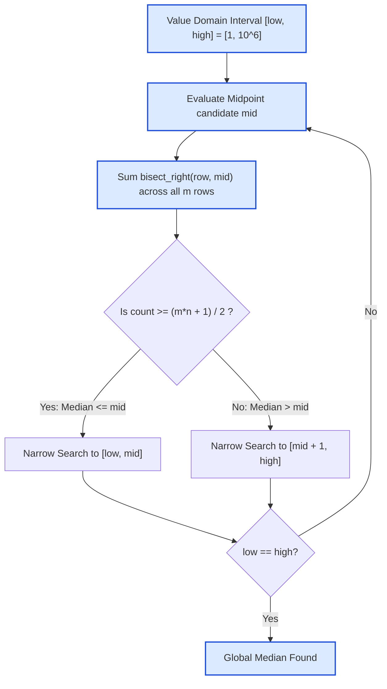

# Guided Example: Median of a Row Wise Sorted Matrix

## 1. Problem Overview & Representative Instance

We are given an $m \times n$ matrix $\text{grid}$ where every row is independently sorted in non-decreasing order. Both dimensions $m$ and $n$ are guaranteed to be odd integers, meaning the total number of entries $N = m \times n$ is always odd.

The objective is to find the **global median** of all $m \times n$ numbers. In an odd-sized collection of $N$ values, the median is the unique element located at 1-indexed position:
$$k = \frac{m \cdot n + 1}{2}$$
when the entire collection is sorted in non-decreasing order.

Consider the representative instance:
$$\text{grid} = \begin{bmatrix} 1 & 1 & 2 \\ 2 & 3 & 3 \\ 1 & 3 & 4 \end{bmatrix}, \quad m = 3, \; n = 3$$

The matrix contains $N = 3 \times 3 = 9$ elements. The target rank is $k = (9 + 1) / 2 = 5$.
Flattening and sorting all elements yields:
$$[1, 1, 1, 2, \mathbf{2}, 3, 3, 3, 4]$$
The $5$-th element is $2$.

Flattening the matrix and sorting requires $\mathcal{O}(mn \log(mn))$ time and $\mathcal{O}(mn)$ space. Because $m, n \le 500$, we can achieve a strictly faster solution in $\mathcal{O}(m \log n \log(\text{MAX}))$ time by performing **Binary Search over the Value Domain**.

## 2. Mathematical & Algorithmic Principles

Rather than searching over matrix indices, we search over the domain of candidate integers $[V_{\min}, V_{\max}]$:
1. **Monotonic Counting Function:**
   Define $f(x)$ as the number of elements in $\text{grid}$ that are less than or equal to $x$:
   $$f(x) = \sum_{r=0}^{m-1} \sum_{c=0}^{n-1} \mathbf{1}_{[\text{grid}[r][c] \le x]}$$
   Because higher values cannot decrease the count of elements $\le x$, $f(x)$ is a monotonically non-decreasing step function:
   $$x_1 \le x_2 \implies f(x_1) \le f(x_2)$$
2. **Row-Wise Logarithmic Counting:**
   Because each individual row $r$ is sorted in non-decreasing order, the number of elements in row $r$ that are $\le x$ can be evaluated in $\mathcal{O}(\log n)$ time using binary search (equivalent to the standard upper-bound operation $\text{bisect\_right}$):
   $$f(x) = \sum_{r=0}^{m-1} \text{bisect\_right}(\text{grid}[r],\, x)$$
   Evaluating $f(x)$ across all $m$ rows requires $\mathcal{O}(m \log n)$ time.
3. **Median Characterization:**
   The median $M$ is the smallest integer $x$ such that:
   $$f(x) \ge \frac{m \cdot n + 1}{2}$$
   - If $f(\text{mid}) \ge k$, there are at least $k$ elements $\le \text{mid}$, so the true median is at most $\text{mid}$. We set $\text{high} = \text{mid}$.
   - If $f(\text{mid}) < k$, $\text{mid}$ is strictly too small. We set $\text{low} = \text{mid} + 1$.

When $\text{low} = \text{high}$, the search converges onto the exact median.

## 3. Step-by-Step Walkthrough with Intermediate State

We trace the binary search on $\text{grid} = [[1, 1, 2], [2, 3, 3], [1, 3, 4]]$.
Here $m = 3, n = 3, N = 9$, and target rank $k = (9 + 1) / 2 = 5$.
Minimum element in the matrix is $1$; maximum is $4$. Search interval is $[1, 4]$.

- **Iteration 1:**
  - Interval: $[low, high] = [1, 4]$.
  - Midpoint: $\text{mid} = \lfloor (1 + 4) / 2 \rfloor = 2$.
  - Row evaluations for $x = 2$:
    - Row 0: $[1, 1, 2] \implies$ all $3$ entries are $\le 2$ (count $= 3$).
    - Row 1: $[2, 3, 3] \implies$ only $[2]$ is $\le 2$ (count $= 1$).
    - Row 2: $[1, 3, 4] \implies$ only $[1]$ is $\le 2$ (count $= 1$).
  - Total count: $f(2) = 3 + 1 + 1 = 5$.
  - Comparison: $f(2) = 5 \ge 5$ (target met).
  - Adjustment: The median is at most $2$. Contract boundary: $\text{high} \leftarrow 2$.

- **Iteration 2:**
  - Interval: $[low, high] = [1, 2]$.
  - Midpoint: $\text{mid} = \lfloor (1 + 2) / 2 \rfloor = 1$.
  - Row evaluations for $x = 1$:
    - Row 0: $[1, 1, 2] \implies [1, 1]$ are $\le 1$ (count $= 2$).
    - Row 1: $[2, 3, 3] \implies$ zero entries are $\le 1$ (count $= 0$).
    - Row 2: $[1, 3, 4] \implies [1]$ is $\le 1$ (count $= 1$).
  - Total count: $f(1) = 2 + 0 + 1 = 3$.
  - Comparison: $f(1) = 3 < 5$ (target not met).
  - Adjustment: The median is strictly greater than $1$. Contract boundary: $\text{low} \leftarrow 1 + 1 = 2$.

- **Termination:**
  - $\text{low} = 2$, $\text{high} = 2$.
  - Search space collapsed to a single integer.
  - Final median: $2$.

## 4. Comprehensive State Trace

The binary search execution trace is detailed in the ledger below:

| Iteration | Search Range $[low, high]$ | Candidate $\text{mid}$ | Row 0 Count $(\le \text{mid})$ | Row 1 Count $(\le \text{mid})$ | Row 2 Count $(\le \text{mid})$ | Global $f(\text{mid})$ | Target Test $(f \ge 5)$ | Updated Boundary |
|---|---|---|---|---|---|---|---|---|
| 1 | $[1, 4]$ | 2 | 3 | 1 | 1 | 5 | $5 \ge 5$ (True) | $\text{high} = 2$ |
| 2 | $[1, 2]$ | 1 | 2 | 0 | 1 | 3 | $3 \ge 5$ (False) | $\text{low} = 2$ |
| 3 | $[2, 2]$ | — | — | — | — | — | Converged | Result $= 2$ |

We also tabulate the cumulative counting function $f(x)$ for all candidate integer values in the problem domain:

| Integer Value $x$ | Row 0 Prefix Profile | Row 1 Prefix Profile | Row 2 Prefix Profile | Cumulative Count $f(x)$ | Percentile Coverage | Median Status |
|---|---|---|---|---|---|---|
| 0 | `[]` | `[]` | `[]` | 0 | $0.0\%$ | Too Small |
| 1 | `[1, 1]` | `[]` | `[1]` | 3 | $33.3\%$ | Too Small ($3 < 5$) |
| 2 | `[1, 1, 2]` | `[2]` | `[1]` | 5 | $55.6\%$ | Exact Median Pivot |
| 3 | `[1, 1, 2]` | `[2, 3, 3]` | `[1, 3]` | 8 | $88.9\%$ | Beyond Median |
| 4 | `[1, 1, 2]` | `[2, 3, 3]` | `[1, 3, 4]` | 9 | $100.0\%$ | Maximum Element |

The smallest value $x$ achieving $f(x) \ge 5$ is uniquely $x = 2$.

## 5. Algorithmic Correctness & Soundness

The correctness of binary search over the value domain is established by:
1. **Order Statistic Invariant:**
   In any multiset of size $N$, an element $M$ is the $k$-th smallest element if and only if:
   - There are at least $k$ elements less than or equal to $M$: $f(M) \ge k$.
   - There are strictly fewer than $k$ elements less than $M$: $f(M - 1) < k$.
2. **Guaranteed Existence in Matrix:**
   Because $f(x)$ only increases at integers present in $\text{grid}$, the smallest integer $x$ that satisfies $f(x) \ge k$ must be an actual entry in the matrix. It cannot be an unoccupied value between matrix entries.
3. **Monotonicity and Binary Search Invariant:**
   Since $f(x)$ is non-decreasing, the condition $f(x) \ge k$ defines a contiguous suffix $[M, \infty)$. Standard binary search maintains the true minimum of this suffix in $[\text{low}, \text{high}]$, converging to $M$ in $\mathcal{O}(\log(\text{range}))$ iterations.

## 6. Edge Cases & Anti-Patterns

- **Single Row Matrix ($m = 1$):** With $m = 1$, the matrix is a single sorted row of length $n$. The binary search directly identifies the middle element $\text{grid}[0][(n - 1) / 2]$.
- **All Identical Elements:** If all entries equal $c$ (e.g. all entries are $7$), $f(7) = m \cdot n \ge k$ and $f(6) = 0 < k$. The algorithm cleanly outputs $7$.
- **Duplicate Medians:** When the median value appears multiple times across multiple rows, $f(\text{mid})$ comfortably exceeds $k$. The algorithm narrows down to the exact smallest integer value representing that cluster.
- **Anti-Pattern: Flattening and Sorting:** Flattening the 2D grid into an array of size $m \cdot n$ and calling a standard sort uses $\mathcal{O}(mn \log(mn))$ time and $\mathcal{O}(mn)$ auxiliary space. Binary search over value domain uses $\mathcal{O}(1)$ space and runs in strictly sub-linear time relative to total elements.

## 7. Complexity Analysis

- **Time Complexity:**
  - Let $V_{\min} = 1$ and $V_{\max} = 10^6$. The value domain span is bounded by $\Delta V \le 10^6$.
  - Binary search over the value domain executes at most $\lceil \log_2(\Delta V) \rceil \le 20$ iterations.
  - In each iteration, we run $\text{bisect\_right}$ on each of the $m$ rows.
  - Each binary search on a row of length $n$ takes $\mathcal{O}(\log n)$ time.
  - Total time complexity is:
    $$\mathcal{O}\bigl(m \log n \cdot \log(\Delta V)\bigr)$$
  - For $m = 500$ and $n = 500$:
    $$500 \times \log_2(500) \times 20 \approx 500 \times 9 \times 20 \approx 90{,}000 \text{ operations}$$
    which is substantially faster than $mn = 250{,}000$ and runs in $< 5$ milliseconds.
- **Space Complexity:**
  - Binary search operates directly on the input matrix rows using scalar loop variables.
  - Auxiliary space complexity is strictly $\mathcal{O}(1)$.