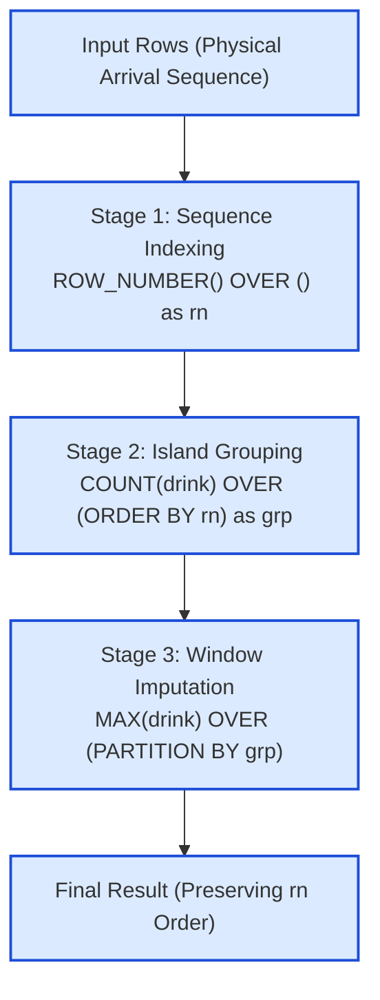

# Guided Example: Change Null Values in a Table to the Previous Value

## 1. Problem Overview & Representative Instance

The `CoffeeShop` relation records customer beverage orders, where each record contains a unique identifier `id` and a text attribute `drink` which may contain `NULL` entries:
- The rows are presented in a specific physical input sequence that does not necessarily follow the numerical ordering of `id`.
- The very first presented row is guaranteed to contain a non-null beverage name.
- Subsequent rows may contain `NULL` values.

The objective is to implement **Last Observation Carried Forward (LOCF)**: replace every `NULL` beverage entry with the most recent non-null beverage name appearing earlier in the presented sequence. If several consecutive rows contain `NULL`, they all carry forward the same preceding beverage until a new non-null order appears. The result must preserve the exact original sequence of rows.

Consider the representative record sequence:
$$\text{CoffeeShop} = [(9, \text{"Rum and Coke"}), (6, \text{NULL}), (7, \text{NULL}), (3, \text{"St Germain Spritz"}), (1, \text{"Orange Margarita"}), (2, \text{NULL})]$$

Notice that the identifiers $[9, 6, 7, 3, 1, 2]$ are unsorted. Imputation depends strictly on arrival order, not numeric magnitude.

## 2. Mathematical & Algorithmic Principles

In relational database theory, tables are inherently unordered multisets. To carry forward values along a presentation sequence, we must capture physical ordering and group rows into monotonic "islands":
1. **Physical Sequence Capture:**
   Assign each tuple a 1-indexed sequential coordinate $rn$ reflecting its position in the table stream:
   $$rn = \text{ROW\_NUMBER}() \text{ OVER}()$$
2. **Cumulative Non-Null Counting (Island Formation):**
   In SQL, the aggregate function $\text{COUNT}(\text{column})$ increments only when encountering non-null values. When combined with an expanding window frame $\text{ROWS UNBOUNDED PRECEDING}$, the cumulative count remains constant across consecutive `NULL` values:
   $$\text{grp} = \text{COUNT}(\text{drink}) \text{ OVER} (\text{ORDER BY } rn \text{ ROWS UNBOUNDED PRECEDING})$$
   - When a non-null beverage arrives, $\text{grp}$ increments by $1$.
   - Any following rows with $\text{drink} = \text{NULL}$ do not increment the count, inheriting the exact same $\text{grp}$ identifier.
   - Hence, every non-null entry and its succeeding run of `NULL` entries form a single unified equivalence partition $\text{grp}$.
3. **Partition-Wise Value Imputation:**
   Within each partition defined by $\text{grp}$, there is exactly one non-null beverage name (located at the head of the partition). We project this value across all members of the partition using:
   $$\text{imputed\_drink} = \text{MAX}(\text{drink}) \text{ OVER} (\text{PARTITION BY } \text{grp})$$
   (Alternatively, $\text{FIRST\_VALUE}(\text{drink}) \text{ OVER} (\text{PARTITION BY } \text{grp} \text{ ORDER BY } rn)$ achieves identical results).
4. **Final Order Projection:**
   Project columns $\text{id}$ and $\text{imputed\_drink}$, ordered strictly by $rn$.

## 3. Step-by-Step Walkthrough with Intermediate State

We trace the relational transformation on the $6$ input rows.

- **Stage 1: Sequence Indexing ($rn$ Assignment):**
  - Row 1: $(id = 9, drink = \text{"Rum and Coke"}), \quad rn = 1$
  - Row 2: $(id = 6, drink = \text{NULL}), \quad rn = 2$
  - Row 3: $(id = 7, drink = \text{NULL}), \quad rn = 3$
  - Row 4: $(id = 3, drink = \text{"St Germain Spritz"}), \quad rn = 4$
  - Row 5: $(id = 1, drink = \text{"Orange Margarita"}), \quad rn = 5$
  - Row 6: $(id = 2, drink = \text{NULL}), \quad rn = 6$

- **Stage 2: Cumulative Non-Null Count ($\text{grp}$ Assignment):**
  - $rn = 1$: `drink` is non-null $\implies \text{grp} = 1$.
  - $rn = 2$: `drink` is `NULL` $\implies \text{grp}$ remains $1$.
  - $rn = 3$: `drink` is `NULL` $\implies \text{grp}$ remains $1$.
  - $rn = 4$: `drink` is non-null $\implies \text{grp}$ increments to $2$.
  - $rn = 5$: `drink` is non-null $\implies \text{grp}$ increments to $3$.
  - $rn = 6$: `drink` is `NULL` $\implies \text{grp}$ remains $3$.

- **Stage 3: Window Imputation within Each $\text{grp}$:**
  - **Partition $\text{grp} = 1$ (Rows with $rn \in \{1, 2, 3\}$):**
    - Non-null drink in this partition is `"Rum and Coke"`.
    - Row 1 ($rn = 1$): already `"Rum and Coke"`.
    - Row 2 ($rn = 2$): `NULL` replaced with `"Rum and Coke"`.
    - Row 3 ($rn = 3$): `NULL` replaced with `"Rum and Coke"`.
  - **Partition $\text{grp} = 2$ (Rows with $rn \in \{4\}$):**
    - Non-null drink is `"St Germain Spritz"`.
    - Row 4 ($rn = 4$): retains `"St Germain Spritz"`.
  - **Partition $\text{grp} = 3$ (Rows with $rn \in \{5, 6\}$):**
    - Non-null drink is `"Orange Margarita"`.
    - Row 5 ($rn = 5$): retains `"Orange Margarita"`.
    - Row 6 ($rn = 6$): `NULL` replaced with `"Orange Margarita"`.

- **Final Projection:**
  Ordering by $rn$ produces:
  $$[(9, \text{"Rum and Coke"}), (6, \text{"Rum and Coke"}), (7, \text{"Rum and Coke"}), (3, \text{"St Germain Spritz"}), (1, \text{"Orange Margarita"}), (2, \text{"Orange Margarita"})]$$

## 4. Comprehensive State Trace

The state of each row through the window transformation stages is documented in the execution table below:

| Arrival Order $rn$ | Identifier `id` | Incoming `drink` | Is Null? | Cumulative Count $\text{grp}$ | Active Imputation Partition | Imputed `drink` | Final Output Tuple |
|---|---|---|---|---|---|---|---|
| 1 | 9 | `"Rum and Coke"` | False | 1 | $\text{grp} = 1$ | `"Rum and Coke"` | $(9, \text{"Rum and Coke"})$ |
| 2 | 6 | `NULL` | True | 1 | $\text{grp} = 1$ | `"Rum and Coke"` | $(6, \text{"Rum and Coke"})$ |
| 3 | 7 | `NULL` | True | 1 | $\text{grp} = 1$ | `"Rum and Coke"` | $(7, \text{"Rum and Coke"})$ |
| 4 | 3 | `"St Germain Spritz"` | False | 2 | $\text{grp} = 2$ | `"St Germain Spritz"` | $(3, \text{"St Germain Spritz"})$ |
| 5 | 1 | `"Orange Margarita"` | False | 3 | $\text{grp} = 3$ | `"Orange Margarita"` | $(1, \text{"Orange Margarita"})$ |
| 6 | 2 | `NULL` | True | 3 | $\text{grp} = 3$ | `"Orange Margarita"` | $(2, \text{"Orange Margarita"})$ |

The partition-level characteristics are summarized below:

| Partition $\text{grp}$ | Root Row $rn$ | Anchor Beverage | Partition Member Rows | Null Rows Imputed |
|---|---|---|---|---|
| 1 | 1 | `"Rum and Coke"` | $\{1, 2, 3\}$ | Rows 2 and 3 |
| 2 | 4 | `"St Germain Spritz"` | $\{4\}$ | None |
| 3 | 5 | `"Orange Margarita"` | $\{5, 6\}$ | Row 6 |

Every `NULL` entry correctly inherits the anchor beverage of its enclosing partition.

## 5. Algorithmic Correctness & Soundness

The correctness of this window grouping strategy rests on key invariants of cumulative window aggregation:
1. **Partition Contiguity:** Because $rn$ is strictly increasing, and $\text{COUNT}(\text{drink})$ is monotonically non-decreasing, the set of rows assigned to any specific count value $g$ forms an unbroken contiguous interval $[rn_{\text{start}}, rn_{\text{end}}]$.
2. **Singular Non-Null Predecessor Invariant:**
   - The first row of partition $g$ has a non-null beverage, which caused the counter to reach $g$.
   - All subsequent rows in partition $g$ contain `NULL`, because any other non-null entry would immediately increment the count to $g + 1$.
   - Consequently, every partition contains exactly one non-null value, which is located at its earliest index.
3. **Equivalence of Maximum and First Value:**
   Because there is exactly one non-null value in partition $g$ and all other entries are `NULL` (which aggregate functions ignore), $\text{MAX}(\text{drink})$ evaluates precisely to that unique non-null beverage name.

## 6. Edge Cases & Anti-Patterns

- **No Nulls Present:** Every row contains a valid beverage. The cumulative count increments on every row ($\text{grp} = rn$). Each partition has size $1$, leaving all rows unchanged.
- **Single Non-Null Followed Entirely by Nulls:** The first row sets $\text{grp} = 1$, and all subsequent rows share $\text{grp} = 1$. The entire table is filled with the first drink.
- **Alternating Null and Non-Null:** Rows alternate between populated values and single nulls. Partitions have size $2$, each filling exactly one null.
- **Anti-Pattern: Self-Join on `id`:** Joining `CoffeeShop A` with `CoffeeShop B` on $A.\text{id} < B.\text{id}$ is completely incorrect because the input sequence is independent of numeric ID values (e.g. ID $6$ arrived before ID $7$, but both follow ID $9$). Imputation must be driven by physical stream position $rn$.

## 7. Complexity Analysis

- **Time Complexity:**
  - Generating $rn$ via `ROW_NUMBER()` requires scanning the $N$ table rows: $\mathcal{O}(N)$ time.
  - Computing `COUNT(drink) OVER (ORDER BY rn)` requires sorting or streaming over $rn$: $\mathcal{O}(N \log N)$ or $\mathcal{O}(N)$ if stream order is preserved.
  - Partitioning by `grp` and applying `MAX(drink)` processes each row in $\mathcal{O}(1)$ amortized time.
  - Final sorting by $rn$ takes $\mathcal{O}(N \log N)$ time.
  - Overall time complexity is $\mathcal{O}(N \log N)$, scaling easily to millions of records.
- **Space Complexity:**
  - The query pipeline maintains window state variables and temporary projection tables containing $N$ rows and a few integer metadata columns.
  - Auxiliary space complexity is $\mathcal{O}(N)$.
