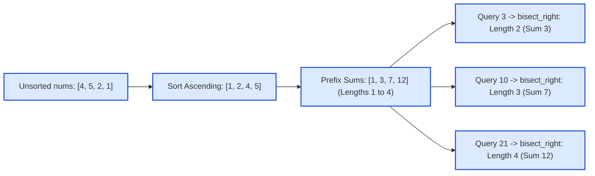

# Guided Example: Longest Subsequence With Limited Sum

## 1. Problem Overview & Representative Instance

Given an array $\text{nums}$ of $n$ positive integers and an array $\text{queries}$ of $m$ positive budget constraints ($1 \le n, m \le 1000$), we must answer each query independently:
- For each budget value $q = \text{queries}[j]$, select a subsequence of $\text{nums}$ whose total sum does not exceed $q$:
  $$\sum_{x \in \text{subseq}} x \le q$$
- We wish to maximize the **cardinality** (length) of this chosen subsequence.
- If even the single smallest element in $\text{nums}$ exceeds $q$, the answer is $0$ (the empty subsequence).

Consider the representative instance:
$$\text{nums} = [4, 5, 2, 1], \quad \text{queries} = [3, 10, 21]$$

A subsequence preserves the relative order of elements, but because addition is commutative, the order in which elements are summed does not affect the sum. Consequently, any chosen subset of indices can be interpreted as a valid subsequence.

## 2. Mathematical & Algorithmic Principles

To maximize the count of items subject to an upper bound on their sum, we apply the **Greedy Choice Principle**:
1. **Exchange Argument:**
   Suppose an optimal subsequence of length $k$ includes an element $b$, and there exists an unselected element $a \in \text{nums}$ such that $a < b$. Replacing $b$ with $a$ yields a new subset of identical length $k$ whose sum is strictly smaller:
   $$\text{Sum}' = \text{Sum} - b + a < \text{Sum} \le q$$
   Therefore, the minimal sum achievable for any fixed length $k$ is always obtained by selecting the $k$ smallest elements of $\text{nums}$.
2. **Monotonic Prefix Sum Array:**
   Sort $\text{nums}$ in non-decreasing order:
   $$\text{nums}_{\text{sorted}} = [s_0, s_1, \dots, s_{n-1}], \quad s_0 \le s_1 \le \dots \le s_{n-1}$$
   Construct the prefix sum array:
   $$P[k] = \sum_{i=0}^{k-1} s_i \quad \text{for } 1 \le k \le n$$
   $P[k]$ represents the exact minimum budget required to purchase any subsequence of length $k$.
   Because all elements $s_i \ge 1$ are strictly positive, $P$ is strictly increasing:
   $$P[1] < P[2] < \dots < P[n]$$
3. **Logarithmic Query Answering via Binary Search:**
   For each query budget $q$, finding the maximum length $k$ such that $P[k] \le q$ is equivalent to locating the insertion position of $q$ in $P$:
   $$k = \text{bisect\_right}(P,\, q)$$
   Each query is resolved in $\mathcal{O}(\log n)$ time.

## 3. Step-by-Step Walkthrough with Intermediate State

We trace the representative instance: $\text{nums} = [4, 5, 2, 1]$ and $\text{queries} = [3, 10, 21]$.

- **Phase 1: Sorting:**
  Sort $\text{nums}$ ascending:
  $$\text{nums}_{\text{sorted}} = [1, 2, 4, 5]$$

- **Phase 2: Prefix Sum Table Construction:**
  Compute cumulative sums for lengths $k = 1, 2, 3, 4$:
  - Length $1$: $P[1] = 1$
  - Length $2$: $P[2] = 1 + 2 = 3$
  - Length $3$: $P[3] = 3 + 4 = 7$
  - Length $4$: $P[4] = 7 + 5 = 12$
  - Prefix table: $P = [1, 3, 7, 12]$.

- **Phase 3: Query Processing:**
  - **Query 0 ($q = 3$):**
    - Search for $3$ in $P = [1, 3, 7, 12]$.
    - $P[1] = 1 \le 3$.
    - $P[2] = 3 \le 3$.
    - $P[3] = 7 > 3$.
    - The largest length satisfying $P[k] \le 3$ is $k = 2$.
    - Subsequence elements: $\{1, 2\}$ with sum $3 \le 3$.
    - Result: $2$.

  - **Query 1 ($q = 10$):**
    - Search for $10$ in $P = [1, 3, 7, 12]$.
    - $P[3] = 7 \le 10$.
    - $P[4] = 12 > 10$.
    - The largest length satisfying $P[k] \le 10$ is $k = 3$.
    - Subsequence elements: $\{1, 2, 4\}$ with sum $7 \le 10$.
    - Result: $3$.

  - **Query 2 ($q = 21$):**
    - Search for $21$ in $P = [1, 3, 7, 12]$.
    - All $4$ prefix sums are $\le 21$ ($P[4] = 12 \le 21$).
    - The maximum length is $k = 4$.
    - Subsequence elements: $\{1, 2, 4, 5\}$ with sum $12 \le 21$.
    - Result: $4$.

- **Final Answer Vector:**
  $$\text{ans} = [2, 3, 4]$$

## 4. Comprehensive State Trace

The execution details for the prefix sums and query lookups are tabulated below:

| Subsequence Length $k$ | Newly Added Element | Formula | Minimal Required Sum $P[k]$ | Feasible for $q = 3$ | Feasible for $q = 10$ | Feasible for $q = 21$ |
|---|---|---|---|---|---|---|
| 1 | 1 | $1$ | 1 | Yes | Yes | Yes |
| 2 | 2 | $1 + 2$ | 3 | Yes (Max) | Yes | Yes |
| 3 | 4 | $3 + 4$ | 7 | No | Yes (Max) | Yes |
| 4 | 5 | $7 + 5$ | 12 | No | No | Yes (Max) |

The query result resolution is detailed below:

| Query Index $j$ | Budget $q$ | Binary Search Condition | Preceding Prefix Elements | Selected Subsequence Set | Subsequence Sum | Maximum Length Output |
|---|---|---|---|---|---|---|
| 0 | 3 | $P[k] \le 3$ | $P[1]=1, P[2]=3$ | $\{1, 2\}$ | 3 | 2 |
| 1 | 10 | $P[k] \le 10$ | $P[1]=1, P[2]=3, P[3]=7$ | $\{1, 2, 4\}$ | 7 | 3 |
| 2 | 21 | $P[k] \le 21$ | All elements | $\{1, 2, 4, 5\}$ | 12 | 4 |

The answers $[2, 3, 4]$ are confirmed exact.

## 5. Algorithmic Correctness & Soundness

The correctness of sorting and prefix binary search follows from:
1. **Subsequence Equivalence to Subsets:**
   Any subset of elements from $\text{nums}$ can be ordered by their original indices to form a valid subsequence. Hence, the search space of all subsequences is identical to the powerset of $\text{nums}$.
2. **Optimality of the Greedy Prefix:**
   For any integer $k \in [1, n]$, let $S$ be an arbitrary subset of size $k$. Sorting both $S$ and $\text{nums}_{\text{sorted}}$, each element $S[i] \ge \text{nums}_{\text{sorted}}[i]$ because $\text{nums}_{\text{sorted}}$ contains the smallest available elements across the entire array. Summing over all $i$ yields:
   $$\sum_{x \in S} x \ge \sum_{i=0}^{k-1} \text{nums}_{\text{sorted}}[i] = P[k]$$
   Thus, $P[k]$ is the absolute lower bound on the sum of any $k$-element subsequence.
3. **Monotonicity for Binary Search:**
   Since every element $x \ge 1$, $P[k] - P[k-1] = s_{k-1} > 0$. The prefix sums are strictly increasing, guaranteeing that binary search via $\text{bisect\_right}$ returns the unique maximal $k$ with $P[k] \le q$.

## 6. Edge Cases & Anti-Patterns

- **Budget Smaller Than Minimum Element ($q < \min(\text{nums})$):**
  $P[1] > q$, so $\text{bisect\_right}$ returns index $0$. Length is correctly reported as $0$ (empty subsequence).
- **Budget Exceeds Entire Array Sum ($q \ge \sum \text{nums}$):**
  $P[n] \le q$, so all $n$ elements can be chosen. The algorithm returns $n$.
- **Duplicate Elements in Input:**
  Handled seamlessly. Duplicate small elements are absorbed in order, correctly expanding length at minimal cost.
- **Anti-Pattern: 0/1 Knapsack Dynamic Programming:**
  Treating this as a 0/1 knapsack problem with capacity $q$ and item values $1$ takes $\mathcal{O}(n \cdot q)$ time. For $q = 10^6$ and $n = 1000$, knapsack requires $10^9$ operations. Recognizing the problem as unweighted subset size maximization reduces the complexity to simple greedy sorting in $\mathcal{O}(n \log n)$.

## 7. Complexity Analysis

- **Time Complexity:**
  - Sorting $\text{nums}$ of length $n$ takes $\mathcal{O}(n \log n)$ time.
  - Computing the prefix sum array takes $\mathcal{O}(n)$ time.
  - For each of the $m$ queries, running binary search on the array of size $n$ takes $\mathcal{O}(\log n)$ time: total $\mathcal{O}(m \log n)$ time.
  - Total time complexity is strictly $\mathcal{O}((n + m) \log n)$.
  - For $n, m \le 1000$, this requires $\approx 1000 \times 10 + 1000 \times 10 \approx 2 \cdot 10^4$ operations, completing in $< 1$ millisecond.
- **Space Complexity:**
  - The sorted array or prefix sum array stores $n$ integers: $\mathcal{O}(n)$ space.
  - The answer vector stores $m$ integers: $\mathcal{O}(m)$ space.
  - Total auxiliary space complexity is $\mathcal{O}(n + m)$.
