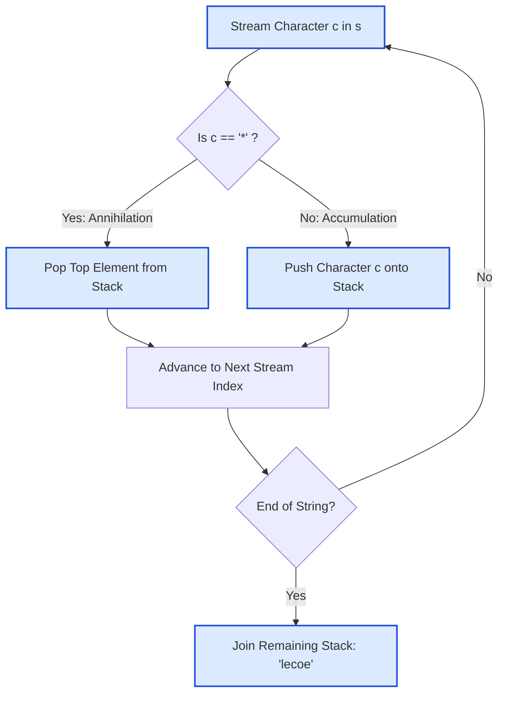

# Guided Example: Removing Stars From a String

## 1. Problem Overview & Representative Instance

We are given a string $s$ of length $n$ ($1 \le n \le 10^5$) consisting of lowercase English letters and asterisk characters `'*'`.

Each asterisk represents a backspace-style operation:
- Choose an asterisk `'*'`.
- Remove the asterisk itself.
- Remove the closest surviving non-asterisk letter to its left.

This process continues until no asterisks remain. The problem contract guarantees that the input is always valid—meaning whenever an asterisk is encountered, at least one surviving letter exists to its left to be deleted. The goal is to return the resulting string after all asterisks have executed their removals.

Consider the representative string:
$$s = \text{"leet**cod*e"}$$

The string contains letters interspersed with asterisks. Each asterisk acts as an annihilation operator on the most recently appended character.

## 2. Mathematical & Algorithmic Principles

This problem directly mirrors the classic text-editor backspace model governed by **Last-In, First-Out (LIFO)** semantics:
1. **LIFO Stack Mechanics:**
   - As we scan $s$ from left to right, every standard letter is pushed onto the top of a stack.
   - When a `'*'` arrives, it immediately consumes the element residing at the top of the stack (the nearest surviving letter to its left).
   - Once popped, that letter is permanently eliminated and cannot be accessed by subsequent asterisks.
2. **Confluence and Invariant Output:**
   Although asterisks could theoretically be processed in different orders, the operation possesses the Church-Rosser property (confluence): any sequence of valid reductions yields the exact same final string. Processing sequentially from left to right guarantees that each asterisk meets the exact closest active predecessor.
3. **In-Place Two-Pointer Equivalence:**
   Instead of allocating an explicit dynamic stack, one can maintain a write pointer $w = 0$ on a mutable character array:
   - For a letter $c$: write $\text{buf}[w] \leftarrow c$, then increment $w \leftarrow w + 1$.
   - For an asterisk `'*'`: decrement $w \leftarrow w - 1$ (rewinding the cursor).
   The surviving prefix $\text{buf}[0 \dots w - 1]$ forms the final output.

## 3. Step-by-Step Walkthrough with Intermediate State

We trace the sequential stack evaluation on $s = \text{"leet**cod*e"}$.

- **Index 0 ($s[0] = \text{'l'}$):**
  - Letter encountered. Push `'l'`.
  - Stack: `['l']`.

- **Index 1 ($s[1] = \text{'e'}$):**
  - Letter encountered. Push `'e'`.
  - Stack: `['l', 'e']`.

- **Index 2 ($s[2] = \text{'e'}$):**
  - Letter encountered. Push `'e'`.
  - Stack: `['l', 'e', 'e']`.

- **Index 3 ($s[3] = \text{'t'}$):**
  - Letter encountered. Push `'t'`.
  - Stack: `['l', 'e', 'e', 't']`.

- **Index 4 ($s[4] = \text{'*'}$):**
  - Asterisk encountered. Pop top element `'t'`.
  - Stack: `['l', 'e', 'e']`.

- **Index 5 ($s[5] = \text{'*'}$):**
  - Asterisk encountered. Pop top element `'e'`.
  - Stack: `['l', 'e']`.

- **Index 6 ($s[6] = \text{'c'}$):**
  - Letter encountered. Push `'c'`.
  - Stack: `['l', 'e', 'c']`.

- **Index 7 ($s[7] = \text{'o'}$):**
  - Letter encountered. Push `'o'`.
  - Stack: `['l', 'e', 'c', 'o']`.

- **Index 8 ($s[8] = \text{'d'}$):**
  - Letter encountered. Push `'d'`.
  - Stack: `['l', 'e', 'c', 'o', 'd']`.

- **Index 9 ($s[9] = \text{'*'}$):**
  - Asterisk encountered. Pop top element `'d'`.
  - Stack: `['l', 'e', 'c', 'o']`.

- **Index 10 ($s[10] = \text{'e'}$):**
  - Letter encountered. Push `'e'`.
  - Stack: `['l', 'e', 'c', 'o', 'e']`.

- **Termination:**
  - String stream exhausted.
  - Concatenate stack contents:
    $$\text{"lecoe"}$$

## 4. Comprehensive State Trace

The character-by-character stack transformations are documented in the execution table below:

| Stream Index $i$ | Input Token $s[i]$ | Token Classification | Executed Action | Popped / Pushed Character | Resulting Stack State | Current String Prefix |
|---|---|---|---|---|---|---|
| 0 | `'l'` | Letter | Push | `'l'` | `['l']` | `"l"` |
| 1 | `'e'` | Letter | Push | `'e'` | `['l', 'e']` | `"le"` |
| 2 | `'e'` | Letter | Push | `'e'` | `['l', 'e', 'e']` | `"lee"` |
| 3 | `'t'` | Letter | Push | `'t'` | `['l', 'e', 'e', 't']` | `"leet"` |
| 4 | `'*'` | Asterisk | Pop | `'t'` removed | `['l', 'e', 'e']` | `"lee"` |
| 5 | `'*'` | Asterisk | Pop | `'e'` removed | `['l', 'e']` | `"le"` |
| 6 | `'c'` | Letter | Push | `'c'` | `['l', 'e', 'c']` | `"lec"` |
| 7 | `'o'` | Letter | Push | `'o'` | `['l', 'e', 'c', 'o']` | `"leco"` |
| 8 | `'d'` | Letter | Push | `'d'` | `['l', 'e', 'c', 'o', 'd']` | `"lecod"` |
| 9 | `'*'` | Asterisk | Pop | `'d'` removed | `['l', 'e', 'c', 'o']` | `"leco"` |
| 10 | `'e'` | Letter | Push | `'e'` | `['l', 'e', 'c', 'o', 'e']` | `"lecoe"` |

The final output is verified as `"lecoe"`.

A second verification on total deletion (Example 2: $s = \text{"erase*****"}$) is summarized below:

| Stream Segment | Actions Performed | Active Stack Contents | Explanation |
|---|---|---|---|
| Prefix `"erase"` | 5 consecutive pushes | `['e', 'r', 'a', 's', 'e']` | Buffer loaded with 5 characters |
| Suffix `"*****"` | 5 consecutive pops | `[]` | Every star annihilates one preceding letter in reverse order |

Final output for $s = \text{"erase*****"}$ is the empty string `""`.

## 5. Algorithmic Correctness & Soundness

The correctness of this single-pass stack simulation is established by:
1. **Strict Locality of Deletion:**
   The phrase "closest non-star character to its left" means that in any prefix $s[0 \dots i]$, an asterisk at $i$ must eliminate the latest unremoved letter in $s[0 \dots i - 1]$. Under sequential left-to-right scanning, that exact letter resides at the top of the stack.
2. **Stack Non-Emptiness Invariant:**
   The problem guarantees that every removal is valid. Therefore, the stack depth $d_i$ after reading prefix $i$ satisfies:
   $$d_i = \sum_{j=0}^{i} \left( \mathbf{1}_{[s[j] \neq \text{'*'}]} - \mathbf{1}_{[s[j] = \text{'*'}]} \right) \ge 0$$
   A pop operation is never attempted on an empty stack.
3. **Preservation of Relative Order:**
   Elements entering the stack are ordered by their original indices. Popping elements removes both the star and the target letter without disturbing the relative ordering of any surviving earlier characters.

## 6. Edge Cases & Anti-Patterns

- **Complete Annihilation ($s = \text{"a*b*c*"}$):** Every character is deleted immediately by its following star. Returns `""`.
- **No Stars Present ($s = \text{"leetcode"}$):** All characters are pushed and none are popped. Returns `"leetcode"`.
- **Multiple Consecutive Stars ($s = \text{"abc***"}$):** Pops characters in strict reverse chronological order: `'c'`, then `'b'`, then `'a'`.
- **Anti-Pattern: In-Place String Slicing / Substring Splice:** Finding the first `'*'` and using string slicing (`s[:idx-1] + s[idx+1:]`) constructs a new string in $\mathcal{O}(n)$ time per star. For a string of length $10^5$ with $5 \cdot 10^4$ stars, this requires $\mathcal{O}(n^2) \approx 2.5 \cdot 10^9$ operations, causing Time Limit Exceeded. The stack achieves strictly linear execution.

## 7. Complexity Analysis

- **Time Complexity:**
  - We scan the input string of length $n$ exactly once from left to right.
  - For each character, we either perform an $\mathcal{O}(1)$ stack append or an $\mathcal{O}(1)$ stack pop.
  - Constructing the final string by joining the surviving characters takes $\mathcal{O}(n)$ time.
  - Total time complexity is strictly linear: $\mathcal{O}(n)$.
  - For $n = 10^5$, execution completes in under $10$ milliseconds.
- **Space Complexity:**
  - The stack or write buffer stores at most $n$ characters: $\mathcal{O}(n)$ space.
  - Total auxiliary space complexity is $\mathcal{O}(n)$.
