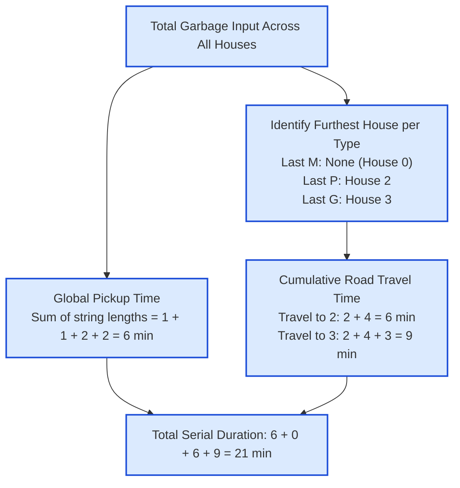

# Guided Example: Minimum Amount of Time to Collect Garbage

## 1. Problem Overview & Representative Instance

We are given an array of strings $\text{garbage}$ of length $n$ ($2 \le n \le 10^5$), where $\text{garbage}[i]$ describes the types of waste present at house $i$. There are three distinct garbage types:
- Metal (`'M'`)
- Paper (`'P'`)
- Glass (`'G'`)

Each individual character represents one unit of garbage and requires exactly $1$ minute to pick up.
We are also given an array $\text{travel}$ of length $n - 1$, where $\text{travel}[i]$ specifies the driving time in minutes from house $i$ to house $i + 1$.

Three dedicated trucks (one for Metal, one for Paper, and one for Glass) start at house $0$. Each truck visits houses in sequential order $0, 1, \dots$ and can stop permanently as soon as it has collected the last piece of its assigned garbage type. Trucks operate serially (one at a time), meaning all pickup and travel times accumulate additively. The goal is to compute the minimum total time required to collect all garbage across all houses.

Consider the representative instance:
$$\text{garbage} = [\text{"G"}, \text{"P"}, \text{"GP"}, \text{"GG"}], \quad \text{travel} = [2, 4, 3]$$

Here $n = 4$ houses and $3$ road segments.

## 2. Mathematical & Algorithmic Principles

Rather than simulating three trucks concurrently or interleaved, we exploit the **Linearity and Additivity of Serial Operations**:
1. **Invariant Pickup Work:**
   Every single unit of garbage across all houses must be collected, regardless of which truck drives when. Because each unit requires $1$ minute:
   $$\text{Total Pickup Time} = \sum_{i=0}^{n-1} |\text{garbage}[i]|$$
2. **Optimal Stopping Horizon for Each Truck:**
   For a given garbage type $T \in \{\text{'M'}, \text{'P'}, \text{'G'}\}$, let $\text{last}_T$ denote the highest house index that contains at least one unit of type $T$:
   $$\text{last}_T = \max \bigl(\{i \mid T \in \text{garbage}[i]\} \cup \{0\}\bigr)$$
   - If type $T$ does not appear anywhere, the truck never needs to leave house $0$ ($\text{last}_T = 0$).
   - A truck never travels past $\text{last}_T$, because all subsequent houses contain zero units of type $T$.
   - Any house $j < \text{last}_T$ must be traversed along the unique line path from $0$ to $\text{last}_T$.
3. **Cumulative Travel Distance via Prefix Sums:**
   Define the cumulative travel time from house $0$ to house $i$ as:
   $$\text{dist}[i] = \sum_{j=0}^{i-1} \text{travel}[j] \quad (\text{with } \text{dist}[0] = 0)$$
   The driving time incurred by truck $T$ is simply $\text{dist}[\text{last}_T]$.
4. **Closed-Form Total Duration:**
   Summing pickup work and independent driving journeys yields:
   $$\text{Total Time} = \text{Total Pickup Time} + \text{dist}[\text{last}_M] + \text{dist}[\text{last}_P] + \text{dist}[\text{last}_G]$$

## 3. Step-by-Step Walkthrough with Intermediate State

We execute this formulation on $\text{garbage} = [\text{"G"}, \text{"P"}, \text{"GP"}, \text{"GG"}]$ and $\text{travel} = [2, 4, 3]$.

- **Phase 1: Cumulative Travel Distance Array:**
  - $\text{dist}[0] = 0$
  - $\text{dist}[1] = \text{travel}[0] = 2$
  - $\text{dist}[2] = \text{dist}[1] + \text{travel}[1] = 2 + 4 = 6$
  - $\text{dist}[3] = \text{dist}[2] + \text{travel}[2] = 6 + 3 = 9$
  - Distance array: $\text{dist} = [0, 2, 6, 9]$.

- **Phase 2: Scanning Houses for Pickup & Furthest Occurrences:**
  - **House 0 (`"G"`):**
    - Units: $1$ unit (`G`). Total pickup so far $= 1$.
    - Contains `G` $\implies \text{last}_G = 0$.
  - **House 1 (`"P"`):**
    - Units: $1$ unit (`P`). Total pickup so far $= 1 + 1 = 2$.
    - Contains `P` $\implies \text{last}_P = 1$.
  - **House 2 (`"GP"`):**
    - Units: $2$ units (`G`, `P`). Total pickup so far $= 2 + 2 = 4$.
    - Contains `G` $\implies \text{last}_G = 2$.
    - Contains `P` $\implies \text{last}_P = 2$.
  - **House 3 (`"GG"`):**
    - Units: $2$ units (`G`, `G`). Total pickup so far $= 4 + 2 = 6$.
    - Contains `G` $\implies \text{last}_G = 3$.

- **Phase 3: Truck Cutoffs & Travel Aggregation:**
  - **Metal Truck (`'M'`):**
    - Never appears in any house: $\text{last}_M = 0$.
    - Travel time: $\text{dist}[0] = 0$ minutes.
  - **Paper Truck (`'P'`):**
    - Last appears at House 2: $\text{last}_P = 2$.
    - Travel time: $\text{dist}[2] = 6$ minutes.
  - **Glass Truck (`'G'`):**
    - Last appears at House 3: $\text{last}_G = 3$.
    - Travel time: $\text{dist}[3] = 9$ minutes.

- **Phase 4: Global Summation:**
  $$\text{Total Time} = 6 \text{ (pickup)} + 0 \text{ (Metal travel)} + 6 \text{ (Paper travel)} + 9 \text{ (Glass travel)} = 21 \text{ minutes}$$

## 4. Comprehensive State Trace

The house-by-house inventories and distance metrics are detailed below:

| House Index $i$ | Waste String $\text{garbage}[i]$ | Garbage Units Count | Present Waste Types | Road Cost $\text{travel}[i-1]$ to Arrive | Cumulative Distance from House 0 |
|---|---|---|---|---|---|
| 0 | `"G"` | 1 | Glass | — (Origin) | 0 |
| 1 | `"P"` | 1 | Paper | 2 | 2 |
| 2 | `"GP"` | 2 | Glass, Paper | 4 | 6 |
| 3 | `"GG"` | 2 | Glass | 3 | 9 |

The per-truck operation and timing audit is summarized below:

| Truck Vehicle | Assigned Waste Type | Total Units Collected | Furthest Needed House $\text{last}_T$ | Intermediate Travel Segments Traversed | Driving Time (min) | Total Truck Time (min) |
|---|---|---|---|---|---|---|
| Truck 1 | Metal (`M`) | 0 | None (0) | None | 0 | $0 + 0 = 0$ |
| Truck 2 | Paper (`P`) | 2 | House 2 | Segment $0 \to 1$ (2), Segment $1 \to 2$ (4) | 6 | $2 + 6 = 8$ |
| Truck 3 | Glass (`G`) | 4 | House 3 | Segment $0 \to 1$ (2), Segment $1 \to 2$ (4), Segment $2 \to 3$ (3) | 9 | $4 + 9 = 13$ |
| **Combined** | **All Types** | **6 units** | — | — | **15 min** | **21 min** |

Total serial duration is confirmed to be $21$ minutes.

## 5. Algorithmic Correctness & Soundness

The soundness of the decoupled calculation is guaranteed by:
1. **Commutativity of Serial Summation:**
   Since only one truck can operate at a time, total operational time is the scalar sum of the durations of each truck's individual mission:
   $$\text{Time}_{\text{total}} = \sum_{T \in \{M, P, G\}} (\text{Pickup}_T + \text{Travel}_T) = \left( \sum_T \text{Pickup}_T \right) + \sum_T \text{Travel}_T$$
   The pickup operations can be partitioned by truck or summed globally; their aggregate sum is identical.
2. **Necessity and Sufficiency of Driving to $\text{last}_T$:**
   - **Necessity:** To collect the unit at $\text{last}_T$, truck $T$ must traverse every intermediate edge from $0$ to $\text{last}_T$, incurring at least $\text{dist}[\text{last}_T]$.
   - **Sufficiency:** All units of type $T$ are located at indices $i \le \text{last}_T$. Since the truck visits houses in increasing order, it encounters and picks up all units along this path without ever needing to backtrack or travel past $\text{last}_T$.

## 6. Edge Cases & Anti-Patterns

- **A Garbage Type Never Appears:** If no house contains metal (`M`), $\text{last}_M = 0$ and $\text{dist}[0] = 0$. The metal truck incurs zero travel and zero pickup.
- **All Garbage at House 0:** If all waste is concentrated at house $0$, every truck has $\text{last}_T = 0$. Travel time is $0$ for all trucks, returning purely the total character count.
- **Single Road Segment ($n = 2$):** Correctly accounts for a single travel step between house $0$ and house $1$.
- **Anti-Pattern: Step-by-Step Simulation of Every Pickup:** Trying to interleave the driving steps of trucks or simulate individual garbage pickups creates unnecessary complexity. Decoupling the problem into global pickup time plus three prefix travel lookups executes in a single linear pass.

## 7. Complexity Analysis

- **Time Complexity:**
  - Computing the prefix sums of the $\text{travel}$ array takes $\mathcal{O}(n)$ time.
  - Scanning the $\text{garbage}$ array to count characters and record the last occurrence of `'M'`, `'P'`, and `'G'` takes $\mathcal{O}\left(\sum |\text{garbage}[i]|\right)$ time.
  - Since each string has length at most $10$, the scan takes $\mathcal{O}(n)$ time.
  - Final summation involves $\mathcal{O}(1)$ arithmetic operations.
  - Total time complexity is strictly $\mathcal{O}(n)$.
  - For $n = 10^5$, this runs in under $15$ milliseconds.
- **Space Complexity:**
  - Prefix travel distances can either be stored in an array of size $n$ ($\mathcal{O}(n)$ space) or computed dynamically on the fly.
  - Tracking the three indices $\text{last}_M, \text{last}_P, \text{last}_G$ takes $\mathcal{O}(1)$ space.
  - Total auxiliary space complexity is $\mathcal{O}(n)$ (or $\mathcal{O}(1)$ if prefix sums overwrite the input array).
