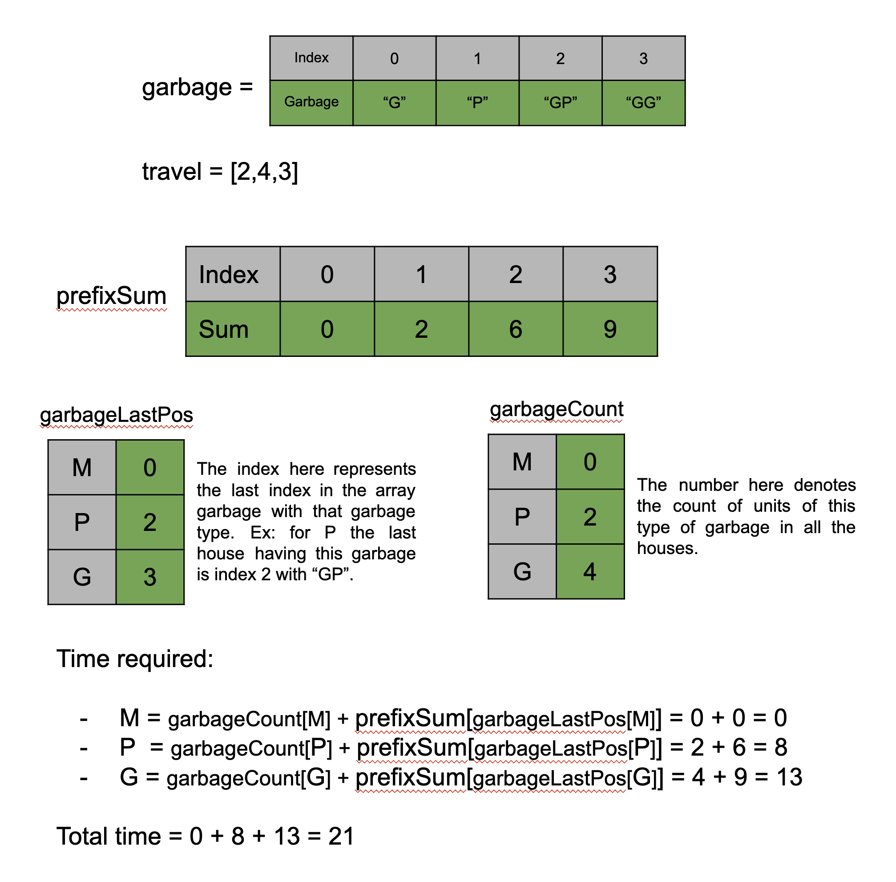

[TOC]

## Solution

---

### Approach 1: HashMap

**Intuition**

The first observation we can make from the problem statement is that all three trucks will pick up only one type of garbage and hence they all will work independently. In other words, the order of different trucks will not matter. Now, let's try to find the minimum time required for a truck to collect a certain type of garbage (say type `M`). Since we need to collect all the garbage `M` and picking one unit of garbage `M` takes one unit of time, the count of garbage `M` in all the houses is the minimum amount of time required for the truck to collect this type of garbage.

Now, we need to find the minimum time required for the truck to travel across the houses to reach all the `M` type garbage. Each truck will start from house `0`, but it doesn't have to go to each house. Also, the truck can only visit houses in order. So if there is no garbage of type `M` at the last house the truck doesn't have to go to the last house. This implies that the truck only needs to travel to the last house having that type of garbage. For example, if the truck needs to collect the `M` type garbage and the houses are `["G","P","MGP","GG"]`, then the truck only needs to travel from index `0` to `2`.

Therefore, we will find the time required for each truck separately. For each type of garbage, we will find the total count in all the houses (say `x`) and also find the index of the last house having this garbage (say `i`). The time to collect this type of garbage will be $x + \text{travel}[0] + \text{travel}[1] + ... + travel[i - 1]$, this is because the truck will need to travel all houses from index `0` to index `i `, and $travel[i - 1]$ is the time to travel from the house at index $i - 1$ to `i`. To find the sum of the first `i` elements in the array `travel`, we will create a prefix sum array to fetch it in constant time. This array `prefixSum` will start from index one ($\text{prefixSum}[0]$ will be `0`, since the truck starts from the house `0`). This way, when we need to find the total time to reach house `0`, we can find it in $\text{prefixSum}[0]$, and the total time to reach house `1` will be found in index $\text{prefixSum}[1]$, and so on.



**Algorithm**

1. Initialize an array `prefixSum` of the size  $\text{travel.length} + 1$, the `$i_{th}$` value in this array will store the sum of first $i - 1$ elements in the array `travel`.
2. Initialize an empty map `garbageLastPos` from character to integer, this map will store the last index of the house for the type of garbage equal to the key.
3. Initialize an empty map `garbageCount` from character to integer, this map will store the count of the type of garbage represented by the key in all the houses.
4. Iterate over the array `garbage` and iterate over each garbage for each house, increment the count in `garbageCount` and store the index in the map `garbageLastPos`.
5. Iterate over each garbage type and for each type (say `c`) add the $\text{garbageCount}[c]$ and $prefixSum[\text{garbageLastPos}[c]]$ to the answer variable `ans`.
6. Return `ans`.

**Implementation**

```python
class Solution:
    def garbageCollection(self, garbage: List[str], travel: List[int]) -> int:
        # List to store the prefix sum in travel.
        prefix_sum = [0] * (len(travel) + 1)
        prefix_sum[1] = travel[0]
        for i in range(1, len(travel)):
            prefix_sum[i + 1] = prefix_sum[i] + travel[i]

        # Dictionary to store garbage type to the last house index.
        garbage_last_pos = {}

        # Dictionary to store the total count of each type of garbage in all houses.
        garbage_count = {}
        for i in range(len(garbage)):
            for c in garbage[i]:
                garbage_last_pos[c] = i
                garbage_count[c] = garbage_count.get(c, 0) + 1

        garbage_types = "MPG"
        ans = 0
        for c in garbage_types:
            # Add only if there is at least one unit of this garbage.
            if c in garbage_count:
                ans += prefix_sum[garbage_last_pos[c]] + garbage_count[c]

        return ans
```

**Complexity Analysis**

Here, $N$ is the number of houses in the array `garbage`, and $K$ is the maximum length $\text{garbage}[i]$.

* Time complexity $O(N * K)$

  We first iterate over the array `travel` to create the `prefixSum`, the size of `travel` is $N$ and hence this will take $O(N)$ time. We then iterate over the `garbage` array and for each string in the array we iterate over each character to store info in the maps `garbageLastPos` and `garbageCount`, this operation will take $O(N * K)$ time. In the end, we just iterate over the three garbage types and add the corresponding answer to `ans`. Hence, the total time complexity is equal to $O(N * K)$

* Space complexity $O(N)$

  We have created an array `prefixSum` of size $N$. We also have the maps to store the last position and the count, however, the space required by these maps can be considered constant as the only keys we need are three (`M`, `P`, `G`). Therefore, the total space complexity can be written as $O(N)$.
  <br/>

---

### Approach 2: HashMap and In-place Modification

**Intuition**

> Note: This approach requires altering of given input which is generally not recommended. This approach has been added for the sake of competition and should be discussed in an interview setting only if asked explicitly.

Let's try to save some space in our previous approach. Due to the array `prefixSum` we have incurred $O(N)$ space in our previous approach. To save space here, we can store the prefix sums in the `travel` array itself instead of creating a new array. This will work because we only need the `travel` array for the prefix sums and not the individual values. Another optimization that can be done is for the map `garbageCount`,  where we store the count of each garbage type, however, instead of returning the time to collect each type of garbage, we only need to return the total time to collect all the garbage. Therefore, we can store the total count of all garbage in a variable instead of a map.

**Algorithm**

1. Create the prefix sum array `travel` by using the equation $\text{travel}[i] = travel[i - 1] + \text{travel}[i]$.
2. Initialize an empty map `garbageLastPos` from character to integer, this map will store the last index of the house for the type of garbage equal to the key.
4. Iterate over the array `garbage` and iterate over each garbage for each house, store the index in the map `garbageLastPos` and add the length of $\text{garbage}[i]$ to the variable `ans`.
5. Iterate over each garbage type and for each type (say `c`) add the $prefixSum[\text{garbageLastPos}[c] - 1]$ to the answer variable `ans`.
6. Return `ans`.

**Implementation**

```python
class Solution:
    def garbageCollection(self, garbage, travel):
        # Store the prefix sum in travel itself.
        for i in range(1, len(travel)):
            travel[i] = travel[i - 1] + travel[i]

        # Dictionary to store garbage type to the last house index.
        garbageLastPos = {}
        ans = 0
        for i in range(len(garbage)):
            for c in garbage[i]:
                garbageLastPos[c] = i
            ans += len(garbage[i])

        garbageTypes = "MPG"
        for c in garbageTypes:
            # No travel time is required if the last house is at index 0.
            ans += (
                0
                if garbageLastPos.get(c, 0) == 0
                else travel[garbageLastPos.get(c) - 1]
            )

        return ans
```

**Complexity Analysis**

Here, $N$ is the number of houses in the array `garbage` and $K$ is the maximum length of garbage in the array `garbage`.

* Time complexity $O(N * K)$

  We first iterate over the array `travel` to create the `prefixSum`, the size of `travel` is $N$ and hence this will take $O(N)$ time. We then iterate over the `garbage` array and for each string in the array we iterate over each character to store info in the maps `garbageLastPos`, this operation will take $O(N * K)$ time. In the end, we just iterate over the three garbage types and add the corresponding answer to `ans`. Hence, the total time complexity is equal to $O(N * K)$

* Space complexity $O(1)$

  The only extra space we used is the map to store the last position, however, the space required by this map can be considered constant as the only keys that we need are three (`M`, `P`, `G`). Therefore, the total space complexity is constant.
  <br/>

---

### Approach 3: Iterate in Reverse

**Intuition**

In the previous approach, we have been traversing in a forward direction, which can lead to a small issue: we do not know if we will encounter a certain type of garbage in the future, and this result will determine whether we need to send a garbage truck for that specific type of garbage to this location.

For example, suppose we start from house $i = 1$ and move to house $i = 1$ without finding any type `M` garbage. However, at this point, we cannot guarantee that the `M` garbage truck does not need to travel from $i = 0$ to $i = 1$. This is because if future houses at index $i = 2$, $i = 3$, etc, have garbage `M`, then we still need the garbage truck `M` to travel from house $i = 0$ to house $i = 1$. We rely on a future value to determine whether to keep the current calculated value, hmm, it doesn't seem quite satisfactory.

This inspires us, what if we switch the order of traversal? This way, we can ensure that as long as we do not encounter a certain type of garbage during the reverse traversal process, it means that the garbage truck of that type will never need to travel these distances! This simplifies our calculations!

For example, when we traverse in reverse from $i = n - 1$ to $i = 10$, and we haven't encountered any type `M` garbage, it means that garbage truck `M` doesn't need to visit these houses until we encounter the first house (in reverse order) that has type `M` garbage. At that point, we can immediately determine that garbage truck `M` will arrive there and finish its journey, that's it.

**Algorithm**

1. Initialize boolean (or int) variables `M`, `P`, and `G` to `false` (`0`) to represent the presence of specific type of garbages ('M', 'P', 'G') we have encountered so far.
2. Initialize the variable `ans` to the length of the first garbage string in the array since we will collect them after all.
3. Iterate through the `garbage` array in reverse order, starting from the last element (at index $\text{garbage.length} - 1$) and moving backwards to the second element (index `1`). For each step `i` inside the loop:
- Update variables `M`, `P`, and `G` based on whether the current $\text{garbage}[i]$ contains the characters 'M', 'P', and 'G' respectively.
- Multiply $travel[i - 1]$ by the sum of the equivalent integer values of `M`, `P`, and `G` (`1` if `true`, `0` if `false`). Add this value to `ans`.
- Add the length of $\text{garbage}[i]$ to the `ans`.
4. After the iteration ends, `ans` will hold the total amount of time. Return the final `ans` as the result.

**Implementation**

```python
class Solution:
    def garbageCollection(self, garbage, travel):
        M, P, G = False, False, False
        ans = len(garbage[0])

        for i in range(len(garbage) - 1, 0, -1):
            M |= "M" in garbage[i]
            P |= "P" in garbage[i]
            G |= "G" in garbage[i]
            ans += travel[i - 1] * (int(M) + int(P) + int(G)) + len(garbage[i])

        return ans
```

**Complexity Analysis**

Here, $N$ is the number of houses in the array `garbage` and $K$ is the maximum length of garbage in the array `garbage`.

* Time complexity $O(N * K)$

  We iterate over the array `garbage` in reverse and for each string in the array, we iterate over each character to and do $O(1)$ work, thus this operation will take $O(N * K)$ time.

* Space complexity $O(1)$

  The only extra space we used is the three variables `M`, `P`, and `G`. Therefore, the total space complexity is constant.
  <br/>

---