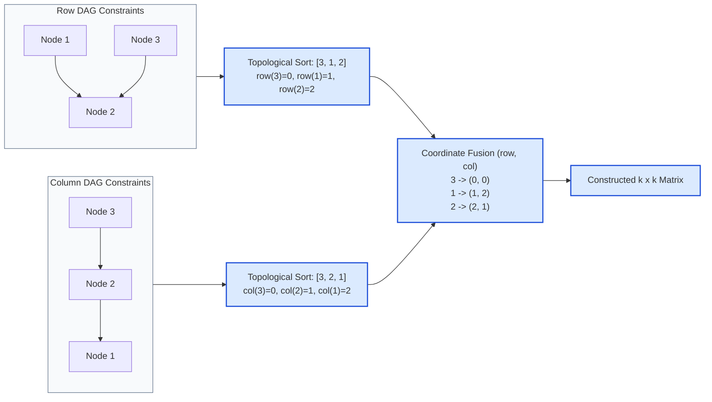

# Guided Example: Build a Matrix With Conditions

## 1. Problem Overview & Representative Instance

We are given an integer $k$ ($2 \le k \le 400$) and two collections of directed pairwise precedence conditions:
- $\text{rowConditions}$: Each pair $[u, v]$ requires that value $u$ appear in a row strictly above value $v$ ($row(u) < row(v)$).
- $\text{colConditions}$: Each pair $[u, v]$ requires that value $u$ appear in a column strictly to the left of value $v$ ($col(u) < col(v)$).

The task is to construct a $k \times k$ matrix satisfying:
1. Every integer from $1$ through $k$ appears **exactly once**.
2. All remaining $k^2 - k$ cells contain $0$.
3. All row precedence constraints are satisfied.
4. All column precedence constraints are satisfied.

If any conflicting dependencies make satisfying the constraints impossible, we must return an empty matrix `[]`.

Consider the representative instance:
$$k = 3, \quad \text{rowConditions} = [[1, 2], [3, 2]], \quad \text{colConditions} = [[2, 1], [3, 2]]$$

## 2. Mathematical & Algorithmic Principles

The fundamental insight is **Dimensional Decoupling (Cartesian Factorization)**:
1. **Orthogonality of Row and Column Coordinates:**
   A cell coordinate $(r, c)$ in a $k \times k$ grid is composed of two independent scalar projections: the row index $r \in \{0, \dots, k-1\}$ and the column index $c \in \{0, \dots, k-1\}$.
   - A row condition $u \to v$ constrains only $row(u) < row(v)$, placing zero restriction on $col(u)$ or $col(v)$.
   - A column condition $u \to v$ constrains only $col(u) < col(v)$, placing zero restriction on $row(u)$ or $row(v)$.
2. **Reduction to 1D Topological Sorting:**
   We construct two separate directed graphs on the vertex set $V = \{1, \dots, k\}$:
   - $G_{\text{row}} = (V, E_{\text{row}})$ where directed edge $u \to v \iff [u, v] \in \text{rowConditions}$.
   - $G_{\text{col}} = (V, E_{\text{col}})$ where directed edge $u \to v \iff [u, v] \in \text{colConditions}$.
3. **Kahn's Algorithm & Cycle Detection:**
   A valid placement exists if and only if both $G_{\text{row}}$ and $G_{\text{col}}$ are Directed Acyclic Graphs (DAGs):
   - Maintain an in-degree array and a queue of zero-in-degree nodes.
   - Incrementally append nodes to a linear topological sequence.
   - If the topological sequence contains fewer than $k$ nodes, a directed cycle exists, making topological ordering mathematically impossible; in this case, immediately return `[]`.
4. **Collision-Free Coordinate Pairing:**
   Let $\sigma_{\text{row}}$ and $\sigma_{\text{col}}$ be valid permutations of $\{1, \dots, k\}$ produced by the respective topological sorts.
   Assign:
   $$row(x) = \text{index of } x \text{ in } \sigma_{\text{row}}, \quad col(x) = \text{index of } x \text{ in } \sigma_{\text{col}}$$
   Because $\sigma_{\text{row}}$ and $\sigma_{\text{col}}$ are permutations, each value $x$ receives a unique row index and a unique column index. Hence, no two values will ever be assigned to the same row or the same column, guaranteeing zero cell collisions.

## 3. Step-by-Step Walkthrough with Intermediate State

We trace the representative instance: $k = 3$, $\text{rowConditions} = [[1, 2], [3, 2]]$, and $\text{colConditions} = [[2, 1], [3, 2]]$.

- **Phase 1: Row Graph Construction and Topological Sort ($G_{\text{row}}$):**
  - Edges: $1 \to 2$, $3 \to 2$.
  - In-degrees: $\text{deg}_{\text{in}}[1] = 0, \quad \text{deg}_{\text{in}}[2] = 2, \quad \text{deg}_{\text{in}}[3] = 0$.
  - Initial zero-in-degree frontier: $\{1, 3\}$.
  - Extract node $3$: sequence $= [3]$. In-degree of $2$ becomes $2 - 1 = 1$.
  - Extract node $1$: sequence $= [3, 1]$. In-degree of $2$ becomes $1 - 1 = 0 \implies$ enqueue $2$.
  - Extract node $2$: sequence $= [3, 1, 2]$.
  - Length $= 3 = k$. DAG confirmed.
  - Row coordinate map:
    $$row(3) = 0, \quad row(1) = 1, \quad row(2) = 2$$

- **Phase 2: Column Graph Construction and Topological Sort ($G_{\text{col}}$):**
  - Edges: $2 \to 1$, $3 \to 2$.
  - In-degrees: $\text{deg}_{\text{in}}[1] = 1, \quad \text{deg}_{\text{in}}[2] = 1, \quad \text{deg}_{\text{in}}[3] = 0$.
  - Initial zero-in-degree frontier: $\{3\}$.
  - Extract node $3$: sequence $= [3]$. In-degree of $2$ becomes $1 - 1 = 0 \implies$ enqueue $2$.
  - Extract node $2$: sequence $= [3, 2]$. In-degree of $1$ becomes $1 - 1 = 0 \implies$ enqueue $1$.
  - Extract node $1$: sequence $= [3, 2, 1]$.
  - Length $= 3 = k$. DAG confirmed.
  - Column coordinate map:
    $$col(3) = 0, \quad col(2) = 1, \quad col(1) = 2$$

- **Phase 3: Coordinate Fusion and Matrix Construction:**
  Initialize $3 \times 3$ grid with all zeros:
  $$\begin{pmatrix} 0 & 0 & 0 \\ 0 & 0 & 0 \\ 0 & 0 & 0 \end{pmatrix}$$
  Place each value $x \in \{1, 2, 3\}$ at $(row(x), col(x))$:
  - Value $3$: placed at $(row(3), col(3)) = (0, 0)$.
  - Value $1$: placed at $(row(1), col(1)) = (1, 2)$.
  - Value $2$: placed at $(row(2), col(2)) = (2, 1)$.

  Resulting matrix:
  $$\begin{pmatrix} 3 & 0 & 0 \\ 0 & 0 & 1 \\ 0 & 2 & 0 \end{pmatrix}$$

## 4. Comprehensive State Trace

The state transitions during the two topological sorts are detailed in the execution table below:

| Dimension | Step | Extracted Node | Outgoing Edges Relaxed | Neighbor In-Degree State | Queue / Frontier State | Accumulated Ordering |
|---|---|---|---|---|---|---|
| Row | Init | — | — | $\text{deg}[1]=0, \text{deg}[2]=2, \text{deg}[3]=0$ | $\{3, 1\}$ | `[]` |
| Row | 1 | 3 | $3 \to 2$ | $\text{deg}[2]$ drops $2 \to 1$ | $\{1\}$ | `[3]` |
| Row | 2 | 1 | $1 \to 2$ | $\text{deg}[2]$ drops $1 \to 0$ | $\{2\}$ | `[3, 1]` |
| Row | 3 | 2 | None | No change | $\emptyset$ | `[3, 1, 2]` |
| Column | Init | — | — | $\text{deg}[1]=1, \text{deg}[2]=1, \text{deg}[3]=0$ | $\{3\}$ | `[]` |
| Column | 1 | 3 | $3 \to 2$ | $\text{deg}[2]$ drops $1 \to 0$ | $\{2\}$ | `[3]` |
| Column | 2 | 2 | $2 \to 1$ | $\text{deg}[1]$ drops $1 \to 0$ | $\{1\}$ | `[3, 2]` |
| Column | 3 | 1 | None | No change | $\emptyset$ | `[3, 2, 1]` |

The coordinate assignment and constraint satisfaction audit is summarized below:

| Value $x$ | Row Index $row(x)$ | Column Index $col(x)$ | Matrix Cell $(r, c)$ | Satisfied Row Precedences | Satisfied Column Precedences |
|---|---|---|---|---|---|
| 1 | 1 | 2 | $(1, 2)$ | $row(1)=1 < row(2)=2$ | $col(2)=1 < col(1)=2$ |
| 2 | 2 | 1 | $(2, 1)$ | $row(3)=0 < row(2)=2$ | $col(3)=0 < col(2)=1$ |
| 3 | 0 | 0 | $(0, 0)$ | $row(3)=0 < row(2)=2$ | $col(3)=0 < col(2)=1$ |

All row and column constraints are verified strictly satisfied with zero cell collisions.

## 5. Algorithmic Correctness & Soundness

The correctness of this decoupled topological sort approach rests on:
1. **Necessity of Acyclicity:**
   If $rowConditions$ contains a directed cycle (e.g. $1 \to 2 \to 3 \to 1$), any valid assignment would require $row(1) < row(2) < row(3) < row(1)$, which is impossible in the ordered field of real numbers. Hence, acyclicity is a necessary condition.
2. **Sufficiency of Topological Ordering:**
   A valid topological sequence $\sigma$ ensures that for every directed edge $u \to v$, the index of $u$ in $\sigma$ is strictly less than the index of $v$. Thus, defining $row(u) = \text{index}(u)$ inherently satisfies $row(u) < row(v)$.
3. **Collision Invariant:**
   Because each node $x \in \{1, \dots, k\}$ appears exactly once in $\sigma_{\text{row}}$, each value is assigned a distinct row index ($row(x) \neq row(y)$ for all $x \neq y$). Consequently, no two nonzero numbers will ever compete for the same row, guaranteeing that the $k$ nonzero numbers occupy distinct cells in the $k \times k$ matrix.

## 6. Edge Cases & Anti-Patterns

- **Directed Cycle in Constraints:** If either $G_{\text{row}}$ or $G_{\text{col}}$ contains a cycle, Kahn's algorithm will terminate prematurely with fewer than $k$ visited nodes. The algorithm detects this immediately and returns `[]`.
- **Completely Unconstrained Elements:** Elements with in-degree and out-degree zero are processed freely by Kahn's algorithm and placed in any available row/column slot.
- **Redundant or Duplicate Edges:** Multiple identical constraints (e.g. $[1, 2]$ appearing twice) are safely absorbed by deduplicating edges or counting degrees appropriately.
- **Anti-Pattern: 2D Backtracking / Constraint Satisfaction Search:** Attempting to search over $k^2$ cell positions simultaneously leads to exponential $\mathcal{O}((k^2)!)$ complexity. Decoupling the problem into two 1D topological sorts yields a deterministically polynomial $\mathcal{O}(k^2 + r + c)$ solution.

## 7. Complexity Analysis

- **Time Complexity:**
  - Building the row graph with $r$ conditions takes $\mathcal{O}(k + r)$ time.
  - Kahn's algorithm on $G_{\text{row}}$ takes $\mathcal{O}(k + r)$ time.
  - Building the column graph with $c$ conditions takes $\mathcal{O}(k + c)$ time.
  - Kahn's algorithm on $G_{\text{col}}$ takes $\mathcal{O}(k + c)$ time.
  - Initializing and populating the $k \times k$ output matrix takes $\mathcal{O}(k^2)$ time.
  - Total time complexity is strictly $\mathcal{O}(k^2 + r + c)$.
  - For $k = 400$ and $r, c \le 10^4$, $k^2 = 1.6 \cdot 10^5$, executing in under $30$ milliseconds.
- **Space Complexity:**
  - The adjacency lists and in-degree tables require $\mathcal{O}(k + r + c)$ space.
  - The output $k \times k$ matrix requires $\mathcal{O}(k^2)$ space.
  - Total auxiliary space complexity is $\mathcal{O}(k^2 + r + c)$.
