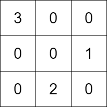

## Description

You are given a **positive** integer `k`. You are also given:

- a 2D integer array `rowConditions` of size `n` where $\text{rowConditions}[i] = [\text{above}_{i}, \text{below}_{i}]$, and

- a 2D integer array `colConditions` of size `m` where $\text{colConditions}[i] = [\text{left}_{i}, \text{right}_{i}]$.

The two arrays contain integers from `1` to `k`.

You have to build a `k x k` matrix that contains each of the numbers from `1` to `k` **exactly once**. The remaining cells should have the value `0`.

The matrix should also satisfy the following conditions:

- The number $\text{above}_{i}$ should appear in a **row** that is strictly **above** the row at which the number $\text{below}_{i}$ appears for all `i` from `0` to $n - 1$.

- The number $\text{left}_{i}$ should appear in a **column** that is strictly **left** of the column at which the number $\text{right}_{i}$ appears for all `i` from `0` to $m - 1$.

Return ***any** matrix that satisfies the conditions*. If no answer exists, return an empty matrix.
### Function Contract

- `n`: Input parameter.
- Returns expected result.

### Examples
#### Example 1

- **Input:** $k = 3, rowConditions = [[1,2],[3,2]], colConditions = [[2,1],[3,2]]$
- **Output:** `[[3,0,0],[0,0,1],[0,2,0]]`
- **Explanation:** The diagram above shows a valid example of a matrix that satisfies all the conditions.
The row conditions are the following:
- Number 1 is in row <u>1</u>, and number 2 is in row <u>2</u>, so 1 is above 2 in the matrix.
- Number 3 is in row <u>0</u>, and number 2 is in row <u>2</u>, so 3 is above 2 in the matrix.
The column conditions are the following:
- Number 2 is in column <u>1</u>, and number 1 is in column <u>2</u>, so 2 is left of 1 in the matrix.
- Number 3 is in column <u>0</u>, and number 2 is in column <u>1</u>, so 3 is left of 2 in the matrix.
Note that there may be multiple correct answers.
#### Example 2

- **Input:** $k = 3, rowConditions = [[1,2],[2,3],[3,1],[2,3]], colConditions = [[2,1]]$
- **Output:** `[]`
- **Explanation:** From the first two conditions, 3 has to be below 1 but the third conditions needs 3 to be above 1 to be satisfied.
No matrix can satisfy all the conditions, so we return the empty matrix.
### Constraints

- $2 \le k \le 400$

- $1 \le \text{rowConditions.length}, \text{colConditions.length} \le 10^{4}$

- $\text{rowConditions}[i].length = \text{colConditions}[i].length = 2$

- $1 \le \text{above}_{i}, \text{below}_{i}, \text{left}_{i}, \text{right}_{i} \le k$

- $\text{above}_{i} \neq \text{below}_{i}$

- $\text{left}_{i} \neq \text{right}_{i}$