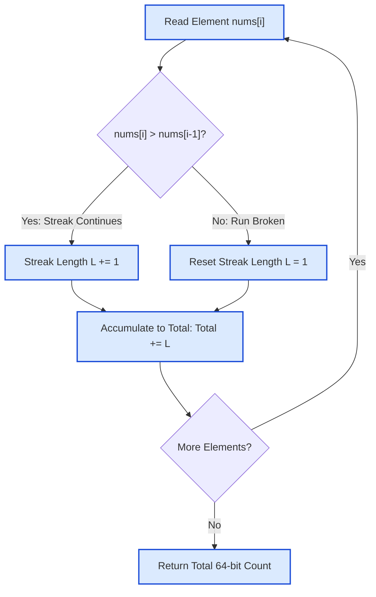

# Guided Example: Count Strictly Increasing Subarrays

## 1. Problem Overview & Representative Instance

We are given an array of positive integers $\text{nums}$ of length $n$ ($1 \le n \le 10^5$). A subarray is a contiguous, non-empty sequence of elements $\text{nums}[l \dots r]$ with $0 \le l \le r < n$. A subarray is strictly increasing if every adjacent pair satisfies $\text{nums}[i] < \text{nums}[i + 1]$ for all $l \le i < r$. Every length-$1$ subarray is trivially strictly increasing.

Our objective is to count the total number of strictly increasing subarrays across the entire array.

Consider the representative array:
$$\text{nums} = [1, 3, 5, 4, 4, 6]$$

The array contains $n = 6$ elements with multiple points where the strictly increasing order breaks (decreases and non-strict equalities).

## 2. Mathematical & Algorithmic Principles

Two dual perspectives establish the optimal linear-time algorithm:
1. **Right-Endpoint Conditioning (Online Recurrence):**
   Every non-empty subarray is uniquely identified by its right endpoint $r$.
   Let $L(r)$ denote the length of the longest strictly increasing subarray ending at index $r$.
   Any strictly increasing subarray ending at $r$ can start at any index $l \in [r - L(r) + 1, r]$.
   Therefore, exactly $L(r)$ strictly increasing subarrays end at index $r$.
   Summing across all possible right endpoints gives the total count:
   $$\text{Total} = \sum_{r=0}^{n-1} L(r)$$
   The recurrence for $L(r)$ is immediate:
   $$L(0) = 1, \quad L(r) = \begin{cases} L(r-1) + 1 & \text{if } \text{nums}[r] > \text{nums}[r-1] \\ 1 & \text{if } \text{nums}[r] \le \text{nums}[r-1] \end{cases}$$
2. **Maximal Run Decomposition & Triangular Summation:**
   Partition the array into maximal contiguous segments $S_1, S_2, \dots, S_m$ where each segment $S_k$ is strictly increasing.
   If a maximal run has length $M_k$, all of its subarrays are strictly increasing. The number of non-empty subarrays within this run is given by the $M_k$-th triangular number:
   $$T(M_k) = \frac{M_k (M_k + 1)}{2} = \sum_{j=1}^{M_k} j$$
   Because any strictly increasing subarray must be entirely contained within some maximal run $S_k$, the global sum is:
   $$\text{Total} = \sum_{k=1}^m \frac{M_k (M_k + 1)}{2}$$
3. **64-Bit Integer Capacity:**
   When the entire array of length $n = 10^5$ is strictly increasing, the maximum possible answer is:
   $$\frac{10^5 \cdot (10^5 + 1)}{2} = 5{,}000{,}050{,}000 \approx 5 \cdot 10^9$$
   This exceeds the signed 32-bit integer limit ($2^{31} - 1 \approx 2.14 \cdot 10^9$), mandating 64-bit integer accumulation.

## 3. Step-by-Step Walkthrough with Intermediate State

We trace the streaming calculation on $\text{nums} = [1, 3, 5, 4, 4, 6]$.

- **Index 0 ($\text{nums}[0] = 1$):**
  - First element. Active streak $L = 1$.
  - Subarrays ending here: $[1]$ ($1$ subarray).
  - Cumulative total: $1$.

- **Index 1 ($\text{nums}[1] = 3$):**
  - Comparison: $\text{nums}[1] = 3 > \text{nums}[0] = 1$. Run continues.
  - Active streak $L = 1 + 1 = 2$.
  - Subarrays ending here: $[3]$, $[1, 3]$ ($2$ subarrays).
  - Cumulative total: $1 + 2 = 3$.

- **Index 2 ($\text{nums}[2] = 5$):**
  - Comparison: $\text{nums}[2] = 5 > \text{nums}[1] = 3$. Run continues.
  - Active streak $L = 2 + 1 = 3$.
  - Subarrays ending here: $[5]$, $[3, 5]$, $[1, 3, 5]$ ($3$ subarrays).
  - Cumulative total: $3 + 3 = 6$.

- **Index 3 ($\text{nums}[3] = 4$):**
  - Comparison: $\text{nums}[3] = 4 \le \text{nums}[2] = 5$. Run breaks.
  - Active streak resets to $L = 1$.
  - Subarrays ending here: $[4]$ ($1$ subarray).
  - Cumulative total: $6 + 1 = 7$.

- **Index 4 ($\text{nums}[4] = 4$):**
  - Comparison: $\text{nums}[4] = 4 \le \text{nums}[3] = 4$ (equality). Run breaks.
  - Active streak resets to $L = 1$.
  - Subarrays ending here: $[4]$ ($1$ subarray).
  - Cumulative total: $7 + 1 = 8$.

- **Index 5 ($\text{nums}[5] = 6$):**
  - Comparison: $\text{nums}[5] = 6 > \text{nums}[4] = 4$. Run continues.
  - Active streak $L = 1 + 1 = 2$.
  - Subarrays ending here: $[6]$, $[4, 6]$ ($2$ subarrays).
  - Cumulative total: $8 + 2 = 10$.

- **Final Result:** Total strictly increasing subarrays $= 10$.

## 4. Comprehensive State Trace

The right-endpoint online step progression is recorded below:

| Index $r$ | Value $\text{nums}[r]$ | Predecessor $\text{nums}[r-1]$ | Strict Increase? | Active Run Length $L(r)$ | Qualifying Subarrays Ending at $r$ | Cumulative Total |
|---|---|---|---|---|---|---|
| 0 | 1 | — | Base Case | 1 | `[1]` | 1 |
| 1 | 3 | 1 | Yes ($3 > 1$) | 2 | `[3]`, `[1, 3]` | 3 |
| 2 | 5 | 3 | Yes ($5 > 3$) | 3 | `[5]`, `[3, 5]`, `[1, 3, 5]` | 6 |
| 3 | 4 | 5 | No ($4 \le 5$) | 1 | `[4]` | 7 |
| 4 | 4 | 4 | No ($4 \le 4$) | 1 | `[4]` | 8 |
| 5 | 6 | 4 | Yes ($6 > 4$) | 2 | `[6]`, `[4, 6]` | 10 |

The maximal run decomposition and triangular partition is audited below:

| Segment ID | Slice Range $[l, r]$ | Elements in Run | Run Length $M$ | Triangular Formula $\frac{M(M+1)}{2}$ | Subarrays Produced | Segment Subtotal |
|---|---|---|---|---|---|---|
| Segment 1 | $[0, 2]$ | $[1, 3, 5]$ | 3 | $\frac{3 \cdot 4}{2} = 6$ | `[1]`, `[3]`, `[5]`, `[1, 3]`, `[3, 5]`, `[1, 3, 5]` | 6 |
| Segment 2 | $[3, 3]$ | $[4]$ | 1 | $\frac{1 \cdot 2}{2} = 1$ | `[4]` (at index 3) | 1 |
| Segment 3 | $[4, 5]$ | $[4, 6]$ | 2 | $\frac{2 \cdot 3}{2} = 3$ | `[4]`, `[6]`, `[4, 6]` | 3 |
| **Global** | **Full Array** | — | — | — | **All Disjoint Runs** | **10** |

Both formulations yield the exact count of $10$.

## 5. Algorithmic Correctness & Soundness

The correctness is established by the following properties:
1. **Partition by Right Endpoint:**
   Every non-empty subarray has a unique right endpoint $r \in \{0, \dots, n-1\}$. By summing the number of valid subarrays ending at each $r$, we neither double-count nor omit any subarray.
2. **Contiguity of Strict Monotonicity:**
   If $\text{nums}[l \dots r]$ is strictly increasing, then any subsegment $\text{nums}[k \dots r]$ with $l \le k \le r$ must also be strictly increasing. Conversely, if $\text{nums}[i] \ge \text{nums}[i+1]$ for some $i$, no strictly increasing subarray can span across the boundary $i$ and $i + 1$. Thus, the set of valid left endpoints for a fixed right endpoint $r$ is precisely the contiguous interval $[r - L(r) + 1, r]$.
3. **Equivalence of Online and Batch Views:**
   Summing integers $1$ through $M_k$ within each maximal run matches $\sum_{j=1}^{M_k} j = \frac{M_k(M_k + 1)}{2}$. Both the online streak accumulator and the maximal segment batcher produce algebraically identical sums.

## 6. Edge Cases & Anti-Patterns

- **All Elements Equal ($\text{nums} = [5, 5, 5, 5]$):** Every step breaks strict monotonicity ($5 \le 5$). The run length remains $1$ for all indices, yielding a total of $n = 4$ subarrays (only length-$1$ subarrays qualify).
- **Strictly Decreasing Array ($\text{nums} = [5, 4, 3, 2, 1]$):** Every comparison fails, returning $n$ length-$1$ subarrays.
- **Strictly Increasing Array ($\text{nums} = [1, 2, 3, 4, 5]$):** Run length grows continuously from $1$ to $5$, yielding $\frac{5 \cdot 6}{2} = 15$.
- **Single Element ($n = 1$):** Loop executes once, returning $1$.
- **32-Bit Integer Overflow:** For $n = 10^5$, answers up to $\approx 5 \cdot 10^9$ overflow 32-bit signed types. Variables must use 64-bit integer types (`long long` in C++, `long` in Java/C#, native integers in Python/Go).
- **Anti-Pattern: Nested Loops Subarray Enumeration:** Checking all $\mathcal{O}(n^2)$ pairs $(l, r)$ takes $\mathcal{O}(n^3)$ or $\mathcal{O}(n^2)$ time ($10^{10}$ operations), causing Time Limit Exceeded. The online streak takes strictly $\mathcal{O}(n)$ time.

## 7. Complexity Analysis

- **Time Complexity:**
  - We iterate through the array of length $n$ once.
  - At each index, we perform one comparison, one increment or reset, and one addition.
  - Total time complexity is strictly linear: $\mathcal{O}(n)$.
  - For $n = 10^5$, the loop finishes in under $2$ milliseconds.
- **Space Complexity:**
  - The online algorithm maintains only two 64-bit scalar accumulators (`streak` and `total`).
  - No auxiliary arrays or recursive call stacks are required.
  - Total auxiliary space complexity is strictly $\mathcal{O}(1)$.
