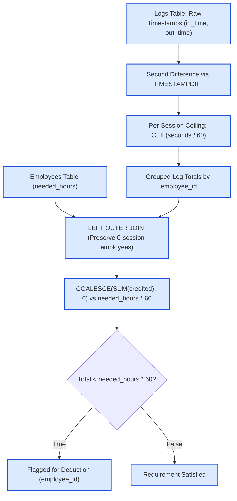

# Guided Example: Employees With Deductions

## 1. Problem Overview & Representative Instance

We are given two relational database tables:
- $\text{Employees}(\text{employee\_id}, \text{needed\_hours})$: Contains each employee's unique identifier and their mandatory monthly work requirement in whole hours ($\text{needed\_hours} > 0$).
- $\text{Logs}(\text{employee\_id}, \text{in\_time}, \text{out\_time})$: Records zero or more distinct work sessions for each employee during October 2022. A work session begins at $\text{in\_time}$ and concludes at $\text{out\_time}$ ($\text{out\_time} > \text{in\_time}$). Sessions that start before midnight may conclude on the following calendar day.

Work session durations are measured in minutes. However, the company applies a strict **per-session upward rounding policy**: each individual session's duration is computed in seconds and rounded up to the nearest whole minute if any remaining seconds exist:
$$\text{credited\_minutes} = \left\lceil \frac{\text{duration in seconds}}{60} \right\rceil$$

An employee incurs a deduction if their total credited work duration across the month is strictly less than their required monthly commitment:
$$\sum \text{credited\_minutes} < \text{needed\_hours} \times 60$$

Employees who logged zero sessions across the entire month have a total credited work time of $0$ minutes and must also be flagged for deductions. Our objective is to identify and return all such $\text{employee\_id}$ values.

Consider the representative instance:

$\text{Employees}$:
$$\begin{array}{|c|c|}
\hline
\text{employee\_id} & \text{needed\_hours} \\
\hline
1 & 20 \\
2 & 12 \\
3 & 5 \\
\hline
\end{array}$$

$\text{Logs}$:
$$\begin{array}{|c|c|c|}
\hline
\text{employee\_id} & \text{in\_time} & \text{out\_time} \\
\hline
1 & \text{2022-10-01 09:00:00} & \text{2022-10-01 17:00:00} \\
1 & \text{2022-10-02 08:30:00} & \text{2022-10-02 16:33:05} \\
1 & \text{2022-10-03 13:00:00} & \text{2022-10-03 17:00:15} \\
2 & \text{2022-10-05 08:00:00} & \text{2022-10-05 19:58:30} \\
\hline
\end{array}$$

## 2. Mathematical & Algorithmic Principles

1. **Non-Linearity of Per-Session Ceiling Rounding:**
   The rounding rule operates **independently per session**, rather than once on the aggregate monthly total. By the mathematical properties of the ceiling function:
   $$\lceil x + y \rceil \le \lceil x \rceil + \lceil y \rceil$$
   Summing raw seconds and taking the ceiling at the end would understate the credited minutes whenever individual sessions have non-zero second remainders. The correct credited duration for session $j$ of employee $i$ is:
   $$c_{i,j} = \left\lceil \frac{\text{TIMESTAMPDIFF}(\text{SECOND}, \text{in\_time}, \text{out\_time})}{60} \right\rceil$$
2. **Relational Outer Join for Universal Employee Coverage:**
   An inner join between $\text{Employees}$ and $\text{Logs}$ would discard employees who logged zero sessions. Because an employee with zero sessions has worked $0$ minutes, they naturally fall short of any positive requirement ($\text{needed\_hours} \times 60 > 0$). A $\text{LEFT OUTER JOIN}$ from $\text{Employees}$ to $\text{Logs}$ preserves all employees, replacing missing session sums with $0$ using $\text{COALESCE}$:
   $$\text{Total Credited}(i) = \text{COALESCE}\left( \sum_{j} c_{i,j}, 0 \right)$$
3. **Threshold Comparison & Deduction Predicate:**
   The filter condition is:
   $$\text{Total Credited}(i) < \text{needed\_hours}_i \times 60$$

## 3. Step-by-Step Walkthrough with Intermediate State

We process the representative dataset:

- **Phase 1: Evaluating Each Session in $\text{Logs}$:**
  - **Employee 1, Session 1:**
    - From `09:00:00` to `17:00:00` $= 8\text{ hours } 0\text{ min } 0\text{ sec} = 28{,}800\text{ seconds}$.
    - Fraction: $28{,}800 / 60 = 480.0\text{ minutes}$.
    - Credited: $\lceil 480.0 \rceil = 480\text{ minutes}$.
  - **Employee 1, Session 2:**
    - From `08:30:00` to `16:33:05` $= 8\text{ hours } 3\text{ min } 5\text{ sec} = 29{,}000 - 15 = 28{,}985\text{ seconds}$.
    - Fraction: $28{,}985 / 60 = 483.0833\dots\text{ minutes}$.
    - Credited: $\lceil 483.0833\dots \rceil = 484\text{ minutes}$ (rounded up by $5$ seconds remainder).
  - **Employee 1, Session 3:**
    - From `13:00:00` to `17:00:15` $= 4\text{ hours } 0\text{ min } 15\text{ sec} = 14{,}415\text{ seconds}$.
    - Fraction: $14{,}415 / 60 = 240.25\text{ minutes}$.
    - Credited: $\lceil 240.25 \rceil = 241\text{ minutes}$ (rounded up by $15$ seconds remainder).
  - **Employee 2, Session 1:**
    - From `08:00:00` to `19:58:30` $= 11\text{ hours } 58\text{ min } 30\text{ sec} = 43{,}110\text{ seconds}$.
    - Fraction: $43{,}110 / 60 = 718.5\text{ minutes}$.
    - Credited: $\lceil 718.5 \rceil = 719\text{ minutes}$ (rounded up by $30$ seconds remainder).

- **Phase 2: Aggregating Credited Minutes per Employee:**
  - **Employee 1:**
    - Total credited minutes $= 480 + 484 + 241 = 1{,}205\text{ minutes}$.
    - Requirement: $20\text{ hours} \times 60 = 1{,}200\text{ minutes}$.
    - Deficit test: $1{,}205 < 1{,}200 \implies \text{False}$. Requirement met.
  - **Employee 2:**
    - Total credited minutes $= 719\text{ minutes}$.
    - Requirement: $12\text{ hours} \times 60 = 720\text{ minutes}$.
    - Deficit test: $719 < 720 \implies \text{True}$. Deficit of $1$ minute $\implies$ **Deduction**.
  - **Employee 3:**
    - No sessions in $\text{Logs}$. $\text{COALESCE}(\text{NULL}, 0) = 0\text{ minutes}$.
    - Requirement: $5\text{ hours} \times 60 = 300\text{ minutes}$.
    - Deficit test: $0 < 300 \implies \text{True}$. Deficit of $300$ minutes $\implies$ **Deduction**.

- **Phase 3: Result Set Assembly:**
  The employees subject to deductions are `employee_id` $2$ and $3$.

## 4. Comprehensive State Trace

The granular breakdown of each work session in $\text{Logs}$ is detailed below:

| Employee ID | Session Interval (`in_time` $\to$ `out_time`) | Raw Duration (seconds) | Exact Fractional Minutes | Applied Ceiling Rule | Credited Minutes |
|---|---|---|---|---|---|
| 1 | `10-01 09:00:00` $\to$ `10-01 17:00:00` | 28,800 | 480.000 | $\lceil 480.000 \rceil$ | 480 |
| 1 | `10-02 08:30:00` $\to$ `10-02 16:33:05` | 28,985 | 483.083 | $\lceil 483.083 \rceil$ | 484 |
| 1 | `10-03 13:00:00` $\to$ `10-03 17:00:15` | 14,415 | 240.250 | $\lceil 240.250 \rceil$ | 241 |
| 2 | `10-05 08:00:00` $\to$ `10-05 19:58:30` | 43,110 | 718.500 | $\lceil 718.500 \rceil$ | 719 |

The monthly reconciliation and deduction audit per employee is summarized below:

| Employee ID | Monthly Requirement (`needed_hours`) | Required Target (minutes) | Total Credited Sessions | Total Credited Minutes | Deficit Condition ($< \text{Target}$) | Deduction Flagged |
|---|---|---|---|---|---|---|
| 1 | 20 | 1,200 | 3 | 1,205 | $1{,}205 < 1{,}200$ (False) | No |
| 2 | 12 | 720 | 1 | 719 | $719 < 720$ (True) | **Yes** |
| 3 | 5 | 300 | 0 | 0 | $0 < 300$ (True) | **Yes** |

Employees 2 and 3 are correctly emitted.

## 5. Algorithmic Correctness & Soundness

1. **Preservation of Zero-Activity Entities:**
   In relational algebra, an inner join filters out any tuple in the left table that has no matching foreign key in the right table. Using a left outer join ensures every employee in $\text{Employees}$ participates in the aggregation. Substituting NULL aggregates with $0$ ensures that employees with no logged activity are evaluated against their positive required hours and correctly flagged.
2. **Strict Compliance with Independent Rounding:**
   By applying $\lceil \Delta t / 60 \rceil$ inside the aggregation expression ($\sum \lceil \cdot \rceil$), each session receives its full discrete upward rounding before summation. Applying the ceiling after summation would violate the explicit problem contract and result in incorrect deductions for borderline workers.

## 6. Edge Cases & Anti-Patterns

- **Zero Logged Sessions:** An employee with zero log rows must not be omitted from the query. A $\text{LEFT JOIN}$ combined with `COALESCE(SUM(...), 0)` correctly computes $0$ minutes, triggering the deduction.
- **Cross-Midnight Work Sessions:** A shift beginning at `23:30:00` on Day 1 and ending at `07:30:00` on Day 2 spans across midnight. Using `TIMESTAMPDIFF(SECOND, in_time, out_time)` correctly computes the full $8$-hour span ($28{,}800$ seconds) across calendar date boundaries.
- **Exact Second Boundaries:** If a session lasts exactly $60$ seconds, $60 / 60 = 1.0 \implies \lceil 1.0 \rceil = 1$ minute. If it lasts $61$ seconds, $61 / 60 = 1.0167 \implies \lceil 1.0167 \rceil = 2$ minutes.
- **Anti-Pattern: Summing Seconds Before Ceiling:** Calculating $\lceil \sum \text{seconds} / 60 \rceil$ aggregates fractional remainders together, potentially erasing upward-rounded minutes earned by multiple individual sessions.
- **Anti-Pattern: Inner Join:** Using `INNER JOIN` silently eliminates inactive employees, failing to report workers who did not work at all.

## 7. Complexity Analysis

- **Time Complexity:**
  - Scanning the $\text{Logs}$ table of $L$ rows and evaluating timestamp differences takes $\mathcal{O}(L)$ time.
  - Grouping logs by $\text{employee\_id}$ using hash aggregation or index scanning takes $\mathcal{O}(L)$ time.
  - Joining the grouped logs with the $\text{Employees}$ table of $E$ rows takes $\mathcal{O}(E + L)$ time.
  - Evaluating the `HAVING` or `WHERE` predicate takes $\mathcal{O}(E)$ time.
  - Total database execution time is strictly $\mathcal{O}(E + L)$.
- **Space Complexity:**
  - Hash tables or temporary spool spaces for grouped aggregation require $\mathcal{O}(E)$ memory.
  - Output table stores at most $E$ employee IDs.
  - Total auxiliary space complexity is $\mathcal{O}(E)$.
