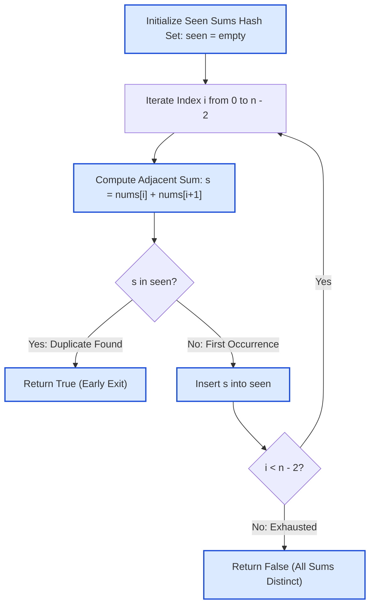

# Guided Example: Find Subarrays With Equal Sum

## 1. Problem Overview & Representative Instance

We are given a 0-indexed integer array $\text{nums}$ of length $n$ ($2 \le n \le 1000$) where $-10^9 \le \text{nums}[i] \le 10^9$. A length-$2$ subarray starting at index $i$ ($0 \le i \le n - 2$) consists of the adjacent pair $(\text{nums}[i], \text{nums}[i + 1])$ and has the sum:
$$S_i = \text{nums}[i] + \text{nums}[i + 1]$$

Our task is to determine whether there exist two distinct starting indices $i \neq j$ such that their length-$2$ subarrays yield identical sums ($S_i = S_j$). Subarrays are permitted to overlap (for instance, $j = i + 1$). If such a pair of indices exists, return `true`; otherwise, return `false`.

Consider the representative instance:
$$\text{nums} = [4, 2, 4]$$

Here $n = 3$, yielding two length-$2$ subarrays that overlap at index $1$.

## 2. Mathematical & Algorithmic Principles

1. **Mapping to Sequence of Pairwise Sums:**
   The array $\text{nums}$ of length $n$ induces a sequence of $n - 1$ adjacent sums:
   $$S = (S_0, S_1, \dots, S_{n-2}), \quad \text{where } S_i = \text{nums}[i] + \text{nums}[i + 1]$$
   The problem is equivalent to determining whether the sequence $S$ contains at least one duplicate element (i.e. whether $S$ is non-injective).
2. **Pigeonhole Principle & Hash Set Membership:**
   By tracking previously encountered sum values in a hash set $\text{seen}$:
   - At step $i$, if $S_i \in \text{seen}$, we have discovered an earlier index $j < i$ such that $S_j = S_i$. Because $j < i$, $j \neq i$ is guaranteed. We can immediately terminate and return `true`.
   - If $S_i \notin \text{seen}$, we insert $S_i$ into $\text{seen}$ and proceed.
3. **Overlapping Pair Invariance:**
   The problem allows $j = i + 1$. For example, in $\text{nums} = [a, b, c]$, the two subarrays are $(a, b)$ with sum $a + b$ and $(b, c)$ with sum $b + c$. They share element $b$. If $a + b = b + c \iff a = c$, this constitutes a valid duplicate pair despite sharing index $1$.

## 3. Step-by-Step Walkthrough with Intermediate State

We trace the algorithm on $\text{nums} = [4, 2, 4]$.

- **Initialization:**
  - Length $n = 3$. Valid starting indices: $i \in \{0, 1\}$.
  - Hash set: $\text{seen} = \emptyset$.

- **Step 1 ($i = 0$):**
  - Extract adjacent pair: $(\text{nums}[0], \text{nums}[1]) = (4, 2)$.
  - Calculate sum: $S_0 = 4 + 2 = 6$.
  - Membership check: $6 \in \text{seen} \implies \text{False}$.
  - State update: $\text{seen} = \{6\}$.

- **Step 2 ($i = 1$):**
  - Extract adjacent pair: $(\text{nums}[1], \text{nums}[2]) = (2, 4)$.
  - Calculate sum: $S_1 = 2 + 4 = 6$.
  - Membership check: $6 \in \text{seen} \implies \text{True}$.
  - A duplicate sum $6$ was generated at index $0$ and repeated at index $1$.
  - Early exit triggered: return `true`.

## 4. Comprehensive State Trace

The online stream processing is recorded in the trace table below:

| Loop Index $i$ | Subarray Slice | Pair Elements $(x, y)$ | Adjacent Sum $S_i = x + y$ | Condition $S_i \in \text{seen}$ | Hash Set State $\text{seen}$ | Action / Verdict |
|---|---|---|---|---|---|---|
| 0 | $\text{nums}[0 \dots 1]$ | $(4, 2)$ | $4 + 2 = 6$ | False | $\{6\}$ | Insert 6 into seen |
| 1 | $\text{nums}[1 \dots 2]$ | $(2, 4)$ | $2 + 4 = 6$ | **True** | $\{6\}$ | **Collision Found $\implies$ Return True** |

To demonstrate the full non-matching case, consider $\text{nums} = [1, 2, 3, 4, 5]$:

| Loop Index $i$ | Subarray Slice | Pair Elements $(x, y)$ | Adjacent Sum $S_i$ | Condition $S_i \in \text{seen}$ | Set Contents After Step | Stream Status |
|---|---|---|---|---|---|---|
| 0 | $\text{nums}[0 \dots 1]$ | $(1, 2)$ | 3 | False | $\{3\}$ | Proceed |
| 1 | $\text{nums}[1 \dots 2]$ | $(2, 3)$ | 5 | False | $\{3, 5\}$ | Proceed |
| 2 | $\text{nums}[2 \dots 3]$ | $(3, 4)$ | 7 | False | $\{3, 5, 7\}$ | Proceed |
| 3 | $\text{nums}[3 \dots 4]$ | $(4, 5)$ | 9 | False | $\{3, 5, 7, 9\}$ | Proceed |
| End | — | — | — | — | Cardinality = 4 | **All Distinct $\implies$ Return False** |

## 5. Algorithmic Correctness & Soundness

1. **Equivalence of Set Collision and Index Uniqueness:**
   The algorithm queries $\text{seen}$ for $S_i$ before inserting $S_i$. If $S_i \in \text{seen}$, there exists an index $j \in \{0, \dots, i - 1\}$ that already inserted $S_i$. Because $j < i$, we have $j \neq i$ by construction, satisfying the distinct index requirement.
2. **Exhaustive Completeness:**
   If there exist indices $i < j$ with $S_i = S_j$, then when the linear loop reaches index $j$, index $i$ has already been processed and $S_i$ is present in $\text{seen}$. The check $S_j \in \text{seen}$ will evaluate to true. Thus, no valid collision can be missed.

## 6. Edge Cases & Anti-Patterns

- **Minimum Length ($n = 2$):** Only one length-$2$ subarray exists ($i = 0$). Loop executes once, never finds a duplicate, and returns `false`.
- **Identical Triplet ($\text{nums} = [0, 0, 0]$):** $S_0 = 0 + 0 = 0$ and $S_1 = 0 + 0 = 0$. Collision detected at $i = 1$, correctly returning `true`.
- **Negative and Large Numbers:** Elements range from $-10^9$ to $10^9$. Pair sums range from $-2 \cdot 10^9$ to $2 \cdot 10^9$, comfortably fitting within standard 32-bit signed integers without overflow.
- **Anti-Pattern: Nested Pair Comparison ($\mathcal{O}(n^2)$):** Checking all pairs of starting indices $(i, j)$ requires $\mathcal{O}(n^2)$ time. While feasible for $n \le 1000$, the hash set approach achieves optimal $\mathcal{O}(n)$ time and terminates on the very first collision.

## 7. Complexity Analysis

- **Time Complexity:**
  - The loop iterates at most $n - 1$ times.
  - In each iteration, computing the adjacent sum and probing a hash set takes $\mathcal{O}(1)$ average time.
  - Worst-case time (when all pair sums are distinct) is $\mathcal{O}(n)$.
  - Best-case time (duplicate at $i = 1$) is $\mathcal{O}(1)$.
  - For $n = 1000$, the scan completes in under $1$ millisecond.
- **Space Complexity:**
  - The hash set stores at most $n - 1$ distinct scalar integer sums.
  - Total auxiliary space complexity is $\mathcal{O}(n)$.
