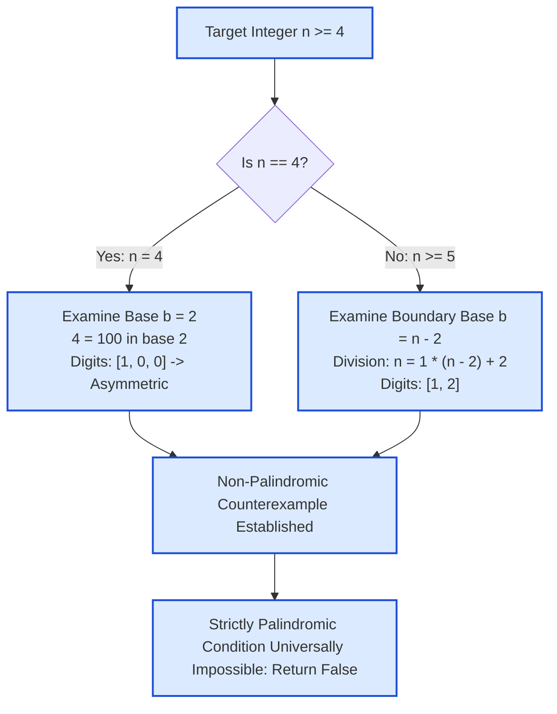

# Guided Example: Strictly Palindromic Number

## 1. Problem Overview & Representative Instance

An integer $n$ ($4 \le n \le 10^5$) is defined as **strictly palindromic** if its representation in **every** integer base $b$ in the range $2 \le b \le n - 2$ forms a palindrome. A representation is palindromic if the sequence of its digits reads identically from left-to-right (most significant to least significant) and from right-to-left.

If there exists even a single base $b \in [2, n - 2]$ in which the digit representation of $n$ is not palindromic, $n$ fails the definition and the result is `false`. Only if every single base in the interval produces a palindrome does the result evaluate to `true`.

Consider the representative instance:
$$n = 9, \quad \text{required bases } b \in \{2, 3, 4, 5, 6, 7\}$$

## 2. Mathematical & Algorithmic Principles

1. **Radix Representation & Polynomial Expansion:**
   In an integer base $b \ge 2$, any positive integer $n$ has a unique representation as:
   $$n = \sum_{k=0}^{m} d_k \cdot b^k = (d_m d_{m-1} \dots d_1 d_0)_b$$
   where each digit satisfies $0 \le d_k < b$ and the leading digit $d_m \neq 0$.
   The sequence of digits $(d_m, \dots, d_0)$ is palindromic if and only if $d_k = d_{m - k}$ for all $0 \le k \le m$.

2. **The Universal Counterexample at Boundary Base $b = n - 2$:**
   Consider the upper boundary base of the required testing interval:
   $$b = n - 2$$
   - For any integer $n \ge 5$, we have $b = n - 2 \ge 3$.
   - Performing Euclidean division of $n$ by $b$:
     $$n = 1 \cdot (n - 2) + 2$$
   - Quotient: $q = 1$.
   - Remainder: $r = 2$.
   - Because $n \ge 5$, the base satisfies $b = n - 2 \ge 3 > 2$. Thus, the remainder $r = 2$ is strictly smaller than the base $b$, making $2$ a valid single digit in base $n - 2$.
   - Consequently, in base $b = n - 2$, the representation of $n$ has exactly two digits:
     $$n = (1 \cdot b^1 + 2 \cdot b^0) = (1, 2)_{n - 2}$$
   - Comparing the most significant digit and least significant digit:
     $$d_1 = 1, \quad d_0 = 2 \implies d_1 \neq d_0$$
   - The sequence $(1, 2)$ has length $2$ and is never a palindrome.

3. **Boundary Case $n = 4$:**
   - When $n = 4$, the required range $[2, n - 2]$ collapses to the single base $b = 4 - 2 = 2$.
   - Expanding $4$ in binary:
     $$4 = 1 \cdot 2^2 + 0 \cdot 2^1 + 0 \cdot 2^0 = (1, 0, 0)_2$$
   - Digits: $(1, 0, 0)$.
   - Comparing the outer digits: $d_2 = 1 \neq d_0 = 0$.
   - The binary expansion of $4$ is not palindromic.

4. **Universal Impossibility Theorem:**
   Because every valid input $n \ge 4$ contains at least one base in $[2, n - 2]$ where its representation is provably not palindromic, no integer $n \ge 4$ can ever be strictly palindromic. The function must return `false` for all valid inputs.

## 3. Step-by-Step Walkthrough with Intermediate State

We trace both the comprehensive multi-base conversion and the boundary counterexample for the representative instance $n = 9$:
The required testing range is $b \in [2, 7]$.

- **Base $b = 2$:**
  - $9 = 1 \cdot 2^3 + 0 \cdot 2^2 + 0 \cdot 2^1 + 1 \cdot 2^0 = (1, 0, 0, 1)_2$.
  - Digits: $[1, 0, 0, 1]$.
  - Reversed: $[1, 0, 0, 1]$.
  - Palindromic: **True**.
  - One palindromic base is insufficient; the condition mandates all bases through $7$.

- **Base $b = 3$:**
  - Repeated division:
    - $9 \div 3 = 3$ remainder $0$.
    - $3 \div 3 = 1$ remainder $0$.
    - $1 \div 3 = 0$ remainder $1$.
  - Digits: $[1, 0, 0]$.
  - Reversed: $[0, 0, 1]$.
  - Outer digits mismatch: $1 \neq 0$.
  - Palindromic: **False**.
  - A violating counterexample is detected at $b = 3$. We can terminate immediately.

- **Boundary Base Inspection ($b = n - 2 = 7$):**
  - $9 \div 7 = 1$ remainder $2$.
  - Digits: $[1, 2]$.
  - Reversed: $[2, 1]$.
  - Outer mismatch: $1 \neq 2$.
  - Palindromic: **False**.
  - Confirms the structural theorem.

## 4. Comprehensive State Trace

The full radix decomposition across all required bases for $n = 9$ is detailed below:

| Base $b$ | Successive Division Steps $(q, r)$ | Extracted Digits | Forward String | Reversed String | Palindrome Match? | Condition Status |
|---|---|---|---|---|---|---|
| 2 | $9=4\cdot2+1, 4=2\cdot2+0, 2=1\cdot2+0, 1=0\cdot2+1$ | $[1, 0, 0, 1]$ | `"1001"` | `"1001"` | True | Satisfied |
| 3 | $9=3\cdot3+0, 3=1\cdot3+0, 1=0\cdot3+1$ | $[1, 0, 0]$ | `"100"` | `"001"` | **False** | **Violated (Counterexample)** |
| 4 | $9=2\cdot4+1, 2=0\cdot4+2$ | $[2, 1]$ | `"21"` | `"12"` | False | Violated |
| 5 | $9=1\cdot5+4, 1=0\cdot5+1$ | $[1, 4]$ | `"14"` | `"41"` | False | Violated |
| 6 | $9=1\cdot6+3, 1=0\cdot6+1$ | $[1, 3]$ | `"13"` | `"31"` | False | Violated |
| 7 ($n-2$) | $9=1\cdot7+2, 1=0\cdot7+1$ | $[1, 2]$ | `"12"` | `"21"` | False | Violated (Boundary Rule) |

The universal boundary breakdown across different integer values is audited below:

| Integer $n$ | Boundary Base $b = n - 2$ | Quotient $n \div b$ | Remainder $n \pmod b$ | Base-$(n-2)$ Digits | Palindrome Check | Verdict |
|---|---|---|---|---|---|---|
| 4 | $2$ (Special case) | $4 \div 2 = 2$ | $0$ | $[1, 0, 0]$ | $1 \neq 0$ | False |
| 5 | 3 | 1 | 2 | $[1, 2]$ | $1 \neq 2$ | False |
| 6 | 4 | 1 | 2 | $[1, 2]$ | $1 \neq 2$ | False |
| 7 | 5 | 1 | 2 | $[1, 2]$ | $1 \neq 2$ | False |
| 10 | 8 | 1 | 2 | $[1, 2]$ | $1 \neq 2$ | False |
| $10^5$ | $99{,}998$ | 1 | 2 | $[1, 2]$ | $1 \neq 2$ | False |

In every case without exception, the boundary base guarantees the non-palindromic signature $[1, 2]$.

## 5. Algorithmic Correctness & Soundness

1. **Existence of Disproving Certificate:**
   By mathematical logic, the statement $\forall b \in [2, n - 2] : \text{Palindromic}(n, b)$ is disproven if there exists at least one witness $b^* \in [2, n - 2]$ such that $\neg\text{Palindromic}(n, b^*)$.
2. **Deterministic Witness Selection:**
   - For $n \ge 5$, the candidate $b^* = n - 2$ is strictly in the interval $[2, n - 2]$.
   - The quotient $1$ and remainder $2$ are unique by the Division Algorithm.
   - Since $n \ge 5 \implies n - 2 \ge 3 > 2$, $2$ is an admissible single digit in base $n - 2$.
   - The digit string is uniquely $[1, 2]$.
   - Since $1 \neq 2$, $[1, 2]$ is asymmetric, constituting an airtight certificate of non-palindromicity.
3. **Soundness for Minimal Input ($n = 4$):**
   - The interval contains only $b^* = 2$.
   - $4$ in binary is $[1, 0, 0]$, where $d_2 = 1 \neq 0 = d_0$.
   - The certificate is valid for $n = 4$ as well.

## 6. Edge Cases & Anti-Patterns

- **Smallest Allowed Input ($n = 4$):** The interval $[2, n - 2]$ consists of only one base ($b = 2$). The base-$2$ representation is `100`, which is not palindromic.
- **Smallest General Input ($n = 5$):** The interval is $b \in [2, 3]$. In base $3$, $5$ is `12`, confirming the $[1, 2]$ theorem.
- **Large Inputs ($n = 10^5$):** In base $99{,}998$, $10^5 = 1 \cdot 99{,}998 + 2 \implies [1, 2]$.
- **Anti-Pattern: Exhaustive Radix Simulation:** Iterating through all $n - 3$ bases and repeatedly computing string conversions wastes time and memory. Identifying the structural property proves that no input can ever satisfy the condition.

## 7. Complexity Analysis

- **Time Complexity:**
  - When applying the mathematical theorem directly, the decision takes $\mathcal{O}(1)$ time.
  - If implemented dynamically by checking base $n - 2$, decomposing $n$ into digits in base $n - 2$ involves $2$ division steps, which takes $\mathcal{O}(1)$ time.
  - Even if checking from base $2$ upwards, the first violation occurs at base $2$ or base $3$, taking $\mathcal{O}(\log n)$ time before early termination.
  - Total time complexity is strictly $\mathcal{O}(1)$.
- **Space Complexity:**
  - Representing the digits in base $n - 2$ requires storing two scalar digits $[1, 2]$.
  - Total auxiliary space complexity is strictly $\mathcal{O}(1)$.
