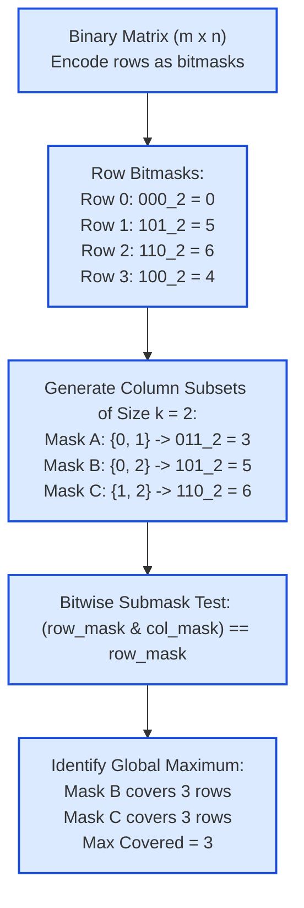

# Guided Example: Maximum Rows Covered by Columns

## 1. Problem Overview & Representative Instance

We are given an $m \times n$ binary matrix $\text{matrix}$ ($1 \le m, n \le 12$) and an integer $\text{numSelect}$ ($1 \le \text{numSelect} \le n$). We must choose a subset $C$ containing exactly $\text{numSelect}$ distinct column indices from $\{0, 1, \dots, n - 1\}$.

A row $r$ is defined as **covered** by column set $C$ if every column containing a $1$ in row $r$ belongs to $C$:
$$\forall c \in \{0, \dots, n - 1\}, \quad \text{matrix}[r][c] = 1 \implies c \in C$$

A row containing only zeros ($0$) is covered by any choice of $C$. The goal is to determine the maximum number of rows that can be covered simultaneously by choosing an optimal subset of $\text{numSelect}$ columns.

Consider the representative instance:
$$\text{matrix} = \begin{pmatrix} 0 & 0 & 0 \\ 1 & 0 & 1 \\ 0 & 1 & 1 \\ 0 & 0 & 1 \end{pmatrix}, \quad \text{numSelect} = 2, \quad m = 4, \quad n = 3$$

We must select $k = 2$ columns out of $\{0, 1, 2\}$.

## 2. Mathematical & Algorithmic Principles

1. **Row Vector Bitmask Encoding:**
   Because the number of columns satisfies $n \le 12$, each row can be compressed into a single integer bitmask. For row $r$:
   $$\text{row\_mask}[r] = \sum_{c=0}^{n-1} \text{matrix}[r][c] \cdot 2^c$$
   The $c$-th bit is $1$ if column $c$ contains a $1$ in row $r$, and $0$ otherwise.

2. **Submask Containment via Bitwise Operations:**
   Let $M$ be the bitmask representing a chosen subset of columns, where bit $c$ is set if and only if $c \in C$.
   A row $r$ is covered by column mask $M$ if and only if the set of columns required by row $r$ is a subset of the selected columns:
   $$\{c \mid \text{bit } c \text{ is set in } \text{row\_mask}[r]\} \subseteq \{c \mid \text{bit } c \text{ is set in } M\}$$
   In bitwise algebra, subset containment is verified by a single operation:
   $$(\text{row\_mask}[r] \ \& \ M) == \text{row\_mask}[r]$$
   Alternatively, no required bit lies outside $M$: $(\text{row\_mask}[r] \ \& \ (\sim M)) == 0$.

3. **Exact Popcount Enumeration:**
   Because $n \le 12$, the total number of column combinations of size $k$ is given by the binomial coefficient:
   $$\binom{n}{k} \le \binom{12}{6} = 924$$
   We can iterate through all $\binom{n}{k}$ subsets (either via combinations or by scanning integers $0 \le M < 2^n$ with Hamming weight $\text{popcount}(M) = k$). For each candidate mask $M$, we count the number of rows satisfying the submask condition and track the maximum.

## 3. Step-by-Step Walkthrough with Intermediate State

We trace the algorithm on $\text{matrix} = [[0,0,0], [1,0,1], [0,1,1], [0,0,1]]$ with $k = 2$ and $n = 3$:

- **Phase 1: Binary Encoding of Rows ($n = 3$ columns):**
  - **Row 0 (`[0, 0, 0]`):**
    $\text{row\_mask}[0] = 0 \cdot 2^0 + 0 \cdot 2^1 + 0 \cdot 2^2 = 0\text{ (binary } 000_2)$.
  - **Row 1 (`[1, 0, 1]`):**
    $\text{row\_mask}[1] = 1 \cdot 2^0 + 0 \cdot 2^1 + 1 \cdot 2^2 = 1 + 4 = 5\text{ (binary } 101_2)$.
  - **Row 2 (`[0, 1, 1]`):**
    $\text{row\_mask}[2] = 0 \cdot 2^0 + 1 \cdot 2^1 + 1 \cdot 2^2 = 2 + 4 = 6\text{ (binary } 110_2)$.
  - **Row 3 (`[0, 0, 1]`):**
    $\text{row\_mask}[3] = 0 \cdot 2^0 + 0 \cdot 2^1 + 1 \cdot 2^2 = 4\text{ (binary } 100_2)$.

- **Phase 2: Enumerating $k = 2$ Combinations from $\{0, 1, 2\}$:**
  There are $\binom{3}{2} = 3$ combinations:

  - **Candidate 1: Columns $\{0, 1\}$ (Mask $M = 2^0 + 2^1 = 3 = 011_2$):**
    - Row 0: $0 \ \& \ 3 = 0 == 0 \implies$ **Covered**.
    - Row 1: $5 \ \& \ 3 = 101_2 \ \& \ 011_2 = 001_2 = 1 \neq 5 \implies$ Not covered.
    - Row 2: $6 \ \& \ 3 = 110_2 \ \& \ 011_2 = 010_2 = 2 \neq 6 \implies$ Not covered.
    - Row 3: $4 \ \& \ 3 = 100_2 \ \& \ 011_2 = 000_2 = 0 \neq 4 \implies$ Not covered.
    - Total covered rows for $\{0, 1\} = 1$.

  - **Candidate 2: Columns $\{0, 2\}$ (Mask $M = 2^0 + 2^2 = 5 = 101_2$):**
    - Row 0: $0 \ \& \ 5 = 0 == 0 \implies$ **Covered**.
    - Row 1: $5 \ \& \ 5 = 5 == 5 \implies$ **Covered**.
    - Row 2: $6 \ \& \ 5 = 110_2 \ \& \ 101_2 = 100_2 = 4 \neq 6 \implies$ Not covered.
    - Row 3: $4 \ \& \ 5 = 100_2 \ \& \ 101_2 = 100_2 = 4 == 4 \implies$ **Covered**.
    - Total covered rows for $\{0, 2\} = 3$ (Rows 0, 1, 3).

  - **Candidate 3: Columns $\{1, 2\}$ (Mask $M = 2^1 + 2^2 = 6 = 110_2$):**
    - Row 0: $0 \ \& \ 6 = 0 == 0 \implies$ **Covered**.
    - Row 1: $5 \ \& \ 6 = 101_2 \ \& \ 110_2 = 100_2 = 4 \neq 5 \implies$ Not covered.
    - Row 2: $6 \ \& \ 6 = 6 == 6 \implies$ **Covered**.
    - Row 3: $4 \ \& \ 6 = 100_2 \ \& \ 110_2 = 100_2 = 4 == 4 \implies$ **Covered**.
    - Total covered rows for $\{1, 2\} = 3$ (Rows 0, 2, 3).

- **Phase 3: Global Optimum:**
  Maximum rows covered $= \max(1, 3, 3) = 3$.

## 4. Comprehensive State Trace

The row bitmask encodings and column requirements are detailed below:

| Row Index $r$ | Matrix Row Vector | Active Columns ($1$s) | Binary String | Integer Bitmask Value | Zero Row? |
|---|---|---|---|---|---|
| 0 | `[0, 0, 0]` | $\emptyset$ | `000` | 0 | Yes (Always covered) |
| 1 | `[1, 0, 1]` | $\{0, 2\}$ | `101` | 5 | No |
| 2 | `[0, 1, 1]` | $\{1, 2\}$ | `110` | 6 | No |
| 3 | `[0, 0, 1]` | $\{2\}$ | `100` | 4 | No |

The complete combinatorial evaluation across all 2-column candidates is summarized below:

| Candidate ID | Selected Columns | Bitmask $M$ | Row 0 ($0$) | Row 1 ($5$) | Row 2 ($6$) | Row 3 ($4$) | Total Covered Rows |
|---|---|---|---|---|---|---|---|
| 1 | $\{0, 1\}$ | $011_2 = 3$ | Covered | Uncovered | Uncovered | Uncovered | 1 |
| 2 | $\{0, 2\}$ | $101_2 = 5$ | Covered | **Covered** | Uncovered | **Covered** | **3 (Optimal)** |
| 3 | $\{1, 2\}$ | $110_2 = 6$ | Covered | Uncovered | **Covered** | **Covered** | **3 (Optimal)** |

Candidates 2 and 3 tie for the maximum of 3 covered rows.

## 5. Algorithmic Correctness & Soundness

1. **Exactness of Bitwise Containment:**
   The bitwise condition $(R \ \& \ M) == R$ is true if and only if for every bit $c$ where $R$ has a $1$, $M$ also has a $1$. This is the exact definition of row coverage: every column containing a $1$ in row $r$ is among the selected columns in $M$.
2. **Exhaustive Combinatorial Optimality:**
   Because all $\binom{n}{k}$ subsets of size $k$ are checked, the algorithm is guaranteed to find the true global maximum without risk of local suboptimality.
3. **Soundness on Zero Rows:**
   When a row has no $1$s, $R = 0$. For any mask $M$, $0 \ \& \ M = 0 == 0$ evaluates to true. Zero rows are inherently counted as covered by every column combination.

## 6. Edge Cases & Anti-Patterns

- **All Rows Zero:** Every mask covers all $m$ rows, returning $m$.
- **$\text{numSelect} = n$:** The only candidate mask selects all $n$ columns ($M = 2^n - 1$). It trivially covers all $m$ rows, returning $m$.
- **$\text{numSelect} = 1$:** Single-column selections check which column alone covers the most rows.
- **Anti-Pattern: Dynamic Programming or Greedy Column Selection:** Choosing columns greedily by row frequency fails because covering a row requires all of its ones simultaneously. A row requiring columns $\{0, 1\}$ gets zero credit if only column $0$ is picked. Exhaustive combination enumeration is required and extremely fast due to $n \le 12$.

## 7. Complexity Analysis

- **Time Complexity:**
  - Encoding $m$ rows of length $n$ into bitmasks takes $\mathcal{O}(m \cdot n)$ time.
  - The number of size-$k$ combinations from $n$ elements is $\binom{n}{k} \le \binom{12}{6} = 924$.
  - For each combination, evaluating $m$ bitwise AND operations takes $\mathcal{O}(m)$ time.
  - Total time complexity is strictly $\mathcal{O}\left(m \cdot n + \binom{n}{k} \cdot m\right)$.
  - For $m, n \le 12$, total operations are at most $924 \times 12 \approx 1.1 \cdot 10^4$, running in under $2$ milliseconds.
- **Space Complexity:**
  - Storing the $m$ integer bitmasks takes $\mathcal{O}(m)$ space.
  - Generating combinations requires $\mathcal{O}(k)$ recursion stack space or $\mathcal{O}(1)$ iterative space.
  - Total auxiliary space complexity is $\mathcal{O}(m)$.
