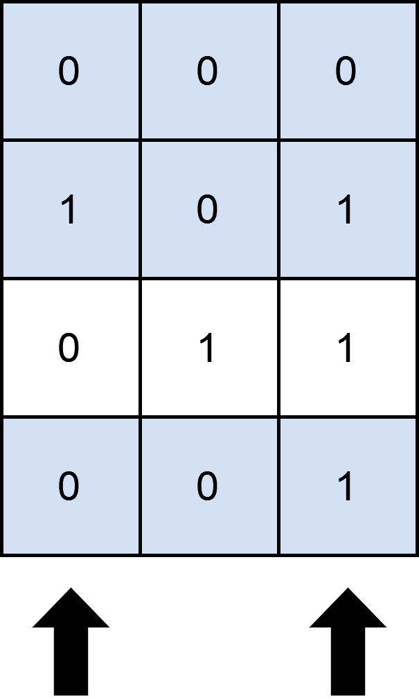

## Description

You are given an `m x n` binary matrix `matrix` and an integer `numSelect`.

Your goal is to select exactly `numSelect` **distinct **columns from `matrix` such that you cover as many rows as possible.

A row is considered **covered** if all the `1`'s in that row are also part of a column that you have selected. If a row does not have any `1`s, it is also considered covered.

More formally, let us consider $selected = {c_{1}, c_{2}, ...., c_{numSelect}}$ as the set of columns selected by you. A row `i` is **covered** by `selected` if:

- For each cell where $\text{matrix}[i][j] = 1$, the column `j` is in `selected`.

- Or, no cell in row `i` has a value of `1`.

Return the **maximum** number of rows that can be **covered** by a set of `numSelect` columns.
### Function Contract

- `n`: Input parameter.
- Returns expected result.

### Examples
#### Example 1

**Input:** matrix = [[0,0,0],[1,0,1],[0,1,1],[0,0,1]], numSelect = 2

**Output:** 3

**Explanation:**

One possible way to cover 3 rows is shown in the diagram above.

We choose s = {0, 2}.

- Row 0 is covered because it has no occurrences of 1.

- Row 1 is covered because the columns with value 1, i.e. 0 and 2 are present in s.

- Row 2 is not covered because matrix[2][1] == 1 but 1 is not present in s.

- Row 3 is covered because matrix[2][2] == 1 and 2 is present in s.

Thus, we can cover three rows.

Note that s = {1, 2} will also cover 3 rows, but it can be shown that no more than three rows can be covered.

#### Example 2

**Input:** matrix = [[1],[0]], numSelect = 1

**Output:** 2

**Explanation:**

Selecting the only column will result in both rows being covered since the entire matrix is selected.

### Constraints

- $m = \text{matrix.length}$

- $n = \text{matrix}[i].length$

- $1 \le m, n \le 12$

- $\text{matrix}[i][j]$ is either `0` or `1`.

- $1 \le numSelect \le n$