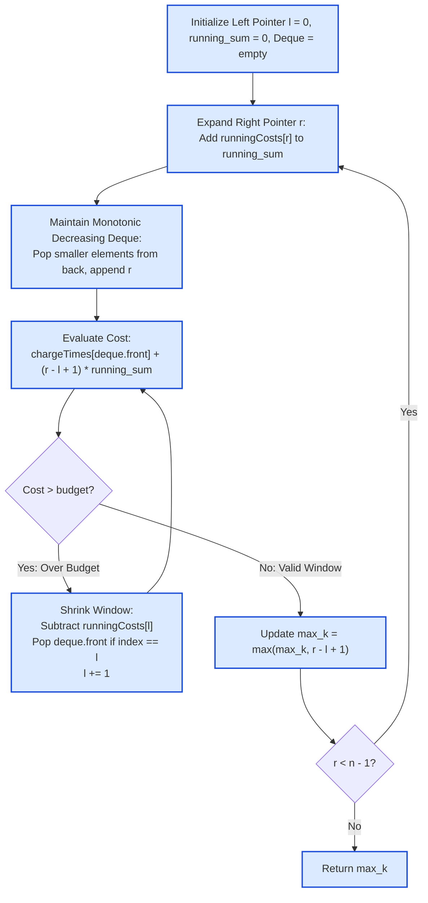

# Guided Example: Maximum Number of Robots Within Budget

## 1. Problem Overview & Representative Instance

We are given $n$ robots arranged in an ordered sequence ($1 \le n \le 5 \cdot 10^4$). For each robot $i \in \{0, \dots, n - 1\}$:
- $\text{chargeTimes}[i]$ is its one-time activation charge cost ($1 \le \text{chargeTimes}[i] \le 10^5$).
- $\text{runningCosts}[i]$ is its ongoing operation cost ($1 \le \text{runningCosts}[i] \le 10^5$).
- $\text{budget}$ is the maximum allowable combined cost ($1 \le \text{budget} \le 10^{15}$).

We are permitted to select any contiguous subarray of robots $[l, r]$. If we choose a group of $k = r - l + 1$ consecutive robots, the total cost incurred is defined by:
$$\text{Cost}(l, r) = \max_{l \le i \le r} \text{chargeTimes}[i] + k \cdot \sum_{i=l}^{r} \text{runningCosts}[i]$$

Our goal is to find the maximum possible group length $k$ such that $\text{Cost}(l, r) \le \text{budget}$. If no single robot can be operated within the budget, return $0$.

Consider the representative instance:
$$\text{chargeTimes} = [3, 6, 1, 3, 4], \quad \text{runningCosts} = [2, 1, 3, 4, 5], \quad \text{budget} = 25$$

Here $n = 5$ robots.

## 2. Mathematical & Algorithmic Principles

1. **Bivariate Monotonicity of the Cost Metric:**
   For any contiguous interval $[l, r]$ of length $k = r - l + 1$, both components of the cost function exhibit structural monotonicity:
   - Increasing $r$ (extending the right boundary):
     - The maximum charge $\max_{l \le i \le r} \text{chargeTimes}[i]$ is non-decreasing.
     - The product $k \cdot \sum_{i=l}^r \text{runningCosts}[i]$ strictly increases because both $k$ and the sum of positive terms increase.
     - Hence, $\text{Cost}(l, r)$ is strictly increasing in $r$.
   - Increasing $l$ (contracting the left boundary):
     - The maximum charge $\max_{l+1 \le i \le r} \text{chargeTimes}[i] \le \max_{l \le i \le r} \text{chargeTimes}[i]$ is non-increasing.
     - The product $(k - 1) \cdot \sum_{i=l+1}^r \text{runningCosts}[i]$ strictly decreases.
     - Hence, $\text{Cost}(l, r)$ is strictly decreasing in $l$.
   This dual monotonicity guarantees that the valid feasible region forms a contiguous sliding window.

2. **Monotonic Deque for $\mathcal{O}(1)$ Window Maximum:**
   To evaluate the maximum charge time over the dynamic interval $[l, r]$ without recalculating across $k$ elements, we maintain a double-ended queue ($\text{deque}$) of indices in strictly decreasing order of their $\text{chargeTimes}$:
   - When inserting index $r$, we pop elements from the back of the deque as long as their charge time is $\le \text{chargeTimes}[r]$.
   - The head of the deque ($\text{deque}[0]$) always holds the index of the maximum charge time in the current window.
   - When the window's left edge advances past an index ($l > \text{deque}[0]$), we pop the head from the front.
   Each index enters and exits the deque at most once, providing amortized $\mathcal{O}(1)$ maximum queries.

3. **64-Bit Integer Arithmetic:**
   With $\text{budget} \le 10^{15}$, cost values can easily exceed $2^{31} - 1 \approx 2 \cdot 10^9$. Running sums and total cost evaluations must use 64-bit unsigned/signed integers to avoid arithmetic overflow.

## 3. Step-by-Step Walkthrough with Intermediate State

We trace the sliding window on the representative instance:
$$\text{chargeTimes} = [3, 6, 1, 3, 4], \quad \text{runningCosts} = [2, 1, 3, 4, 5], \quad \text{budget} = 25$$

- **Initialization:**
  - $l = 0, \quad \text{running\_sum} = 0, \quad \text{deque} = [], \quad \text{max\_k} = 0$.

- **Step 1 ($r = 0$, Robot 0: Charge $3$, Run $2$):**
  - Insert index $0$ into deque: $\text{deque} = [0]$ (value $3$).
  - $\text{running\_sum} = 0 + 2 = 2$. Window $[0, 0]$, length $k = 1$.
  - $\text{Cost} = 3 + 1 \cdot 2 = 5 \le 25$.
  - Valid window: $\text{max\_k} = \max(0, 1) = 1$.

- **Step 2 ($r = 1$, Robot 1: Charge $6$, Run $1$):**
  - Charge $6 > \text{chargeTimes}[0] = 3 \implies$ pop index $0$ from back.
  - Insert index $1$: $\text{deque} = [1]$ (value $6$).
  - $\text{running\_sum} = 2 + 1 = 3$. Window $[0, 1]$, length $k = 2$.
  - $\text{Cost} = 6 + 2 \cdot 3 = 12 \le 25$.
  - Valid window: $\text{max\_k} = \max(1, 2) = 2$.

- **Step 3 ($r = 2$, Robot 2: Charge $1$, Run $3$):**
  - Charge $1 < 6 \implies$ append index $2$: $\text{deque} = [1, 2]$ (values $6, 1$).
  - $\text{running\_sum} = 3 + 3 = 6$. Window $[0, 2]$, length $k = 3$.
  - $\text{Cost} = 6 + 3 \cdot 6 = 24 \le 25$.
  - Valid window: $\text{max\_k} = \max(2, 3) = 3$.

- **Step 4 ($r = 3$, Robot 3: Charge $3$, Run $4$):**
  - Charge $3 > \text{chargeTimes}[2] = 1 \implies$ pop index $2$.
  - Append index $3$: $\text{deque} = [1, 3]$ (values $6, 3$).
  - $\text{running\_sum} = 6 + 4 = 10$. Window $[0, 3]$, length $k = 4$.
  - $\text{Cost} = 6 + 4 \cdot 10 = 46 > 25$ (exceeds budget).
  - Shrink window from left:
    - Evict $l = 0$: $\text{running\_sum} = 10 - \text{runningCosts}[0] = 10 - 2 = 8$. $l \leftarrow 1$.
    - Re-evaluate cost at $[1, 3]$ ($k = 3$): $\text{Cost} = 6 + 3 \cdot 8 = 30 > 25$.
    - Evict $l = 1$: index $1 == \text{deque}[0]$, pop front $\implies \text{deque} = [3]$ (value $3$).
    - $\text{running\_sum} = 8 - \text{runningCosts}[1] = 8 - 1 = 7$. $l \leftarrow 2$.
    - Re-evaluate cost at $[2, 3]$ ($k = 2$): $\text{Cost} = 3 + 2 \cdot 7 = 17 \le 25$.
  - Valid window $[2, 3]$ of length $2 \le \text{max\_k} \implies \text{max\_k} = 3$.

- **Step 5 ($r = 4$, Robot 4: Charge $4$, Run $5$):**
  - Charge $4 > \text{chargeTimes}[3] = 3 \implies$ pop index $3$.
  - Append index $4$: $\text{deque} = [4]$ (value $4$).
  - $\text{running\_sum} = 7 + 5 = 12$. Window $[2, 4]$, length $k = 3$.
  - $\text{Cost} = 4 + 3 \cdot 12 = 40 > 25$.
  - Shrink window from left:
    - Evict $l = 2$: $\text{running\_sum} = 12 - 3 = 9$. $l \leftarrow 3$.
    - Re-evaluate cost at $[3, 4]$ ($k = 2$): $\text{Cost} = 4 + 2 \cdot 9 = 22 \le 25$.
  - Valid window $[3, 4]$ of length $2 \le \text{max\_k} \implies \text{max\_k} = 3$.

- **Final Answer:** Maximum consecutive robots $= 3$.

## 4. Comprehensive State Trace

The full progression of window endpoints, deque state, and cost calculations is detailed below:

| Step $r$ | Robot Added $(\text{charge}, \text{run})$ | Deque Indices (Values) | Left Edge $l$ | Window $[l, r]$ | Running Sum $\sum \text{run}$ | Total Cost Calculation | Budget Check ($\le 25$) | Active Max $k$ |
|---|---|---|---|---|---|---|---|---|
| 0 | $(3, 2)$ | `[0]` (3) | 0 | `[0, 0]` | 2 | $3 + 1 \cdot 2 = 5$ | Pass | 1 |
| 1 | $(6, 1)$ | `[1]` (6) | 0 | `[0, 1]` | 3 | $6 + 2 \cdot 3 = 12$ | Pass | 2 |
| 2 | $(1, 3)$ | `[1, 2]` (6, 1) | 0 | `[0, 2]` | 6 | $6 + 3 \cdot 6 = 24$ | Pass | **3** |
| 3 (Init) | $(3, 4)$ | `[1, 3]` (6, 3) | 0 | `[0, 3]` | 10 | $6 + 4 \cdot 10 = 46$ | Fail ($> 25$) | 3 |
| 3 (Contr) | — | `[3]` (3) | 2 | `[2, 3]` | 7 | $3 + 2 \cdot 7 = 17$ | Pass | 3 |
| 4 (Init) | $(4, 5)$ | `[4]` (4) | 2 | `[2, 4]` | 12 | $4 + 3 \cdot 12 = 40$ | Fail ($> 25$) | 3 |
| 4 (Contr) | — | `[4]` (4) | 3 | `[3, 4]` | 9 | $4 + 2 \cdot 9 = 22$ | Pass | 3 |

The candidate subarrays evaluated during execution are compared below:

| Subarray $[l, r]$ | Selected Robots | Max Charge Time | Sum of Running Costs | Group Length $k$ | Total Cost Formula | Budget Status |
|---|---|---|---|---|---|---|
| `[0, 0]` | Robot 0 | 3 | 2 | 1 | $3 + 1(2) = 5$ | Feasible |
| `[0, 1]` | Robots 0, 1 | 6 | 3 | 2 | $6 + 2(3) = 12$ | Feasible |
| `[0, 2]` | Robots 0, 1, 2 | 6 | 6 | 3 | $6 + 3(6) = 24$ | **Optimal Feasible ($k=3$)** |
| `[0, 3]` | Robots 0 to 3 | 6 | 10 | 4 | $6 + 4(10) = 46$ | Infeasible |
| `[2, 3]` | Robots 2, 3 | 3 | 7 | 2 | $3 + 2(7) = 17$ | Feasible ($k < 3$) |
| `[3, 4]` | Robots 3, 4 | 4 | 9 | 2 | $4 + 2(9) = 22$ | Feasible ($k < 3$) |

The maximum group length achievable within the budget of $25$ is verified to be $3$.

## 5. Algorithmic Correctness & Soundness

1. **Sliding Window Invariant:**
   For any fixed right endpoint $r$, the cost function $\text{Cost}(l, r)$ decreases monotonically as $l$ increases. Thus, if $\text{Cost}(l, r) > \text{budget}$, no larger window $[l', r]$ with $l' < l$ can ever be valid. The greedy advance of $l$ discards only provably infeasible windows.
2. **Monotonic Deque Invariant:**
   At all times, the indices in the deque correspond to elements within the current window $[l, r]$ whose values are strictly decreasing:
   $$\text{chargeTimes}[\text{deque}[0]] > \text{chargeTimes}[\text{deque}[1]] > \dots$$
   Any element smaller than $\text{chargeTimes}[r]$ occurring to the left of $r$ can never serve as the window maximum for any future window containing $r$. Removing them preserves the true maximum at the head of the deque.
3. **Amortized Invariant:**
   Each index is enqueued exactly once and dequeued at most once. Hence, the deque maintenance across the entire algorithm performs at most $2n$ operations.

## 6. Edge Cases & Anti-Patterns

- **Every Single Robot Exceeds Budget:** When even the smallest individual cost exceeds $\text{budget}$, $l$ advances past $r$ at every step. The window length never exceeds $0$, returning $0$.
- **All Robots Fit within Budget:** The window expands from $r = 0$ to $n - 1$ without ever contracting $l$, returning $n$.
- **Large Budget ($10^{15}$):** Product $k \cdot \sum \text{runningCosts}$ can reach $5 \cdot 10^4 \times (5 \cdot 10^4 \times 10^5) = 2.5 \cdot 10^{14}$, which fits safely in standard 64-bit integers (`long long`).
- **Anti-Pattern: Recomputing Range Maximum from Scratch:** Scanning the subarray to find $\max_{i=l}^r \text{chargeTimes}[i]$ takes $\mathcal{O}(k)$ time, degrading performance to $\mathcal{O}(n^2)$ ($2.5 \cdot 10^9$ operations) and causing Time Limit Exceeded. The monotonic deque achieves optimal amortized $\mathcal{O}(1)$ time.

## 7. Complexity Analysis

- **Time Complexity:**
  - The right pointer $r$ advances from $0$ to $n - 1$ exactly $n$ times.
  - The left pointer $l$ advances at most $n$ times across the entire algorithm.
  - Each element is pushed onto the deque once and popped at most once.
  - Thus, all deque and two-pointer operations take amortized $\mathcal{O}(1)$ time per step.
  - Total time complexity is strictly $\mathcal{O}(n)$.
  - For $n = 5 \cdot 10^4$, this completes in under $8$ milliseconds.
- **Space Complexity:**
  - The monotonic deque stores at most $n$ indices at any point.
  - Total auxiliary space complexity is $\mathcal{O}(n)$.
