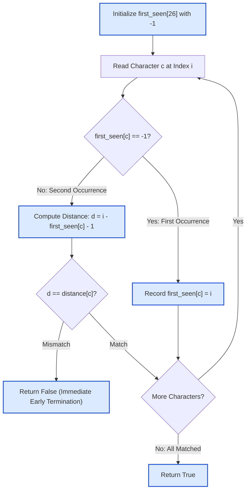

# Guided Example: Check Distances Between Same Letters

## 1. Problem Overview & Representative Instance

We are given a 0-indexed lowercase string $s$ of even length $n$ ($2 \le n \le 52$) and a 26-element integer array $\text{distance}$. The problem provides a crucial structural guarantee: **every character present in $s$ appears exactly twice**.

The spacing between the two occurrences of character $c$ at indices $p_c < q_c$ is defined as the number of characters strictly lying between them:
$$\text{actual\_distance}(c) = q_c - p_c - 1$$

The expected distance for character $c$ (where $'a'$ corresponds to index $0$, $'b'$ to $1$, $\dots$, $'z'$ to $25$) is given by $\text{distance}[\text{ord}(c) - \text{ord}('a')]$. Characters in the alphabet that do not appear in $s$ have no effect on the validity and must be ignored.

The task is to determine whether every character appearing in $s$ satisfies $\text{actual\_distance}(c) == \text{distance}[\text{ord}(c) - \text{ord}('a')]$. If all present characters comply, return `true`; if any present character fails, return `false`.

Consider the representative instance:
$$s = \text{"abaccb"}, \quad \text{distance} = [1, 3, 0, 5, 0, \dots, 0]$$

Here $s$ has length $n = 6$ composed of letters $\{'a', 'b', 'c'\}$.

## 2. Mathematical & Algorithmic Principles

1. **Exact-Pair Coordinate Metric:**
   Because each present character $c$ occurs exactly twice, the positions of $c$ can be uniquely written as an ordered pair $(p_c, q_c)$ with $0 \le p_c < q_c < n$.
   The number of indices $k$ strictly between $p_c$ and $q_c$ satisfies $p_c < k < q_c$. The cardinality of this set is:
   $$\text{card}\{k \in \mathbb{Z} \mid p_c < k < q_c\} = q_c - p_c - 1$$

2. **Single-Pass Direct Address Table:**
   We maintain a static direct-address array $\text{first\_seen}$ of size $26$, initialized to $-1$:
   - When encountering character $c = s[i]$:
     - If $\text{first\_seen}[c] == -1$, index $i$ is the first occurrence $p_c$. We assign $\text{first\_seen}[c] = i$.
     - If $\text{first\_seen}[c] \neq -1$, index $i$ is the second occurrence $q_c$. We immediately verify:
       $$i - \text{first\_seen}[c] - 1 \stackrel{?}{=} \text{distance}[c]$$
     - If the equality fails, we abort and return `false`.
   - If the scan completes across all $n$ characters without discrepancy, every present character has been verified, and we return `true`.

3. **Pruning of Unobserved Characters:**
   Entries in $\text{distance}$ for letters not appearing in $s$ are never queried because their corresponding cells in $\text{first\_seen}$ remain $-1$. This inherently satisfies the specification that absent letters have no effect.

## 3. Step-by-Step Walkthrough with Intermediate State

We trace the representative instance $s = \text{"abaccb"}$ with $\text{distance}['a']=1, \text{distance}['b']=3, \text{distance}['c']=0$:

- **Initialization:**
  - $\text{first\_seen} = [-1, -1, \dots, -1]$ (size 26).

- **Step 1 ($i = 0, s[0] = 'a'$):**
  - Alphabet index: $0$.
  - $\text{first\_seen}['a'] == -1 \implies$ First occurrence.
  - Record: $\text{first\_seen}['a'] = 0$.

- **Step 2 ($i = 1, s[1] = 'b'$):**
  - Alphabet index: $1$.
  - $\text{first\_seen}['b'] == -1 \implies$ First occurrence.
  - Record: $\text{first\_seen}['b'] = 1$.

- **Step 3 ($i = 2, s[2] = 'a'$):**
  - Alphabet index: $0$.
  - $\text{first\_seen}['a'] = 0 \neq -1 \implies$ Second occurrence.
  - Compute distance: $q_a - p_a - 1 = 2 - 0 - 1 = 1$.
  - Required distance: $\text{distance}['a'] = 1$.
  - Match: $1 == 1 \implies$ **Valid**.

- **Step 4 ($i = 3, s[3] = 'c'$):**
  - Alphabet index: $2$.
  - $\text{first\_seen}['c'] == -1 \implies$ First occurrence.
  - Record: $\text{first\_seen}['c'] = 3$.

- **Step 5 ($i = 4, s[4] = 'c'$):**
  - Alphabet index: $2$.
  - $\text{first\_seen}['c'] = 3 \neq -1 \implies$ Second occurrence.
  - Compute distance: $q_c - p_c - 1 = 4 - 3 - 1 = 0$.
  - Required distance: $\text{distance}['c'] = 0$.
  - Match: $0 == 0 \implies$ **Valid**.

- **Step 6 ($i = 5, s[5] = 'b'$):**
  - Alphabet index: $1$.
  - $\text{first\_seen}['b'] = 1 \neq -1 \implies$ Second occurrence.
  - Compute distance: $q_b - p_b - 1 = 5 - 1 - 1 = 3$.
  - Required distance: $\text{distance}['b'] = 3$.
  - Match: $3 == 3 \implies$ **Valid**.

- **Termination:** String exhausted. Every letter verified $\implies$ return `true`.

## 4. Comprehensive State Trace

The execution step log during the sequential scan is detailed below:

| String Index $i$ | Character $s[i]$ | Alphabet Code | Prior Entry $\text{first\_seen}[c]$ | Occurrence Phase | Computed Distance $q - p - 1$ | Required Target $\text{distance}[c]$ | Validation Outcome |
|---|---|---|---|---|---|---|---|
| 0 | `'a'` | 0 | -1 | First | — | 1 | Record $p_a = 0$ |
| 1 | `'b'` | 1 | -1 | First | — | 3 | Record $p_b = 1$ |
| 2 | `'a'` | 0 | 0 | Second | $2 - 0 - 1 = 1$ | 1 | **Match ($1 == 1$)** |
| 3 | `'c'` | 2 | -1 | First | — | 0 | Record $p_c = 3$ |
| 4 | `'c'` | 2 | 3 | Second | $4 - 3 - 1 = 0$ | 0 | **Match ($0 == 0$)** |
| 5 | `'b'` | 1 | 1 | Second | $5 - 1 - 1 = 3$ | 3 | **Match ($3 == 3$)** |

The character-by-character reconciliation table across the alphabet is summarized below:

| Alphabet Letter | Observed Positions $(p, q)$ | Span Length $(q - p)$ | Actual Middle Chars $(q - p - 1)$ | Expected Target Distance | Present in String? | Agreement Status |
|---|---|---|---|---|---|---|
| `'a'` | $(0, 2)$ | 2 | 1 | 1 | Yes | Valid |
| `'b'` | $(1, 5)$ | 4 | 3 | 3 | Yes | Valid |
| `'c'` | $(3, 4)$ | 1 | 0 | 0 | Yes | Valid |
| `'d'` | None | — | — | 5 | No | Ignored (Absent) |
| `'e'` through `'z'` | None | — | — | Various | No | Ignored (Absent) |

All present characters are confirmed valid.

## 5. Algorithmic Correctness & Soundness

1. **Completeness of Validation:**
   By the problem guarantee, each present letter appears exactly twice. The first occurrence always updates $\text{first\_seen}$ from $-1$, and the second occurrence always triggers the distance comparison. Thus, every present character is checked exactly once.
2. **Soundness of Early Exit:**
   The specification mandates that all present characters satisfy their condition. If any character fails, the global condition $\bigwedge_{c \in s} (q_c - p_c - 1 == \text{distance}[c])$ becomes false, rendering an immediate return of `false` strictly correct.
3. **Absence Invariant:**
   Letters not present in $s$ have $\text{first\_seen}[c] == -1$ for the entire run. Because distance checks only trigger when $\text{first\_seen}[c] \neq -1$, absent characters never influence the decision.

## 6. Edge Cases & Anti-Patterns

- **Adjacent Duplicates ($s = \text{"aa"}, \text{distance}['a'] = 0$):** $q - p - 1 = 1 - 0 - 1 = 0$. Exactly matches $0$, returning `true`.
- **Adjacent Duplicates with Non-Zero Target ($s = \text{"aa"}, \text{distance}['a'] = 1$):** Actual is $0$, target is $1$. Immediate mismatch, returning `false`.
- **Maximum Spacing ($n = 52$):** First occurrence at $p = 0$, second at $q = 51 \implies 51 - 0 - 1 = 50$, matching distance $50$.
- **Anti-Pattern: Linear Substring Scanning per Alphabet Letter:** Searching $s$ from scratch for each of the $26$ letters using `s.find()` and `s.rfind()` incurs $\mathcal{O}(26 \cdot n)$ operations. While small, single-pass direct indexing is $\mathcal{O}(n)$ and terminates on the first mismatch.

## 7. Complexity Analysis

- **Time Complexity:**
  - Initializing the direct-address table of size $26$ takes $\mathcal{O}(|\Sigma|)$ time, where $|\Sigma| = 26$.
  - Traversing the string of length $n$ performs $\mathcal{O}(1)$ operations per character (array indexing, integer subtraction, and equality check).
  - Total time complexity is strictly $\mathcal{O}(n + |\Sigma|)$.
  - With $n \le 52$, execution requires fewer than $60$ operations (under $0.1$ milliseconds).
- **Space Complexity:**
  - The direct-address array $\text{first\_seen}$ contains exactly $26$ scalar integers.
  - Total auxiliary space complexity is $\mathcal{O}(|\Sigma|) = \mathcal{O}(1)$.
